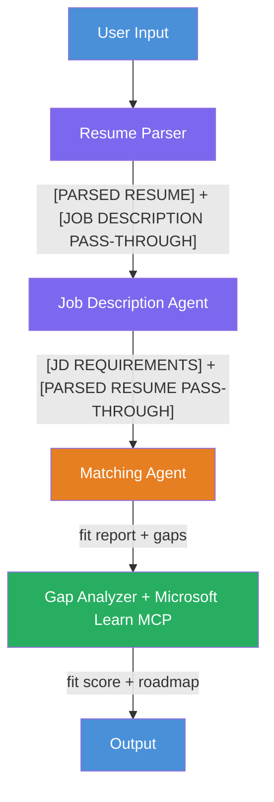

# Lab 02 - Multi-Agent Workflow: Resume → Job Fit Evaluator

## Overview

For dis hands-on lab, you go build **workflow-first multi-agent app** wey dey use Foundry Toolkit for VS Code and deploy am to Microsoft Foundry Agent Service.

**Wetin you go build:** Resume → Job Fit Evaluator wey go parse resume and job description, score di match, then produce personalized learning roadmap wey dey use Microsoft Learn resources.

---

## Architecture

```mermaid
flowchart TD
    A["User Input"] --> B["Resume Parser"]
    B -->|"[PARSED RESUME] + [JOB DESCRIPTION PASS-THROUGH]"| C["Job Description Agent"]
    C -->|"[JD REQUIREMENTS] + [PARSED RESUME PASS-THROUGH]"| D["Matching Agent"]
    D -->|fit report + gaps| E["Gap Analyzer + Microsoft Learn MCP"]
    E -->|fit score + roadmap| F["Output"]

    style A fill:#4A90D9,color:#fff
    style B fill:#7B68EE,color:#fff
    style C fill:#7B68EE,color:#fff
    style D fill:#E67E22,color:#fff
    style E fill:#27AE60,color:#fff
    style F fill:#4A90D9,color:#fff
```

**How e dey work:**
1. User go paste resume and job description.
2. **ResumeParser** go parse di resume and copy di JD verbatim enter `[JOB DESCRIPTION PASS-THROUGH]` section.
3. **JD Agent** go comot structured requirements from di pass-through, then e go relay di `[PARSED RESUME]` forward as `[PARSED RESUME PASS-THROUGH]`.
4. **MatchingAgent** go compare `[PARSED RESUME PASS-THROUGH]` vs `[JD REQUIREMENTS]` then e go produce fit score.
5. **GapAnalyzer** go turn di gaps to practical roadmap and go find real Microsoft Learn links through MCP.

---

## Prerequisites

Make you finish Lab 01 first:

- [Lab 01 - Single Agent](../lab01-single-agent/README.md)

---

## Part 1: Read di modules for order

See di full learning path for:

- [Lab 2 Docs - Prerequisites](docs/00-prerequisites.md)
- [Lab 2 Docs - Full Learning Path](docs/README.md)
- [PersonalCareerCopilot run guide](PersonalCareerCopilot/README.md)

---

## Part 2: Build and test di workflow

1. Use Foundry Toolkit wizard to scaffold di workflow-based project.
2. Copy di prompt blocks and workflow graph from `PersonalCareerCopilot/main.py` go your workspace.
3. Run am locally with Agent Inspector and verify all di four agents plus di MCP tool.
4. Deploy di hosted agent to Foundry when local testing pass.

---

## Orchestration patterns

Lab 02 get di default **fan-out → fan-in → sequential** flow, plus di docs describe alternative orchestration patterns for experiment.

- **Fan-out/Fan-in with weighted consensus**
- **Reviewer/critic pass before final roadmap**
- **Conditional router** based on fit score and missing skills

See [docs/04-orchestration-patterns.md](docs/04-orchestration-patterns.md).

---

**Previous:** [Lab 01 - Single Agent](../lab01-single-agent/README.md) · **Back to:** [Workshop Home](../../README.md)

---

<!-- CO-OP TRANSLATOR DISCLAIMER START -->
**Disclaimer**:
Dis document don translate wit AI translation service [Co-op Translator](https://github.com/Azure/co-op-translator). Even tho we dey try make am correct, abeg make you know say automated translation fit get errors or mistakes. Di original document for dia own language na im be di correct source. For important info, make person wey sabi human translation do am. We no go responsible for any misunderstanding or wrong understanding wey fit happen because of dis translation.
<!-- CO-OP TRANSLATOR DISCLAIMER END -->