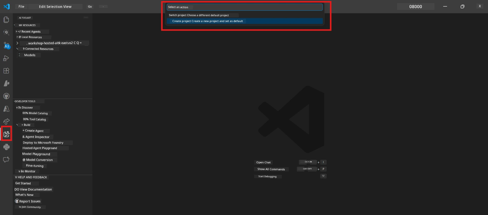

# Module 0 - Prerequisites

Before you start Lab 02, make sure say di following tins don finish. This lab base directly on top Lab 01 - no skip am.

---

## 1. Complete Lab 01

Lab 02 dey assume say you don already:

- [x] Finish all 8 modules for [Lab 01 - Single Agent](../../lab01-single-agent/README.md)
- [x] Successfully deploy one single agent go Foundry Agent Service
- [x] Confirm say di agent dey work for both local Agent Inspector and Foundry Playground

If you never finish Lab 01, waka go back come finish am now: [Lab 01 Docs](../../lab01-single-agent/docs/00-prerequisites.md)

---

## 2. Verify existing setup

All tools from Lab 01 suppose still dey installed and dey work. Run these quick checks:

### 2.1 Azure CLI

```powershell
az account show --query "{name:name, id:id}" --output table
```

Expected: E go show your subscription name and ID. If e no work, run [`az login`](https://learn.microsoft.com/cli/azure/authenticate-azure-cli-interactively).

### 2.2 VS Code extensions

1. Press `Ctrl+Shift+P` → type **"Microsoft Foundry"** → confirm say you see commands (e.g., `Microsoft Foundry: Create a New Hosted Agent`).
2. Press `Ctrl+Shift+P` → type **"Foundry Toolkit"** → confirm say you see commands (e.g., `Foundry Toolkit: Open Agent Inspector`).

### 2.3 Foundry project & model

1. Click di **Microsoft Foundry** icon for VS Code Activity Bar.
2. Confirm say your project dey listed (e.g., `workshop-agents`).
3. Expand di project → confirm say one deployed model dey (e.g., `gpt-4.1-mini`) wey get status **Succeeded**.

> **If your model deployment don expire:** Some free-tier deployments dey auto-expire. Redeploy from the [Model Catalog](https://learn.microsoft.com/azure/foundry/foundry-models/concepts/models-sold-directly-by-azure) (`Ctrl+Shift+P` → **Microsoft Foundry: Open Model Catalog**).



### 2.4 RBAC roles

Confirm say you get **Azure AI User** for your Foundry project:

1. [Azure Portal](https://portal.azure.com) → your Foundry **project** resource → **Access control (IAM)** → **[Role assignments](https://learn.microsoft.com/azure/foundry/concepts/rbac-foundry)** tab.
2. Search your name → confirm say **[Azure AI User](https://aka.ms/foundry-ext-project-role)** dey listed.

---

## 3. Understand multi-agent concepts (new for Lab 02)

Lab 02 dey introduce concepts wey Lab 01 never cover. Read dem well before you continue:

### 3.1 Wetin be multi-agent workflow?

Instead make one agent dey do everything, **multi-agent workflow** dey split di work among many specialized agents. Each agent get:

- Im own **instructions** (system prompt)
- Im own **role** (wetin e responsible for)
- Optional **tools** (functions wey e fit call)

The agents dey talk through one **orchestration graph** wey define how data dey flow between dem.

### 3.2 WorkflowBuilder

Di [`WorkflowBuilder`](https://learn.microsoft.com/agent-framework/workflows/agents-in-workflows) class from `agent_framework` na di SDK part wey dey connect agents together:

```python
from agent_framework import WorkflowBuilder

workflow = (
    WorkflowBuilder(
        name="MyWorkflow",
        start_executor=agent_a,
        output_executors=[agent_d],
    )
    .add_edge(agent_a, agent_b)
    .add_edge(agent_a, agent_c)
    .add_edge(agent_b, agent_d)
    .add_edge(agent_c, agent_d)
    .build()
)
```

- **`start_executor`** - Na di first agent wey go receive user input
- **`output_executors`** - Di agent(s) wey output go be di final answer
- **`add_edge(source, target)`** - Define say `target` go receive `source` output

### 3.3 MCP (Model Context Protocol) tools

Lab 02 dey use one **MCP tool** wey dey call Microsoft Learn API to find learning resources. [MCP (Model Context Protocol)](https://modelcontextprotocol.io/introduction) na standardized protocol to connect AI models to outside data sources and tools.

| Term | Definition |
|------|-----------|
| **MCP server** | Na service wey dey expose tools/resources via di [MCP protocol](https://learn.microsoft.com/azure/foundry/agents/how-to/tools/model-context-protocol) |
| **MCP client** | Your agent code wey dey connect to MCP server and call im tools |
| **[Streamable HTTP](https://learn.microsoft.com/agent-framework/agents/tools/hosted-mcp-tools)** | Di transport method wey dem dey use communicate with MCP server |

### 3.4 How Lab 02 different from Lab 01

| Aspect | Lab 01 (Single Agent) | Lab 02 (Multi-Agent) |
|--------|----------------------|---------------------|
| Agents | 1 | 4 (specialized roles) |
| Orchestration | None | WorkflowBuilder (parallel + sequential) |
| Tools | Optional `@tool` function | MCP tool (external API call) |
| Complexity | Simple prompt → response | Resume + JD → fit score → roadmap |
| Context flow | Direct | Agent-to-agent handoff |

---

## 4. Workshop repository structure for Lab 02

Make sure say you sabi where Lab 02 files dey:

```
workshop/
└── lab02-multi-agent/
    ├── README.md                       ← Lab overview
    ├── docs/                           ← You are here
    │   ├── README.md                   ← Learning path index
    │   ├── 00-prerequisites.md         ← This file
    │   ├── 01-understand-multi-agent.md
    │   ├── ...
    │   └── 08-troubleshooting.md
    └── PersonalCareerCopilot/          ← The agent project
        ├── agent.yaml                  ← Agent definition
        ├── main.py                     ← 4-agent workflow code
        ├── Dockerfile                  ← Container configuration
        └── requirements.txt            ← Python dependencies
```

---

### Checkpoint

- [ ] Lab 01 don fully complete (all 8 modules, agent deploy and verify)
- [ ] `az account show` dey return your subscription
- [ ] Microsoft Foundry and Foundry Toolkit extensions don install and dem dey respond
- [ ] Foundry project get deployed model (e.g., `gpt-4.1-mini`)
- [ ] You get **Azure AI User** role for project
- [ ] You don read di multi-agent concepts section wey dey above and understand WorkflowBuilder, MCP, and agent orchestration

---

**Next:** [01 - Understand Multi-Agent Architecture →](01-understand-multi-agent.md)

---

<!-- CO-OP TRANSLATOR DISCLAIMER START -->
**Disclaimer**:  
Dis document na AI translation service [Co-op Translator](https://github.com/Azure/co-op-translator) wey translate am. Even as we try make am correct, abeg sabi say automated translations fit get error or wahala. Di original document for di ogbonge language na di real correct one. For important tori dem, better make person wey sabi do professional human translation do am. We no get responsible for any confusion or wrong meaning wey fit show because of dis translation.
<!-- CO-OP TRANSLATOR DISCLAIMER END -->