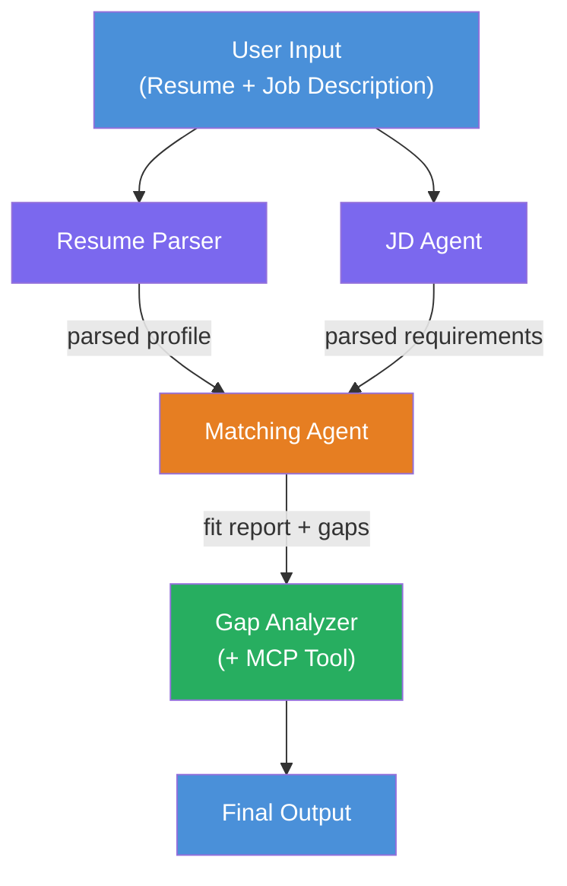
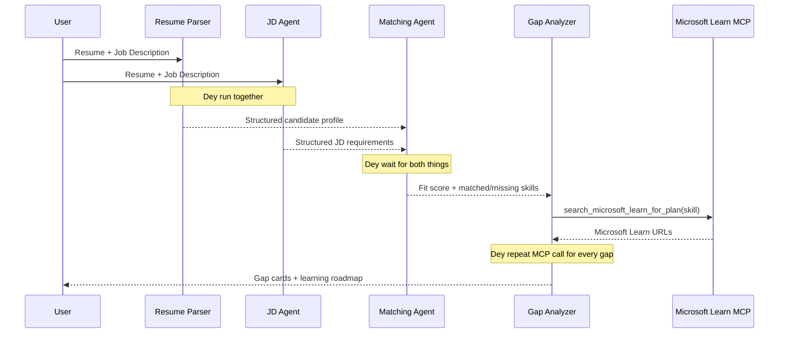
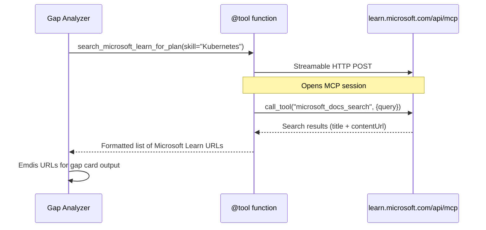

# Module 1 - Understand di Multi-Agent Architecture

For dis module, you go learn di architecture of di Resume → Job Fit Evaluator before you begin write any code. To sabi di orchestration graph, agent roles, an how data dey flow na important tin for debugging an to fit add more things inside [multi-agent workflows](https://learn.microsoft.com/azure/architecture/ai-ml/idea/multiple-agent-workflow-automation).

---

## Di wahala dis dey solve

To match resume to job description get plenty skills wey dem separate:

1. **Parsing** - To comot structured data from unstructured text (resume)
2. **Analysis** - To comot requirements from di job description
3. **Comparison** - To score how dem two dey align
4. **Planning** - To build learning plan to close di gaps

If na one agent dey do all four task for one prompt, e dey usually produce:
- Extraction wey no complete (e dey rush to parsing to reach di score)
- Shallow scoring (no evidence-based breakdown)
- Generic roadmaps (no customize am to fit di specific gaps)

If you split am into **four specialized agents**, each one go focus on im task with dedicated instruction, e go produce beta quality output for each stage.

---

## Di four agents

Each agent na full [Microsoft Foundry](https://learn.microsoft.com/azure/foundry/agents/concepts/hosted-agents) agent wey dem create with `AzureAIAgentClient.as_agent()`. Dem dey use di same model deployment but dem get different instructions and (if e suppose) different tools.

| # | Agent Name | Role | Input | Output |
|---|-----------|------|-------|--------|
| 1 | **ResumeParser** | E extract structured profile from di resume text | Raw resume text (from user) | Candidate Profile, Technical Skills, Soft Skills, Certifications, Domain Experience, Achievements |
| 2 | **JobDescriptionAgent** | E extract structured requirements from JD | Raw JD text (from user, wey ResumeParser forward) | Role Overview, Required Skills, Preferred Skills, Experience, Certifications, Education, Responsibilities |
| 3 | **MatchingAgent** | E calculate evidence-based fit score | Outputs from ResumeParser + JobDescriptionAgent | Fit Score (0-100 with breakdown), Matched Skills, Missing Skills, Gaps |
| 4 | **GapAnalyzer** | E build personalized learning roadmap | Output from MatchingAgent | Gap cards (per skill), Learning Order, Timeline, Resources from Microsoft Learn |

---

## Di orchestration graph

Di workflow dey use **parallel fan-out** come follow am with **sequential aggregation**:


> **Legend:** Purple = parallel agents, Orange = aggregation point, Green = final agent with tools

### How data dey flow


1. **User send** message wey get resume an job description.
2. **ResumeParser** receive di full user input an extract structured candidate profile.
3. **JobDescriptionAgent** receive di user input parallel an e extract structured requirements.
4. **MatchingAgent** receive outputs from **ResumeParser** and **JobDescriptionAgent** (framework go wait for both dem finish before e run MatchingAgent).
5. **GapAnalyzer** receive MatchingAgent output an e call **Microsoft Learn MCP tool** to find real learning resources for every gap.
6. Di **final output** na GapAnalyzer response, wey get di fit score, gap cards, and full learning roadmap.

### Why parallel fan-out important

ResumeParser an JobDescriptionAgent dey run **parallel** because dem no dey depend on each other. Dis one:
- E reduce total latency (dem both go run at di same time instead of to run one after di other)
- Na natural split (parsing resume and JD na separate work)
- E show common multi-agent pattern: **fan-out → aggregate → act**

---

## WorkflowBuilder for code

See how di graph wey dey above join with [`WorkflowBuilder`](https://learn.microsoft.com/agent-framework/workflows/agents-in-workflows) API calls for `main.py`:

```python
from agent_framework import WorkflowBuilder

workflow = (
    WorkflowBuilder(
        name="ResumeJobFitEvaluator",
        start_executor=resume_parser,       # First agent weh go receive user input
        output_executors=[gap_analyzer],     # Final agent weh output go return
    )
    .add_edge(resume_parser, jd_agent)      # ResumeParser → JobDescriptionAgent
    .add_edge(resume_parser, matching_agent) # ResumeParser → MatchingAgent
    .add_edge(jd_agent, matching_agent)      # JobDescriptionAgent → MatchingAgent
    .add_edge(matching_agent, gap_analyzer)  # MatchingAgent → GapAnalyzer
    .build()
)
```

**To understand di edges:**

| Edge | Wetin e mean |
|------|--------------|
| `resume_parser → jd_agent` | JD Agent dey receive ResumeParser output |
| `resume_parser → matching_agent` | MatchingAgent dey receive ResumeParser output |
| `jd_agent → matching_agent` | MatchingAgent also dey receive JD Agent output (e dey wait for both) |
| `matching_agent → gap_analyzer` | GapAnalyzer dey receive MatchingAgent output |

Because `matching_agent` get **two incoming edges** (`resume_parser` and `jd_agent`), di framework go automatically wait make both finish before e run Matching Agent.

---

## Di MCP tool

Di GapAnalyzer agent get one tool: `search_microsoft_learn_for_plan`. Dis one na **[MCP tool](https://learn.microsoft.com/agent-framework/agents/tools/hosted-mcp-tools)** wey dey call Microsoft Learn API to find curated learning resources.

### How e dey work

```python
@tool
async def search_microsoft_learn_for_plan(
    skill: str, role: str = "", max_results: int = 5
) -> str:
    """Search Microsoft Learn MCP and return curated official links."""
    # Connect to https://learn.microsoft.com/api/mcp wit Streamable HTTP
    # Dey call di 'microsoft_docs_search' tool for di MCP server
    # E dey return formatted list of Microsoft Learn URLs
```

### MCP call flow


1. GapAnalyzer sabi say e need learning resources for one skill (e.g., "Kubernetes")
2. Di framework dey call `search_microsoft_learn_for_plan(skill="Kubernetes")`
3. Di function open [Streamable HTTP](https://learn.microsoft.com/agent-framework/agents/tools/hosted-mcp-tools) connection go `https://learn.microsoft.com/api/mcp`
4. E dey call `microsoft_docs_search` tool for [MCP server](https://learn.microsoft.com/azure/foundry/agents/how-to/tools/model-context-protocol)
5. MCP server go return search results (title + URL)
6. Di function go format di results an return am as string
7. GapAnalyzer dey use di URLs wey e get for im gap card output

### Wetin you fit expect for MCP logs

When tool dey run, you go see log entries like:

```
GET https://learn.microsoft.com/api/mcp → 405 (Method Not Allowed)
POST https://learn.microsoft.com/api/mcp → 200
DELETE https://learn.microsoft.com/api/mcp → 405 (Method Not Allowed)
```

**Dis one na normal tin.** MCP client dey probe with GET and DELETE during initialization - if dem return 405, na normal tin. Di real tool call dey use POST and e go return 200. You no need worry unless POST call fail.

---

## Agent creation pattern

Every agent na to create am with **[`AzureAIAgentClient.as_agent()`](https://learn.microsoft.com/python/api/overview/azure/ai-agents-readme) async context manager**. Dis one na Foundry SDK way to create agents wey e go clean up automatically:

```python
async with (
    get_credential() as credential,
    AzureAIAgentClient(
        project_endpoint=PROJECT_ENDPOINT,
        model_deployment_name=MODEL_DEPLOYMENT_NAME,
        credential=credential,
    ).as_agent(
        name="ResumeParser",
        instructions=RESUME_PARSER_INSTRUCTIONS,
    ) as resume_parser,
    # ... mek e happen again for each agent ...
):
    # All 4 agents dey here
    workflow = create_workflow(resume_parser, jd_agent, matching_agent, gap_analyzer)
```

**Main points:**
- Every agent get im own `AzureAIAgentClient` instance (SDK require make agent name join client)
- All agents dey share same `credential`, `PROJECT_ENDPOINT`, an `MODEL_DEPLOYMENT_NAME`
- Di `async with` block make sure say all agents go clean up well when server shut down
- The GapAnalyzer agent also get `tools=[search_microsoft_learn_for_plan]`

---

## Server startup

After dem create all agents and build di workflow, server go start:

```python
from azure.ai.agentserver.agentframework import from_agent_framework

agent = create_workflow(resume_parser, jd_agent, matching_agent, gap_analyzer)
await from_agent_framework(agent).run_async()
```

`from_agent_framework()` dey wrap di workflow as HTTP server wey expose `/responses` endpoint for port 8088. Dis one na di same pattern as Lab 01, but now "agent" na di whole [workflow graph](https://learn.microsoft.com/agent-framework/workflows/as-agents).

---

### Checkpoint

- [ ] You sabi di 4-agent architecture an wetin each agent dey do
- [ ] You fit follow how data flow: User → ResumeParser → (parallel) JD Agent + MatchingAgent → GapAnalyzer → Output
- [ ] You sabi why MatchingAgent dey wait for both ResumeParser and JD Agent (because e get two incoming edges)
- [ ] You sabi di MCP tool: wetin e dey do, how dem dey call am, and say GET 405 logs na normal
- [ ] You sabi di `AzureAIAgentClient.as_agent()` pattern an why every agent get im own client instance
- [ ] You fit read `WorkflowBuilder` code an join am to di visual graph

---

**Previous:** [00 - Prerequisites](00-prerequisites.md) · **Next:** [02 - Scaffold the Multi-Agent Project →](02-scaffold-multi-agent.md)

---

<!-- CO-OP TRANSLATOR DISCLAIMER START -->
**Disclaimer**:  
Dis document don translate wit AI translation service [Co-op Translator](https://github.com/Azure/co-op-translator). Even though we dey try make e correct, abeg sabi say automated translations fit get mistake or errors. Di original document for e own language na di correct source. For important info, e better make human professional translate am. We no go responsible for any misunderstanding or wrong meaning wey fit come from using dis translation.
<!-- CO-OP TRANSLATOR DISCLAIMER END -->