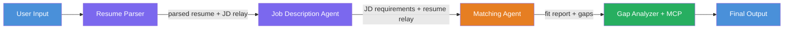

# Module 1 - Undastan di Architecture

⏱️ ~5 min

Before you start to write any code, na quick overview of wetin you dey build and how e dey work.

---

## Wetin you dey build

You go put **resume** and **job description**. Di workflow go bring out:

- A fit score (0–100 with breakdown)
- List of skill and certification wey dey missing
- Personalized learning roadmap with Microsoft Learn links for every gap

---

## Di four agents

One agent wey try to parse, score, and plan all at once dey rush and e dey produce shallow output. If you split di work into four specialized agents, e dey give better results:

| Agent | Wetin e dey do |
|-------|-------------|
| **ResumeParser** | E dey parse di resume; e dey copy di JD exactamundo into `[JOB DESCRIPTION PASS-THROUGH]` for the next agents |
| **JobDescriptionAgent** | E dey extract JD requirements from di pass-through; e dey pass `[PARSED RESUME]` as `[PARSED RESUME PASS-THROUGH]` go next |
| **MatchingAgent** | E dey compare both labeled sections; e dey produce 0–100 fit score and list of gaps |
| **GapAnalyzer** | E dey build learning roadmap; e dey find Microsoft Learn for each gap |

---

## Di orchestration graph

Di workflow na **sequential pipeline** - every agent dey pass hin output to di next one:


```mermaid
flowchart LR
    A["User Input"] --> B["Resume Parser"]
    B -- "parsed resume + JD relay" --> C["Job Description Agent"]
    C -- "JD requirements + resume relay" --> D["Matching Agent"]
    D -- "fit report + gaps" --> E["Gap Analyzer + MCP"]
    E --> F["Final Output"]

    style A fill:#4A90D9,color:#fff
    style B fill:#7B68EE,color:#fff
    style C fill:#7B68EE,color:#fff
    style D fill:#E67E22,color:#fff
    style E fill:#27AE60,color:#fff
    style F fill:#4A90D9,color:#fff
```

1. **ResumeParser** go receive di user input, parse di resume, and copy di JD into `[JOB DESCRIPTION PASS-THROUGH]`.
2. **JD Agent** go extract structured requirements and pass `[PARSED RESUME PASS-THROUGH]` go next.
3. **MatchingAgent** go compare both sections and bring back fit score and gap list.
4. **GapAnalyzer** go build di roadmap and call Microsoft Learn MCP tool for every gap.

---

## How dis one take relate to code

For `main.py`, you go describe dis graph with `WorkflowBuilder`:

```python
workflow_agent = (
    WorkflowBuilder(
        start_executor=resume_executor,       # first agent wey go collect user input
        output_executors=[gap_executor],      # last agent - na im output na di answer
    )
    .add_edge(resume_executor, jd_executor)       # ResumeParser → JD Agent
    .add_edge(jd_executor, matching_executor)     # JD Agent → MatchingAgent
    .add_edge(matching_executor, gap_executor)    # MatchingAgent → GapAnalyzer
    .build()
    .as_agent()
)
```

Every `Agent` dey inside `AgentExecutor`. Di `add_edge()` calls dem dey define strictly sequential pipeline - every agent go receive only dia direct predecessor output.

> `context_mode="last_agent"` mean say every executor go see only dia direct predecessor output. ResumeParser and JD Agent go dey pass data forward inside labeled sections, so every downstream agent get exactly wetin e need.

---

## Di MCP tool

GapAnalyzer get one tool: `search_microsoft_learn_for_plan`. E connect to `https://learn.microsoft.com/api/mcp` and e go return real Microsoft Learn links for every skill gap.

When di tool run, you go see these logs - all na wetin you expect:

```
GET  https://learn.microsoft.com/api/mcp → 405   ← connection probe, normal
POST https://learn.microsoft.com/api/mcp → 200   ← actual tool call
DELETE https://learn.microsoft.com/api/mcp → 405 ← cleanup probe, normal
```

No bipu unless di `POST` return error.

---

**Previous:** [00 - Prerequisites](00-prerequisites.md) · **Next:** [02 - Scaffold the Project →](02-scaffold-multi-agent.md)

---

<!-- CO-OP TRANSLATOR DISCLAIMER START -->
**Disclaimer**:
Dis document don translate wit AI translation service [Co-op Translator](https://github.com/Azure/co-op-translator). Even tho we dey try make am correct, abeg make you know say automated translation fit get errors or mistakes. Di original document for dia own language na im be di correct source. For important info, make person wey sabi human translation do am. We no go responsible for any misunderstanding or wrong understanding wey fit happen because of dis translation.
<!-- CO-OP TRANSLATOR DISCLAIMER END -->