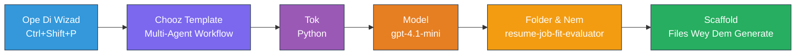
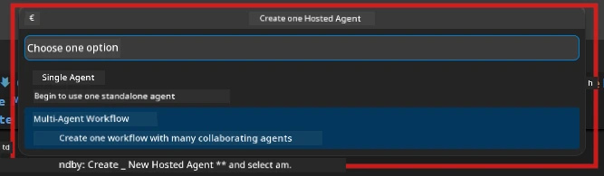

# Module 2 - Scaffold di Multi-Agent Project

For dis module, you go use di [Microsoft Foundry extension](https://marketplace.visualstudio.com/items?itemName=TeamsDevApp.vscode-ai-foundry) to **scaffold one multi-agent workflow project**. Di extension go generate di whole project structure - `agent.yaml`, `main.py`, `Dockerfile`, `requirements.txt`, `.env`, plus debug configuration. Den you go customize dem files for Modules 3 and 4.

> **Note:** Di `PersonalCareerCopilot/` folder for dis lab na complete, working example of one customized multi-agent project. You fit either scaffold fresh project (wey dem recommend for learning) or study di existing code direct.

---

## Step 1: Open di Create Hosted Agent wizard


1. Press `Ctrl+Shift+P` to open di **Command Palette**.
2. Type: **Microsoft Foundry: Create a New Hosted Agent** and select am.
3. Di hosted agent creation wizard go open.

> **Alternative:** Click di **Microsoft Foundry** icon for di Activity Bar → click di **+** icon wey dey beside **Agents** → **Create New Hosted Agent**.

---

## Step 2: Choose di Multi-Agent Workflow template

Di wizard go ask you to select template:

| Template | Description | When to use |
|----------|-------------|-------------|
| Single Agent | One agent wey get instructions and optional tools | Lab 01 |
| **Multi-Agent Workflow** | Plenty agents wey dey collaborate via WorkflowBuilder | **Dis lab (Lab 02)** |

1. Select **Multi-Agent Workflow**.
2. Click **Next**.



---

## Step 3: Choose programming language

1. Select **Python**.
2. Click **Next**.

---

## Step 4: Select your model

1. Di wizard go show models wey dem deploy for your Foundry project.
2. Select di same model wey you use for Lab 01 (for example, **gpt-4.1-mini**).
3. Click **Next**.

> **Tip:** [`gpt-4.1-mini`](https://learn.microsoft.com/azure/foundry/foundry-models/concepts/models-sold-directly-by-azure#gpt-41-series) na wetin dem recommend for development - e fast, cheap, and e sabi handle multi-agent workflows well well. If you want higher quality, switch go `gpt-4.1` when you wan production final deployment.

---

## Step 5: Choose folder location and agent name

1. One file dialog go open. Choose your target folder:
   - If you dey follow di workshop repo: go `workshop/lab02-multi-agent/` and create new subfolder
   - If you dey start fresh: choose any folder you like
2. Put **name** for di hosted agent (for example, `resume-job-fit-evaluator`).
3. Click **Create**.

---

## Step 6: Wait make di scaffolding finish

1. VS Code go open new window (or e go update di current window) with di scaffolded project.
2. You suppose see dis file structure:

```
resume-job-fit-evaluator/
├── .env                ← Environment variables (placeholders)
├── .vscode/
│   └── launch.json     ← Debug configuration
├── agent.yaml          ← Agent definition (kind: hosted)
├── Dockerfile          ← Container configuration
├── main.py             ← Multi-agent workflow code (scaffold)
└── requirements.txt    ← Python dependencies
```

> **Workshop note:** For di workshop repository, di `.vscode/` folder dey for di **workspace root** wit shared `launch.json` and `tasks.json`. Di debug configurations for Lab 01 and Lab 02 dey inside. When you press F5, select **"Lab02 - Multi-Agent"** from di dropdown.

---

## Step 7: Understand di scaffolded files (multi-agent specific)

Di multi-agent scaffold different from di single-agent scaffold for some important ways:

### 7.1 `agent.yaml` - Agent definition

```yaml
kind: hosted
name: resume-job-fit-evaluator
description: >
  A multi-agent workflow that evaluates resume-to-job fit.
metadata:
  authors:
    - Microsoft
  tags:
    - Multi-Agent Workflow
    - Resume Evaluator
protocols:
  - protocol: responses
    version: v1
environment_variables:
  - name: PROJECT_ENDPOINT
    value: ${PROJECT_ENDPOINT}
  - name: MODEL_DEPLOYMENT_NAME
    value: ${MODEL_DEPLOYMENT_NAME}
```

**Key difference from Lab 01:** Di `environment_variables` section fit get extra variables for MCP endpoints or other tool configuration. Di `name` and `description` dey show di multi-agent use case.

### 7.2 `main.py` - Multi-agent workflow code

Di scaffold get:
- **Plenty agent instruction strings** (one const per agent)
- **Plenty [`AzureAIAgentClient.as_agent()`](https://learn.microsoft.com/python/api/overview/azure/ai-agents-readme) context managers** (one per agent)
- **[`WorkflowBuilder`](https://learn.microsoft.com/agent-framework/workflows/agents-in-workflows)** to join agents together
- **`from_agent_framework()`** to serve di workflow as HTTP endpoint

```python
from agent_framework import WorkflowBuilder, tool
from agent_framework.azure import AzureAIAgentClient
from azure.ai.agentserver.agentframework import from_agent_framework
```

Di extra import [`WorkflowBuilder`](https://learn.microsoft.com/agent-framework/workflows/agents-in-workflows) na new from wetin Lab 01 get.

### 7.3 `requirements.txt` - Extra dependencies

Di multi-agent project use di same base packages like Lab 01, plus any MCP-related packages:

```
agent-framework-azure-ai==1.0.0rc3
agent-framework-core==1.0.0rc3
azure-ai-agentserver-agentframework==1.0.0b16
azure-ai-agentserver-core==1.0.0b16
debugpy
agent-dev-cli --pre
```

> **Important version note:** Di `agent-dev-cli` package need di `--pre` flag for `requirements.txt` to install di latest preview version. Dis one necessary for Agent Inspector to work well with `agent-framework-core==1.0.0rc3`. Make you check [Module 8 - Troubleshooting](08-troubleshooting.md) for version details.

| Package | Version | Purpose |
|---------|---------|---------|
| [`agent-framework-azure-ai`](https://learn.microsoft.com/agent-framework/overview/) | `1.0.0rc3` | Azure AI integration for [Microsoft Agent Framework](https://github.com/microsoft/agent-framework) |
| [`agent-framework-core`](https://learn.microsoft.com/agent-framework/overview/) | `1.0.0rc3` | Core runtime (e get WorkflowBuilder inside) |
| `azure-ai-agentserver-agentframework` | `1.0.0b16` | Hosted agent server runtime |
| `azure-ai-agentserver-core` | `1.0.0b16` | Core agent server abstractions |
| `debugpy` | latest | Python debugging (F5 for VS Code) |
| `agent-dev-cli` | `--pre` | Local dev CLI plus Agent Inspector backend |

### 7.4 `Dockerfile` - E remain di same as Lab 01

Di Dockerfile na exactly like Lab 01 own - e copy files, install dependencies from `requirements.txt`, expose port 8088, and run `python main.py`.

```dockerfile
FROM python:3.14-slim
WORKDIR /app
COPY ./ .
RUN pip install --upgrade pip && \
    if [ -f requirements.txt ]; then \
        pip install -r requirements.txt; \
    else \
      echo "No requirements.txt found" >&2; exit 1; \
    fi
EXPOSE 8088
CMD ["python", "main.py"]
```

---

### Checkpoint

- [ ] Scaffold wizard don finish → new project structure dey visible
- [ ] You fit see all di files: `agent.yaml`, `main.py`, `Dockerfile`, `requirements.txt`, `.env`
- [ ] `main.py` get `WorkflowBuilder` import (dis one confirm say you select multi-agent template)
- [ ] `requirements.txt` get both `agent-framework-core` and `agent-framework-azure-ai`
- [ ] You sabi how multi-agent scaffold different from single-agent scaffold (plenty agents, WorkflowBuilder, MCP tools)

---

**Previous:** [01 - Understand Multi-Agent Architecture](01-understand-multi-agent.md) · **Next:** [03 - Configure Agents & Environment →](03-configure-agents.md)

---

<!-- CO-OP TRANSLATOR DISCLAIMER START -->
**Disclaimer**:  
Dis document don translate wit AI translation service [Co-op Translator](https://github.com/Azure/co-op-translator). Even tho we dey try make am correct, abeg sabi say automated translations fit get errors or wahala. Di original document wey dey im native language na di correct source. If na serious matter, make you use professional human translation. We no go take responsibility for any misunderstanding or wrong meaning wey fit show from dis translation.
<!-- CO-OP TRANSLATOR DISCLAIMER END -->