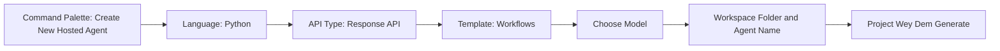
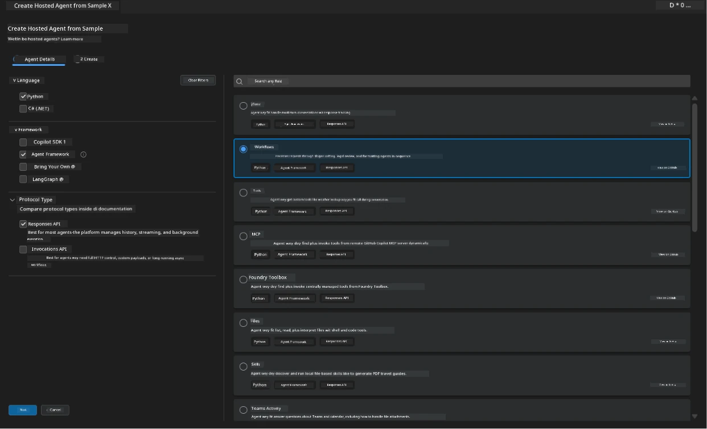
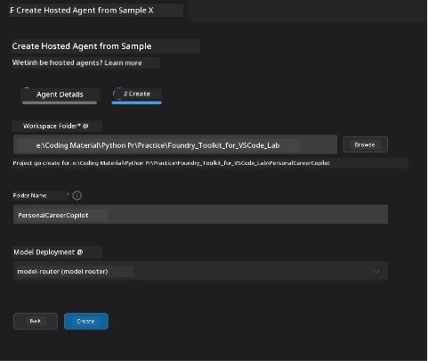

# Module 2 - Scaffold di Multi-Agent Project

⏱️ ~5 min

For dis module, you go use [Foundry Toolkit for VS Code](https://aka.ms/foundrytk) to **scaffold one multi-agent project**. Di wizard go generate `agent.yaml`, `main.py`, `Dockerfile`, `requirements.txt`, `.env`, plus VS Code debug configuration - so you fit concentrate for wiring di 4-agent workflow for Module 3.

> **Key concept:** Di scaffold na working stub wey get one agent. You go change di placeholder logic wit di `WorkflowBuilder` graph for Module 3. You no go write di boilerplate from scratch.

> **Reference implementation:** [`PersonalCareerCopilot/`](../../../../../workshop/lab02-multi-agent/PersonalCareerCopilot) na complete working example. Use am make you fit compare your work as you dey go.

### Scaffold wizard flow


```mermaid
flowchart LR
    A[Command Palette: Create New Hosted Agent] --> B[Language: Python]
    B --> C[API Type: Response API]
    C --> D[Template: Workflows]
    D --> E[Choose Model]
    E --> F[Workspace Folder and Agent Name]
    F --> G[Project Wey Dem Generate]
```

---

## Step 1: Open di Create Hosted Agent wizard

1. Press `Ctrl+Shift+P` make you open **Command Palette**.
2. Type: **Foundry Toolkit: Create a New Hosted Agent** and select am.
3. Di wizard go open for **Agent Details** tab.

> **Alternative:** Click di **Foundry Toolkit** icon for di Activity Bar → click di **+** icon wey dey next to **Hosted Agents** → **Create New Hosted Agent**.

---

## Step 2: Choose settings



1. For left navigation/options section, select di following:

| Menu | Selection | Notes |
|--------|-----------|-------|
| **Language** | Python | C# (.NET) still dey supported |
| **Framework** | Agent Framework | E dey provide `Agent`, `AgentExecutor`, `WorkflowBuilder` |
| **API type** | Response API | `POST /responses` - platform dey manage history, streaming support |
| **Template** | **Workflows** | E dey process requests through plenty agents one after another |

2. Once you select am, click **Next**



3. For di next window, choose di following:

| Menu | Selection | Notes |
|--------|-----------|-------|
| **Workspace folder** | Browse reach your target folder | For example, `workshop/lab02-multi-agent/` for dis repo |
| **Agent name** | `PersonalCareerCopilot` | Dis one go become di project directory name |
| **Model Deployment** | Select your deployed model | For example, `gpt-4.1-mini` from Lab 01 |

4. Click **Create** to scaffold di project. VS Code go generate di files and open di folder.

> **Tip:** [`gpt-4.1-mini`](https://learn.microsoft.com/azure/foundry/foundry-models/concepts/models-sold-directly-by-azure#gpt-41-series) good balance speed and quality well for multi-agent development.

---

## Step 3: Inspect di generated project

After you finish scaffolding, make sure say you see these files for Explorer (`Ctrl+Shift+E`):

```
📂 <your-agent-name>/
├── .azdignore          ← Files excluded from Azure Developer CLI deployments
├── .dockerignore       ← Files excluded from Docker builds
├── .env                ← Environment variables (placeholders - fill in Module 3)
├── .vscode/
│   ├── launch.json     ← Debug config (F5 → run + Agent Inspector)
│   └── tasks.json      ← VS Code task definitions
├── agent.yaml          ← Agent definition (kind: hosted, protocol: responses)
├── Dockerfile          ← Container config for deployment
├── main.py             ← Stub agent entry point (replace with WorkflowBuilder in Module 3)
└── requirements.txt    ← Python dependencies
```

> **Important:** Open dis scaffolded folder directly for VS Code so that `.vscode/launch.json` and `tasks.json` go work correct for F5 debugging.

### Key files explained

| File | Purpose |
|------|---------|
| `agent.yaml` | Talks `kind: hosted`, maps env vars, defines di `/responses` protocol |
| `main.py` | Stub: one `FoundryChatClient` → `Agent` → `ResponsesHostServer`. You go replace dis wit 4 agents + `WorkflowBuilder` for Module 3 |
| `Dockerfile` | `python:3.12-slim`, e dey install `requirements.txt`, e dey expose port 8088, e dey run `python main.py` |
| `requirements.txt` | `agent-framework-foundry`, `agent-framework-foundry-hosting`, `mcp<2,>=1.24.0`, `debugpy` |

> **Reference:** See [`PersonalCareerCopilot/agent.yaml`](../../../../../workshop/lab02-multi-agent/PersonalCareerCopilot/agent.yaml) and [`PersonalCareerCopilot/requirements.txt`](../../../../../workshop/lab02-multi-agent/PersonalCareerCopilot/requirements.txt) for di complete generated content.

---

### ✅ Checkpoint

- [ ] Scaffold wizard don finish - new project folder dey visible for Explorer
- [ ] All di expected files dey: `agent.yaml`, `main.py`, `Dockerfile`, `requirements.txt`, `.env`
- [ ] `agent.yaml` dey show `kind: hosted` and `protocol: responses`
- [ ] `main.py` dey import `Agent`, `FoundryChatClient`, `ResponsesHostServer`
- [ ] Scaffolded folder open as di VS Code workspace root
- [ ] You understand say `main.py` na stub - `WorkflowBuilder` go add for Module 3

---

**Previous:** [01 - Understand Multi-Agent Architecture](01-understand-multi-agent.md) · **Next:** [03 - Configure Agents & Environment →](03-configure-agents.md)

---

<!-- CO-OP TRANSLATOR DISCLAIMER START -->
**Disclaimer**:
Dis document don translate wit AI translation service [Co-op Translator](https://github.com/Azure/co-op-translator). Even tho we dey try make am correct, abeg make you know say automated translation fit get errors or mistakes. Di original document for dia own language na im be di correct source. For important info, make person wey sabi human translation do am. We no go responsible for any misunderstanding or wrong understanding wey fit happen because of dis translation.
<!-- CO-OP TRANSLATOR DISCLAIMER END -->