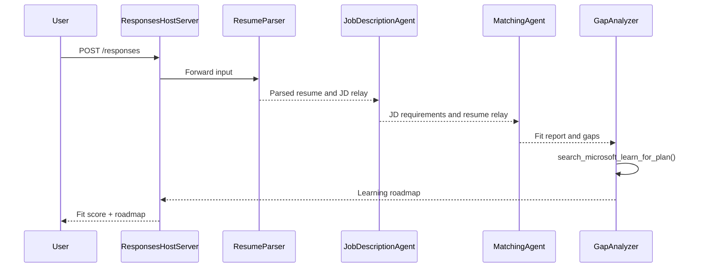

# Module 3 - Configure Instructions, Environment & Install Dependencies

⏱️ ~15 min

for dis module, you go transform di scaffolded stub into **your** multi-agent workflow - by setting environment variables, writing agent instructions, adding di MCP tool, wiring di workflow graph, and installing dependencies.

> **Reference:** Di full working code dey for [`PersonalCareerCopilot/main.py`](../../../../../workshop/lab02-multi-agent/PersonalCareerCopilot/main.py). Use am as reference while you dey build your own workflow graph and prompt blocks.

---

## How di four agents dey fit togeder



---

## Step 1: Configure environment variables

1. Open di **`.env`** file for your project root (wey di scaffold wizard create).
2. Change di placeholders wit your real values from Lab 01.

<details open>
<summary><strong>🅰️ Path A - Foundry subscription</strong></summary>

```env
FOUNDRY_PROJECT_ENDPOINT=https://<your-account>.services.ai.azure.com/api/projects/<your-project>
AZURE_AI_MODEL_DEPLOYMENT_NAME=gpt-4.1-mini
```

> **Where to find values:** See [Lab 01, Module 1](../../lab01-single-agent/docs/01-setup.md#deploy-a-model--assign-rbac).

</details>

<details open>
<summary><strong>🅱️ Path B - Foundry Local</strong></summary>

```env
FOUNDRY_PROJECT_ENDPOINT=http://localhost:5273/v1
AZURE_AI_MODEL_DEPLOYMENT_NAME=phi-4-mini
```

> All di inference run for your machine - no data go comot your device. Run `foundry model list` to sure di exact model alias. Di only request wey go outside na di MCP tool call to `https://learn.microsoft.com/api/mcp`.

> **Where to find values:** See [Lab 01, Module 1 - local path](../../lab01-single-agent/docs/01-setup.md#step-2-set-up-based-on-your-access).

</details>

> **Security:** No ever commit `.env` to version control. E suppose don dey for `.gitignore` already.

---

## Step 2: Write agent instructions

Instructions dey define every agent role, output format, and rules. Open `main.py` and define (or replace) di four instruction constants - di full strings dey for [`PersonalCareerCopilot/main.py`](../../../../../workshop/lab02-multi-agent/PersonalCareerCopilot/main.py).

### 2.1 `RESUME_PARSER_INSTRUCTIONS`
E go parse di resume into structured candidate profile **and** go copy di job description word for word into `[JOB DESCRIPTION PASS-THROUGH]`. Both labeled sections mus dey for di output.

> **Why di pass-through?** Wit `context_mode="last_agent"`, ResumeParser na di **only** agent wey dey see di original user message. If e no copy di JD forward, di agents wey dey after no go ever see am.

### 2.2 `JOB_DESCRIPTION_INSTRUCTIONS`
E go read `[PARSED RESUME]` and `[JOB DESCRIPTION PASS-THROUGH]` from ResumeParser output. E go output `[JD REQUIREMENTS]` (structured requirements) and `[PARSED RESUME PASS-THROUGH]` (word-for-word resume copy for MatchingAgent).

### 2.3 `MATCHING_AGENT_INSTRUCTIONS`
E dey read `[JD REQUIREMENTS]` and `[PARSED RESUME PASS-THROUGH]`. E go produce scored fit report (0–100) with breakdown math, matched skills, missing skills, and experience alignment.

### 2.4 `GAP_ANALYZER_INSTRUCTIONS`
E dey read di fit report. For **every** missing skill, e go call `search_microsoft_learn_for_plan` to find Microsoft Learn resources. E go produce one detailed gap card per skill plus week-by-week learning roadmap.

---

## Step 3: Add di MCP tool

Di GapAnalyzer go call di [Microsoft Learn MCP server](https://learn.microsoft.com/azure/foundry/agents/how-to/tools/model-context-protocol) to fetch real learning resources for every skill gap. Di full `search_microsoft_learn_for_plan` function dey in [`PersonalCareerCopilot/main.py`](../../../../../workshop/lab02-multi-agent/PersonalCareerCopilot/main.py).

Register di tool on di GapAnalyzer wen you dey create di agent:

```python
gap_analyzer = Agent(
    client=client,
    instructions=GAP_ANALYZER_INSTRUCTIONS,
    name="GapAnalyzer",
    tools=[search_microsoft_learn_for_plan],
)
```

> See [`PersonalCareerCopilot/main.py`](../../../../../workshop/lab02-multi-agent/PersonalCareerCopilot/main.py) for di full `WorkflowBuilder` graph wit `FoundryChatClient`, `AgentExecutor`, and all `add_edge()` calls.

---

## Step 4: Create virtual environment & install dependencies

> ⚠️ **No skip dis step.** Without dependencies install finish, F5 debugging no go work.

### 4.1 Create di virtual environment

```powershell
python -m venv .venv
```

### 4.2 Activate am

| OS | Command |
|----|---------|
| **Windows (PowerShell)** | `.\.venv\Scripts\Activate.ps1` |
| **Windows (CMD)** | `.venv\Scripts\activate.bat` |
| **macOS / Linux** | `source .venv/bin/activate` |

You go see `(.venv)` for your terminal prompt.

### 4.3 Install dependencies

```powershell
pip install -r requirements.txt
```

### 4.4 Verify

```powershell
pip list | Select-String "agent-framework|mcp|debugpy"
```

Expect: `agent-framework-foundry`, `agent-framework-foundry-hosting`, `mcp`, and `debugpy` go dey listed.

---

## Step 5: Verify authentication

<details open>
<summary><strong>🅰️ Path A - Azure credential</strong></summary>

```powershell
az account show --query "{name:name, id:id}" --output table
```

If dis one fail, run [`az login`](https://learn.microsoft.com/cli/azure/authenticate-azure-cli-interactively).

All four agents dey use one `FoundryChatClient` and one `DefaultAzureCredential`. If authentication work for one, e dey work for all.

</details>

<details open>
<summary><strong>🅱️ Path B - Foundry Local</strong></summary>

No authentication needed for local testing.

</details>

---

### ✅ Checkpoint

> No proceed to Module 04 till: **(1)** `(.venv)` show for your prompt AND **(2)** `pip install -r requirements.txt` don finish successful.

- [ ] `.env` get correct endpoint and model deployment name (no be placeholders)
- [ ] All 4 agent instruction constants dey defined for `main.py` (ResumeParser, JD Agent, MatchingAgent, GapAnalyzer)
- [ ] `search_microsoft_learn_for_plan` MCP tool dey defined and registered on GapAnalyzer
- [ ] `FoundryChatClient` + 4 `Agent` + 4 `AgentExecutor` objects dey created for `main()`
- [ ] `WorkflowBuilder` dey build correct sequential graph wit all 3 `add_edge()` calls
- [ ] Virtual environment create and activated (`(.venv)` dey visible for prompt)
- [ ] `pip install -r requirements.txt` finish without error
- [ ] **Path A:** `az account show` succeed OR VS Code Accounts icon dey show signed-in account

---

**Previous:** [02 - Scaffold Multi-Agent Project](02-scaffold-multi-agent.md) · **Next:** [04 - Orchestration Patterns →](04-orchestration-patterns.md)

---

<!-- CO-OP TRANSLATOR DISCLAIMER START -->
**Disclaimer**:
Dis document don translate wit AI translation service [Co-op Translator](https://github.com/Azure/co-op-translator). Even tho we dey try make am correct, abeg make you know say automated translation fit get errors or mistakes. Di original document for dia own language na im be di correct source. For important info, make person wey sabi human translation do am. We no go responsible for any misunderstanding or wrong understanding wey fit happen because of dis translation.
<!-- CO-OP TRANSLATOR DISCLAIMER END -->