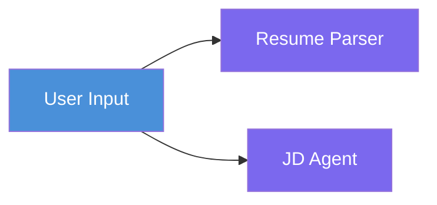
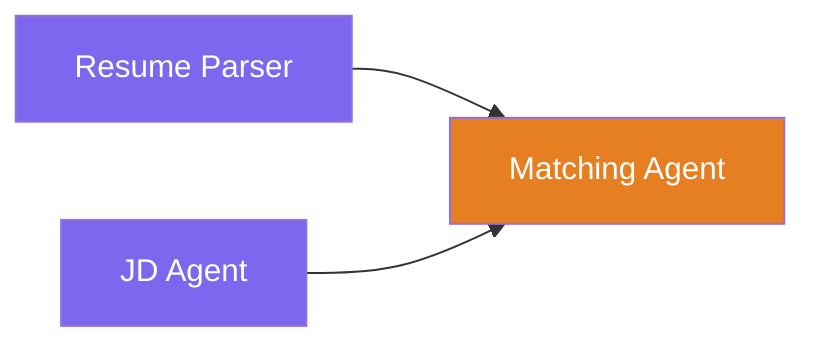
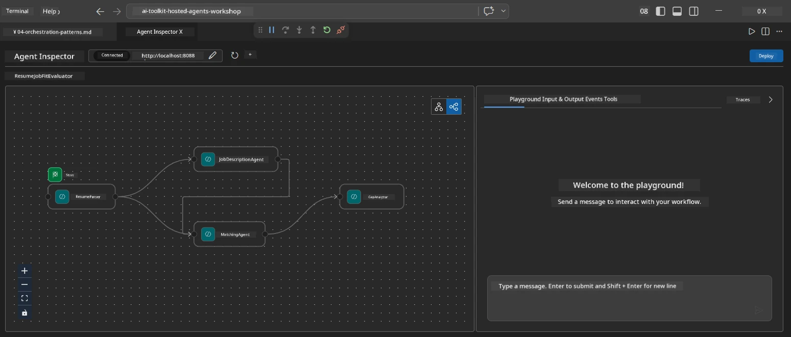
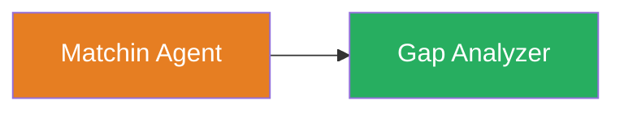
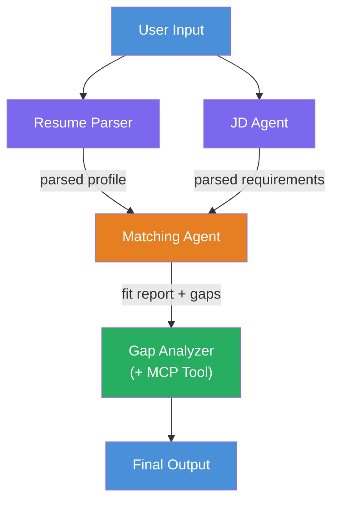
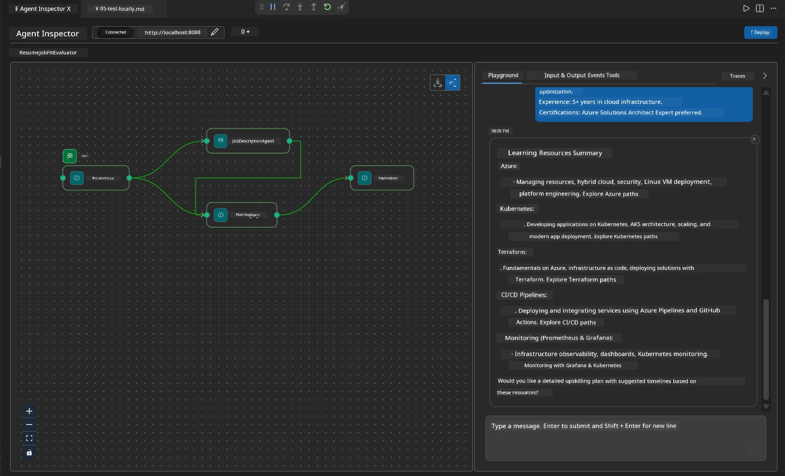

# Module 4 - Orchestration Patterns

For dis module, you go explore di orchestration patterns wey dem dey use for di Resume Job Fit Evaluator and learn how to read, modify, and extend di workflow graph. To sabi dis patterns na wetin go help you debug data flow issues and build your own [multi-agent workflows](https://learn.microsoft.com/agent-framework/workflows/).

---

## Pattern 1: Fan-out (parallel split)

Di first pattern for di workflow na **fan-out** - one input dey go multiple agents at di same time.


For code, dis dey happen because `resume_parser` na di `start_executor` - e dey receive di user message first. Then, because both `jd_agent` and `matching_agent` get edges from `resume_parser`, di framework dey route `resume_parser` output go both agents:

```python
.add_edge(resume_parser, jd_agent)         # ResumeParser output → JD Agent
.add_edge(resume_parser, matching_agent)   # ResumeParser output → MatchingAgent
```

**Why dis dey work:** ResumeParser and JD Agent dey process different parts of di same input. To run dem parallel dey reduce di whole latency compared to to run dem one after di other.

### When to use fan-out

| Use case | Example |
|----------|---------|
| Independent subtasks | Parsing resume vs. parsing JD |
| Redundancy / voting | Two agents analyze the same data, a third picks the best answer |
| Multi-format output | One agent generates text, another generates structured JSON |

---

## Pattern 2: Fan-in (aggregation)

Di second pattern na **fan-in** - multiple agent outputs dey collect and send go one downstream agent.


For code:

```python
.add_edge(resume_parser, matching_agent)   # ResumeParser output → MatchingAgent
.add_edge(jd_agent, matching_agent)        # JD Agent output → MatchingAgent
```

**Key behavior:** When one agent get **two or more incoming edges**, di framework go automatically wait for **all** di upstream agents to finish before e run di downstream agent. MatchingAgent no go start until ResumeParser and JD Agent don finish.

### Wetin MatchingAgent dey receive

Di framework dey join all di outputs from di upstream agents. MatchingAgent input go be like:

```
[ResumeParser output]
---
Candidate Profile:
  Name: Jane Doe
  Technical Skills: Python, Azure, Kubernetes, ...
  ...

[JobDescriptionAgent output]
---
Role Overview: Senior Cloud Engineer
Required Skills: Python, Azure, Terraform, ...
...
```

> **Note:** Di exact way of to join output depend on di framework version. Di agent instruction suppose fit handle both structured and unstructured upstream output.



---

## Pattern 3: Sequential chain

Di third pattern na **sequential chaining** - one agent output go directly enter di next one.


For code:

```python
.add_edge(matching_agent, gap_analyzer)    # Output wey MatchingAgent give → GapAnalyzer
```

Dis na di simplest pattern. GapAnalyzer dey receive MatchingAgent fit score, matched/missing skills, plus gaps. E go call [MCP tool](https://learn.microsoft.com/azure/foundry/agents/how-to/tools/model-context-protocol) for each gap to find Microsoft Learn resources.

---

## The complete graph

If you combine all three patterns, e go produce di full workflow:


### Execution timeline

```mermaid
gantt
    title Agent Execution Timeline
    dateFormat X
    axisFormat %s

    section Parallel
    Resume Parser       :rp, 0, 3
    JD Agent            :jd, 0, 2

    section Sequential
    Matching Agent      :ma, 3, 5
    Gap Analyzer        :ga, 5, 9
```


> Di total wall-clock time na about `max(ResumeParser, JD Agent) + MatchingAgent + GapAnalyzer`. GapAnalyzer usually slow pass because e dey make many MCP tool calls (one per gap).

---

## Reading the WorkflowBuilder code

Here be di complete `create_workflow()` function from `main.py`, with annotations:

```python
def create_workflow(resume_parser, jd_agent, matching_agent, gap_analyzer):
    workflow = (
        WorkflowBuilder(
            name="ResumeJobFitEvaluator",

            # Di first agent wey go receive user input
            start_executor=resume_parser,

            # Di agent dem wey output go turn final response
            output_executors=[gap_analyzer],
        )
        # Fan-out: ResumeParser output dey go both JD Agent and MatchingAgent
        .add_edge(resume_parser, jd_agent)
        .add_edge(resume_parser, matching_agent)

        # Fan-in: MatchingAgent dey wait for both ResumeParser and JD Agent
        .add_edge(jd_agent, matching_agent)

        # Sequential: MatchingAgent output dey go GapAnalyzer
        .add_edge(matching_agent, gap_analyzer)

        .build()
    )
    return workflow.as_agent()
```

### Edge summary table

| # | Edge | Pattern | Effect |
|---|------|---------|--------|
| 1 | `resume_parser → jd_agent` | Fan-out | JD Agent dey receive ResumeParser output (plus di original user input) |
| 2 | `resume_parser → matching_agent` | Fan-out | MatchingAgent dey receive ResumeParser output |
| 3 | `jd_agent → matching_agent` | Fan-in | MatchingAgent dey also receive JD Agent output (e go wait for both) |
| 4 | `matching_agent → gap_analyzer` | Sequential | GapAnalyzer dey receive fit report plus gap list |

---

## Modifying the graph

### Adding a new agent

To add fifth agent (like **InterviewPrepAgent** wey generate interview questions based on gap analysis):

```python
# 1. Define di instructions
INTERVIEW_PREP_INSTRUCTIONS = """\
You are the Interview Prep Agent.
Given a gap analysis and fit report, generate 10 targeted interview questions
the candidate should prepare for.
"""

# 2. Create di agent (inside di async with block)
AzureAIAgentClient(
    project_endpoint=PROJECT_ENDPOINT,
    model_deployment_name=MODEL_DEPLOYMENT_NAME,
    credential=credential,
).as_agent(
    name="InterviewPrepAgent",
    instructions=INTERVIEW_PREP_INSTRUCTIONS,
) as interview_prep,

# 3. Add edges for create_workflow()
.add_edge(matching_agent, interview_prep)   # dey receive fit report
.add_edge(gap_analyzer, interview_prep)     # dey also receive gap cards

# 4. Update output_executors
output_executors=[interview_prep],  # dis na di final agent now
```

### Changing execution order

To make JD Agent run **after** ResumeParser (sequential instead of parallel):

```python
# Remove: .add_edge(resume_parser, jd_agent)  ← don already dey, make e remain so
# Comot the parallel wey no clear by NOT making jd_agent receive user input straight
# The start_executor dey send to resume_parser first, and jd_agent go only get
# resume_parser output through the edge. Dis one make dem dey sequential.
```

> **Important:** Di `start_executor` na di only agent wey dey receive di raw user input. All other agents dey receive output from their upstream edges. If you want agent to also receive di raw user input, e must get edge from di `start_executor`.

---

## Common graph mistakes

| Mistake | Symptom | Fix |
|---------|---------|-----|
| Missing edge to `output_executors` | Agent dey run but output dey empty | Make sure say path dey from `start_executor` to every agent wey dey `output_executors` |
| Circular dependency | Infinite loop or timeout | Check say no agent dey feed back into upstream agent |
| Agent wey dey `output_executors` without incoming edge | Output empty | Add at least one `add_edge(source, that_agent)` |
| Multiple `output_executors` without fan-in | Output get only one agent response | Use one output agent wey dey aggregate, or accept multiple outputs |
| Missing `start_executor` | `ValueError` for build time | Always specify `start_executor` inside `WorkflowBuilder()` |

---

## Debugging the graph

### Using Agent Inspector

1. Start di agent locally (F5 or terminal - see [Module 5](05-test-locally.md)).
2. Open Agent Inspector (`Ctrl+Shift+P` → **Foundry Toolkit: Open Agent Inspector**).
3. Send test message.
4. For Inspector response panel, look for **streaming output** - e go show each agent contribution one by one.



### Using logging

Add logging to `main.py` to trace data flow:

```python
import logging
logger = logging.getLogger("resume-job-fit")

# Inside create_workflow(), afta we don build:
logger.info("Workflow graph built with edges: RP→JD, RP→MA, JD→MA, MA→GA")
```

Di server logs go show agent execution order and MCP tool calls:

```
INFO:resume-job-fit:Starting Resume -> Job Fit Evaluator HTTP server...
INFO:resume-job-fit:Server running on http://localhost:8088
INFO:agent_framework:Executing agent: ResumeParser
INFO:agent_framework:Executing agent: JobDescriptionAgent
INFO:agent_framework:Waiting for upstream agents: ResumeParser, JobDescriptionAgent
INFO:agent_framework:Executing agent: MatchingAgent
INFO:agent_framework:Executing agent: GapAnalyzer
INFO:agent_framework:Tool call: search_microsoft_learn_for_plan(skill="Kubernetes")
POST https://learn.microsoft.com/api/mcp → 200
INFO:agent_framework:Tool call: search_microsoft_learn_for_plan(skill="Terraform")
POST https://learn.microsoft.com/api/mcp → 200
```

---

### Checkpoint

- [ ] You fit identify di three orchestration patterns for di workflow: fan-out, fan-in, and sequential chain
- [ ] You sabi say agents wey get multiple incoming edges dey wait make all upstream agents finish
- [ ] You fit read `WorkflowBuilder` code and map each `add_edge()` call to di graph wey dey visual
- [ ] You sabi di execution timeline: parallel agents dey run first, then aggregation, then sequential
- [ ] You sabi how to add new agent to di graph (define instructions, create agent, add edges, update output)
- [ ] You fit identify common graph mistakes and their symptoms

---

**Previous:** [03 - Configure Agents & Environment](03-configure-agents.md) · **Next:** [05 - Test Locally →](05-test-locally.md)

---

<!-- CO-OP TRANSLATOR DISCLAIMER START -->
**Disclaimer**:  
Dis document don translate wit AI translation service [Co-op Translator](https://github.com/Azure/co-op-translator). Even tho we dey try make am correct, abeg sabi say automated translations fit get errors or mistakes. Di original document wey dey im native language na di correct one wey you suppose trust pass. For important mata, make you use professional human translation. We no go responsible for any misunderstanding or wrong meaning wey fit show because of dis translation.
<!-- CO-OP TRANSLATOR DISCLAIMER END -->