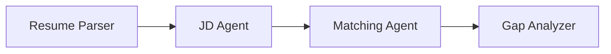
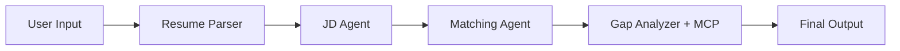

# Module 4 - Orchestration Patterns

⏱️ ~10 min

For dis module, you go explore di orchestration patterns Wey dem dey use for Resume Job Fit Evaluator and you go learn how to read, modify, and extend di workflow graph. To sabi these patterns na important for debugging data flow wahala and to build your own [multi-agent workflows](https://learn.microsoft.com/agent-framework/workflows/).

---

## Pattern 1: Sequential chain

Di fundamental pattern for di workflow na **sequential chain** - each agent output dey go directly inside di next one.


```mermaid
flowchart LR
    RP[Resume Parser] --> JD[JD Agent]
    JD --> MA[Matching Agent]
    MA --> GA[Gap Analyzer]
```

For code, each `add_edge()` call dey create one step for di chain:

```python
.add_edge(resume_executor, jd_executor)       # ResumeParser output → JD Agent
.add_edge(jd_executor, matching_executor)     # JD Agent output → MatchingAgent
.add_edge(matching_executor, gap_executor)    # MatchingAgent output → GapAnalyzer
```

> **Why sequential, no be fan-out/fan-in?** `WorkflowBuilder` dey use **OR-semantics** for incoming edges: downstream executor go start as soon as **any** predecessor don finish. If `matching_executor` get two incoming edges (from `resume_executor` and `jd_executor`), e go trigger two times - once wen ResumeParser finish and again wen JD Agent finish - wey go make GapAnalyzer run two times and output go show two times. Di sequential pipeline fit avoid dis wahala complete.

## Pattern 2: Content Relay

Because `context_mode="last_agent"` mean each executor na only im **direct predecessor output** e dey see, agents for sequential chain gats pass any data Wey downstream agents need explicitly.

For dis workflow:
- **ResumeParser** dey copy di JD verbatim enter `[JOB DESCRIPTION PASS-THROUGH]` (make JD Agent fit find am).
- **JD Agent** dey copy `[PARSED RESUME]` verbatim enter `[PARSED RESUME PASS-THROUGH]` (make MatchingAgent fit compare both profiles).

```
ResumeParser output
└─ [PARSED RESUME]               ← extracted by JD Agent
└─ [JOB DESCRIPTION PASS-THROUGH] ← extracted by JD Agent

JD Agent output
└─ [JD REQUIREMENTS]             ← extracted by MatchingAgent
└─ [PARSED RESUME PASS-THROUGH]  ← extracted by MatchingAgent
```

Each relay section gats copy **verbatim** - if you summarize or paraphrase am, e go break di downstream agent Wey depend on am.

---

## Di complete graph

To combine di sequential chain and content relay patterns dey produce di full workflow:


```mermaid
flowchart LR
    U[User Input] --> RP[Resume Parser]
    RP --> JD[JD Agent]
    JD --> MA[Matching Agent]
    MA --> GA[Gap Analyzer + MCP]
    GA --> O[Final Output]
```

Di Agent Inspector dey show dis same graph structure wen di agent dey run locally. Make you check [Module 5 - Test Locally](05-test-locally.md) for screenshots.

---

## Reading the WorkflowBuilder code

Di full `create_workflow()` function dey for [`PersonalCareerCopilot/main.py`](../../../../../workshop/lab02-multi-agent/PersonalCareerCopilot/main.py). Di three `add_edge()` calls na im dey build di sequential pipeline:

| # | Edge | Effect |
|---|------|--------|
| 1 | `resume_executor → jd_executor` | JD Agent go receive `[PARSED RESUME]` + `[JOB DESCRIPTION PASS-THROUGH]` |
| 2 | `jd_executor → matching_executor` | MatchingAgent go receive `[JD REQUIREMENTS]` + `[PARSED RESUME PASS-THROUGH]` |
| 3 | `matching_executor → gap_executor` | GapAnalyzer go receive fit report + gap list |

---

## Modifying di graph

### Adding new agent

To add di fifth agent (for example, an **InterviewPrepAgent** after GapAnalyzer):

1. Define constant `INTERVIEW_PREP_INSTRUCTIONS`.
2. Create `Agent` + `AgentExecutor` objects (same pattern as di four Wey dey already).
3. Add `.add_edge(gap_executor, interview_exec)` for `WorkflowBuilder`.
4. Update `output_executors=[interview_exec]`.

> **Important:** `start_executor` na only agent Wey dey receive raw user input. All oda agents go receive output from their upstream edge.

---

## Common graph mistakes

| Mistake | Symptom | Fix |
|---------|---------|-----|
| Missing edge go `output_executors` | Agent dey run but output empty | Make sure say path dey from `start_executor` go every agent for `output_executors` |
| Circular dependency | Infinite loop or timeout | Check say no agent dey feed back enter upstream agent |
| Agent for `output_executors` wey get no incoming edge | Empty output | Add at least one `add_edge(source, that_agent)` |
| Plenty `output_executors` wey no get fan-in | Output get only one agent response | Use only one output agent Wey dey aggregate, or accept multiple outputs |
| Missing `start_executor` | `ValueError` for build time | Always specify `start_executor` for `WorkflowBuilder()` |

---

## Debugging di graph

### Using Agent Inspector

1. Start di agent locally wit F5.
2. Open Agent Inspector (`Ctrl+Shift+P` → **Foundry Toolkit: Open Agent Inspector**).
3. Send test message.
4. For Inspector response panel, look di **streaming output** - e dey show each agent contribution one by one.


### Using logging

Add logging to `main.py` to trace how data dey flow:

```python
import logging
logger = logging.getLogger("resume-job-fit")

# For main(), afta you don build di workflow:
logger.info("Workflow graph built with edges: RP→JD, JD→MA, MA→GA")
```

Server logs go show agent execution order and MCP tool calls:

```
INFO:agent_framework:Executing agent: ResumeParser
INFO:agent_framework:Executing agent: JobDescriptionAgent
INFO:agent_framework:Executing agent: MatchingAgent
INFO:agent_framework:Executing agent: GapAnalyzer
INFO:agent_framework:Tool call: search_microsoft_learn_for_plan(skill="Kubernetes")
POST https://learn.microsoft.com/api/mcp → 200
INFO:agent_framework:Tool call: search_microsoft_learn_for_plan(skill="Terraform")
POST https://learn.microsoft.com/api/mcp → 200
```

---

### Checkpoint

- [ ] You fit sabi di two orchestration patterns for workflow: sequential chain and content relay
- [ ] You understand why `context_mode="last_agent"` gats explicit data relay between agents
- [ ] You dey fit read `WorkflowBuilder` code and link each `add_edge()` call to di visual graph
- [ ] You sabi how to add new agent go end of di pipeline
- [ ] You fit sabi common graph mistakes and how dem dey show

---

**Previous:** [03 - Configure Agents & Environment](03-configure-agents.md) · **Next:** [05 - Test Locally →](05-test-locally.md)

---

<!-- CO-OP TRANSLATOR DISCLAIMER START -->
**Disclaimer**:
Dis document don translate wit AI translation service [Co-op Translator](https://github.com/Azure/co-op-translator). Even tho we dey try make am correct, abeg make you know say automated translation fit get errors or mistakes. Di original document for dia own language na im be di correct source. For important info, make person wey sabi human translation do am. We no go responsible for any misunderstanding or wrong understanding wey fit happen because of dis translation.
<!-- CO-OP TRANSLATOR DISCLAIMER END -->