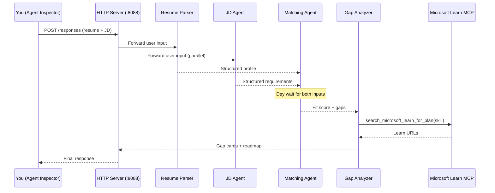
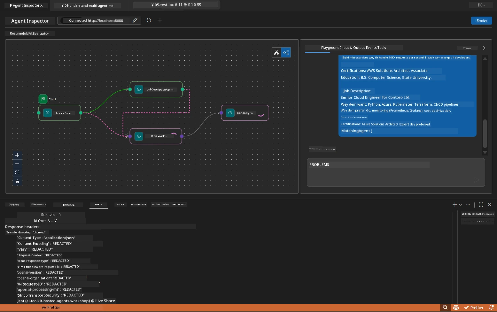

# Module 5 - Test Locally (Multi-Agent)

For dis module, you go run di multi-agent workflow for your own machine, test am with Agent Inspector, and confirm say all four agents plus di MCP tool dey work well before you deploy am for Foundry.

### Wetin dey happen during local test run


---

## Step 1: Start di agent server

### Option A: Using di VS Code task (wey dem recommend)

1. Press `Ctrl+Shift+P` → type **Tasks: Run Task** → choose **Run Lab02 HTTP Server**.
2. Di task go start di server with debugpy on top port `5679` and di agent for port `8088`.
3. Wait till di output show:

```
INFO:resume-job-fit:Starting Resume -> Job Fit Evaluator HTTP server...
INFO:resume-job-fit:Server running on http://localhost:8088
```

### Option B: Use terminal manually

```powershell
cd workshop\lab02-multi-agent\PersonalCareerCopilot
```

Activate di virtual environment:

**PowerShell (Windows):**
```powershell
.\.venv\Scripts\Activate.ps1
```

**macOS/Linux:**
```bash
source .venv/bin/activate
```

Start di server:

```powershell
python -m debugpy --listen 127.0.0.1:5679 -m agentdev run main.py --verbose --port 8088
```

### Option C: Use F5 (debug mode)

1. Press `F5` or go to **Run and Debug** (`Ctrl+Shift+D`).
2. Choose di **Lab02 - Multi-Agent** launch configuration from di dropdown.
3. Di server go start with full breakpoint support.

> **Tip:** Debug mode go allow you set breakpoints inside `search_microsoft_learn_for_plan()` to check MCP responses, or inside di agent instruction strings to see wetin each agent dey receive.

---

## Step 2: Open Agent Inspector

1. Press `Ctrl+Shift+P` → type **Foundry Toolkit: Open Agent Inspector**.
2. Agent Inspector go open for browser tab at `http://localhost:5679`.
3. You suppose see di agent interface ready to accept messages.

> **If Agent Inspector no open:** Make sure say di server don fully start (you go see di "Server running" log). If port 5679 dey busy, check [Module 8 - Troubleshooting](08-troubleshooting.md).

---

## Step 3: Run smoke tests

Run dis three tests one by one. Each one go test more parts of di workflow.

### Test 1: Basic resume + job description

Paste dis one for Agent Inspector:

```
Resume:
Jane Doe
Senior Software Engineer with 5 years of experience in Python, Django, and AWS.
Built microservices handling 10K+ requests/second. Led a team of 4 developers.
Certifications: AWS Solutions Architect Associate.
Education: B.S. Computer Science, State University.

Job Description:
Senior Cloud Engineer at Contoso Ltd.
Required: Python, Azure, Kubernetes, Terraform, CI/CD pipelines.
Preferred: Go, monitoring (Prometheus/Grafana), cost optimization.
Experience: 5+ years in cloud infrastructure.
Certifications: Azure Solutions Architect Expert preferred.
```

**Expected output structure:**

Di response go get output for all four agents one-by-one:

1. **Resume Parser output** - Structured candidate profile with skills grouped by category
2. **JD Agent output** - Structured requirements with required vs. preferred skills separated
3. **Matching Agent output** - Fit score (0-100) with breakdown, matched skills, missing skills, gaps
4. **Gap Analyzer output** - Individual gap cards for each missing skill, each with Microsoft Learn URLs



### Wetin to check for Test 1

| Check | Expected | Pass? |
|-------|----------|-------|
| Response get fit score | Number between 0-100 with breakdown | |
| Matched skills dey listed | Python, CI/CD (partial), etc. | |
| Missing skills dey listed | Azure, Kubernetes, Terraform, etc. | |
| Gap cards dey for each missing skill | One card per skill | |
| Microsoft Learn URLs dey | Real `learn.microsoft.com` links | |
| No error message for response | Clean structured output | |

### Test 2: Verify MCP tool execution

While Test 1 dey run, check di **server terminal** for MCP log entries:

```
GET https://learn.microsoft.com/api/mcp → 405 (Method Not Allowed)
POST https://learn.microsoft.com/api/mcp → 200
DELETE https://learn.microsoft.com/api/mcp → 405 (Method Not Allowed)
```

| Log entry | Meaning | Expected? |
|-----------|---------|-----------|
| `GET ... → 405` | MCP client dey probe with GET during initialization | Yes - normal |
| `POST ... → 200` | Real tool call to Microsoft Learn MCP server | Yes - dis na real call |
| `DELETE ... → 405` | MCP client dey probe with DELETE during cleanup | Yes - normal |
| `POST ... → 4xx/5xx` | Tool call fail | No - check [Troubleshooting](08-troubleshooting.md) |

> **Key point:** Di `GET 405` and `DELETE 405` lines na **normal behavior**. Only concern yourself if `POST` calls no return 200 status codes.

### Test 3: Edge case - high-fit candidate

Paste resume wey match di JD well well to confirm GapAnalyzer fit handle high-fit cases:

```
Resume:
Alex Chen
Senior Cloud Engineer with 7 years of experience.
Skills: Python, Azure (AKS, Functions, DevOps), Kubernetes, Terraform, CI/CD (GitHub Actions, Azure Pipelines), Go, Prometheus, Grafana, cost optimization.
Certifications: Azure Solutions Architect Expert, Azure DevOps Engineer Expert.
Led infrastructure migration to Azure for 3 enterprise clients.
Education: M.S. Computer Science, Tech University.

Job Description:
Senior Cloud Engineer at Contoso Ltd.
Required: Python, Azure, Kubernetes, Terraform, CI/CD pipelines.
Preferred: Go, monitoring (Prometheus/Grafana), cost optimization.
Experience: 5+ years in cloud infrastructure.
Certifications: Azure Solutions Architect Expert preferred.
```

**Expected behavior:**
- Fit score go be **80+** (most skills match)
- Gap cards go focus on polish/interview readiness no be foundational learning
- Di GapAnalyzer instructions talk say: "If fit >= 80, focus on polish/interview readiness"

---

## Step 4: Verify output completeness

After you run di tests, confirm say di output meet these criteria:

### Output structure checklist

| Section | Agent | Present? |
|---------|-------|----------|
| Candidate Profile | Resume Parser | |
| Technical Skills (grouped) | Resume Parser | |
| Role Overview | JD Agent | |
| Required vs. Preferred Skills | JD Agent | |
| Fit Score with breakdown | Matching Agent | |
| Matched / Missing / Partial skills | Matching Agent | |
| Gap card per missing skill | Gap Analyzer | |
| Microsoft Learn URLs in gap cards | Gap Analyzer (MCP) | |
| Learning order (numbered) | Gap Analyzer | |
| Timeline summary | Gap Analyzer | |

### Common issues wey dey this stage

| Issue | Cause | Fix |
|-------|-------|-----|
| Only 1 gap card (others cut) | GapAnalyzer instructions no get CRITICAL block | Add di `CRITICAL:` paragraph to `GAP_ANALYZER_INSTRUCTIONS` - see [Module 3](03-configure-agents.md) |
| No Microsoft Learn URLs | MCP endpoint no dey reachable | Check internet connectivity. Confirm `MICROSOFT_LEARN_MCP_ENDPOINT` for `.env` na `https://learn.microsoft.com/api/mcp` |
| Empty response | `PROJECT_ENDPOINT` or `MODEL_DEPLOYMENT_NAME` no set | Check `.env` file values. Run `echo $env:PROJECT_ENDPOINT` for terminal |
| Fit score na 0 or no dey | MatchingAgent no get upstream data | Make sure `add_edge(resume_parser, matching_agent)` and `add_edge(jd_agent, matching_agent)` dey for `create_workflow()` |
| Agent start then exit sharp sharp | Import error or missing dependency | Run `pip install -r requirements.txt` again. Check terminal for errors |
| `validate_configuration` error | Missing env vars | Create `.env` with `PROJECT_ENDPOINT=<your-endpoint>` and `MODEL_DEPLOYMENT_NAME=<your-model>` |

---

## Step 5: Test with your own data (optional)

Try paste your own resume and real job description. This one go help prove:

- Di agents fit handle different resume formats (chronological, functional, hybrid)
- JD Agent fit handle different JD styles (bullet points, paragraphs, structured)
- MCP tool fit return relevant resources for real skills
- Gap cards go personalize for your own background

> **Privacy note:** When you dey test locally, your data dey your machine only and e go only send to your Azure OpenAI deployment. E no dey logged or stored by workshop infrastructure. You fit use placeholder names if you want (like "Jane Doe" instead of your real name).

---

### Checkpoint

- [ ] Server start well for port `8088` (log show "Server running")
- [ ] Agent Inspector open and connect to agent
- [ ] Test 1: Complete response with fit score, matched/missing skills, gap cards, and Microsoft Learn URLs
- [ ] Test 2: MCP logs show `POST ... → 200` (tool calls succeed)
- [ ] Test 3: High-fit candidate get score 80+ with polish-focused advice
- [ ] All gap cards dey present (one per missing skill, no cut)
- [ ] No errors or stack traces for server terminal

---

**Previous:** [04 - Orchestration Patterns](04-orchestration-patterns.md) · **Next:** [06 - Deploy to Foundry →](06-deploy-to-foundry.md)

---

<!-- CO-OP TRANSLATOR DISCLAIMER START -->
**Disclaimer**:  
Dis document don translate wit AI translation service [Co-op Translator](https://github.com/Azure/co-op-translator). Even tho we dey try make am correct, abeg sabi say automated translations fit get mistake or inaccuracy. Di original document wey dey dia for im native language na di correct source. For important tin dem, e beta make professional human translation do am. We no go responsible for any misunderstanding or wrong interpretation wey fit happen from using dis translation.
<!-- CO-OP TRANSLATOR DISCLAIMER END -->