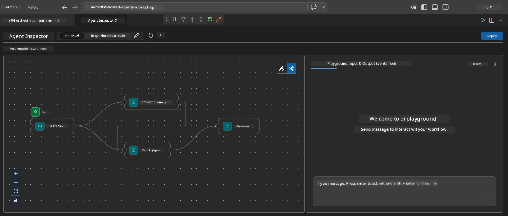
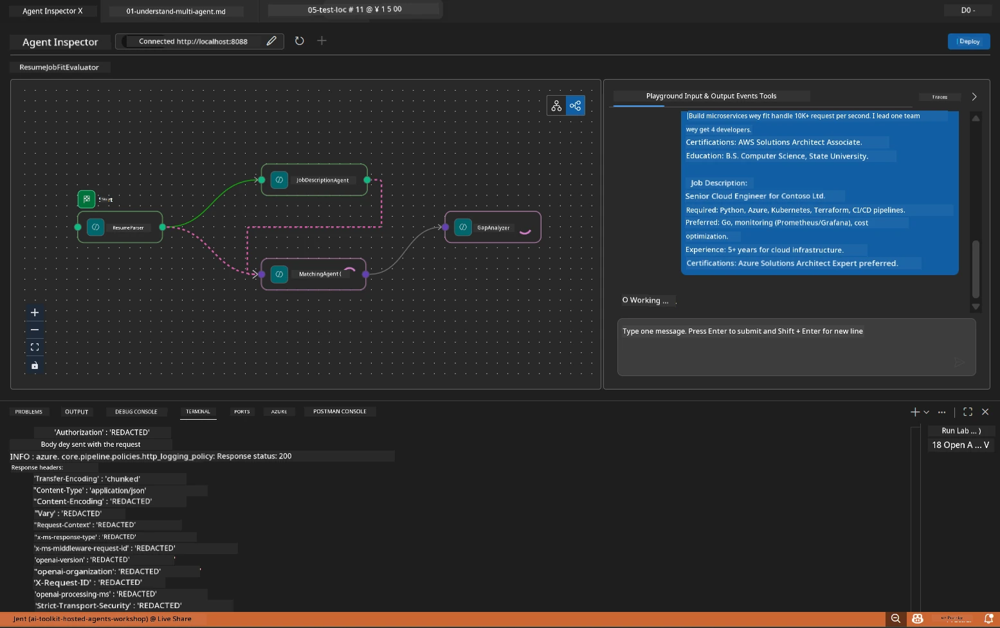

# Module 5 - Test for Local

⏱️ ~15 minit

for dis module, you go run dat multi-agent workflow for your local machine, test am with Agent Inspector, plus check say all four agents plus di MCP tool dey work well before you deploy am.

---

## Step 1: Start di agent server

### Option A: Use di VS Code task (wey dem recommend)

1. Open `workshop/lab02-multi-agent/PersonalCareerCopilot/` as your VS Code folder.
2. Press `Ctrl+Shift+P` → type **Tasks: Run Task** → select **Run Agent HTTP Server**.
3. Di task go start di server with debugpy attach for port `5679` and di agent on port `8088`.
4. Wait make di output show:

```
INFO:resume-job-fit:Starting Resume -> Job Fit Evaluator HTTP server...
INFO:resume-job-fit:Server running on http://localhost:8088
```

### Option B: Use F5 (debug mode)

1. Press `F5` → select **Debug Local Agent HTTP Server**.
2. Di server go start with full breakpoint support - e good for inspecting MCP responses or agent outputs.

---

## Step 2: Open Agent Inspector

1. Press `Ctrl+Shift+P` → type **Foundry Toolkit: Open Agent Inspector**.
2. Agent Inspector go open as VS Code panel Wey connect to `http://localhost:8088`.
3. You for see say di agent interface ready to receive messages.



> **If Agent Inspector no open:** Make sure say di server don fully start (you fit see di "Server running" log). If port 5679 busy, check [Module 8 - Troubleshooting](08-troubleshooting.md).

---

## Step 2b: (Optional) Open di Workflow Visualizer

Di Foundry Toolkit get real-time **Workflow Visualizer** Wey dey show how agents dey interact as di graph dey run. E good well well for multi-agent debugging.

1. Press `Ctrl+Shift+P` → type **Foundry Toolkit: Open Visualizer for Hosted Agents**.
2. One new VS Code tab go open show di live execution graph.
3. As you dey send messages for Agent Inspector, di visualizer go dey update on top, green nodes mean say agents done, and animated edges dey show how data dey flow between dem.

> **Port conflict:** If di visualizer port don dey use, change am for VS Code Settings → **Extensions** → **Microsoft Foundry Configuration** → **Hosted Agents: Visualizer Port**.

---

## Step 3: Run smoke tests

Run dis three tests one after di oda. Each one dey test more parts of di workflow.

### Test 1: Basic resume + job description

Paste dis one inside Agent Inspector:

```
Resume:
Jane Doe
Senior Software Engineer with 5 years of experience in Python, Django, and AWS.
Built microservices handling 10K+ requests/second. Led a team of 4 developers.
Certifications: AWS Solutions Architect Associate.
Education: B.S. Computer Science, State University.

Job Description:
Senior Cloud Engineer at Contoso Ltd.
Required: Python, Azure, Kubernetes, Terraform, CI/CD pipelines.
Preferred: Go, monitoring (Prometheus/Grafana), cost optimization.
Experience: 5+ years in cloud infrastructure.
Certifications: Azure Solutions Architect Expert preferred.
```

**How output suppose be:**

Di response suppose get output from all four agents for order:

1. **Resume Parser output** - Two labeled sections: `[PARSED RESUME]` (candidate profile with grouped skills) and `[JOB DESCRIPTION PASS-THROUGH]` (verbatim JD text Wey dey feed di JD Agent)
2. **JD Agent output** - Structured requirements with required vs. preferred skills separate
3. **Matching Agent output** - Fit score (0-100) with breakdown, matched skills, missing skills, gaps
4. **Gap Analyzer output** - Individual gap cards for each missing skill, each with Microsoft Learn URLs




### Wetin to check for Test 1

| Check | Expected | Pass? |
|-------|----------|-------|
| Response get fit score | Number between 0-100 with breakdown | |
| Matched skills dey listed | Python, CI/CD (partial), etc. | |
| Missing skills dey listed | Azure, Kubernetes, Terraform, etc. | |
| Gap cards dey for each missing skill | One card per skill | |
| Microsoft Learn URLs dey there | Real `learn.microsoft.com` links | |
| No error messages for response | Clean structured output | |

### Test 2: Edge case - high-fit candidate

Paste resume Wey close to match di JD well make you fit verify say GapAnalyzer fit handle high-fit cases:

```
Resume:
Alex Chen
Senior Cloud Engineer with 7 years of experience.
Skills: Python, Azure (AKS, Functions, DevOps), Kubernetes, Terraform, CI/CD (GitHub Actions, Azure Pipelines), Go, Prometheus, Grafana, cost optimization.
Certifications: Azure Solutions Architect Expert, Azure DevOps Engineer Expert.
Led infrastructure migration to Azure for 3 enterprise clients.
Education: M.S. Computer Science, Tech University.

Job Description:
Senior Cloud Engineer at Contoso Ltd.
Required: Python, Azure, Kubernetes, Terraform, CI/CD pipelines.
Preferred: Go, monitoring (Prometheus/Grafana), cost optimization.
Experience: 5+ years in cloud infrastructure.
Certifications: Azure Solutions Architect Expert preferred.
```

**How e suppose behave:**
- Fit score suppose be **80+** (most skills match)
- Gap cards suppose focus on polish/interview readiness no be just basic learning
- Di GapAnalyzer instructions talk say: "If fit >= 80, focus on polish/interview readiness"

---

## Step 4: Test with your own data (optional)

Try paste your own resume and real job description. E go help check say:

- Di agents fit take different resume formats (chronological, functional, hybrid)
- Di JD Agent fit handle different JD styles (bullet points, paragraphs, structured)
- Di MCP tool go give relevant resources for real skills
- Di gap cards go be tailor to your own background

> **Privacy - Path A (Foundry cloud):** Resume and JD text dey send go your Azure OpenAI deployment for inference. Workshop infrastructure no dey log or store am. If you want, use placeholder names (e.g., "Jane Doe").
>
> **Privacy - Path B (Foundry Local):** All four agent inferences dey run fully for your device. Your resume and job description text **no go comot your machine**. Only outbound call na di MCP tool wey dey fetch resources from `https://learn.microsoft.com/api/mcp`; dat query only get di skill name, no your personal info.

---

### Checkpoint

- [ ] Server start well for port `8088` (log show "Server running")
- [ ] Agent Inspector open and connect to di agent
- [ ] Test 1: Complete response with fit score, matched/missing skills, gap cards, and Microsoft Learn URLs
- [ ] Test 2: High-fit candidate get score 80+ with polish-focused recommendations
- [ ] All gap cards dey present (one for each missing skill, no cut)
- [ ] No error or stack trace for the server terminal

---

**Previous:** [04 - Orchestration Patterns](04-orchestration-patterns.md) · **Next:** [06 - Deploy to Foundry →](06-deploy-to-foundry.md)

---

<!-- CO-OP TRANSLATOR DISCLAIMER START -->
**Disclaimer**:
Dis document don translate wit AI translation service [Co-op Translator](https://github.com/Azure/co-op-translator). Even tho we dey try make am correct, abeg make you know say automated translation fit get errors or mistakes. Di original document for dia own language na im be di correct source. For important info, make person wey sabi human translation do am. We no go responsible for any misunderstanding or wrong understanding wey fit happen because of dis translation.
<!-- CO-OP TRANSLATOR DISCLAIMER END -->