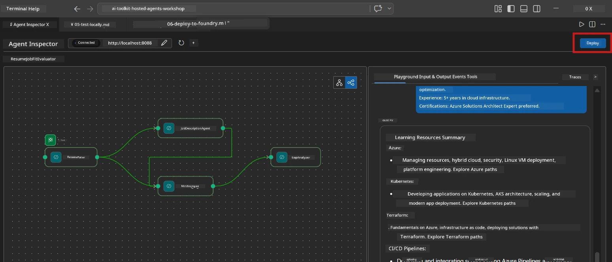
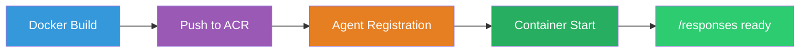
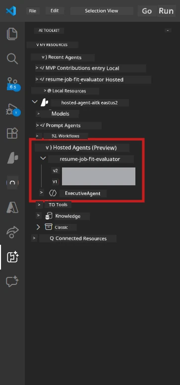

# Module 6 - Deploy to Foundry Agent Service

For dis module, you go deploy your locally-tested multi-agent workflow to [Microsoft Foundry](https://learn.microsoft.com/azure/foundry/agents/concepts/hosted-agents) as **Hosted Agent**. The deployment process go build one Docker container image, e go push am go [Azure Container Registry (ACR)](https://learn.microsoft.com/azure/container-registry/container-registry-intro), den e go create one hosted agent version for [Foundry Agent Service](https://learn.microsoft.com/azure/foundry/agents/how-to/publish-agent).

> **Key difference from Lab 01:** Di deployment process na di same. Foundry dey treat your multi-agent workflow as one single hosted agent - di complexity dey inside di container, but di deployment surface na di same `/responses` endpoint.

---

## Prerequisites check

Before you deploy, make sure say every tin down below true:

1. **Agent don pass local smoke tests:**
   - You don finish all 3 tests for [Module 5](05-test-locally.md) and di workflow produce complete output with gap cards plus Microsoft Learn URLs.

2. **You get [Azure AI User](https://learn.microsoft.com/azure/foundry/concepts/rbac-foundry) role:**
   - Dem assign am for you for [Lab 01, Module 2](../../lab01-single-agent/docs/02-create-foundry-project.md). Check am:
   - [Azure Portal](https://portal.azure.com) → your Foundry **project** resource → **Access control (IAM)** → **Role assignments** → confirm say **[Azure AI User](https://aka.ms/foundry-ext-project-role)** dey listed for your account.

3. **You don sign enter Azure for VS Code:**
   - Check Accounts icon for di bottom-left corner for VS Code. Your account name suppose dey visible.

4. **`agent.yaml` get correct values:**
   - Open `PersonalCareerCopilot/agent.yaml` and verify:
     ```yaml
     environment_variables:
       - name: PROJECT_ENDPOINT
         value: ${PROJECT_ENDPOINT}
       - name: MODEL_DEPLOYMENT_NAME
         value: ${MODEL_DEPLOYMENT_NAME}
     ```
   - Dem suppose match di env vars wey your `main.py` dey read.

5. **`requirements.txt` get correct versions:**
   ```
   agent-framework-azure-ai==1.0.0rc3
   agent-framework-core==1.0.0rc3
   azure-ai-agentserver-agentframework==1.0.0b16
   azure-ai-agentserver-core==1.0.0b16
   debugpy
   agent-dev-cli --pre
   ```

---

## Step 1: Start the deployment

### Option A: Deploy from the Agent Inspector (recommended)

If your agent dey run with F5 and Agent Inspector dey open:

1. Look for di **top-right corner** of the Agent Inspector panel.
2. Click di **Deploy** button (cloud icon wey get up arrow ↑).
3. Di deployment wizard go open.



### Option B: Deploy from the Command Palette

1. Press `Ctrl+Shift+P` make you open **Command Palette**.
2. Type: **Microsoft Foundry: Deploy Hosted Agent** then select am.
3. Di deployment wizard go open.

---

## Step 2: Configure the deployment

### 2.1 Select the target project

1. One dropdown go show your Foundry projects.
2. Select di project wey you don use for di whole workshop (for example, `workshop-agents`).

### 2.2 Select the container agent file

1. Dem go ask you to select the agent entry point.
2. Navigate go `workshop/lab02-multi-agent/PersonalCareerCopilot/` den choose **`main.py`**.

### 2.3 Configure resources

| Setting | Recommended value | Notes |
|---------|------------------|-------|
| **CPU** | `0.25` | Na di default. Multi-agent workflows no need more CPU because model calls na I/O-bound |
| **Memory** | `0.5Gi` | Na di default. Increase am to `1Gi` if you add big data processing tools |

---

## Step 3: Confirm and deploy

1. Di wizard go show deployment summary.
2. Review am then click **Confirm and Deploy**.
3. Dey watch di progress for VS Code.

### Wetin go happen during deployment

Dey watch VS Code **Output** panel (select "Microsoft Foundry" dropdown):


1. **Docker build** - E go build di container from your `Dockerfile`:
   ```
   Step 1/6 : FROM python:3.14-slim
   Step 2/6 : WORKDIR /app
   ...
   Successfully built abc123def456
   ```

2. **Docker push** - E go push di image go ACR (e fit take 1-3 minutes for first time).

3. **Agent registration** - Foundry go create one hosted agent using `agent.yaml` metadata. Di agent name na `resume-job-fit-evaluator`.

4. **Container start** - Di container go start for Foundry managed infrastructure with one system-managed identity.

> **First deployment go slow pass** (Docker go push all di layers). If you deploy again, e go use cached layers dem and e go fast.

### Multi-agent specific notes

- **All di four agents dey inside one container.** Foundry dey treat am as one single hosted agent. Di WorkflowBuilder graph dey run inside.
- **MCP calls go outside.** Di container need internet access to reach `https://learn.microsoft.com/api/mcp`. Foundry managed infrastructure dey provide dis by default.
- **[Managed Identity](https://learn.microsoft.com/python/api/overview/azure/identity-readme#managed-identity-support).** For di hosted environment, `get_credential()` for `main.py` go return `ManagedIdentityCredential()` (because `MSI_ENDPOINT` set). Dis one dey automatic.

---

## Step 4: Verify the deployment status

1. Open di **Microsoft Foundry** sidebar (click the Foundry icon for di Activity Bar).
2. Expand **Hosted Agents (Preview)** under your project.
3. Find **resume-job-fit-evaluator** (or your agent name).
4. Click on di agent name → expand versions (for example, `v1`).
5. Click on di version → check **Container Details** → **Status**:



| Status | Meaning |
|--------|---------|
| **Started** / **Running** | Di container dey run, agent don ready |
| **Pending** | Container dey start (wait 30-60 seconds) |
| **Failed** | Container no fit start (check logs - see below) |

> **Multi-agent startup dey take more time** pass single-agent because di container go create 4 agent instances when e dey start. "Pending" for up to 2 minutes na normal.

---

## Common deployment errors and fixes

### Error 1: Permission denied - `agents/write`

```
Error: lacks the required data action 
Microsoft.CognitiveServices/accounts/AIServices/agents/write
```

**Fix:** Make sure say you assign **[Azure AI User](https://learn.microsoft.com/azure/foundry/concepts/rbac-foundry)** role at di **project** level. See [Module 8 - Troubleshooting](08-troubleshooting.md) for step-by-step instructions.

### Error 2: Docker no dey run

```
Error: Docker build failed / Cannot connect to Docker daemon
```

**Fix:**
1. Start Docker Desktop.
2. Wait till you see "Docker Desktop is running".
3. Verify with: `docker info`
4. **Windows:** Make sure WSL 2 backend dey enabled for Docker Desktop settings.
5. Retry again.

### Error 3: pip install fail during Docker build

```
Error: Could not find a version that satisfies the requirement agent-dev-cli
```

**Fix:** Di `--pre` flag for `requirements.txt` dey handled different for Docker. Make sure your `requirements.txt` get:
```
agent-dev-cli --pre
```

If Docker still dey fail, create `pip.conf` or pass `--pre` as build argument. See [Module 8](08-troubleshooting.md).

### Error 4: MCP tool no dey work for hosted agent

If Gap Analyzer stop to produce Microsoft Learn URLs after deployment:

**Root cause:** Network policy fit dey block outbound HTTPS from di container.

**Fix:**
1. Normally e no dey happen for Foundry default configuration.
2. If e happen, check if di Foundry project's virtual network get NSG wey dey block outbound HTTPS.
3. Di MCP tool get built-in fallback URLs, so di agent still go produce output (even if no live URLs).

---

### Checkpoint

- [ ] Deployment command finish without errors for VS Code
- [ ] Agent dey appear under **Hosted Agents (Preview)** for Foundry sidebar
- [ ] Agent name na `resume-job-fit-evaluator` (or di name wey you choose)
- [ ] Container status show **Started** or **Running**
- [ ] (If errors) You identify error, apply di fix, then redeploy succeed

---

**Previous:** [05 - Test Locally](05-test-locally.md) · **Next:** [07 - Verify in Playground →](07-verify-in-playground.md)

---

<!-- CO-OP TRANSLATOR DISCLAIMER START -->
**Disclaimer**:  
Dis document don translate wit AI translation service [Co-op Translator](https://github.com/Azure/co-op-translator). Even though we dey try make am correct, abeg make you sabi say automated translations fit get mistakes or errors. Di original document wey original language na di correct source. For important mata, e better make human pro translate am. We no go responsible for any misunderstanding or wrong meaning wey fit come from this translation.
<!-- CO-OP TRANSLATOR DISCLAIMER END -->