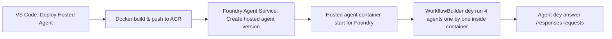
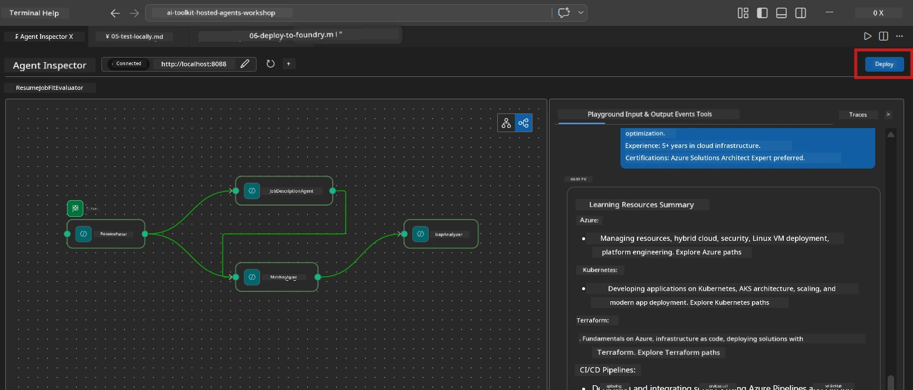

# Module 6 - Deploy to Foundry Agent Service

⏱️ ~10 min

For dis module, you go deploy your multi-agent workflow wey you test finish local come for [Microsoft Foundry](https://learn.microsoft.com/azure/foundry/agents/concepts/hosted-agents) as **Hosted Agent**. Di deployment process go build Docker container image, push am go [Azure Container Registry (ACR)](https://learn.microsoft.com/azure/container-registry/container-registry-intro), den go create one hosted agent version for [Foundry Agent Service](https://learn.microsoft.com/azure/foundry/agents/how-to/publish-agent).

> **Key difference from Lab 01:** Di deployment process na di same. Foundry go treat your multi-agent workflow as one single hosted agent - di kain wahala dey inside di container, but di deployment surface na di same `/responses` endpoint.

### Deployment pipeline


```mermaid
flowchart LR
    A[VS Code: Deploy Hosted Agent] --> B[Docker build & push to ACR]
    B --> C[Foundry Agent Service: Create hosted agent version]
    C --> D[Hosted agent container start for Foundry]
    D --> E[WorkflowBuilder dey run 4 agents one by one inside container]
    E --> F[Agent dey answer /responses requests]
```

---

## Prerequisites check

Before you deploy, make sure you check every item below:

1. **Agent pass local smoke tests:**
   - You don complete all di 3 tests for [Module 5](05-test-locally.md) and di workflow produce complete output with gap cards and Microsoft Learn URLs.

2. **You get di [Foundry User](https://learn.microsoft.com/azure/foundry/concepts/rbac-foundry) role** (to deploy, you need at least **Foundry Project Manager** for project scope):

   > **Note:** Di Foundry RBAC roles don recently change name - **Foundry User**, **Foundry Owner**, and **Foundry Project Manager** dem before di dem dey call Azure AI User, Azure AI Owner, and Azure AI Project Manager. Di Role IDs and permissions no change.

   - Check am for [Azure Portal](https://portal.azure.com) → your Foundry **project** resource → **Access control (IAM)** → **Role assignments** → confirm say **Foundry User** (or above) dey your account.

3. **You don sign in to Azure for VS Code:**
   - Check Accounts icon for bottom-left for VS Code. Your account name must dey show.

4. **`agent.yaml` get correct values:**
   - Open `PersonalCareerCopilot/agent.yaml` make you verify:
     ```yaml
     environment_variables:
       - name: AZURE_AI_MODEL_DEPLOYMENT_NAME
         value: ${AZURE_AI_MODEL_DEPLOYMENT_NAME}
     ```
   - `FOUNDRY_PROJECT_ENDPOINT` no dey listed here - Foundry go inject am for runtime. Na only `AZURE_AI_MODEL_DEPLOYMENT_NAME` you suppose declare.

5. **`requirements.txt` get correct versions:**
   ```
   agent-framework-foundry
   agent-framework-foundry-hosting
   mcp<2,>=1.24.0
   debugpy
   ```

---

## Step 1: Start di deployment

### Option A: Deploy from the Agent Inspector (we recommend)

If di agent dey run via F5 with Agent Inspector open:

1. Look di **top-right corner** for Agent Inspector panel.
2. Click di **Deploy** button (cloud icon wey get up arrow ↑).
3. The deployment wizard go open.



### Option B: Deploy from the Command Palette

1. Press `Ctrl+Shift+P` to open **Command Palette**.
2. Type: **Foundry Toolkit: Deploy Hosted Agent** then select am.
3. Di deployment wizard go open.

---

## Step 2: Configure di deployment

### 2.1 Select di target project

1. A dropdown go show your Foundry projects.
2. Choose di project wey you dey use for di whole workshop (like `workshop-agents`).

### 2.2 Select di container agent file

1. Dem go ask you to select di agent entry point.
2. Navigate go `workshop/lab02-multi-agent/PersonalCareerCopilot/` then choose **`main.py`**.

### 2.3 Configure resources

| Setting | Recommended value | Notes |
|---------|------------------|-------|
| **Deployment Method** | **Container** (we recommend) or **Code** | Container dey build Docker image; Code dey upload source as ZIP (preview) |
| **Container Registry** | **Default ACR** | Foundry go create and manage one for you |
| **CPU** | `0.25` | Na default. Multi-agent workflows no need more CPU because model calls na I/O-bound |
| **Memory** | `0.5Gi` | Na default. Increase am to `1Gi` if you put big data processing tools |

---

## Step 3: Confirm and deploy

1. Di wizard go show deployment summary.
2. Review am then click **Confirm and Deploy**.
3. Watch di progress for VS Code.

### Wetin dey happen during deployment

Watch di VS Code **Output** panel (select "Microsoft Foundry" dropdown):

1. **Docker build** - Di container dey build from your `Dockerfile`
   ```
   Step 1/6 : FROM python:3.12-slim
   Step 2/6 : WORKDIR /app
   ...
   Successfully built abc123def456
   ```

2. **Docker push** - Di image go push go ACR (1-3 minutes for first deploy).

3. **Agent registration** - Foundry go create hosted agent using `agent.yaml` metadata. Di agent name na `resume-job-fit-evaluator`.

4. **Container start** - Di container go start for Foundry managed infrastructure with system-managed identity.

> **First deployment dey slow** (Docker push all layers). Later deployments go use cached layers to fasten di process.

### Multi-agent specific notes

- **All four agents dey inside one container.** Foundry dey see one single hosted agent. The WorkflowBuilder graph dey run inside di container.
- **MCP calls dey go outside.** Di container need internet access to reach `https://learn.microsoft.com/api/mcp`. Foundry managed infrastructure dey provide dis by default.
- **[Managed Identity](https://learn.microsoft.com/azure/foundry/agents/concepts/agent-identity).** Foundry automatic create **dedicated per-agent Entra identity** for each hosted agent when you deploy. For hosted environment, `DefaultAzureCredential` go automatically resolve to dis agent identity - no need to configure manual managed identity.

---

## Step 4: Verify di deployment status

1. Open **Microsoft Foundry** sidebar (click Foundry icon for Activity Bar).
2. Expand **Hosted Agents (Preview)** under your project.
3. Find **resume-job-fit-evaluator** (or your agent name).
4. Click di agent name → expand versions (e.g., `v1`).
5. Click di version → check **Container Details** → **Status**:


| Status | Meaning |
|--------|---------|
| **active** | Agent dey run and ready to receive requests |
| **creating** | Container dey start (wait 30–60 seconds) |
| **failed** | Container fail to start (check logs - see below) |

> **Note:** VS Code sidebar fit show labels like "Running" or "Started" even though di underlying API dey use `active`/`creating`. Both dis and dat mean di same thing.

> **Multi-agent startup dey take longer** pass single-agent because di container dey create 4 agent instances on startup. `creating` for up to 2 minutes na normal.

---

## Common deployment errors and fixes

### Error 1: Permission denied - `agents/write`

```
Error: lacks the required data action 
Microsoft.CognitiveServices/accounts/AIServices/agents/write
```

**Fix:** Assign di **[Foundry User](https://learn.microsoft.com/azure/foundry/concepts/rbac-foundry)** role (before na **Azure AI User**) for **project** level. See [Module 8 - Troubleshooting](08-troubleshooting.md) for step-by-step instructions.

### Error 2: Docker no dey run

```
Error: Docker build failed / Cannot connect to Docker daemon
```

**Fix:**
1. Start Docker Desktop.
2. Wait till "Docker Desktop is running".
3. Check: `docker info`
4. **Windows:** Make sure say WSL 2 backend don enable for Docker Desktop settings.
5. Try again.

### Error 3: pip install no dey work during Docker build

```
Error: Could not find a version that satisfies the requirement agent-framework-foundry
```

**Fix:** Make sure say `requirements.txt` match:
```
agent-framework-foundry
agent-framework-foundry-hosting
mcp<2,>=1.24.0
debugpy
```

If build still no work, your Docker network fit dey block PyPI. Check `docker info` for proxy settings.

### Error 4: MCP tool no dey work for hosted agent

If Gap Analyzer stop to produce Microsoft Learn URLs after deployment:

**Root cause:** Network policy fit dey block outbound HTTPS from container.

**Fix:**
1. Usually no be problem for Foundry default config.
2. If e happen, check if Foundry project's virtual network get NSG wey dey block outbound HTTPS.
3. MCP tool get fallback URLs inside am, so di agent still go produce output (without live URLs).

---

### Checkpoint

- [ ] Deployment command finish without error for VS Code
- [ ] Agent dey under **Hosted Agents (Preview)** for Foundry sidebar
- [ ] Agent name na `resume-job-fit-evaluator` (or your selected name)
- [ ] Container status dey show **Started** or **Running**
- [ ] (If errors) You sabi di error, you fix am, then you redeploy successfully

---

**Previous:** [05 - Test Locally](05-test-locally.md) · **Next:** [07 - Verify in Playground →](07-verify-in-playground.md)

---

<!-- CO-OP TRANSLATOR DISCLAIMER START -->
**Disclaimer**:
Dis document don translate wit AI translation service [Co-op Translator](https://github.com/Azure/co-op-translator). Even tho we dey try make am correct, abeg make you know say automated translation fit get errors or mistakes. Di original document for dia own language na im be di correct source. For important info, make person wey sabi human translation do am. We no go responsible for any misunderstanding or wrong understanding wey fit happen because of dis translation.
<!-- CO-OP TRANSLATOR DISCLAIMER END -->