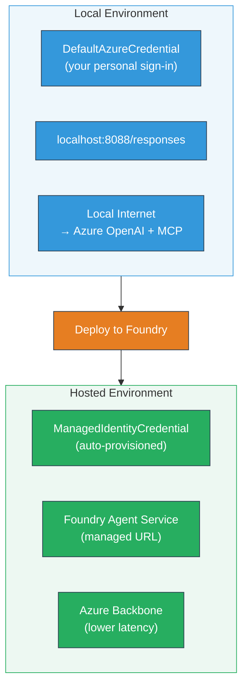

# Module 7 - Verify for Playground

For dis module, you go test your deployed multi-agent workflow for both **VS Code** and the **[Foundry Portal](https://ai.azure.com)**, make sure say the agent dey behave di same way like e do for local testing.

---

## Why you go verify after deployment?

Your multi-agent workflow run well well for local, so why you still wan test again? The hosted environment get different kian:


| Difference | Local | Hosted |
|-----------|-------|--------|
| **Identity** | [`DefaultAzureCredential`](https://learn.microsoft.com/azure/developer/python/sdk/authentication/credential-chains#defaultazurecredential-overview) (your personal sign-in) | [`ManagedIdentityCredential`](https://learn.microsoft.com/python/api/overview/azure/identity-readme#managed-identity-support) (auto-provisioned) |
| **Endpoint** | `http://localhost:8088/responses` | [Foundry Agent Service](https://learn.microsoft.com/azure/foundry/agents/concepts/hosted-agents) endpoint (managed URL) |
| **Network** | Local machine → Azure OpenAI + MCP outbound | Azure backbone (lower latency between services) |
| **MCP connectivity** | Local internet → `learn.microsoft.com/api/mcp` | Container outbound → `learn.microsoft.com/api/mcp` |

If any environment variable no set well, RBAC different or MCP outbound block, you go catch am here.

---

## Option A: Test for VS Code Playground (na dis one dem recommend first)

The [Foundry extension](https://marketplace.visualstudio.com/items?itemName=TeamsDevApp.vscode-ai-foundry) get integrated Playground wey make you fit yan with your deployed agent without commot VS Code.

### Step 1: Find your hosted agent

1. Click **Microsoft Foundry** icon for VS Code **Activity Bar** (left sidebar) make e open Foundry panel.
2. Expand your connected project (for example `workshop-agents`).
3. Expand **Hosted Agents (Preview)**.
4. You go see your agent name (for example `resume-job-fit-evaluator`).

### Step 2: Choose version

1. Click agent name make e show the versions.
2. Click the version wey you deploy (for example `v1`).
3. Detail panel go open show Container Details.
4. Make sure say the status na **Started** or **Running**.

### Step 3: Open Playground

1. For detail panel, click **Playground** button (or right-click the version → **Open in Playground**).
2. Chat interface go open for VS Code tab.

### Step 4: Run your smoke tests

Use the same 3 tests from [Module 5](05-test-locally.md). Type every message for Playground input box and press **Send** (or **Enter**).

#### Test 1 - Full resume + JD (normal flow)

Paste the full resume + JD prompt from Module 5, Test 1 (Jane Doe + Senior Cloud Engineer for Contoso Ltd).

**Wetin you suppose expect:**
- Fit score with breakdown math (100-point scale)
- Matched Skills section
- Missing Skills section
- **One gap card for every missing skill** with Microsoft Learn URLs
- Learning roadmap with timeline

#### Test 2 - Quick short test (minimal input)

```
RESUME: 3 years Python developer, knows Django and PostgreSQL, no cloud experience.

JOB: Cloud DevOps Engineer requiring AWS, Kubernetes, Terraform, CI/CD. 5 years needed.
```

**Wetin you suppose expect:**
- Lower fit score (< 40)
- Honest assessment with staged learning path
- Plenty gap cards (AWS, Kubernetes, Terraform, CI/CD, experience gap)

#### Test 3 - High-fit candidate

```
RESUME:
10 years Azure Cloud Architect. AZ-305 certified. Expert in AKS, Terraform, Azure DevOps, 
Azure Functions, Helm, Prometheus, Grafana, Python, Go. Led platform team of 8.

JOB:
Senior Cloud Engineer. Required: AKS, Terraform, Azure DevOps, Python. Preferred: Helm, Go.
5+ years experience. AZ-305 preferred.
```

**Wetin you suppose expect:**
- High fit score (≥ 80)
- Focus on interview readiness and polishing
- Few or no gap cards
- Short timeline focused on preparation

### Step 5: Compare with local results

Open your notes or browser tab from Module 5 wey you save local responses. For every test:

- Di response get **same structure** (fit score, gap cards, roadmap)?
- E follow di **same scoring rubric** (100-point breakdown)?
- **Microsoft Learn URLs** still dey inside gap cards?
- E get **one gap card per missing skill** (no cut short)?

> **Small word difference no wahala** - the model no dey always give same ting. Make you focus for structure, scoring consistency, and MCP tool use.

---

## Option B: Test for Foundry Portal

The [Foundry Portal](https://ai.azure.com) dey give web-based playground wey good if you want share with teammates or stakeholders.

### Step 1: Open Foundry Portal

1. Open your browser go [https://ai.azure.com](https://ai.azure.com).
2. Sign in with the same Azure account wey you dey use for the workshop.

### Step 2: Find your project

1. For home page, look **Recent projects** for the left sidebar.
2. Click your project name (for example `workshop-agents`).
3. If you no see am, click **All projects** make you search am.

### Step 3: Find your deployed agent

1. For the project left navigation, click **Build** → **Agents** (or look for **Agents** section).
2. You go see list of agents. Find your deployed agent (for example `resume-job-fit-evaluator`).
3. Click agent name to open the detail page.

### Step 4: Open Playground

1. For the agent detail page, check for top toolbar.
2. Click **Open in playground** (or **Try in playground**).
3. Chat interface go open.

### Step 5: Run same smoke tests

Run all 3 tests wey you run for VS Code Playground. Compare every response with both local results (Module 5) and VS Code Playground results (Option A).

---

## Multi-agent specific verification

No just check basic correctness, verify these multi-agent-specific behaviours:

### MCP tool execution

| Check | How to verify | Pass condition |
|-------|---------------|----------------|
| MCP calls succeed | Gap cards get `learn.microsoft.com` URLs | Real URLs, no be fallback message |
| Plenty MCP calls | Every High/Medium priority gap get resources | No be only first gap card |
| MCP fallback work | If URLs dey missing, check for fallback text | Agent still dey produce gap cards (with or without URLs) |

### Agent coordination

| Check | How to verify | Pass condition |
|-------|---------------|----------------|
| All 4 agents run | Output get fit score AND gap cards | Score come from MatchingAgent, cards come from GapAnalyzer |
| Parallel fan-out | Response time dey reasonable (< 2 min) | If e pass 3 min, parallel execution no too dey work |
| Data flow integrity | Gap cards reference skills wey dey matching report | No hallucinated skills wey no dey JD |

---

## Validation rubric

Use dis rubric to evaluate how your multi-agent workflow dey behave for hosted environment:

| # | Criteria | Pass condition | Pass? |
|---|----------|---------------|-------|
| 1 | **Functional correctness** | Agent dey respond to resume + JD with fit score and gap analysis | |
| 2 | **Scoring consistency** | Fit score dey use 100-point scale with breakdown math | |
| 3 | **Gap card completeness** | One card per missing skill (no cut or join) | |
| 4 | **MCP tool integration** | Gap cards get real Microsoft Learn URLs | |
| 5 | **Structural consistency** | Output structure match between local and hosted runs | |
| 6 | **Response time** | Hosted agent respond within 2 minutes for full assessment | |
| 7 | **No errors** | No HTTP 500 errors, timeouts or empty responses | |

> "Pass" mean say all 7 criteria meet for all 3 smoke tests for at least one playground (VS Code or Portal).

---

## Troubleshooting playground wahala

| Symptom | Likely cause | Fix |
|---------|-------------|-----|
| Playground no load | Container status no be "Started" | Go back to [Module 6](06-deploy-to-foundry.md), check deployment status. Wait if e dey "Pending" |
| Agent dey return empty response | Model deployment name no match | Check `agent.yaml` → `environment_variables` → `MODEL_DEPLOYMENT_NAME` make e match your deployed model |
| Agent dey return error message | [RBAC](https://learn.microsoft.com/azure/foundry/concepts/rbac-foundry) permission no dey | Assign **[Azure AI User](https://aka.ms/foundry-ext-project-role)** for project scope |
| No Microsoft Learn URLs for gap cards | MCP outbound block or MCP server no dey available | Check if container fit reach `learn.microsoft.com`. See [Module 8](08-troubleshooting.md) |
| Only 1 gap card (cut short) | GapAnalyzer instructions no get "CRITICAL" block | Review [Module 3, Step 2.4](03-configure-agents.md) |
| Fit score no match local | Different model or instructions deploy | Compare `agent.yaml` env vars with local `.env`. Redeploy if need |
| "Agent not found" for Portal | Deployment still dey propagate or e fail | Wait 2 minutes, refresh. If e never show, re-deploy from [Module 6](06-deploy-to-foundry.md) |

---

### Checkpoint

- [ ] Tested agent for VS Code Playground - all 3 smoke tests pass
- [ ] Tested agent for [Foundry Portal](https://ai.azure.com) Playground - all 3 smoke tests pass
- [ ] Responses get same structure with local testing (fit score, gap cards, roadmap)
- [ ] Microsoft Learn URLs dey inside gap cards (MCP tool dey work for hosted environment)
- [ ] One gap card per missing skill (no cut short)
- [ ] No errors or timeouts during testing
- [ ] Validation rubric complete (all 7 criteria pass)

---

**Previous:** [06 - Deploy to Foundry](06-deploy-to-foundry.md) · **Next:** [08 - Troubleshooting →](08-troubleshooting.md)

---

<!-- CO-OP TRANSLATOR DISCLAIMER START -->
**Disclaimer**:  
Dis document don be translate wit AI translation service [Co-op Translator](https://github.com/Azure/co-op-translator). Even though we dey try make am correct, abeg make you sabi say automated translations fit get errors or wrong tins. Di original document wey dey im native language na di correct source. For important mata, na make professional human translation you go use. We no go responsible for any misunderstandings or wrong interpretation wey fit come from dis translation.
<!-- CO-OP TRANSLATOR DISCLAIMER END -->