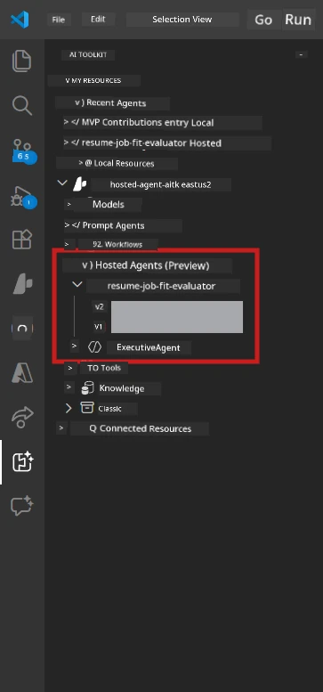

# Module 7 - Verify for Playground

⏱️ ~10 min

For dis module, you go test your deployed multi-agent workflow for VS Code and Foundry Portal, make sure say the agent dey behave like how e be for local testing.

---

## Why you go test again after deploying?

The hosted environment different from local for some important ways:

| | Local | Hosted |
|--|-------|--------|
| **Identity** | Your personal sign-in (`DefaultAzureCredential`) | Dedicated per-agent Entra identity (auto-provisioned at deploy time) |
| **Endpoint** | `http://localhost:8088/responses` | Foundry Agent Service managed URL |
| **Network** | Your machine → Azure OpenAI + MCP | Azure backbone (lower latency) |

If env var no correct, or RBAC issue, or MCP outbound call block, e go show for here first.

---

## Option A: Test for VS Code Playground (this one na wey we recommend first)

### Step 1: Find your hosted agent

1. Click the **Foundry Toolkit** icon for Activity Bar.
2. Expand your project → **Hosted Agents (Preview)** → find your agent.



### Step 2: Choose version

1. Click the agent to expand versions.
2. Click `v1` → check say status dey **active** (sidebar fit talk "Running" or "Started" - both mean say e ready).

### Step 3: Open Playground

1. Click **Playground** (or right-click version → **Open in Playground**).
2. Chat window go open for VS Code tab.

### Step 4: Run your smoke tests

Use the same 3 tests from [Module 5](05-test-locally.md). Type each message for Playground input box then press **Send** (or **Enter**).

#### Test 1 - Full resume + JD (standard flow)

Paste the full resume + JD prompt from Module 5, Test 1 (Jane Doe + Senior Cloud Engineer at Contoso Ltd).

**Expected:**
- Fit score with breakdown math (100-point scale)
- Matched Skills section
- Missing Skills section
- **One gap card per missing skill** wit Microsoft Learn URLs
- Learning roadmap with timeline

#### Test 2 - Quick short test (minimal input)

```
RESUME: 3 years Python developer, knows Django and PostgreSQL, no cloud experience.

JOB: Cloud DevOps Engineer requiring AWS, Kubernetes, Terraform, CI/CD. 5 years needed.
```

**Expected:**
- Lower fit score (< 40)
- Honest assessment wit staged learning path
- Multiple gap cards (AWS, Kubernetes, Terraform, CI/CD, experience gap)

#### Test 3 - High-fit candidate

```
RESUME:
10 years Azure Cloud Architect. AZ-305 certified. Expert in AKS, Terraform, Azure DevOps, 
Azure Functions, Helm, Prometheus, Grafana, Python, Go. Led platform team of 8.

JOB:
Senior Cloud Engineer. Required: AKS, Terraform, Azure DevOps, Python. Preferred: Helm, Go.
5+ years experience. AZ-305 preferred.
```

**Expected:**
- High fit score (≥ 80)
- Focus on interview readiness and polishing
- Few or no gap cards
- Short timeline focused on preparation

### Step 5: Compare wit local results

Open your notes or browser tab from Module 5 wey you save local responses. For each test:

- The response get **same structure** (fit score, gap cards, roadmap)?
- E follow **same scoring rubric** (100-point breakdown)?
- Still get **Microsoft Learn URLs** for gap cards?
- E get **one gap card per missing skill** (no truncated)?

> **Small wahala for wording na normal** - the model no dey always behave the same way. Focus on structure, scoring consistency, and MCP tool usage.

---

## Option B: Test for Foundry Portal

The [Foundry Portal](https://ai.azure.com) get web-based playground wey e good for sharing wit teammates or stakeholders.

### Step 1: Open Foundry Portal

1. Open your browser and go [https://ai.azure.com](https://ai.azure.com).
2. Sign in wit the same Azure account wey you dey use for the workshop.

### Step 2: Find your project

1. For home page, look for **Recent projects** for the left sidebar.
2. Click your project name (e.g., `workshop-agents`).
3. If you no see am, click **All projects** and search am.

### Step 3: Find your deployed agent

1. For project left navigation, click **Build** → **Agents** (or look for **Agents** section).
2. You go see list of agents. Find your deployed agent (e.g., `resume-job-fit-evaluator`).
3. Click the agent name make e open detail page.

### Step 4: Open Playground

1. For agent detail page, look for top toolbar.
2. Click **Open in playground** (or **Try in playground**).
3. Chat interface go open.

### Step 5: Run the same smoke tests

Repeat all 3 tests from VS Code Playground section above. Compare every response wit both local results (Module 5) and VS Code Playground results (Option A).

---

## Multi-agent specific verification

More than just basic correctness, make sure these multi-agent-specific behaviors dey:

### MCP tool execution

| Check | How to verify | Pass condition |
|-------|---------------|----------------|
| MCP calls succeed | Gap cards get `learn.microsoft.com` URLs | Real URLs, no fallback messages |
| Multiple MCP calls | Each High/Medium priority gap get resources | No be only the first gap card |
| MCP fallback works | If URLs no dey, check for fallback text | Agent still dey produce gap cards (wit or no URLs) |

### Agent coordination

| Check | How to verify | Pass condition |
|-------|---------------|----------------|
| All 4 agents run | Output get fit score AND gap cards | Score from MatchingAgent, cards from GapAnalyzer |
| Sequential execution | Response time dey reasonable (< 2 min) | If pass 3 min, check errors for terminal log |
| Data flow integrity | Gap cards refer skills from matching report | No hallucinated skills wey no dey for JD |

---

## Validation rubric

Use this rubric to check your multi-agent workflow hosted behavior:

| # | Criteria | Pass condition | Pass? |
|---|----------|---------------|-------|
| 1 | **Functional correctness** | Agent respond to resume + JD wit fit score and gap analysis | |
| 2 | **Scoring consistency** | Fit score use 100-point scale with breakdown math | |
| 3 | **Gap card completeness** | One card per missing skill (no truncated or combined) | |
| 4 | **MCP tool integration** | Gap cards get real Microsoft Learn URLs | |
| 5 | **Structural consistency** | Output structure match between local and hosted runs | |
| 6 | **Response time** | Hosted agent respond within 2 minutes for full assessment | |
| 7 | **No errors** | No HTTP 500 errors, timeouts, or empty responses | |

> "Pass" mean say all 7 criteria meet for all 3 smoke tests for at least one playground (VS Code or Portal).

---

## Troubleshooting playground issues

| Symptom | Likely cause | Fix |
|---------|-------------|-----|
| Playground no dey load | Container no dey `active` state | Go back to [Module 6](06-deploy-to-foundry.md), check deployment status. Wait if e dey `creating` |
| Agent dey give empty response | Model deployment name no match | Check `agent.yaml` → `environment_variables` → `AZURE_AI_MODEL_DEPLOYMENT_NAME` sha e match your deployed model |
| Agent return error message | [RBAC](https://learn.microsoft.com/azure/foundry/concepts/rbac-foundry) permission never give | Assign **[Foundry User](https://aka.ms/foundry-ext-project-role)** (before Azure AI User) for project scope |
| No Microsoft Learn URLs for gap cards | MCP outbound block or MCP server no dey | Check if container fit reach `learn.microsoft.com`. See [Module 8](08-troubleshooting.md) |
| Only 1 gap card (truncated) | GapAnalyzer instructions no get "CRITICAL" block | Review [Module 3, Step 2.4](03-configure-agents.md) |
| Fit score difference from local pass plenty | Different model or instructions deploy | Compare `agent.yaml` env vars with local `.env`. Redeploy if need |
| "Agent no dey found" for Portal | Deployment still dey propagate or e fail | Wait 2 minutes, refresh. If still no dey, re-deploy from [Module 6](06-deploy-to-foundry.md) |

---

### Checkpoint

- [ ] Test agent for VS Code Playground - all 3 smoke tests pass
- [ ] Test agent for [Foundry Portal](https://ai.azure.com) Playground - all 3 smoke tests pass
- [ ] Responses structurally consistent with local testing (fit score, gap cards, roadmap)
- [ ] Microsoft Learn URLs dey for gap cards (MCP tool dey work for hosted environment)
- [ ] One gap card per missing skill (no truncation)
- [ ] No errors or timeouts during testing
- [ ] Validation rubric complete (all 7 criteria pass)

---

**Previous:** [06 - Deploy to Foundry](06-deploy-to-foundry.md) · **Next:** [08 - Troubleshooting →](08-troubleshooting.md)

---

<!-- CO-OP TRANSLATOR DISCLAIMER START -->
**Disclaimer**:
Dis document don translate wit AI translation service [Co-op Translator](https://github.com/Azure/co-op-translator). Even tho we dey try make am correct, abeg make you know say automated translation fit get errors or mistakes. Di original document for dia own language na im be di correct source. For important info, make person wey sabi human translation do am. We no go responsible for any misunderstanding or wrong understanding wey fit happen because of dis translation.
<!-- CO-OP TRANSLATOR DISCLAIMER END -->