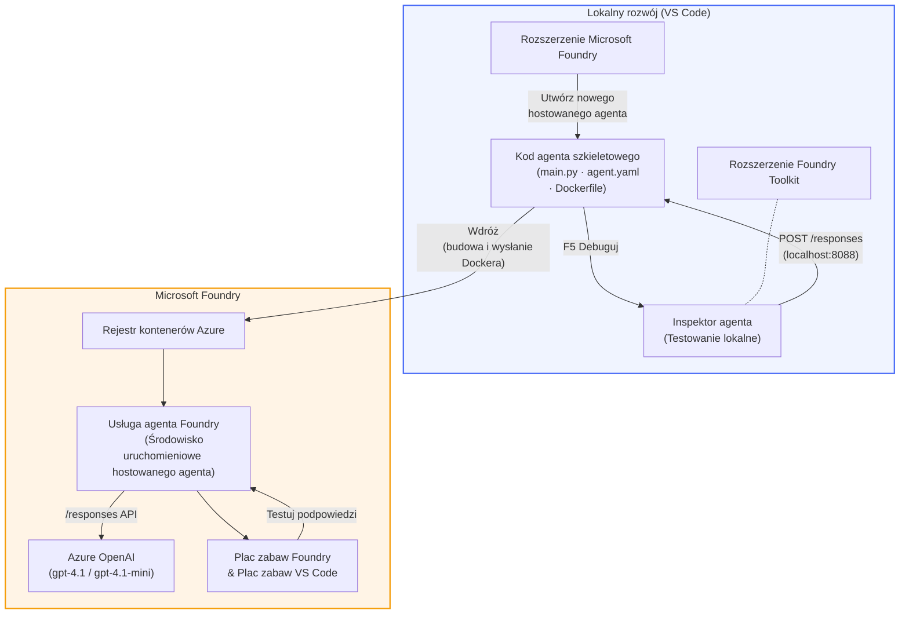

# Foundry Toolkit + Warsztaty z Foundry Hosted Agents

[](https://www.python.org/)
[](https://github.com/microsoft/agents)
[](https://learn.microsoft.com/azure/ai-foundry/agents/concepts/hosted-agents/)
[](https://ai.azure.com/)
[](https://learn.microsoft.com/azure/ai-services/openai/)
[](https://learn.microsoft.com/cli/azure/install-azure-cli)
[](https://learn.microsoft.com/azure/developer/azure-developer-cli/install-azd)
[](https://www.docker.com/)
[](https://marketplace.visualstudio.com/items?itemName=ms-windows-ai-studio.windows-ai-studio)
[](LICENSE)

Buduj, testuj i wdrażaj agentów AI do **Microsoft Foundry Agent Service** jako **Hosted Agents** – całkowicie z VS Code, korzystając z **Microsoft Foundry extension** i **Foundry Toolkit**.

> **Hosted Agents są obecnie w wersji zapoznawczej.** Obsługiwane regiony są ograniczone – zobacz [dostępność regionów](https://learn.microsoft.com/azure/foundry/agents/concepts/hosted-agents#region-availability).

> Folder `agent/` w każdym laboratorium jest **automatycznie generowany** przez rozszerzenie Foundry – następnie dostosowujesz kod, testujesz lokalnie i wdrażasz.

### 🌐 Obsługa wielojęzyczna

#### Obsługiwane przez GitHub Action (automatycznie i zawsze aktualne)

<!-- CO-OP TRANSLATOR LANGUAGES TABLE START -->
[Arabski](../ar/README.md) | [Bengalski](../bn/README.md) | [Bułgarski](../bg/README.md) | [Birmański (Myanmar)](../my/README.md) | [Chiński (uproszczony)](../zh-CN/README.md) | [Chiński (tradycyjny, Hongkong)](../zh-HK/README.md) | [Chiński (tradycyjny, Makau)](../zh-MO/README.md) | [Chiński (tradycyjny, Tajwan)](../zh-TW/README.md) | [Chorwacki](../hr/README.md) | [Czeski](../cs/README.md) | [Duński](../da/README.md) | [Niderlandzki](../nl/README.md) | [Estoński](../et/README.md) | [Fiński](../fi/README.md) | [Francuski](../fr/README.md) | [Niemiecki](../de/README.md) | [Grecki](../el/README.md) | [Hebrajski](../he/README.md) | [Hindi](../hi/README.md) | [Węgierski](../hu/README.md) | [Indonezyjski](../id/README.md) | [Włoski](../it/README.md) | [Japoński](../ja/README.md) | [Kannada](../kn/README.md) | [Khmer](../km/README.md) | [Koreański](../ko/README.md) | [Litewski](../lt/README.md) | [Malajski](../ms/README.md) | [Malajalam](../ml/README.md) | [Marathi](../mr/README.md) | [Nepalski](../ne/README.md) | [Nigerski pidgin](../pcm/README.md) | [Norweski](../no/README.md) | [Perski (Farsi)](../fa/README.md) | [Polski](./README.md) | [Portugalski (Brazylia)](../pt-BR/README.md) | [Portugalski (Portugalia)](../pt-PT/README.md) | [Pendżabski (Gurmukhi)](../pa/README.md) | [Rumuński](../ro/README.md) | [Rosyjski](../ru/README.md) | [Serbski (cyrylica)](../sr/README.md) | [Słowacki](../sk/README.md) | [Słoweński](../sl/README.md) | [Hiszpański](../es/README.md) | [Suahili](../sw/README.md) | [Szwedzki](../sv/README.md) | [Tagalog (Filipiński)](../tl/README.md) | [Tamilski](../ta/README.md) | [Telugu](../te/README.md) | [Tajski](../th/README.md) | [Turecki](../tr/README.md) | [Ukraiński](../uk/README.md) | [Urdu](../ur/README.md) | [Wietnamski](../vi/README.md)

> **Wolisz sklonować lokalnie?**
>
> To repozytorium zawiera ponad 50 tłumaczeń, co znacznie zwiększa rozmiar pobierania. Aby sklonować bez tłumaczeń, użyj sparse checkout:
>
> **Bash / macOS / Linux:**
> ```bash
> git clone --filter=blob:none --sparse https://github.com/microsoft-foundry/Foundry_Toolkit_for_VSCode_Lab.git
> cd Foundry_Toolkit_for_VSCode_Lab
> git sparse-checkout set --no-cone '/*' '!translations' '!translated_images'
> ```
>
> **CMD (Windows):**
> ```cmd
> git clone --filter=blob:none --sparse https://github.com/microsoft-foundry/Foundry_Toolkit_for_VSCode_Lab.git
> cd Foundry_Toolkit_for_VSCode_Lab
> git sparse-checkout set --no-cone "/*" "!translations" "!translated_images"
> ```
>
> Daje to wszystko, czego potrzebujesz do ukończenia kursu z dużo szybszym pobieraniem.
<!-- CO-OP TRANSLATOR LANGUAGES TABLE END -->

---

## Architektura


**Przebieg:** rozszerzenie Foundry generuje szkielet agenta → dostosowujesz kod i instrukcje → testujesz lokalnie z Agent Inspector → wdrażasz do Foundry (obraz Dockera wysyłany do ACR) → weryfikujesz w Playground.

---

## Co zbudujesz

| Laboratorium | Opis | Status |
|--------------|-------|--------|
| **Lab 01 - Pojedynczy agent** | Zbuduj **agenta "Wyjaśnij to jak dla członka zarządu"**, testuj go lokalnie i wdrażaj do Foundry | ✅ Dostępne |
| **Lab 02 - Przepływ pracy wielu agentów** | Zbuduj **"Ocena dopasowania CV do pracy"** – 4 agenty współpracują, aby ocenić dopasowanie CV i wygenerować plan nauki | ✅ Dostępne |

---

## Poznaj agenta Executive

Na tych warsztatach zbudujesz **agenta "Wyjaśnij to jak dla członka zarządu"** – agenta AI, który zamienia trudny techniczny żargon na spójne, gotowe do prezentacji podsumowania. Bo bądźmy szczerzy, nikt na poziomie zarządu nie chce słyszeć o „wyczerpaniu puli wątków spowodowanym przez synchroniczne wywołania wprowadzone w wersji 3.2”.

Zbudowałem tego agenta po zbyt wielu sytuacjach, kiedy moje perfekcyjnie przygotowane post-mortem otrzymywało odpowiedź: *„Czyli... strona działa czy nie?”*

### Jak to działa

Podajesz mu aktualizację techniczną. On zwraca streszczenie dla zarządu – trzy punkty, bez żargonu, bez śladów stosu, bez zbędnego dramatyzmu. Tylko **co się stało**, **wpływ na biznes** i **kolejny krok**.

### Zobacz go w akcji

**Ty mówisz:**
> „Opóźnienie API wzrosło z powodu wyczerpania puli wątków spowodowanego synchronicznymi wywołaniami wprowadzonymi w wersji 3.2.”

**Agent odpowiada:**

> **Streszczenie dla zarządu:**
> - **Co się stało:** Po ostatniej aktualizacji system zwolnił.
> - **Wpływ na biznes:** Niektórzy użytkownicy doświadczyli opóźnień w korzystaniu z usługi.
> - **Kolejny krok:** Zmiana została wycofana, a naprawa jest przygotowywana przed ponownym wdrożeniem.

### Dlaczego ten agent?

To prosty, jednozadaniowy agent – idealny do nauki end-to-end przepływu pracy Hosted Agent, bez komplikacji złożonych narzędzi. A powiedzmy sobie szczerze? Każdy zespół inżynierski mógłby mieć takiego.

---

## Struktura warsztatów

```
📂 Foundry_Toolkit_for_VSCode_Lab/
├── 📄 README.md                      ← You are here
├── 📂 ExecutiveAgent/                ← Standalone hosted agent project
│   ├── agent.yaml
│   ├── Dockerfile
│   ├── main.py
│   └── requirements.txt
└── 📂 workshop/
    ├── 📂 lab01-single-agent/        ← Full lab: docs + agent code
    │   ├── README.md                 ← Hands-on lab instructions
    │   ├── 📂 docs/                  ← Step-by-step tutorial modules
    │   │   ├── 00-prerequisites.md
    │   │   ├── 01-install-foundry-toolkit.md
    │   │   ├── 02-create-foundry-project.md
    │   │   ├── 03-create-hosted-agent.md
    │   │   ├── 04-configure-and-code.md
    │   │   ├── 05-test-locally.md
    │   │   ├── 06-deploy-to-foundry.md
    │   │   ├── 07-verify-in-playground.md
    │   │   └── 08-troubleshooting.md
    │   └── 📂 agent/                 ← Reference solution (auto-scaffolded by Foundry extension)
    │       ├── agent.yaml
    │       ├── Dockerfile
    │       ├── main.py
    │       └── requirements.txt
    └── 📂 lab02-multi-agent/         ← Resume → Job Fit Evaluator
        ├── README.md                 ← Hands-on lab instructions (end-to-end)
        ├── 📂 docs/                  ← Step-by-step tutorial modules
        │   ├── 00-prerequisites.md
        │   ├── 01-understand-multi-agent.md
        │   ├── 02-scaffold-multi-agent.md
        │   ├── 03-configure-agents.md
        │   ├── 04-orchestration-patterns.md
        │   ├── 05-test-locally.md
        │   ├── 06-deploy-to-foundry.md
        │   ├── 07-verify-in-playground.md
        │   └── 08-troubleshooting.md
        └── 📂 PersonalCareerCopilot/ ← Reference solution (multi-agent workflow)
            ├── agent.yaml
            ├── Dockerfile
            ├── main.py
            └── requirements.txt
```

> **Uwaga:** Folder `agent/` w każdym laboratorium jest generowany przez **Microsoft Foundry extension** po uruchomieniu `Microsoft Foundry: Create a New Hosted Agent` z palety poleceń. Pliki są potem dostosowywane z instrukcjami, narzędziami i konfiguracją agenta. Laboratorium 01 prowadzi cię krok po kroku przez ręczne odtworzenie tego procesu od podstaw.

---

## Rozpoczęcie pracy

### 1. Sklonuj repozytorium

```bash
git clone https://github.com/microsoft-foundry/Foundry_Toolkit_for_VSCode_Lab.git
cd Foundry_Toolkit_for_VSCode_Lab
```

### 2. Utwórz wirtualne środowisko Pythona

```bash
python -m venv venv
```

Aktywuj je:

- **Windows (PowerShell):**
  ```powershell
  .\venv\Scripts\Activate.ps1
  ```
- **macOS / Linux:**
  ```bash
  source venv/bin/activate
  ```

### 3. Zainstaluj zależności

```bash
pip install -r workshop/lab01-single-agent/agent/requirements.txt
```

### 4. Skonfiguruj zmienne środowiskowe

Skopiuj przykładowy plik `.env` w folderze agenta i uzupełnij swoje wartości:

```bash
cp workshop/lab01-single-agent/agent/.env.example workshop/lab01-single-agent/agent/.env
```

Edytuj `workshop/lab01-single-agent/agent/.env`:

```env
AZURE_AI_PROJECT_ENDPOINT=https://<your-account>.services.ai.azure.com/api/projects/<your-project>
MODEL_DEPLOYMENT_NAME=<your-model-deployment-name>
```

### 5. Realizuj laboratoria

Każde laboratorium jest samodzielne z własnymi modułami. Zacznij od **Lab 01**, aby poznać podstawy, a potem przejdź do **Lab 02** dla przepływów wielu agentów.

#### Lab 01 - Pojedynczy agent ([pełne instrukcje](workshop/lab01-single-agent/README.md))

| # | Moduł | Link |
|---|--------|------|
| 1 | Przeczytaj wymagania wstępne | [00-prerequisites.md](workshop/lab01-single-agent/docs/00-prerequisites.md) |
| 2 | Zainstaluj Foundry Toolkit i rozszerzenie Foundry | [01-install-foundry-toolkit.md](workshop/lab01-single-agent/docs/01-install-foundry-toolkit.md) |
| 3 | Utwórz projekt Foundry | [02-create-foundry-project.md](workshop/lab01-single-agent/docs/02-create-foundry-project.md) |
| 4 | Utwórz hosted agenta | [03-create-hosted-agent.md](workshop/lab01-single-agent/docs/03-create-hosted-agent.md) |
| 5 | Skonfiguruj instrukcje i środowisko | [04-configure-and-code.md](workshop/lab01-single-agent/docs/04-configure-and-code.md) |
| 6 | Testuj lokalnie | [05-test-locally.md](workshop/lab01-single-agent/docs/05-test-locally.md) |
| 7 | Wdrażaj do Foundry | [06-deploy-to-foundry.md](workshop/lab01-single-agent/docs/06-deploy-to-foundry.md) |
| 8 | Weryfikuj w playground | [07-verify-in-playground.md](workshop/lab01-single-agent/docs/07-verify-in-playground.md) |
| 9 | Rozwiązywanie problemów | [08-troubleshooting.md](workshop/lab01-single-agent/docs/08-troubleshooting.md) |

#### Lab 02 - Przepływ wielu agentów ([pełne instrukcje](workshop/lab02-multi-agent/README.md))

| # | Moduł | Link |
|---|--------|------|
| 1 | Wymagania wstępne (Lab 02) | [00-prerequisites.md](workshop/lab02-multi-agent/docs/00-prerequisites.md) |
| 2 | Zrozum architekturę multi-agenta | [01-understand-multi-agent.md](workshop/lab02-multi-agent/docs/01-understand-multi-agent.md) |
| 3 | Stwórz szkielet projektu multi-agenta | [02-scaffold-multi-agent.md](workshop/lab02-multi-agent/docs/02-scaffold-multi-agent.md) |
| 4 | Skonfiguruj agentów i środowisko | [03-configure-agents.md](workshop/lab02-multi-agent/docs/03-configure-agents.md) |
| 5 | Wzorce orkiestracji | [04-orchestration-patterns.md](workshop/lab02-multi-agent/docs/04-orchestration-patterns.md) |
| 6 | Testuj lokalnie (multi-agent) | [05-test-locally.md](workshop/lab02-multi-agent/docs/05-test-locally.md) |
| 7 | Wdróż do Foundry | [06-deploy-to-foundry.md](workshop/lab02-multi-agent/docs/06-deploy-to-foundry.md) |
| 8 | Zweryfikuj w placu zabaw | [07-verify-in-playground.md](workshop/lab02-multi-agent/docs/07-verify-in-playground.md) |
| 9 | Rozwiązywanie problemów (wielu agentów) | [08-troubleshooting.md](workshop/lab02-multi-agent/docs/08-troubleshooting.md) |

---

## Opiekun

<table>
<tr>
    <td align="center"><a href="https://github.com/ShivamGoyal03">
        <br />
        <sub><b>Shivam Goyal</b></sub>
    </a><br />
    </td>
</tr>
</table>

---

## Wymagane uprawnienia (szybkie odniesienie)

| Scenariusz | Wymagane role |
|------------|---------------|
| Utwórz nowy projekt Foundry | **Azure AI Owner** zasobu Foundry |
| Wdróż do istniejącego projektu (nowe zasoby) | **Azure AI Owner** + **Contributor** na subskrypcji |
| Wdróż do w pełni skonfigurowanego projektu | **Reader** na koncie + **Azure AI User** na projekcie |

> **Ważne:** Role `Owner` i `Contributor` w Azure obejmują tylko uprawnienia *zarządzania*, nie uprawnienia *programistyczne* (akcje na danych). Do tworzenia i wdrażania agentów potrzebujesz **Azure AI User** lub **Azure AI Owner**.

---

## Odniesienia

- [Szybki start: Wdróż swojego pierwszego hostowanego agenta (VS Code)](https://learn.microsoft.com/azure/foundry/agents/quickstarts/quickstart-hosted-agent)
- [Czym są hostowani agenci?](https://learn.microsoft.com/azure/foundry/agents/concepts/hosted-agents)
- [Twórz przepływy pracy hostowanych agentów w VS Code](https://learn.microsoft.com/azure/foundry/agents/how-to/vs-code-agents-workflow-pro-code)
- [Wdróż hostowanego agenta](https://learn.microsoft.com/azure/foundry/agents/how-to/deploy-hosted-agent)
- [RBAC dla Microsoft Foundry](https://learn.microsoft.com/azure/foundry/concepts/rbac-foundry)
- [Przykład agenta przeglądu architektury](https://github.com/Azure-Samples/agent-architecture-review-sample) - Hostowany agent z prawdziwego świata z narzędziami MCP, diagramami Excalidraw i podwójnym wdrożeniem

---

## Licencja

[MIT](../../LICENSE)

---

<!-- CO-OP TRANSLATOR DISCLAIMER START -->
**Zastrzeżenie**:  
Niniejszy dokument został przetłumaczony za pomocą usługi tłumaczenia AI [Co-op Translator](https://github.com/Azure/co-op-translator). Chociaż dążymy do dokładności, prosimy mieć na uwadze, że tłumaczenia automatyczne mogą zawierać błędy lub nieścisłości. Oryginalny dokument w języku źródłowym należy traktować jako źródło wiarygodne. W przypadku informacji krytycznych zalecane jest skorzystanie z profesjonalnego tłumaczenia wykonanego przez człowieka. Nie ponosimy odpowiedzialności za jakiekolwiek nieporozumienia lub błędne interpretacje wynikające z korzystania z tego tłumaczenia.
<!-- CO-OP TRANSLATOR DISCLAIMER END -->