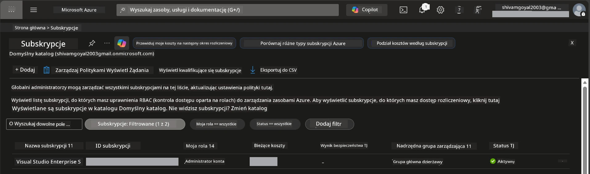

# Moduł 0 - Wymagania wstępne

Przed rozpoczęciem warsztatów upewnij się, że masz gotowe następujące narzędzia, dostęp i środowisko. Wykonaj każdy krok poniżej - nie pomijaj niczego.

---

## 1. Konto i subskrypcja Azure

### 1.1 Utwórz lub zweryfikuj swoją subskrypcję Azure

1. Otwórz przeglądarkę i przejdź do [https://azure.microsoft.com/free/](https://azure.microsoft.com/free/).
2. Jeśli nie masz konta Azure, kliknij **Start free** i postępuj zgodnie z procesem rejestracji. Będziesz potrzebować konta Microsoft (lub musisz je utworzyć) oraz karty kredytowej do weryfikacji tożsamości.
3. Jeśli masz już konto, zaloguj się na [https://portal.azure.com](https://portal.azure.com).
4. W Portalu kliknij **Subskrypcje** w lewym menu nawigacyjnym (lub wyszukaj "Subscriptions" w pasku wyszukiwania u góry).
5. Sprawdź, czy widzisz przynajmniej jedną **Aktywną** subskrypcję. Zanotuj **ID Subskrypcji** - będzie potrzebne później.



### 1.2 Zrozum wymagane role RBAC

[Hosted Agent](https://learn.microsoft.com/azure/foundry/agents/concepts/hosted-agents) wymaga uprawnień **operacji na danych**, których standardowe role Azure `Owner` i `Contributor` **nie zawierają**. Będziesz potrzebować jednego z tych [kombinacji ról](https://learn.microsoft.com/azure/foundry/concepts/rbac-foundry#built-in-roles):

| Scenariusz | Wymagane role | Gdzie przypisać |
|------------|---------------|-----------------|
| Utworzenie nowego projektu Foundry | **Azure AI Owner** na zasobie Foundry | Zasób Foundry w Azure Portal |
| Wdrożenie do istniejącego projektu (nowe zasoby) | **Azure AI Owner** + **Contributor** na subskrypcji | Subskrypcja + zasób Foundry |
| Wdrożenie do w pełni skonfigurowanego projektu | **Reader** na koncie + **Azure AI User** na projekcie | Konto + projekt w Azure Portal |

> **Kluczowa informacja:** Role Azure `Owner` i `Contributor` obejmują tylko uprawnienia *zarządzania* (operacje ARM). Potrzebujesz [**Azure AI User**](https://learn.microsoft.com/azure/foundry/concepts/rbac-foundry#built-in-roles) (lub wyższej) dla *operacji na danych* jak `agents/write`, co jest wymagane do tworzenia i wdrażania agentów. Role te przypiszesz w [Moduł 2](02-create-foundry-project.md).

---

## 2. Zainstaluj lokalne narzędzia

Zainstaluj każde z poniższych narzędzi. Po instalacji zweryfikuj, że działa, uruchamiając odpowiednie polecenie testowe.

### 2.1 Visual Studio Code

1. Przejdź na [https://code.visualstudio.com/](https://code.visualstudio.com/).
2. Pobierz instalator dla swojego systemu operacyjnego (Windows/macOS/Linux).
3. Uruchom instalator z domyślnymi ustawieniami.
4. Otwórz VS Code, aby potwierdzić, że się uruchamia.

### 2.2 Python 3.10+

1. Przejdź na [https://www.python.org/downloads/](https://www.python.org/downloads/).
2. Pobierz Pythona 3.10 lub nowszego (zalecana wersja 3.12+).
3. **Windows:** Podczas instalacji zaznacz **"Add Python to PATH"** na pierwszym ekranie.
4. Otwórz terminal i sprawdź:

   ```powershell
   python --version
   ```

   Oczekiwany wynik: `Python 3.10.x` lub nowszy.

### 2.3 Azure CLI

1. Przejdź do [https://learn.microsoft.com/cli/azure/install-azure-cli](https://learn.microsoft.com/cli/azure/install-azure-cli).
2. Postępuj zgodnie z instrukcjami instalacji dla swojego systemu.
3. Zweryfikuj:

   ```powershell
   az --version
   ```

   Oczekiwany wynik: `azure-cli 2.80.0` lub nowszy.

4. Zaloguj się:

   ```powershell
   az login
   ```

### 2.4 Azure Developer CLI (azd)

1. Przejdź do [https://learn.microsoft.com/azure/developer/azure-developer-cli/install-azd](https://learn.microsoft.com/azure/developer/azure-developer-cli/install-azd).
2. Postępuj zgodnie z instrukcjami instalacji dla swojego systemu. Na Windows:

   ```powershell
   winget install microsoft.azd
   ```

3. Zweryfikuj:

   ```powershell
   azd version
   ```

   Oczekiwany wynik: `azd version 1.x.x` lub nowszy.

4. Zaloguj się:

   ```powershell
   azd auth login
   ```

### 2.5 Docker Desktop (opcjonalnie)

Docker jest potrzebny tylko jeśli chcesz lokalnie zbudować i przetestować obraz kontenera przed wdrożeniem. Rozszerzenie Foundry automatycznie obsługuje budowanie kontenerów podczas wdrożenia.

1. Przejdź do [https://docs.docker.com/get-docker/](https://docs.docker.com/get-docker/).
2. Pobierz i zainstaluj Docker Desktop dla swojego systemu.
3. **Windows:** Upewnij się, że podczas instalacji wybrano backend WSL 2.
4. Uruchom Docker Desktop i poczekaj, aż ikona na pasku zadań pokaże **"Docker Desktop is running"**.
5. Otwórz terminal i sprawdź:

   ```powershell
   docker info
   ```

   Powinno to wypisać informacje o systemie Docker bez błędów. Jeśli pojawi się `Cannot connect to the Docker daemon`, poczekaj kilka sekund na pełne uruchomienie Dockera.

---

## 3. Zainstaluj rozszerzenia VS Code

Potrzebujesz trzech rozszerzeń. Zainstaluj je **przed** rozpoczęciem warsztatów.

### 3.1 Microsoft Foundry dla VS Code

1. Otwórz VS Code.
2. Naciśnij `Ctrl+Shift+X`, aby otworzyć panel rozszerzeń.
3. W polu wyszukiwania wpisz **"Microsoft Foundry"**.
4. Znajdź **Microsoft Foundry for Visual Studio Code** (wydawca: Microsoft, ID: `TeamsDevApp.vscode-ai-foundry`).
5. Kliknij **Install**.
6. Po instalacji powinien pojawić się ikonka **Microsoft Foundry** w pasku aktywności (lewy pasek boczny).

### 3.2 Foundry Toolkit

1. W panelu rozszerzeń (`Ctrl+Shift+X`) wyszukaj **"Foundry Toolkit"**.
2. Znajdź **Foundry Toolkit** (wydawca: Microsoft, ID: `ms-windows-ai-studio.windows-ai-studio`).
3. Kliknij **Install**.
4. Ikona **Foundry Toolkit** powinna pojawić się w pasku aktywności.

### 3.3 Python

1. W panelu rozszerzeń wyszukaj **"Python"**.
2. Znajdź **Python** (wydawca: Microsoft, ID: `ms-python.python`).
3. Kliknij **Install**.

---

## 4. Zaloguj się do Azure z poziomu VS Code

[Microsoft Agent Framework](https://learn.microsoft.com/agent-framework/overview/) używa [`DefaultAzureCredential`](https://learn.microsoft.com/azure/developer/python/sdk/authentication/credential-chains#defaultazurecredential-overview) do uwierzytelniania. Musisz być zalogowany do Azure w VS Code.

### 4.1 Zaloguj się przez VS Code

1. Spójrz w lewy dolny róg VS Code i kliknij ikonę **Konta** (sylwetka osoby).
2. Kliknij **Sign in to use Microsoft Foundry** (lub **Sign in with Azure**).
3. Otworzy się okno przeglądarki - zaloguj się na konto Azure, które ma dostęp do Twojej subskrypcji.
4. Wróć do VS Code. Powinieneś zobaczyć nazwę swojego konta w lewym dolnym rogu.

### 4.2 (Opcjonalnie) Zaloguj się przez Azure CLI

Jeśli zainstalowałeś Azure CLI i wolisz uwierzytelnianie przez CLI:

```powershell
az login
```

Otworzy się przeglądarka do logowania. Po zalogowaniu ustaw właściwą subskrypcję:

```powershell
az account set --subscription "<your-subscription-id>"
```

Zweryfikuj:

```powershell
az account show --query "{name:name, id:id, state:state}" --output table
```

Powinieneś zobaczyć nazwę subskrypcji, jej ID oraz status = `Enabled`.

### 4.3 (Alternatywnie) Uwierzytelnianie za pomocą principal usługi

Dla CI/CD lub środowisk współdzielonych ustaw następujące zmienne środowiskowe:

```powershell
$env:AZURE_TENANT_ID = "<your-tenant-id>"
$env:AZURE_CLIENT_ID = "<your-client-id>"
$env:AZURE_CLIENT_SECRET = "<your-client-secret>"
```

---

## 5. Ograniczenia wersji podglądowej

Przed kontynuowaniem zapoznaj się z obecnymi ograniczeniami:

- [**Hosted Agents**](https://learn.microsoft.com/azure/foundry/agents/concepts/hosted-agents) są obecnie w **publicznej wersji podglądowej** - niezalecane do obciążeń produkcyjnych.
- **Wspierane regiony są ograniczone** - sprawdź [dostępność regionów](https://learn.microsoft.com/azure/foundry/agents/concepts/hosted-agents#region-availability) przed tworzeniem zasobów. Jeśli wybierzesz region nieobsługiwany, wdrożenie się nie powiedzie.
- Pakiet `azure-ai-agentserver-agentframework` jest wersją przedpremierową (`1.0.0b16`) - API mogą ulec zmianie.
- Limity skalowania: hostowane agenty obsługują od 0 do 5 replik (w tym skalowanie do zera).

---

## 6. Lista kontrolna przed rozpoczęciem

Przejdź przez każdy punkt poniżej. Jeśli którykolwiek krok zawiedzie, wróć i popraw go przed kontynuacją.

- [ ] VS Code uruchamia się bez błędów
- [ ] Python 3.10+ jest na Twojej ścieżce (`python --version` pokazuje `3.10.x` lub nowszy)
- [ ] Azure CLI jest zainstalowany (`az --version` pokazuje `2.80.0` lub nowszy)
- [ ] Azure Developer CLI jest zainstalowany (`azd version` pokazuje wersję)
- [ ] Rozszerzenie Microsoft Foundry jest zainstalowane (ikona widoczna w pasku aktywności)
- [ ] Rozszerzenie Foundry Toolkit jest zainstalowane (ikona widoczna w pasku aktywności)
- [ ] Rozszerzenie Python jest zainstalowane
- [ ] Jesteś zalogowany do Azure w VS Code (sprawdź ikonę Konta, lewy dolny róg)
- [ ] `az account show` zwraca Twoją subskrypcję
- [ ] (Opcjonalnie) Docker Desktop działa (`docker info` zwraca informacje o systemie bez błędów)

### Punkt kontrolny

Otwórz pasek aktywności VS Code i potwierdź, że widzisz zarówno widoki w pasku bocznym **Foundry Toolkit**, jak i **Microsoft Foundry**. Kliknij na każdy, aby potwierdzić, że ładują się bez błędów.

---

**Dalej:** [01 - Install Foundry Toolkit & Foundry Extension →](01-install-foundry-toolkit.md)

---

<!-- CO-OP TRANSLATOR DISCLAIMER START -->
**Zastrzeżenie**:  
Niniejszy dokument został przetłumaczony za pomocą usługi tłumaczenia AI [Co-op Translator](https://github.com/Azure/co-op-translator). Chociaż dążymy do dokładności, prosimy pamiętać, że automatyczne tłumaczenia mogą zawierać błędy lub niedokładności. Oryginalny dokument w języku źródłowym należy uważać za autorytatywne źródło. W przypadku informacji krytycznych zalecane jest skorzystanie z profesjonalnego tłumaczenia wykonanego przez człowieka. Nie ponosimy odpowiedzialności za jakiekolwiek nieporozumienia lub błędne interpretacje wynikające z korzystania z tego tłumaczenia.
<!-- CO-OP TRANSLATOR DISCLAIMER END -->