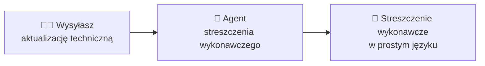

# Moduł 0 - Wprowadzenie

⏱️ ~10 min

> [!WARNING]
> **Podgląd i ograniczenia:** [Hosted Agents](https://learn.microsoft.com/azure/foundry/agents/concepts/hosted-agents) są obecnie w **publicznym podglądzie** - niezalecane do obciążeń produkcyjnych. Zwróć uwagę na następujące rzeczy:
> - **Obsługiwane regiony są ograniczone** - sprawdź [dostępność regionu](https://learn.microsoft.com/azure/foundry/agents/concepts/hosted-agents#region-availability) przed utworzeniem zasobów. Wybór nieobsługiwanego regionu spowoduje niepowodzenie wdrożenia.
> - Pakiet `azure-ai-agentserver-agentframework` jest wersją przedpremierową - API mogą się zmieniać między wersjami.
> - Limity skalowania: hosted agents obsługują 0–5 replik (w tym skalowanie do zera).
> - Niektóre funkcje pokazane w tym warsztacie mogą się zmienić, gdy usługa osiągnie ogólną dostępność.

## Co zbudujesz

W tym warsztacie zbudujesz agenta **„Wyjaśnij jak dla Dyrektora”** – hostowanego agenta AI, który bierze skomplikowane aktualizacje techniczne i przepisuje je na proste, angielskojęzyczne streszczenia dla kadry zarządzającej.

```mermaid
flowchart LR
    A["🧑‍💻 Wysyłasz\naktualizację techniczną"] --> B["🤖 Agent\nstreszczenia wykonawczego"]
    B --> C["📝 Streszczenie wykonawcze\nw prostym języku"]
```

**Agent używa:**
- **Microsoft Agent Framework** – do logiki i struktury agenta
- **Foundry Toolkit dla VS Code** – do tworzenia szkieletu, testowania lokalnego i wdrażania
- **Modelu AI** (np. `gpt-4.1-mini/gpt-5-mini`) – do generowania streszczeń

Pod koniec laboratorium będziesz miał działającego agenta, którego możesz przetestować lokalnie za pomocą Agent Inspector, a opcjonalnie wdrożyć do chmury.

---

## Czym są hosted agents?

**Hosted agent** to agent AI działający jako zarządzana usługa w Microsoft Foundry. Zamiast zarządzać własną infrastrukturą, opakowujesz swój kod agenta w kontener, a Foundry zajmuje się skalowaniem, hostingiem i udostępnianiem go przez standardowy punkt końcowy HTTP.

| Pojęcie | Co to oznacza |
|---------|--------------|
| **Agent** | Twój kod Pythona, który odbiera wiadomość od użytkownika, wywołuje model AI i zwraca odpowiedź w strukturze |
| **Hosted** | Foundry uruchamia twoj kontener – bez maszyn wirtualnych, Kubernetesa ani zarządzania infrastrukturą |
| **Protokół odpowiedzi** | Standardowe API HTTP (`POST /responses`), które każdy klient może wywołać, aby komunikować się z twoim agentem |
| **Agent Inspector** | Lokalny interfejs testowy (wbudowany w Foundry Toolkit), który pozwala rozmawiać z agentem przed wdrożeniem |

W tym warsztacie przejdziesz od zera do wpełni hostowanego agenta – lub zatrzymasz się na testach lokalnych, jeśli wolisz.

---

## Wybierz swoją ścieżkę

> ⚠️ **Wybierz jedną ścieżkę przed kontynuacją.** Twój wybór determinuje, które narzędzia zainstalujesz i które moduły będą stosowane. Możesz później zmienić ścieżkę z B → A, jeśli uzyskasz subskrypcję.

<strong>🅰️ Ścieżka A - chmura Azure (wymaga subskrypcji Azure)</strong>

| | Szczegóły |
|---|---|
| **Dla kogo?** | Masz aktywną subskrypcję Azure i możesz tworzyć zasoby Foundry |
| **Model** | Azure OpenAI przez Foundry (np. `gpt-4.1-mini/gpt-5-mini`) |
| **Zakres modułów** | Wszystkie moduły (00–07) |
| **Wdrażanie do chmury?** | ✅ Tak – pełne wdrożenie end-to-end |

<strong>🅱️ Ścieżka B - lokalna / bezpłatna (nie wymaga subskrypcji Azure)</strong>

| | Szczegóły |
|---|---|
| **Dla kogo?** | MVP, studenci lub każdy bez dostępu do Azure |
| **Model** | **Foundry Local** (darmowy, działa na twoim komputerze) |
| **Zakres modułów** | Moduły 00–04 (pomijając wdrażanie i weryfikację w chmurze) |
| **Wdrażanie do chmury?** | ❌ Nie – tylko testy lokalne przez Agent Inspector |

---

## Wszystkie ścieżki: wymagane narzędzia

Zainstaluj każde z poniższych narzędzi. Po instalacji sprawdź ich działanie, uruchamiając polecenie weryfikujące.

| # | Narzędzie | Wersja | Instalacja | Weryfikacja (oczekiwany wynik) |
|---|------|---------|---------|---------------------------|
| 1 | **Visual Studio Code** | Najnowsza | [code.visualstudio.com](https://code.visualstudio.com/) | Otwiera się bez błędów |
| 2 | **Python** | 3.12 lub wyższy | [python.org/downloads](https://www.python.org/downloads/) | `python --version` $\rightarrow$ `Python 3.12.x` |
| 3 | **Foundry Toolkit dla VS Code** | Najnowsza | ID rozszerzenia: `ms-windows-ai-studio.windows-ai-studio` | Ikona Foundry na pasku aktywności |
| 4 | **Rozszerzenie Pythona dla VS Code** | Najnowsza | ID rozszerzenia: `ms-python.python` | Zainstalowane w panelu rozszerzeń |

> [!TIP]
> **Porady instalacyjne:**
> - **Python PATH (Windows):** Zawsze zaznacz **„Add Python to PATH”** na pierwszym ekranie instalatora Pythona. Bez tego `python` nie będzie rozpoznawany w terminalu.
> - **Wiele wersji Pythona:** Jeśli masz zainstalowane zarówno Python 3.10, jak i 3.12, użyj `python3.12 -m venv .venv`, aby upewnić się, że właściwa wersja jest używana w wirtualnym środowisku.
> - **Docker WSL 2 (Windows):** Podczas instalacji Docker Desktop upewnij się, że wybrano **backend WSL 2**. Docker z Hyper-V jest wolniejszy i może powodować problemy z budowaniem kontenerów Foundry.
> - **Docker się nie uruchamia?** Poczekaj 30–60 sekund po uruchomieniu Docker Desktop. Uruchom `docker info` - jeśli zobaczysz "Cannot connect to the Docker daemon", Docker wciąż się inicjalizuje.
> - **Rozszerzenia VS Code się nie ładują?** Po instalacji rozszerzeń przeładuj okno: `Ctrl+Shift+P` → `Developer: Reload Window`.

> **Użytkownicy Windows:** Podczas instalacji Pythona zaznacz **„Add Python to PATH”**.

**Dalej:** [01 - Setup →](01-setup.md)

---

<!-- CO-OP TRANSLATOR DISCLAIMER START -->
**Zastrzeżenie**:
Niniejszy dokument został przetłumaczony za pomocą usługi tłumaczenia AI [Co-op Translator](https://github.com/Azure/co-op-translator). Choć dążymy do dokładności, prosimy pamiętać, że automatyczne tłumaczenia mogą zawierać błędy lub niedokładności. Oryginalny dokument w jego języku źródłowym należy uznawać za autorytatywne źródło. W przypadku informacji krytycznych zalecane jest skorzystanie z profesjonalnego tłumaczenia wykonanego przez człowieka. Nie ponosimy odpowiedzialności za jakiekolwiek nieporozumienia lub błędne interpretacje wynikające z użycia tego tłumaczenia.
<!-- CO-OP TRANSLATOR DISCLAIMER END -->