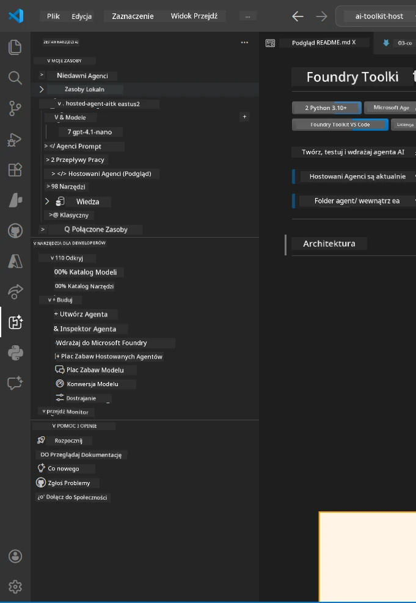
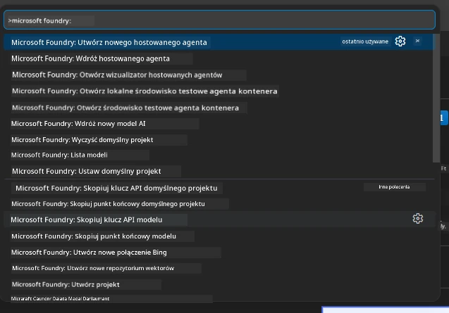

# Moduł 1 - Instalacja Foundry Toolkit i rozszerzenia Foundry

Ten moduł przeprowadzi Cię przez instalację i weryfikację dwóch kluczowych rozszerzeń VS Code dla tego warsztatu. Jeśli zainstalowałeś je już podczas [Modułu 0](00-prerequisites.md), użyj tego modułu, aby sprawdzić, czy działają poprawnie.

---

## Krok 1: Instalacja rozszerzenia Microsoft Foundry

Rozszerzenie **Microsoft Foundry for VS Code** to Twoje główne narzędzie do tworzenia projektów Foundry, wdrażania modeli, tworzenia szkieletów hostowanych agentów oraz wdrażania bezpośrednio z VS Code.

1. Otwórz VS Code.
2. Naciśnij `Ctrl+Shift+X`, aby otworzyć panel **Rozszerzenia**.
3. W polu wyszukiwania na górze wpisz: **Microsoft Foundry**
4. Znajdź wynik zatytułowany **Microsoft Foundry for Visual Studio Code**.
   - Wydawca: **Microsoft**
   - ID rozszerzenia: `TeamsDevApp.vscode-ai-foundry`
5. Kliknij przycisk **Zainstaluj**.
6. Poczekaj na zakończenie instalacji (zobaczysz mały wskaźnik postępu).
7. Po instalacji spójrz na **pasek aktywności** (pionowy pasek ikon po lewej stronie VS Code). Powinieneś zobaczyć nową ikonę **Microsoft Foundry** (wygląda jak diament/ikona AI).
8. Kliknij ikonę **Microsoft Foundry**, aby otworzyć jej widok panelu bocznego. Powinieneś zobaczyć sekcje:
   - **Zasoby** (lub Projekty)
   - **Agenci**
   - **Modele**

> **Jeśli ikona się nie pojawia:** Spróbuj przeładować VS Code (`Ctrl+Shift+P` → `Developer: Reload Window`).

---

## Krok 2: Instalacja rozszerzenia Foundry Toolkit

Rozszerzenie **Foundry Toolkit** zapewnia [**Agent Inspector**](https://learn.microsoft.com/azure/foundry/agents/how-to/vs-code-agents-workflow-pro-code) - wizualny interfejs do lokalnego testowania i debugowania agentów - a także narzędzia do placu zabaw, zarządzania modelami i ewaluacji.

1. W panelu rozszerzeń (`Ctrl+Shift+X`) wyczyść pole wyszukiwania i wpisz: **Foundry Toolkit**
2. Znajdź w wynikach **Foundry Toolkit**.
   - Wydawca: **Microsoft**
   - ID rozszerzenia: `ms-windows-ai-studio.windows-ai-studio`
3. Kliknij **Zainstaluj**.
4. Po instalacji ikona **Foundry Toolkit** pojawi się na pasku aktywności (wygląda jak robot/ikona iskierki).
5. Kliknij ikonę **Foundry Toolkit**, aby otworzyć jej widok panelu bocznego. Powinien pojawić się ekran powitalny Foundry Toolkit z opcjami:
   - **Modele**
   - **Plac zabaw**
   - **Agenci**

---

## Krok 3: Weryfikacja działania obu rozszerzeń

### 3.1 Weryfikacja rozszerzenia Microsoft Foundry

1. Kliknij ikonę **Microsoft Foundry** na pasku aktywności.
2. Jeśli jesteś zalogowany w Azure (z Modułu 0), powinieneś zobaczyć swoje projekty pod **Zasoby**.
3. Jeśli pojawi się monit o zalogowanie, kliknij **Zaloguj się** i wykonaj procedurę uwierzytelniania.
4. Potwierdź, że widok panelu bocznego wyświetla się bez błędów.

### 3.2 Weryfikacja rozszerzenia Foundry Toolkit

1. Kliknij ikonę **Foundry Toolkit** na pasku aktywności.
2. Potwierdź, że widok powitalny lub główny panel ładuje się bez błędów.
3. Na razie nie musisz nic konfigurować - Agent Inspector wykorzystamy w [Moduł 5](05-test-locally.md).

### 3.3 Weryfikacja za pomocą palety poleceń

1. Naciśnij `Ctrl+Shift+P`, aby otworzyć paletę poleceń.
2. Wpisz **"Microsoft Foundry"** - powinieneś zobaczyć polecenia takie jak:
   - `Microsoft Foundry: Create a New Hosted Agent`
   - `Microsoft Foundry: Deploy Hosted Agent`
   - `Microsoft Foundry: Open Model Catalog`
3. Naciśnij `Escape`, aby zamknąć paletę poleceń.
4. Ponownie otwórz paletę poleceń i wpisz **"Foundry Toolkit"** - powinieneś zobaczyć polecenia takie jak:
   - `Foundry Toolkit: Open Agent Inspector`

> Jeśli nie widzisz tych poleceń, rozszerzenia mogą nie być poprawnie zainstalowane. Spróbuj je odinstalować i ponownie zainstalować.

---

## Co te rozszerzenia robią na tym warsztacie

| Rozszerzenie | Co robi | Kiedy będzie używane |
|--------------|---------|---------------------|
| **Microsoft Foundry for VS Code** | Tworzenie projektów Foundry, wdrażanie modeli, **tworzenie szkieletów [hostowanych agentów](https://learn.microsoft.com/azure/foundry/agents/concepts/hosted-agents)** (auto-generuje `agent.yaml`, `main.py`, `Dockerfile`, `requirements.txt`), wdrażanie do [Foundry Agent Service](https://learn.microsoft.com/azure/foundry/agents/overview) | Moduły 2, 3, 6, 7 |
| **Foundry Toolkit** | Agent Inspector do lokalnego testowania/debugowania, interfejs placu zabaw, zarządzanie modelami | Moduły 5, 7 |

> **Rozszerzenie Foundry jest najważniejszym narzędziem na tym warsztacie.** Obsługuje cały cykl życia: tworzenie szkieletu → konfiguracja → wdrożenie → weryfikacja. Foundry Toolkit uzupełnia je, udostępniając wizualny Agent Inspector do lokalnych testów.

---

### Punkt kontrolny

- [ ] Ikona Microsoft Foundry jest widoczna na pasku aktywności
- [ ] Kliknięcie w nią otwiera panel boczny bez błędów
- [ ] Ikona Foundry Toolkit jest widoczna na pasku aktywności
- [ ] Kliknięcie w nią otwiera panel boczny bez błędów
- [ ] `Ctrl+Shift+P` → wpisanie "Microsoft Foundry" pokazuje dostępne polecenia
- [ ] `Ctrl+Shift+P` → wpisanie "Foundry Toolkit" pokazuje dostępne polecenia

---

**Poprzedni:** [00 - Wymagania wstępne](00-prerequisites.md) · **Następny:** [02 - Utwórz projekt Foundry →](02-create-foundry-project.md)

---

<!-- CO-OP TRANSLATOR DISCLAIMER START -->
**Zrzeczenie się odpowiedzialności**:  
Dokument ten został przetłumaczony przy użyciu usługi tłumaczenia AI [Co-op Translator](https://github.com/Azure/co-op-translator). Chociaż dążymy do dokładności, prosimy pamiętać, że automatyczne tłumaczenia mogą zawierać błędy lub niedokładności. Za wiarygodne źródło należy uważać oryginalny dokument w języku źródłowym. W przypadku informacji krytycznych zalecane jest skorzystanie z profesjonalnego tłumaczenia wykonanego przez człowieka. Nie ponosimy odpowiedzialności za jakiekolwiek nieporozumienia lub błędne interpretacje wynikające z wykorzystania tego tłumaczenia.
<!-- CO-OP TRANSLATOR DISCLAIMER END -->