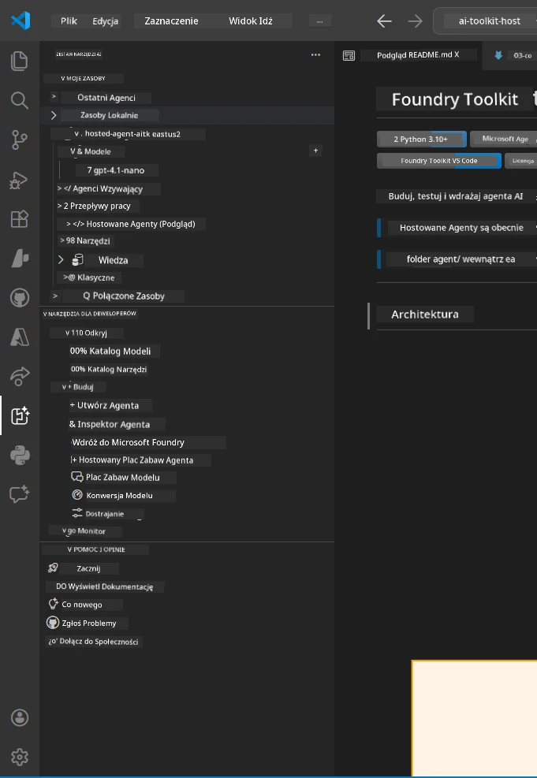
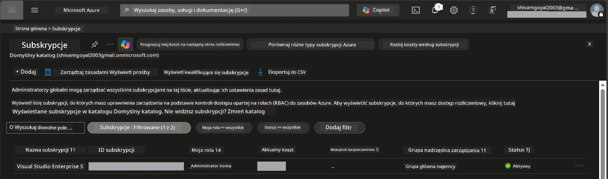
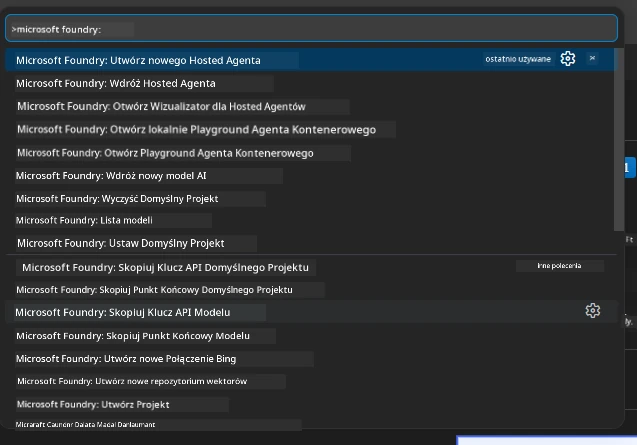
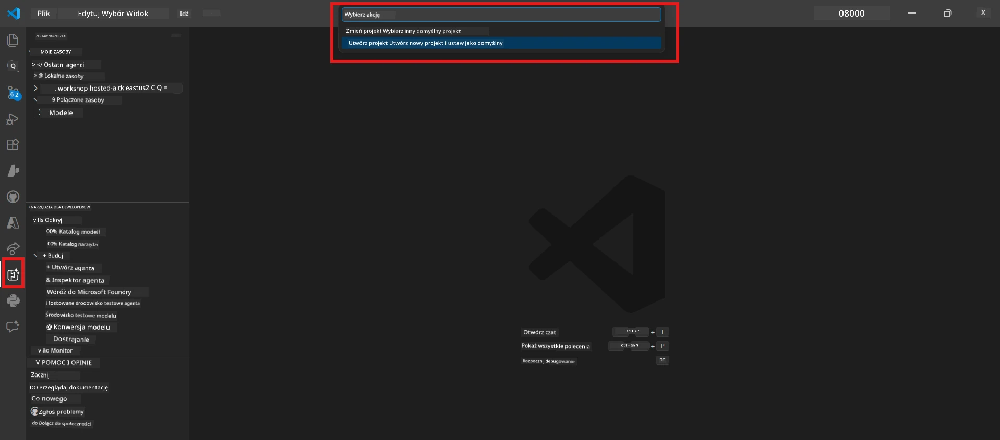
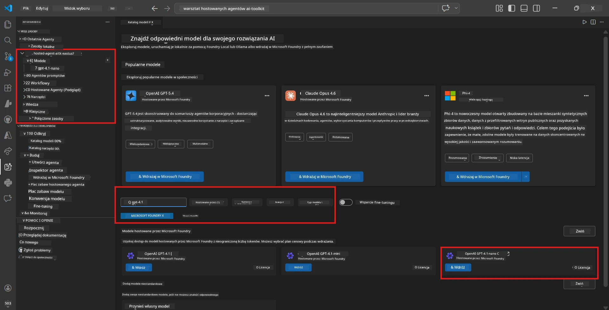
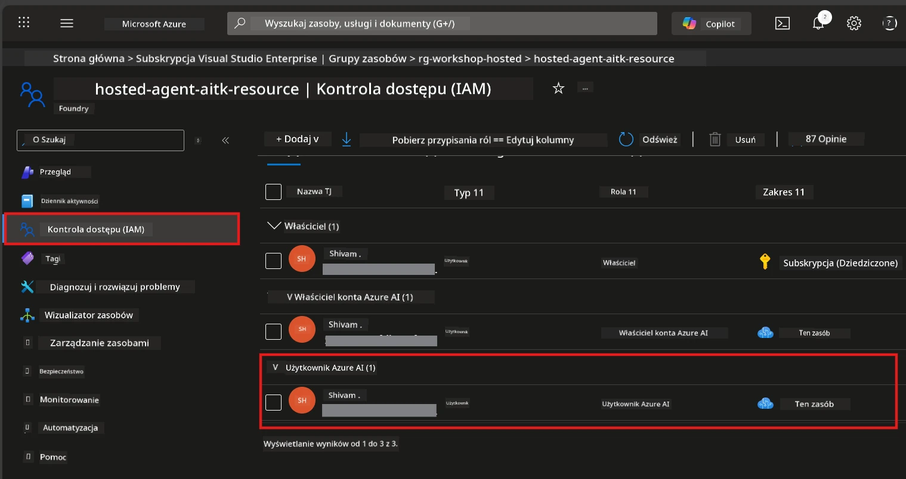

# Konfiguracja: Rozszerzenie, Projekt i Model

⏱️ ~15 min

W tym module zainstalujesz i zweryfikujesz rozszerzenie Foundry Toolkit, utworzysz (lub połączysz się z) projektem Foundry oraz wdrożysz model, z którego będzie korzystać twój agent.

## Krok 1: Zainstaluj Foundry Toolkit

**Foundry Toolkit dla VS Code** to główne rozszerzenie używane w tym warsztacie. Zapewnia tworzenie projektów, wdrażanie modeli, szablony agentów, lokalne testowanie (Agent Inspector) oraz wdrażanie w chmurze – wszystko z poziomu VS Code.

1. Otwórz VS Code, a następnie naciśnij `Ctrl+Shift+X`, aby otworzyć panel **Rozszerzenia**.
2. Wyszukaj **Foundry Toolkit**.
3. Zainstaluj **Foundry Toolkit for VS Code** (Wydawca: Microsoft, ID: `ms-windows-ai-studio.windows-ai-studio`).
4. Po instalacji w pasku aktywności (lewy pasek boczny) pojawi się ikona **Foundry Toolkit**.

> *Uwaga: W starszych wersjach rozszerzenia w pasku aktywności może być wyświetlane "AI TOOLKIT". Funkcjonalność jest identyczna.*



## Krok 2: Skonfiguruj w zależności od dostępu

> **Wybierz swoją ścieżkę:** Rozwiń poniższą sekcję odpowiadającą twojej konfiguracji. Musisz wykonać tylko **jedną** ścieżkę.

<details>
<summary><strong>🅰️ Ścieżka A - Chmura Azure (wymaga subskrypcji Azure)</strong></summary>

### Azure CLI

1. Zainstaluj z [learn.microsoft.com/cli/azure/install-azure-cli](https://learn.microsoft.com/cli/azure/install-azure-cli).
2. Sprawdź wersję: `az --version` (oczekuj 2.80.0+).
3. Zaloguj się: `az login`

### Opcje uwierzytelniania

[Microsoft Agent Framework](https://learn.microsoft.com/agent-framework/overview/) używa [`DefaultAzureCredential`](https://learn.microsoft.com/azure/developer/python/sdk/authentication/credential-chains#defaultazurecredential-overview), który próbuje różnych metod uwierzytelniania po kolei. Wybierz tę, która pasuje do twojego środowiska:

#### Opcja 1: Konta w VS Code (zalecane na warsztaty)
1. Kliknij ikonę **Konta** (sylwetka osoby) w lewym dolnym rogu VS Code.
2. Wybierz **Zaloguj się, aby używać Microsoft Foundry** (lub **Zaloguj się z Azure**).
3. Otworzy się przeglądarka – zaloguj się na konto Azure, które ma dostęp do twojej subskrypcji.
4. Wróć do VS Code. Powinieneś zobaczyć nazwę konta w lewym dolnym rogu.

#### Opcja 2: Azure CLI
```bash
az login
az account set --subscription "<your-subscription-id>"
```

#### Opcja 3: Service Principal (dla przedsiębiorstw / CI)
W zamkniętych środowiskach lub potokach CI/CD ustaw te zmienne środowiskowe w pliku `.env`:
```env
AZURE_TENANT_ID=<your-tenant-id>
AZURE_CLIENT_ID=<your-client-id>
AZURE_CLIENT_SECRET=<your-client-secret>
```

> **Jak działa `DefaultAzureCredential`:** najpierw próbuje zmienne środowiskowe, następnie tożsamość zarządzaną, potem logowanie w VS Code, potem Azure CLI – i używa tej metody, która się powiedzie pierwsza. Zobacz [dokumentację łańcuchów poświadczeń](https://learn.microsoft.com/azure/developer/python/sdk/authentication/credential-chains#defaultazurecredential-overview).

### Azure Developer CLI (azd)

1. Zainstaluj: `winget install microsoft.azd` (Windows) lub zobacz [dokumentację instalacji](https://learn.microsoft.com/azure/developer/azure-developer-cli/install-azd).
2. Sprawdź: `azd version`
3. Zaloguj się: `azd auth login`

### Docker Desktop (opcjonalnie)

Docker jest potrzebny tylko, jeśli chcesz budować kontenery lokalnie. Rozszerzenie Foundry automatycznie obsługuje budowę podczas wdrażania.

1. Zainstaluj z [docs.docker.com/get-docker](https://docs.docker.com/get-docker/).
2. Sprawdź: `docker info`

### Subskrypcja Azure i RBAC

1. Zaloguj się na [portal.azure.com](https://portal.azure.com).
2. Przejdź do **Subskrypcje** i potwierdź, że co najmniej jedna jest **Aktywna**.
3. Zanotuj swój **ID subskrypcji** – będzie potrzebny w Module 01.



#### Tabela scenariuszy RBAC

Wdrożenie [Hosted Agenta](https://learn.microsoft.com/azure/foundry/agents/concepts/hosted-agents) wymaga uprawnień do **operacji na danych**, których standardowe role Azure `Owner` i `Contributor` **nie zawierają**. Skorzystaj z poniższej tabeli, aby określić, które role są potrzebne:

| Scenariusz | Wymagane role | Gdzie je przypisać |
|----------|---------------|----------------------|
| Utworzenie nowego projektu Foundry | **Azure AI Owner** na zasobie Foundry | Zasób Foundry w Azure Portal |
| Wdrożenie do istniejącego projektu (nowe zasoby) | **Azure AI Owner** + **Contributor** na subskrypcji | Subskrypcja + zasób Foundry |
| Wdrożenie do w pełni skonfigurowanego projektu | **Reader** na koncie + **Azure AI User** na projekcie | Konto + projekt w Azure Portal |
| Tylko testy lokalne (bez wdrożenia) | **Azure AI User** na projekcie | Projekt w Azure Portal |

> **Kluczowa uwaga:** Role `Owner` i `Contributor` w Azure dotyczą tylko uprawnień *zarządczych* (operacji ARM). Potrzebujesz [**Azure AI User**](https://learn.microsoft.com/azure/foundry/concepts/rbac-foundry#built-in-roles) (lub wyższej) do *operacji na danych*, takich jak `agents/write`, które są wymagane do tworzenia i wdrażania agentów.

## Połącz się lub utwórz projekt Foundry



1. Naciśnij `Ctrl+Shift+P` → wpisz **Foundry Toolkit: Create Project** → wybierz tę opcję.
2. Wybierz swoją **subskrypcję Azure** z listy rozwijanej.
3. Wybierz lub utwórz **grupę zasobów** (np. `rg-hosted-agents-workshop`).
4. Wybierz region obsługujący hostowanych agentów: `East US`, `West US 2` lub `Sweden Central`. Zobacz [dostępność regionów](https://learn.microsoft.com/azure/foundry/agents/concepts/hosted-agents#region-availability).
5. Wprowadź nazwę projektu (np. `workshop-agents`).
6. Poczekaj 2–5 minut na provisioning. Powiadomienie o postępie pojawi się w VS Code.
7. Po zakończeniu projekt pojawi się w pasku bocznym **Foundry Toolkit** pod **MOJE ZASOBY**.



## Wdrożenie modelu i przypisanie RBAC

Twój hostowany agent potrzebuje modelu AI do generowania odpowiedzi.

#### Macierz wyboru modelu
W zależności od potrzeb możesz wybrać spośród różnych poziomów modeli:

| Model | Najlepszy do | Koszt | Uwagi |
|-------|-------------|-------|--------|
| `gpt-4.1` | Wysokiej jakości, niuansowe odpowiedzi | Wyższy | Najlepsze wyniki, zalecany do testów końcowych |
| `gpt-4.1-mini/gpt-5-mini` | Szybkie iteracje, niższy koszt | Niższy | Dobry do rozwoju na warsztatach i szybkich testów |
| `gpt-4.1-nano` | Lekkie zadania | Najniższy | Najbardziej ekonomiczny, ale prostsze odpowiedzi |

1. Naciśnij `Ctrl+Shift+P` → **Foundry Toolkit: Open Model Catalog** (lub kliknij **Model Catalog** w pasku bocznym w sekcji NARZĘDZIA DLA DEWELOPERÓW → Odkryj).
2. Wyszukaj **gpt-4.1** w katalogu.
3. Znajdź **OpenAI GPT-4.1-mini** (lub `gpt-5-mini` dla lepszej jakości) i kliknij **Deploy**.



4. W konfiguracji wdrożenia:
   - **Nazwa wdrożenia:** Pozostaw domyślną lub wpisz własną nazwę. **Zapamiętaj tę nazwę.**
   - **Cel:** Wybierz **Deploy to Foundry Toolkit** → wybierz swój projekt.
5. Kliknij **Deploy** i poczekaj 1–3 minuty.

> **Zalecenie:** Na warsztaty używaj `gpt-4.1-mini/gpt-5-mini` – szybki, przystępny i daje dobre efekty.

### Zanotuj swoje wartości

Po wdrożeniu zanotuj te dwie wartości (będą potrzebne w Module 03):

| Wartość | Gdzie ją znaleźć |
|---------|-----------------|
| **Endpoint projektu** | Kliknij swój projekt w pasku bocznym → widok szczegółowy pokaże URL (np. `https://<account>.services.ai.azure.com/api/projects/<project>`) |
| **Nazwa wdrożenia modelu** | Rozwiń projekt → **Models** → nazwa obok wdrożonego modelu (np. `gpt-4.1-mini/gpt-5-mini`) |

### Przypisz rolę RBAC

> ⚠️ **To jest najczęściej pomijany krok.** Bez prawidłowej roli wdrożenie w Module 05 zakończy się niepowodzeniem.

#### Jaką rolę potrzebuję?
W zależności od scenariusza potrzebujesz następujących kombinacji ról:

| Scenariusz | Wymagane role | Gdzie je przypisać |
|----------|---------------|----------------------|
| Utworzenie nowego projektu Foundry | **Azure AI Owner** na zasobie Foundry | Zasób Foundry w Azure Portal |
| Wdrożenie do istniejącego projektu (nowe zasoby) | **Azure AI Owner** + **Contributor** na subskrypcji | Subskrypcja + zasób Foundry |
| Wdrożenie do w pełni skonfigurowanego projektu | **Reader** na koncie + **Azure AI User** na projekcie | Konto + projekt w Azure Portal |

**Kluczowe:** Role `Owner` i `Contributor` w Azure obejmują tylko uprawnienia *zarządcze*. Potrzebujesz **Azure AI User** (lub wyższej) do *operacji na danych* takich jak `agents/write`, wymaganej do tworzenia i wdrażania agentów.

1. Otwórz [portal.azure.com](https://portal.azure.com).
2. Wyszukaj nazwę swojego **projektu Foundry** → kliknij wynik typu **"Foundry Toolkit project"** (NIE konto nadrzędne).
3. Kliknij **Kontrola dostępu (IAM)** w lewym menu.
4. Kliknij **+ Dodaj** → **Dodaj przypisanie roli**.
5. **Zakładka roli:** Wyszukaj **Azure AI User**, wybierz ją i kliknij **Dalej**.
6. **Zakładka członków:** Wybierz **Użytkownik, grupa lub Service Principal** → kliknij **+ Wybierz członków** → znajdź i wybierz siebie → kliknij **Wybierz**.
7. Kliknij **Przejrzyj + przypisz** → ponownie **Przejrzyj + przypisz**.
8. **Poczekaj 1–2 minuty** na rozpowszechnienie zmian.

> **Dlaczego ta rola?** Role `Owner`/`Contributor` w Azure dają tylko uprawnienia zarządcze. Rola **Azure AI User** daje operację na danych `agents/write` potrzebną do tworzenia i wdrażania agentów. Zobacz [dokumentację RBAC Foundry](https://learn.microsoft.com/azure/foundry/concepts/rbac-foundry#built-in-roles).



</details>

<details>
<summary><strong>🅱️ Ścieżka B - Lokalnie / plan bezpłatny (nie wymaga subskrypcji Azure)</strong></summary>

### Foundry Local

Foundry Local pozwala uruchamiać modele AI na twoim własnym komputerze – nie jest potrzebne konto w chmurze. Możesz uzyskać dostęp do modeli Foundry Local za pomocą Foundry Toolkit poprzez katalog modeli w następujący sposób:

1. Przejdź do rozszerzenia Foundry Toolkit.
2. W nawigacji Foundry Toolkit przejdź do **Narzędzia dla deweloperów** > i wybierz **Model Catalog**
3. W nowym oknie wybierz **local** z paska nawigacyjnego.
4. Przewiń w dół do **Phi 4 Mini,** i kliknij **przycisk dodaj** pojawi się okienko wskazujące, że model jest pobierany.
5. Po pobraniu modelu możesz przejść do kolejnego kroku.

</details>

### ✅ Punkt kontrolny


- [ ] `Ctrl+Shift+P` → "Foundry Toolkit" pokazuje dostępne polecenia
- [ ] Rozszerzenie Foundry Toolkit zainstalowane i pasek boczny ładuje się bez błędów
- [ ] VS Code otwiera się i działa poprawnie
- [ ] `python --version` pokazuje 3.10+
- [ ] Ikona Foundry Toolkit widoczna w pasku aktywności VS Code
- [ ] **Ścieżka A:** `az login` zakończony sukcesem, subskrypcja jest Aktywna
- [ ] **Ścieżka B:** Foundry Local działa (`foundry local status`)
- [ ] **Ścieżka A:** Projekt Foundry widoczny w pasku bocznym, model wdrożony, rola Azure AI User przypisana
- [ ] **Ścieżka B:** Foundry Local działa z modelem
- [ ] Zanotowałeś swój **endpoint** oraz **nazwę wdrożenia modelu**


**Poprzedni:** [00 - Wymagania wstępne](00-prerequisites.md) · **Następny:** [02 - Utwórz Hostowanego Agenta →](02-create-hosted-agent.md)

---

<!-- CO-OP TRANSLATOR DISCLAIMER START -->
**Zastrzeżenie**:
Niniejszy dokument został przetłumaczony za pomocą usługi tłumaczenia AI [Co-op Translator](https://github.com/Azure/co-op-translator). Choć dążymy do dokładności, prosimy pamiętać, że automatyczne tłumaczenia mogą zawierać błędy lub niedokładności. Oryginalny dokument w jego języku źródłowym należy uznawać za autorytatywne źródło. W przypadku informacji krytycznych zalecane jest skorzystanie z profesjonalnego tłumaczenia wykonanego przez człowieka. Nie ponosimy odpowiedzialności za jakiekolwiek nieporozumienia lub błędne interpretacje wynikające z użycia tego tłumaczenia.
<!-- CO-OP TRANSLATOR DISCLAIMER END -->