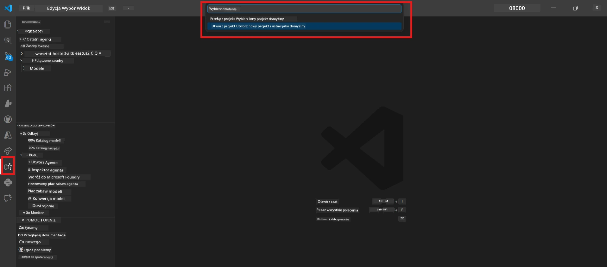
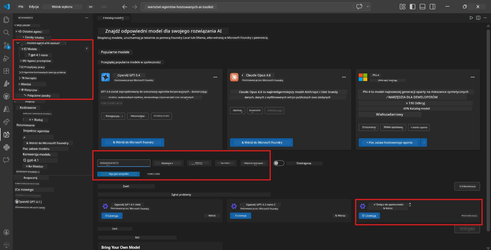
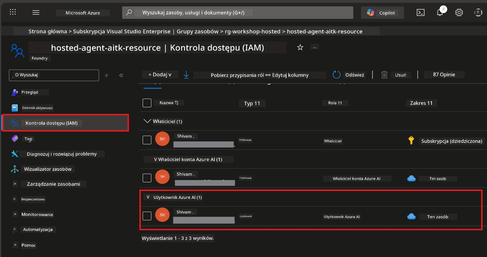

# Moduł 2 - Utwórz projekt Foundry i wdroż model

W tym module tworzysz (lub wybierasz) projekt Microsoft Foundry i wdrażasz model, którego będzie używał Twój agent. Każdy krok jest opisany szczegółowo - wykonuj je w podanej kolejności.

> Jeśli masz już projekt Foundry z wdrożonym modelem, przejdź do [Modułu 3](03-create-hosted-agent.md).

---

## Krok 1: Utwórz projekt Foundry z VS Code

Użyjesz rozszerzenia Microsoft Foundry, aby utworzyć projekt bez wychodzenia z VS Code.

1. Naciśnij `Ctrl+Shift+P`, aby otworzyć **Paletę poleceń**.
2. Wpisz: **Microsoft Foundry: Create Project** i wybierz tę opcję.
3. Pojawi się lista rozwijana - wybierz swoją **subskrypcję Azure** z listy.
4. Zostaniesz poproszony o wybranie lub utworzenie **grupy zasobów**:
   - Aby utworzyć nową: wpisz nazwę (np. `rg-hosted-agents-workshop`) i naciśnij Enter.
   - Aby użyć istniejącej: wybierz ją z listy rozwijanej.
5. Wybierz **region**. **Ważne:** Wybierz region, który obsługuje hostowanych agentów. Sprawdź [dostępność regionów](https://learn.microsoft.com/azure/foundry/agents/concepts/hosted-agents#region-availability) - popularne opcje to `East US`, `West US 2` lub `Sweden Central`.
6. Wpisz **nazwę** projektu Foundry (np. `workshop-agents`).
7. Naciśnij Enter i poczekaj na zakończenie tworzenia.

> **Provisioning trwa 2-5 minut.** W prawym dolnym rogu VS Code zobaczysz powiadomienie o postępie. Nie zamykaj VS Code podczas provisioning.

8. Po zakończeniu w pasku bocznym **Microsoft Foundry** zobaczysz nowy projekt pod **Resources**.
9. Kliknij nazwę projektu, aby go rozwinąć i potwierdź, że pojawiają się sekcje takie jak **Models + endpoints** oraz **Agents**.



### Alternatywnie: Utwórz przez Portal Foundry

Jeśli wolisz użyć przeglądarki:

1. Otwórz [https://ai.azure.com](https://ai.azure.com) i zaloguj się.
2. Kliknij **Create project** na stronie głównej.
3. Wprowadź nazwę projektu, wybierz subskrypcję, grupę zasobów i region.
4. Kliknij **Create** i poczekaj na provisioning.
5. Po utworzeniu wróć do VS Code - projekt powinien pojawić się w pasku bocznym Foundry po odświeżeniu (kliknij ikonę odświeżania).

---

## Krok 2: Wdroż model

Twój [hostowany agent](https://learn.microsoft.com/azure/foundry/agents/concepts/hosted-agents) potrzebuje modelu Azure OpenAI do generowania odpowiedzi. Teraz [wdrożysz go](https://learn.microsoft.com/azure/ai-foundry/openai/how-to/create-resource#deploy-a-model).

1. Naciśnij `Ctrl+Shift+P`, aby otworzyć **Paletę poleceń**.
2. Wpisz: **Microsoft Foundry: Open [Model Catalog](https://learn.microsoft.com/azure/ai-foundry/openai/concepts/models)** i wybierz tę opcję.
3. W VS Code otworzy się widok Katalogu Modeli. Przeglądaj lub użyj paska wyszukiwania, aby znaleźć **gpt-4.1**.
4. Kliknij kartę modelu **gpt-4.1** (lub `gpt-4.1-mini`, jeśli wolisz niższe koszty).
5. Kliknij **Deploy**.


6. W konfiguracji wdrożenia:
   - **Deployment name**: Pozostaw domyślną nazwę (np. `gpt-4.1`) lub wpisz własną. **Zapamiętaj tę nazwę** - będzie potrzebna w Module 4.
   - **Target**: Wybierz **Deploy to Microsoft Foundry** i wskaż właśnie utworzony projekt.
7. Kliknij **Deploy** i poczekaj na zakończenie wdrożenia (1-3 minuty).

### Wybór modelu

| Model | Najlepsze do | Koszt | Uwagi |
|-------|--------------|-------|-------|
| `gpt-4.1` | Odpowiedzi wysokiej jakości, zniuansowane | Wyższy | Najlepsze wyniki, zalecany do testów końcowych |
| `gpt-4.1-mini` | Szybkie iteracje, niższy koszt | Niższy | Dobry do rozwoju i szybkich testów warsztatowych |
| `gpt-4.1-nano` | Lekkie zadania | Najniższy | Najbardziej opłacalny, ale prostsze odpowiedzi |

> **Rekomendacja na ten warsztat:** Używaj `gpt-4.1-mini` do rozwoju i testów. Jest szybki, tani i daje dobre wyniki dla ćwiczeń.

### Sprawdź wdrożenie modelu

1. W pasku bocznym **Microsoft Foundry** rozwiń swój projekt.
2. Sprawdź sekcję **Models + endpoints** (lub podobną).
3. Powinieneś zobaczyć wdrożony model (np. `gpt-4.1-mini`) ze statusem **Succeeded** lub **Active**.
4. Kliknij wdrożenie modelu, aby zobaczyć szczegóły.
5. **Zanotuj** te dwa wartości - będą potrzebne w Moduł 4:

   | Ustawienie | Gdzie znaleźć | Przykładowa wartość |
   |---------|-----------------|---------------|
   | **Project endpoint** | Kliknij nazwę projektu w pasku bocznym Foundry. URL endpointu jest pokazany w widoku szczegółów. | `https://<account>.services.ai.azure.com/api/projects/<project>` |
   | **Model deployment name** | Nazwa widoczna obok wdrożonego modelu. | `gpt-4.1-mini` |

---

## Krok 3: Przypisz wymagane role RBAC

To jest **najczęściej pomijany krok**. Bez właściwych ról wdrożenie w Module 6 zakończy się błędem uprawnień.

### 3.1 Przypisz rolę Azure AI User sobie

1. Otwórz przeglądarkę i przejdź do [https://portal.azure.com](https://portal.azure.com).
2. W górnym pasku wyszukiwania wpisz nazwę swojego **projektu Foundry** i kliknij ją w wynikach.
   - **Ważne:** Przejdź do zasobu **projektu** (typ: "Microsoft Foundry project"), **nie** do nadrzędnego konta/huba.
3. W lewym menu projektu kliknij **Access control (IAM)**.
4. Kliknij przycisk **+ Add** na górze → wybierz **Add role assignment**.
5. Na karcie **Role** wyszukaj [**Azure AI User**](https://learn.microsoft.com/azure/foundry/concepts/rbac-foundry#built-in-roles) i wybierz ją. Kliknij **Next**.
6. Na karcie **Members**:
   - Wybierz **User, group, or service principal**.
   - Kliknij **+ Select members**.
   - Wyszukaj swoje imię lub e-mail, wybierz siebie i kliknij **Select**.
7. Kliknij **Review + assign** → a następnie ponownie **Review + assign**, aby potwierdzić.



### 3.2 (Opcjonalnie) Przypisz rolę Azure AI Developer

Jeśli potrzebujesz tworzyć dodatkowe zasoby w projekcie lub zarządzać wdrożeniami programowo:

1. Powtórz powyższe kroki, ale w kroku 5 wybierz **Azure AI Developer**.
2. Przypisz ją na poziomie **zasobu Foundry (konto)**, nie tylko na poziomie projektu.

### 3.3 Sprawdź przypisania ról

1. Na stronie **Access control (IAM)** projektu kliknij kartę **Role assignments**.
2. Wyszukaj swoje imię.
3. Powinieneś zobaczyć przynajmniej rolę **Azure AI User** przypisaną w zakresie projektu.

> **Dlaczego to ważne:** Rola [`Azure AI User`](https://learn.microsoft.com/azure/foundry/concepts/rbac-foundry#built-in-roles) przyznaje akcję danych `Microsoft.CognitiveServices/accounts/AIServices/agents/write`. Bez niej podczas wdrożenia pojawi się taki błąd:
>
> ```
> Error: lacks the required data action 
> Microsoft.CognitiveServices/accounts/AIServices/agents/write 
> to perform POST /api/projects/{projectName}/assistants operation.
> ```
>
> Więcej szczegółów znajdziesz w [Moduł 8 - Rozwiązywanie problemów](08-troubleshooting.md).

---

### Punkt kontrolny

- [ ] Projekt Foundry istnieje i widoczny jest w pasku bocznym Microsoft Foundry w VS Code
- [ ] Przynajmniej jeden model jest wdrożony (np. `gpt-4.1-mini`) ze statusem **Succeeded**
- [ ] Zanotowałeś URL **project endpoint** i nazwę wdrożenia modelu
- [ ] Masz przypisaną rolę **Azure AI User** na poziomie **projektu** (sprawdź w Azure Portal → IAM → Role assignments)
- [ ] Projekt znajduje się w [obsługiwanym regionie](https://learn.microsoft.com/azure/foundry/agents/concepts/hosted-agents#region-availability) dla hostowanych agentów

---

**Poprzedni:** [01 - Instalacja Foundry Toolkit](01-install-foundry-toolkit.md) · **Następny:** [03 - Utwórz hostowanego agenta →](03-create-hosted-agent.md)

---

<!-- CO-OP TRANSLATOR DISCLAIMER START -->
**Zastrzeżenie**:  
Ten dokument został przetłumaczony przy użyciu usługi tłumaczeń AI [Co-op Translator](https://github.com/Azure/co-op-translator). Chociaż dążymy do dokładności, prosimy mieć na uwadze, że tłumaczenia automatyczne mogą zawierać błędy lub niedokładności. Oryginalny dokument w jego rodzinnym języku powinien być uważany za autorytatywne źródło. W przypadku informacji krytycznych zaleca się profesjonalne tłumaczenie wykonane przez człowieka. Nie ponosimy odpowiedzialności za jakiekolwiek nieporozumienia lub błędne interpretacje wynikające z korzystania z tego tłumaczenia.
<!-- CO-OP TRANSLATOR DISCLAIMER END -->