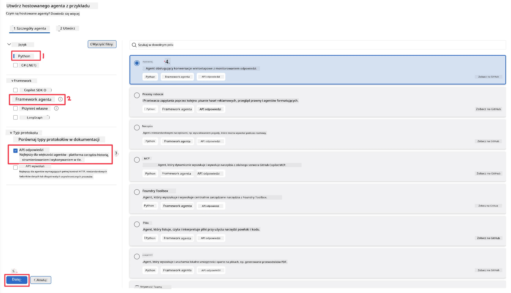
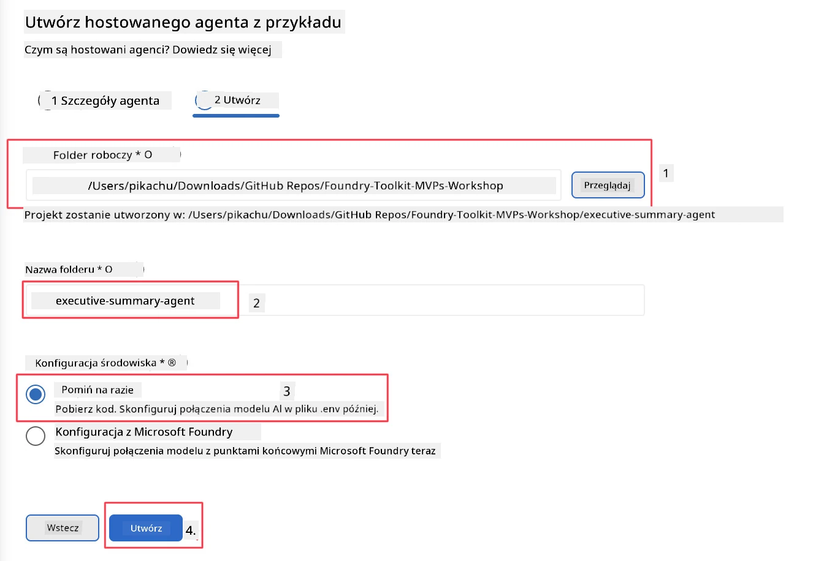

# Moduł 2 - Utwórz nowego hostowanego agenta

⏱️ ~5 min

W tym module użyjesz Foundry Toolkit, aby **wygenerować szkielet projektu hostowanego agenta**. Szkielet generuje pełną strukturę projektu - `agent.yaml`, `main.py`, `Dockerfile`, `requirements.txt` oraz konfigurację debugowania VS Code - dzięki czemu możesz skupić się na dostosowywaniu zachowania agenta.

> **Kluczowa koncepcja:** Folder `agent/` w tym laboratorium to przykład tego, co generuje Foundry Toolkit. Nie tworzysz tych plików od podstaw.

### Przebieg kreatora szkieletu

```mermaid
flowchart LR
    A["Command Palette:
    Create new Hosted Agent"] --> B["Language:
    Python"]
    B --> C["API type:
    Response API"]
    C --> D["Template:
    Basic - Agent Framework"]
    D --> E["Wybierz model"]
    E --> F["Workspace folder
    & agent name"]
    F --> G["Wygenerowany projekt"]

    style A fill:#4A90D9,color:#fff
    style B fill:#7B68EE,color:#fff
    style C fill:#7B68EE,color:#fff
    style D fill:#7B68EE,color:#fff
    style E fill:#7B68EE,color:#fff
    style F fill:#7B68EE,color:#fff
    style G fill:#27AE60,color:#fff
```



---

## Krok 1: Otwórz kreator Create Hosted Agent

1. Naciśnij `Ctrl+Shift+P`, aby otworzyć **Command Palette**.
2. Wpisz: **Foundry Toolkit: Create new Hosted Agent** i wybierz tę opcję.

> **Alternatywa: Utwórz przez Foundry Portal**
> Jeśli wolisz przeglądarkę, możesz utworzyć projekt na stronie [https://ai.azure.com](https://ai.azure.com). Po utworzeniu projektu wróć do VS Code i użyj paska bocznego **Foundry Toolkit**, aby się z nim połączyć.

> **Alternatywnie:** Kliknij ikonę **+** obok **Hosted Agents (Preview)** w pasku bocznym Foundry Toolkit.

## Krok 2: Wybierz ustawienia



1. W lewej sekcji nawigacji/opcji wybierz następujące elementy:

| Menu | Wybór | Uwagi |
|--------|-----------|-------|
| **Language** | Python | Obsługiwany jest również C# |
| **Framework** | Agent Framework | Prosty punkt startowy z użyciem Agent Framework SDK |
| **API type** | Response API | `POST /responses` - konwersacyjne, z historią zarządzaną przez platformę |
| **Template** | Basic | Prosty punkt startowy z użyciem Agent Framework SDK |

2. Po wybraniu kliknij **Next**



3. W następnym oknie wybierz następujące elementy:

| Menu | Wybór | Uwagi |
|--------|-----------|-------|
| **Workspace folder** | Wybierz docelowy folder | np. `/workspace/Foundry_Toolkit_for_VSCode_Lab/` lub podfolder w tym repozytorium |
| **Agent name** | Wprowadź nazwę | np. `executive-summary-agent` |
| **Environment Setup** | na razie pomiń konfigurację |  |

Kliknij **create**, aby utworzyć agenta. Zostanie utworzony nowy folder o nazwie hostowanego agenta.

## Krok 3: Sprawdź wygenerowany projekt

Po zakończeniu generowania sprawdź, czy widzisz te pliki w Eksploratorze (`Ctrl+Shift+E`):

```
📂 my-agent/
├── .env                ← Environment variables (placeholders)
├── .vscode/
│   ├── launch.json     ← Debug config (F5 → run + Agent Inspector)
│   └── tasks.json      ← VS Code task definitions
├── agent.yaml          ← Agent definition (kind: hosted)
├── Dockerfile          ← Container config for deployment
├── main.py             ← Agent entry point (your main code)
└── requirements.txt    ← Python dependencies
```

### Wyjaśnienie kluczowych plików

| Plik | Cel |
|------|---------|
| `agent.yaml` | Deklaruje agenta jako `kind: hosted`, mapuje zmienne środowiskowe, definiuje protokół `/responses` |
| `main.py` | Tworzy `FoundryChatClient` → opakowuje go w `Agent` z instrukcjami → udostępnia przez `ResponsesHostServer` na porcie 8088 |
| `Dockerfile` | Używa `python:3.12-slim`, instaluje zależności, wystawia port 8088, uruchamia `main.py` |
| `requirements.txt` | `agent-framework-foundry`, `agent-framework-foundry-hosting`, `mcp`, `debugpy` |

> **Ważne:** Otwórz folder wygenerowanego agenta bezpośrednio w VS Code (sam folder `agent/`), aby `.vscode/launch.json` i `tasks.json` działały poprawnie podczas debugowania F5.

---

### ✅ Punkt kontrolny

- [ ] Wygenerowany projekt utworzony ze wszystkimi oczekiwanymi plikami
- [ ] `agent.yaml` pokazuje `kind: hosted` oraz `protocol: responses`
- [ ] `main.py` importuje `Agent`, `FoundryChatClient`, `ResponsesHostServer`
- [ ] Folder agenta jest otwarty w VS Code jako główny katalog roboczy

---

**Poprzedni:** [01 - Setup](01-setup.md) · **Następny:** [03 - Konfiguracja i kodowanie →](03-configure-and-code.md)

---

<!-- CO-OP TRANSLATOR DISCLAIMER START -->
**Zastrzeżenie**:
Niniejszy dokument został przetłumaczony za pomocą usługi tłumaczenia AI [Co-op Translator](https://github.com/Azure/co-op-translator). Choć dążymy do dokładności, prosimy pamiętać, że automatyczne tłumaczenia mogą zawierać błędy lub niedokładności. Oryginalny dokument w jego języku źródłowym należy uznawać za autorytatywne źródło. W przypadku informacji krytycznych zalecane jest skorzystanie z profesjonalnego tłumaczenia wykonanego przez człowieka. Nie ponosimy odpowiedzialności za jakiekolwiek nieporozumienia lub błędne interpretacje wynikające z użycia tego tłumaczenia.
<!-- CO-OP TRANSLATOR DISCLAIMER END -->