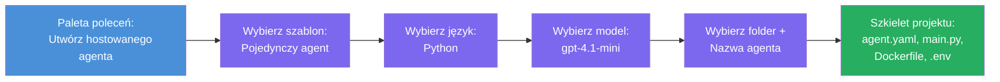

# Moduł 3 - Utwórz nowego hostowanego agenta (automatycznie wygenerowany przez rozszerzenie Foundry)

W tym module użyjesz rozszerzenia Microsoft Foundry, aby **wygenerować nowy projekt [hostowanego agenta](https://learn.microsoft.com/azure/foundry/agents/concepts/hosted-agents)**. Rozszerzenie tworzy całą strukturę projektu za Ciebie – w tym `agent.yaml`, `main.py`, `Dockerfile`, `requirements.txt`, plik `.env` oraz konfigurację debugowania w VS Code. Po wygenerowaniu dostosujesz te pliki do instrukcji, narzędzi i konfiguracji Twojego agenta.

> **Kluczowa koncepcja:** Folder `agent/` w tym laboratorium to przykład tego, co generuje rozszerzenie Foundry po uruchomieniu tego polecenia scaffold. Nie tworzysz tych plików od zera – rozszerzenie je generuje, a Ty je modyfikujesz.

### Przebieg kreatora scaffoldingu


---

## Krok 1: Otwórz kreatora tworzenia hostowanego agenta

1. Naciśnij `Ctrl+Shift+P`, aby otworzyć **Paletę poleceń**.
2. Wpisz: **Microsoft Foundry: Create a New Hosted Agent** i wybierz tę opcję.
3. Otworzy się kreator tworzenia hostowanego agenta.

> **Alternatywna ścieżka:** Możesz także dotrzeć do tego kreatora z paska bocznego Microsoft Foundry → kliknij ikonę **+** obok **Agents** albo kliknij prawym i wybierz **Create New Hosted Agent**.

---

## Krok 2: Wybierz szablon

Kreator poprosi Cię o wybranie szablonu. Zobaczysz opcje takie jak:

| Szablon | Opis | Kiedy używać |
|---------|------|--------------|
| **Single Agent** | Jeden agent z własnym modelem, instrukcjami i opcjonalnymi narzędziami | To warsztaty (Lab 01) |
| **Multi-Agent Workflow** | Wielu agentów współpracujących sekwencyjnie | Lab 02 |

1. Wybierz **Single Agent**.
2. Kliknij **Dalej** (lub wybór wykona się automatycznie).

---

## Krok 3: Wybierz język programowania

1. Wybierz **Python** (zalecany na te warsztaty).
2. Kliknij **Dalej**.

> **Wspierany jest także C#** jeśli wolisz .NET. Struktura scaffoldingu jest podobna (z `Program.cs` zamiast `main.py`).

---

## Krok 4: Wybierz model

1. Kreator pokazuje modele wdrożone w Twoim projekcie Foundry (z Modułu 2).
2. Wybierz model, który wdrożyłeś – np. **gpt-4.1-mini**.
3. Kliknij **Dalej**.

> Jeśli nie widzisz żadnych modeli, wróć do [Modułu 2](02-create-foundry-project.md) i najpierw wdroż jeden.

---

## Krok 5: Wybierz lokalizację folderu i nazwę agenta

1. Otworzy się okno dialogowe wyboru pliku – wybierz **docelowy folder**, w którym zostanie stworzony projekt. W trakcie tych warsztatów:
   - Jeśli zaczynasz od początku: wybierz dowolny folder (np. `C:\Projects\my-agent`)
   - Jeśli pracujesz w repozytorium warsztatowym: stwórz nowy podfolder pod `workshop/lab01-single-agent/agent/`
2. Wprowadź **nazwę** hostowanego agenta (np. `executive-summary-agent` lub `my-first-agent`).
3. Kliknij **Utwórz** (lub naciśnij Enter).

---

## Krok 6: Poczekaj na zakończenie scaffoldu

1. VS Code otworzy **nowe okno** z wygenerowanym projektem.
2. Poczekaj kilka sekund, aż projekt się w pełni załaduje.
3. Powinieneś zobaczyć następujące pliki w panelu Eksploratora (`Ctrl+Shift+E`):

```
📂 my-first-agent/
├── .env                ← Environment variables (auto-generated with placeholders)
├── .vscode/
│   └── launch.json     ← Debug configuration (F5 to run + Agent Inspector)
├── agent.yaml          ← Agent definition (kind: hosted)
├── Dockerfile          ← Container configuration for deployment
├── main.py             ← Agent entry point (your main code file)
└── requirements.txt    ← Python dependencies
```

> **To ta sama struktura, co folder `agent/`** w tym laboratorium. Rozszerzenie Foundry generuje te pliki automatycznie – nie musisz ich tworzyć ręcznie.

> **Uwaga warsztatowa:** W repozytorium warsztatowym folder `.vscode/` znajduje się w **głównym katalogu pracy** (nie wewnątrz każdego projektu). Zawiera on współdzielone pliki `launch.json` oraz `tasks.json` z dwiema konfiguracjami debugowania – **"Lab01 - Single Agent"** i **"Lab02 - Multi-Agent"** – każda wskazuje na odpowiedni katalog roboczy. Po naciśnięciu F5 wybierz konfigurację odpowiadającą aktualnemu laboratorium z listy rozwijanej.

---

## Krok 7: Zrozum każdy wygenerowany plik

Poświęć chwilę, aby przyjrzeć się każdemu utworzonemu plikowi. Zrozumienie ich jest ważne do Modułu 4 (dostosowywanie).

### 7.1 `agent.yaml` - Definicja agenta

Otwórz `agent.yaml`. Wygląda tak:

```yaml
# yaml-language-server: $schema=https://raw.githubusercontent.com/microsoft/AgentSchema/refs/heads/main/schemas/v1.0/ContainerAgent.yaml

kind: hosted
name: my-first-agent
description: >
  A hosted agent deployed to Microsoft Foundry Agent Service.
metadata:
  authors:
    - Microsoft
  tags:
    - Azure AI AgentServer
    - Microsoft Agent Framework
    - Hosted Agent
protocols:
  - protocol: responses
    version: v1
environment_variables:
  - name: AZURE_AI_PROJECT_ENDPOINT
    value: ${PROJECT_ENDPOINT}
  - name: AZURE_AI_MODEL_DEPLOYMENT_NAME
    value: ${MODEL_DEPLOYMENT_NAME}
dockerfile_path: Dockerfile
resources:
  cpu: '0.25'
  memory: 0.5Gi
```

**Kluczowe pola:**

| Pole | Cel |
|-------|-----|
| `kind: hosted` | Deklaruje, że jest to hostowany agent (oparty na kontenerze, wdrożony w [Foundry Agent Service](https://learn.microsoft.com/azure/foundry/agents/overview)) |
| `protocols: responses v1` | Agent udostępnia kompatybilny z OpenAI endpoint HTTP `/responses` |
| `environment_variables` | Mapuje wartości z `.env` na zmienne środowiskowe kontenera podczas wdrożenia |
| `dockerfile_path` | Wskazuje plik Dockerfile używany do budowy obrazu kontenera |
| `resources` | Przydział CPU i pamięci dla kontenera (0.25 CPU, 0.5Gi pamięci) |

### 7.2 `main.py` - Punkt wejścia agenta

Otwórz `main.py`. To główny plik Pythona, w którym znajduje się logika Twojego agenta. Scaffold zawiera:

```python
from agent_framework.azure import AzureAIAgentClient
from azure.ai.agentserver.agentframework import from_agent_framework
from azure.identity.aio import DefaultAzureCredential
```

**Kluczowe importy:**

| Import | Cel |
|--------|-----|
| `AzureAIAgentClient` | Łączy się z Twoim projektem Foundry i tworzy agentów za pomocą `.as_agent()` |
| [`DefaultAzureCredential`](https://learn.microsoft.com/azure/developer/python/sdk/authentication/credential-chains#defaultazurecredential-overview) | Obsługuje uwierzytelnianie (CLI Azure, logowanie w VS Code, tożsamość zarządzaną lub principal serwisowy) |
| `from_agent_framework` | Opakowuje agenta jako serwer HTTP udostępniający endpoint `/responses` |

Główny przebieg to:
1. Stwórz poświadczenie → utwórz klienta → wywołaj `.as_agent()` aby uzyskać agenta (asynchroniczny context manager) → opakuj go jako serwer → uruchom

### 7.3 `Dockerfile` - Obraz kontenera

```dockerfile
FROM python:3.14-slim

WORKDIR /app

COPY ./ .

RUN pip install --upgrade pip && \
    if [ -f requirements.txt ]; then \
        pip install -r requirements.txt; \
    else \
        echo "No requirements.txt found" >&2; exit 1; \
    fi

EXPOSE 8088

CMD ["python", "main.py"]
```

**Kluczowe informacje:**
- Używa `python:3.14-slim` jako obrazu bazowego.
- Kopiuje wszystkie pliki projektu do `/app`.
- Aktualizuje `pip`, instaluje zależności z `requirements.txt` i szybko zgłasza błąd, jeśli plik jest brakujący.
- **Udostępnia port 8088** – jest to wymagany port dla hostowanych agentów. Nie zmieniaj go.
- Uruchamia agenta poleceniem `python main.py`.

### 7.4 `requirements.txt` - Zależności

```
agent-framework-azure-ai==1.0.0rc3
agent-framework-core==1.0.0rc3
azure-ai-agentserver-agentframework==1.0.0b16
azure-ai-agentserver-core==1.0.0b16
debugpy
agent-dev-cli
```

| Pakiet | Cel |
|---------|-----|
| `agent-framework-azure-ai` | Integracja Azure AI dla Microsoft Agent Framework |
| `agent-framework-core` | Podstawowe środowisko uruchomieniowe do budowy agentów (zawiera `python-dotenv`) |
| `azure-ai-agentserver-agentframework` | Środowisko uruchomieniowe hostowanego serwera agenta dla Foundry Agent Service |
| `azure-ai-agentserver-core` | Podstawowe abstrakcje serwera agenta |
| `debugpy` | Wsparcie debugowania Pythona (umożliwia debugowanie F5 w VS Code) |
| `agent-dev-cli` | Lokalny CLI do testów agentów (używany przez konfigurację debug/run) |

---

## Zrozumienie protokołu agenta

Hostowani agenci komunikują się poprzez protokół **OpenAI Responses API**. Podczas działania (lokalnie lub w chmurze) agent udostępnia pojedynczy endpoint HTTP:

```
POST http://localhost:8088/responses
Content-Type: application/json

{
  "input": "Your prompt here",
  "stream": false
}
```

Foundry Agent Service wywołuje ten endpoint, aby wysyłać podpowiedzi użytkownika i odbierać odpowiedzi agenta. To ten sam protokół, który używa API OpenAI, więc Twój agent jest kompatybilny z dowolnym klientem obsługującym format OpenAI Responses.

---

### Punkt kontrolny

- [ ] Kreator scaffoldingu zakończył się sukcesem i otworzyło się **nowe okno VS Code**
- [ ] Widać wszystkie 5 plików: `agent.yaml`, `main.py`, `Dockerfile`, `requirements.txt`, `.env`
- [ ] Istnieje plik `.vscode/launch.json` (umożliwia debugowanie F5 – w tych warsztatach jest w głównym katalogu workspace, z konfiguracjami specyficznymi dla labów)
- [ ] Przejrzałeś każdy plik i rozumiesz jego przeznaczenie
- [ ] Rozumiesz, że port `8088` jest wymagany oraz że endpoint `/responses` to protokół

---

**Poprzedni:** [02 - Create Foundry Project](02-create-foundry-project.md) · **Następny:** [04 - Configure & Code →](04-configure-and-code.md)

---

<!-- CO-OP TRANSLATOR DISCLAIMER START -->
**Zastrzeżenie**:  
Niniejszy dokument został przetłumaczony przy użyciu usługi tłumaczenia AI [Co-op Translator](https://github.com/Azure/co-op-translator). Pomimo naszych starań o dokładność, prosimy mieć na uwadze, że automatyczne tłumaczenia mogą zawierać błędy lub nieścisłości. Oryginalny dokument w jego rodzimym języku powinien być uznawany za źródło autorytatywne. W przypadku informacji krytycznych zalecane jest skorzystanie z profesjonalnego tłumaczenia wykonanego przez człowieka. Nie ponosimy odpowiedzialności za jakiekolwiek nieporozumienia lub błędne interpretacje wynikające z użycia tego tłumaczenia.
<!-- CO-OP TRANSLATOR DISCLAIMER END -->