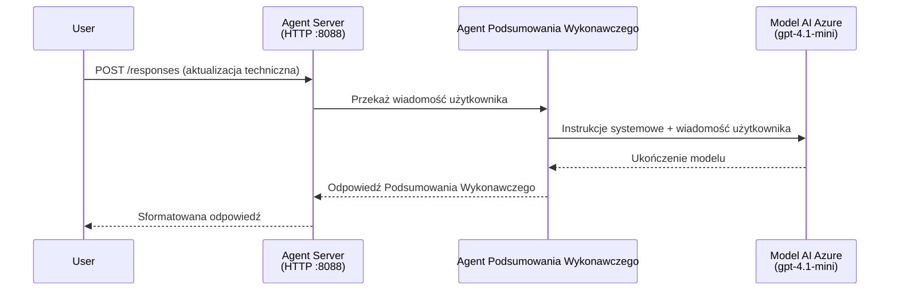
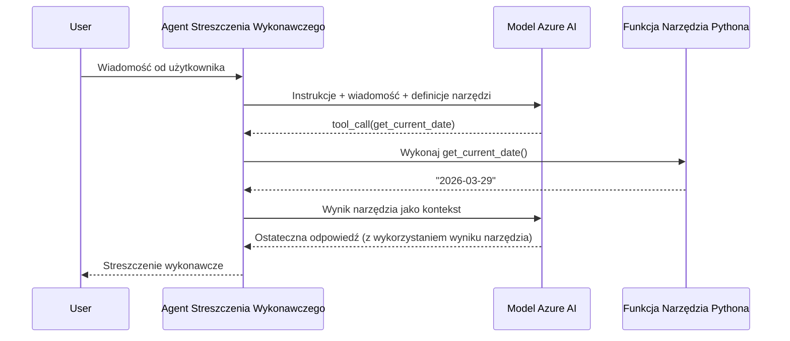

# Moduł 4 - Konfiguracja instrukcji, środowiska i instalacja zależności

W tym module dostosowujesz automatycznie wygenerowane pliki agenta z Modułu 3. To tutaj przekształcasz ogólny szkielet w **swojego** agenta - pisząc instrukcje, ustawiając zmienne środowiskowe, opcjonalnie dodając narzędzia i instalując zależności.

> **Przypomnienie:** Wtyczka Foundry automatycznie wygenerowała Twoje pliki projektowe. Teraz je modyfikujesz. Zobacz katalog [`agent/`](../../../../../workshop/lab01-single-agent/agent) dla kompletnego działającego przykładu dostosowanego agenta.

---

## Jak komponenty współgrają ze sobą

### Cykl życia zapytania (pojedynczy agent)


> **Z narzędziami:** Jeśli agent ma zarejestrowane narzędzia, model może zwrócić wywołanie narzędzia zamiast bezpośredniej odpowiedzi. Framework wykonuje narzędzie lokalnie, przekazuje wynik z powrotem do modelu, który generuje finalną odpowiedź.


---

## Krok 1: Konfiguracja zmiennych środowiskowych

Szkielet utworzył plik `.env` z wartościami zastępczymi. Musisz uzupełnić prawdziwe wartości z Modułu 2.

1. W swoim wygenerowanym projekcie otwórz plik **`.env`** (jest w katalogu głównym projektu).
2. Zamień wartości zastępcze na rzeczywiste dane projektu Foundry:

   ```env
   PROJECT_ENDPOINT=https://<your-account>.services.ai.azure.com/api/projects/<your-project>
   MODEL_DEPLOYMENT_NAME=gpt-4.1-mini
   ```

3. Zapisz plik.

### Gdzie znaleźć te wartości

| Wartość | Jak znaleźć |
|---------|-------------|
| **Endpoint projektu** | Otwórz pasek boczny **Microsoft Foundry** w VS Code → kliknij na swój projekt → URL endpointu znajduje się w widoku szczegółów. Wygląda to jak `https://<account-name>.services.ai.azure.com/api/projects/<project-name>` |
| **Nazwa wdrożenia modelu** | W pasku Foundry rozwiń projekt → sprawdź pod **Models + endpoints** → nazwa jest wymieniona obok wdrożonego modelu (np. `gpt-4.1-mini`) |

> **Bezpieczeństwo:** Nigdy nie commituj pliku `.env` do kontroli wersji. Jest on domyślnie uwzględniony w `.gitignore`. Jeśli nie jest, dodaj go:
> ```
> .env
> ```

### Przepływ zmiennych środowiskowych

Łańcuch mapowania to: `.env` → `main.py` (odczyt przez `os.getenv`) → `agent.yaml` (mapowanie na zmienne środowiskowe kontenera w czasie wdrażania).

W `main.py` szkielet odczytuje te wartości tak:

```python
PROJECT_ENDPOINT = os.getenv("AZURE_AI_PROJECT_ENDPOINT") or os.getenv("PROJECT_ENDPOINT")
MODEL_DEPLOYMENT_NAME = os.getenv("AZURE_AI_MODEL_DEPLOYMENT_NAME", os.getenv("MODEL_DEPLOYMENT_NAME", "gpt-4.1-mini"))
```

Akceptowane są zarówno `AZURE_AI_PROJECT_ENDPOINT`, jak i `PROJECT_ENDPOINT` (w `agent.yaml` używa się prefiksu `AZURE_AI_*`).

---

## Krok 2: Napisz instrukcje dla agenta

To najważniejszy krok dostosowania. Instrukcje definiują osobowość agenta, sposób zachowania, format wyjścia i ograniczenia bezpieczeństwa.

1. Otwórz `main.py` w swoim projekcie.
2. Znajdź ciąg znaków z instrukcjami (szkielet zawiera domyślny/generyczny).
3. Zamień go na szczegółowe, ustrukturyzowane instrukcje.

### Co powinny zawierać dobre instrukcje

| Składnik | Cel | Przykład |
|----------|-----|----------|
| **Rola** | Kim jest i co robi agent | "Jesteś agentem podsumowującym kluczowe punkty" |
| **Odbiorca** | Dla kogo są odpowiedzi | "Kierownictwo z ograniczoną wiedzą techniczną" |
| **Definicja wejścia** | Jakie zapytania obsługuje | "Raporty incydentów technicznych, aktualizacje operacyjne" |
| **Format wyjścia** | Dokładna struktura odpowiedzi | "Podsumowanie: - Co się wydarzyło: ... - Wpływ biznesowy: ... - Następny krok: ..." |
| **Zasady** | Ograniczenia i warunki odmowy | "NIE dodawaj informacji wykraczających poza dostarczone dane" |
| **Bezpieczeństwo** | Zapobieganie nadużyciom i halucynacjom | "Jeśli wejście jest niejasne, poproś o wyjaśnienie" |
| **Przykłady** | Pary wejście/wyjście sterujące zachowaniem | Zawierać 2-3 przykłady z różnymi zapytaniami |

### Przykład: Instrukcje agenta do podsumowań kierowniczych

Oto instrukcje użyte w warsztatowym [`agent/main.py`](../../../../../workshop/lab01-single-agent/agent/main.py):

```python
AGENT_INSTRUCTIONS = """You are an "Explain Like I'm an Executive" agent.

Purpose:
Your job is to translate complex technical or operational information into
clear, concise, and outcome-focused summaries that can be easily understood
by non-technical executives.

Audience:
Senior leaders with limited technical background who care about impact,
risk, and what happens next.

What you must do:
- Rephrase the input so it is understandable to a non-technical audience
- Prioritize clarity, brevity, and outcomes over technical accuracy
- Remove technical jargon, logs, metrics, stack traces, and deep root-cause details
- Translate technical causes into simple cause-and-effect statements
- Explicitly call out business impact
- Always include a clear next step or action
- Maintain a neutral, factual, and calm executive tone
- Do NOT add new facts or speculate beyond the input

Standard Output Structure (always use this wording):

Executive Summary:
- What happened: <plain-language description>
- Business impact: <clear, non-technical impact>
- Next step: <clear action or mitigation>

Rules:
- Keep responses under 100 words
- Do NOT add facts beyond the input
- If input is unclear, ask for clarification
"""
```

4. Zamień istniejący ciąg instrukcji w `main.py` na swoje niestandardowe instrukcje.
5. Zapisz plik.

---

## Krok 3: (Opcjonalnie) Dodaj niestandardowe narzędzia

Agenci hostowani mogą wykonywać **lokalne funkcje Pythona** jako [narzędzia](https://learn.microsoft.com/azure/foundry/agents/concepts/tool-catalog). To kluczowa zaleta agentów uruchamianych na kodzie nad agentami tylko na prompt - Twój agent może wykonać dowolną logikę po stronie serwera.

### 3.1 Zdefiniuj funkcję narzędzia

Dodaj funkcję narzędzia do `main.py`:

```python
from agent_framework import tool

@tool
def get_current_date() -> str:
    """Returns the current date in YYYY-MM-DD format."""
    from datetime import date
    return str(date.today())
```

Dekorator `@tool` przekształca standardową funkcję Pythona w narzędzie agenta. Docstring staje się opisem narzędzia widzianym przez model.

### 3.2 Zarejestruj narzędzie w agencie

Podczas tworzenia agenta przez `.as_agent()` (menadżer kontekstu), przekaż narzędzie w parametrze `tools`:

```python
async with AzureAIAgentClient(
    project_endpoint=PROJECT_ENDPOINT,
    model_deployment_name=MODEL_DEPLOYMENT_NAME,
    credential=credential,
).as_agent(
    name="my-agent",
    instructions=AGENT_INSTRUCTIONS,
    tools=[get_current_date],
) as agent:
    server = from_agent_framework(agent)
    await server.run_async()
```

### 3.3 Jak działają wywołania narzędzi

1. Użytkownik wysyła zapytanie.
2. Model decyduje, czy potrzebne jest narzędzie (na podstawie prompta, instrukcji i opisów narzędzi).
3. Jeśli potrzebne, framework wywołuje lokalnie Twoją funkcję Pythona (wewnątrz kontenera).
4. Wartość zwrócona przez narzędzie jest przekazywana modelowi jako kontekst.
5. Model generuje finalną odpowiedź.

> **Narzędzia wykonują się po stronie serwera** - działają w Twoim kontenerze, nie w przeglądarce użytkownika ani w modelu. Oznacza to, że możesz korzystać z baz danych, API, systemów plików lub dowolnej biblioteki Pythona.

---

## Krok 4: Utwórz i aktywuj środowisko wirtualne

Przed instalacją zależności utwórz izolowane środowisko Pythona.

### 4.1 Utwórz środowisko wirtualne

Otwórz terminal w VS Code (`` Ctrl+` ``) i uruchom:

```powershell
python -m venv .venv
```

To tworzy folder `.venv` w katalogu projektu.

### 4.2 Aktywuj środowisko wirtualne

**PowerShell (Windows):**

```powershell
.\.venv\Scripts\Activate.ps1
```

**Wiersz poleceń (Windows):**

```cmd
.venv\Scripts\activate.bat
```

**macOS/Linux (Bash):**

```bash
source .venv/bin/activate
```

Powinieneś zobaczyć `(.venv)` na początku promptu terminala, co oznacza, że środowisko jest aktywne.

### 4.3 Zainstaluj zależności

Z aktywowanym środowiskiem zainstaluj potrzebne pakiety:

```powershell
pip install -r requirements.txt
```

Instalowane są:

| Pakiet | Cel |
|---------|-----|
| `agent-framework-azure-ai==1.0.0rc3` | Integracja Azure AI dla [Microsoft Agent Framework](https://learn.microsoft.com/agent-framework/overview/) |
| `agent-framework-core==1.0.0rc3` | Podstawowe środowisko uruchomieniowe do budowy agentów (zawiera `python-dotenv`) |
| `azure-ai-agentserver-agentframework==1.0.0b16` | Środowisko serwera agenta hostowanego dla [Foundry Agent Service](https://learn.microsoft.com/azure/foundry/agents/overview) |
| `azure-ai-agentserver-core==1.0.0b16` | Podstawowe abstrakcje serwera agenta |
| `debugpy` | Debugowanie Pythona (umożliwia debugowanie F5 w VS Code) |
| `agent-dev-cli` | Lokalny CLI do testowania agentów |

### 4.4 Zweryfikuj instalację

```powershell
pip list | Select-String "agent-framework|agentserver"
```

Oczekiwany wynik:
```
agent-framework-azure-ai   1.0.0rc3
agent-framework-core       1.0.0rc3
azure-ai-agentserver-agentframework 1.0.0b16
azure-ai-agentserver-core  1.0.0b16
```

---

## Krok 5: Sprawdź autoryzację

Agent używa [`DefaultAzureCredential`](https://learn.microsoft.com/azure/developer/python/sdk/authentication/credential-chains#defaultazurecredential-overview), który próbuje kilku sposobów autoryzacji w tej kolejności:

1. **Zmienne środowiskowe** - `AZURE_CLIENT_ID`, `AZURE_TENANT_ID`, `AZURE_CLIENT_SECRET` (principal usługi)
2. **Azure CLI** - wykorzystuje aktywną sesję `az login`
3. **VS Code** - korzysta z konta, na które zalogowano się w VS Code
4. **Managed Identity** - używane podczas uruchamiania w Azure (w czasie wdrażania)

### 5.1 Sprawdzenie dla lokalnego rozwoju

Przynajmniej jedna z poniższych powinna działać:

**Opcja A: Azure CLI (zalecane)**

```powershell
az account show --query "{name:name, id:id}" --output table
```

Oczekiwane: Wyświetla nazwę i ID subskrypcji.

**Opcja B: Logowanie w VS Code**

1. Spójrz na lewy dolny róg VS Code na ikonę **Konta**.
2. Jeśli widzisz swoją nazwę konta, jesteś zalogowany.
3. Jeśli nie, kliknij ikonę → **Zaloguj się, aby korzystać z Microsoft Foundry**.

**Opcja C: Principal usługi (dla CI/CD)**

```powershell
$env:AZURE_TENANT_ID = "<your-tenant-id>"
$env:AZURE_CLIENT_ID = "<your-client-id>"
$env:AZURE_CLIENT_SECRET = "<your-client-secret>"
```

### 5.2 Częsty problem z autoryzacją

Jeśli jesteś zalogowany do kilku kont Azure, upewnij się, że wybrana jest poprawna subskrypcja:

```powershell
az account set --subscription "<your-subscription-id>"
```

---

### Punkt kontrolny

- [ ] Plik `.env` zawiera poprawne wartości `PROJECT_ENDPOINT` i `MODEL_DEPLOYMENT_NAME` (nie są to wartości zastępcze)
- [ ] Instrukcje agenta są dostosowane w `main.py` – definiują rolę, odbiorcę, format wyjścia, zasady i ograniczenia bezpieczeństwa
- [ ] (Opcjonalnie) Niestandardowe narzędzia zostały zdefiniowane i zarejestrowane
- [ ] Środowisko wirtualne zostało utworzone i aktywowane (`(.venv)` widoczne w promptcie terminala)
- [ ] `pip install -r requirements.txt` zakończyło się sukcesem bez błędów
- [ ] `pip list | Select-String "azure-ai-agentserver"` pokazuje zainstalowany pakiet
- [ ] Autoryzacja jest poprawna – `az account show` zwraca Twoją subskrypcję LUB jesteś zalogowany w VS Code

---

**Poprzedni:** [03 - Utwórz agenta hostowanego](03-create-hosted-agent.md) · **Następny:** [05 - Testuj lokalnie →](05-test-locally.md)

---

<!-- CO-OP TRANSLATOR DISCLAIMER START -->
**Zastrzeżenie**:  
Ten dokument został przetłumaczony za pomocą usługi tłumaczenia AI [Co-op Translator](https://github.com/Azure/co-op-translator). Chociaż dążymy do dokładności, prosimy mieć na uwadze, że automatyczne tłumaczenia mogą zawierać błędy lub nieścisłości. Oryginalny dokument w jego rodzimym języku powinien być uznawany za źródło autorytatywne. W przypadku krytycznych informacji zalecane jest profesjonalne tłumaczenie wykonywane przez człowieka. Nie ponosimy odpowiedzialności za jakiekolwiek nieporozumienia lub błędne interpretacje wynikające z wykorzystania tego tłumaczenia.
<!-- CO-OP TRANSLATOR DISCLAIMER END -->