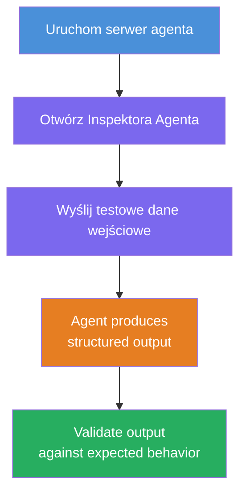
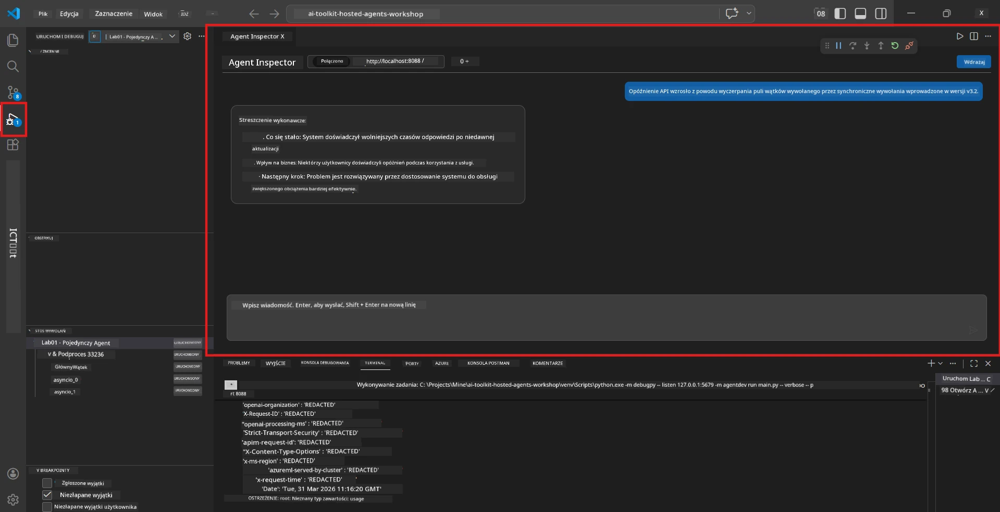
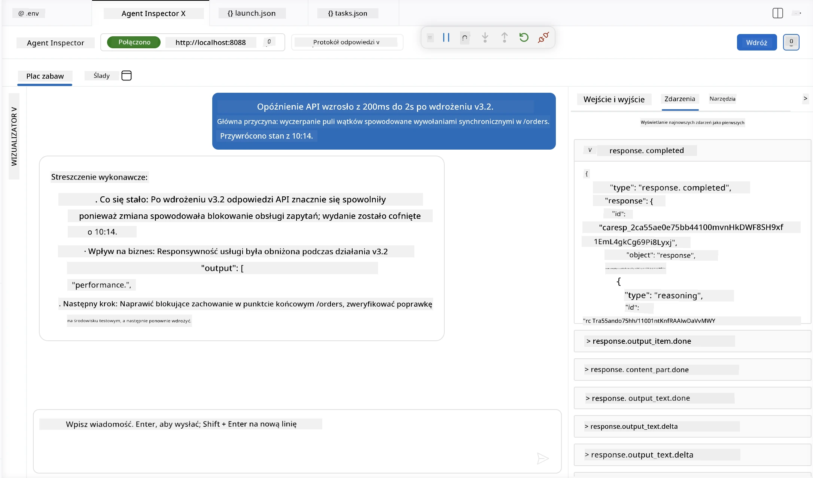

# Moduł 4 - Testowanie lokalne

⏱️ ~10 min

W tym module uruchomisz swojego agenta lokalnie i zweryfikujesz, czy działa poprawnie, korzystając z **testów funkcjonalnych happy-path**. Użyjesz Agent Inspector (interfejs wizualny) lub bezpośrednich wywołań HTTP, aby potwierdzić, że agent generuje uporządkowane i dokładne odpowiedzi.

### Przebieg testów lokalnych



---

## Opcja 1: Naciśnij F5 - debuguj z Agent Inspector (zalecane)

### Uruchom debuger

1. Otwórz folder **executive-summary-agent/** bezpośrednio w VS Code (`Plik → Otwórz folder`).
2. Otwórz panel **Uruchom i debuguj** (`Ctrl+Shift+D`).
3. Wybierz z listy **Debug Local Agent Server**.
4. Naciśnij **F5** (lub kliknij ▶ Startuj Debugowanie).

> ⚠️ **Krytyczne: Wybierz swój interpreter Pythona**
> Jeśli pojawi się błąd "ModuleNotFoundError" lub debuger nie uruchamia się, musisz wskazać VS Code, aby korzystał z twojego środowiska wirtualnego:
  > 1. Naciśnij `Ctrl+Shift+P` $\rightarrow$ wpisz **Python: Select Interpreter**.
  > 2. Wybierz interpreter znajdujący się w folderze `.venv` twojego projektu (np. `.\.venv\Scripts\python.exe` na Windows).
  > 3. Zrestartuj sesję debugowania.
> Jeśli nadal występują błędy, ręcznie zaktualizuj plik `tasks.json` w następujący sposób:
  > 1. Przejdź do pliku `.vscode/tasks.json`
  > 2. Znajdź polecenie oznaczone jako: `Run Agent/Workflow HTTP Server`
  > 3. Zmień wartość polecenia na: `"value": "${workspaceFolder}/.venv/bin/python",`

### Co się dzieje

1. Uruchamia się serwer HTTP pod adresem `http://localhost:8088/responses`.
2. Panel **Agent Inspector** otwiera się automatycznie - to wizualny interfejs czatu do testowania.
3. Punkty przerwania są aktywne w `main.py`.

Obserwuj Terminal w poszukiwaniu:
```
Starting executive summary hosted agent
Executive agent server running on http://localhost:8088
```

> **Jeśli Agent Inspector się nie otwiera:** Naciśnij `Ctrl+Shift+P` → **Foundry Toolkit: Open Agent Inspector**.



> *Zrzut ekranu może przedstawiać starsze oznaczenie 'AI TOOLKIT' z wcześniejszej wersji rozszerzenia.*

---

## Opcja 2: Testuj przez Terminal (alternatywa)

Uruchom agenta w jednym terminalu, wysyłaj żądania z innego:

```bash
# Terminal 1: Uruchom agenta
cd executive-summary-agent/
source .venv/bin/activate
python main.py
```

```bash
# Terminal 2: Wyślij test (curl)
curl -sS -X POST http://localhost:8088/responses \
  -H "Content-Type: application/json" \
  -d '{"input": "The API latency increased due to thread pool exhaustion caused by sync calls in v3.2.", "stream": false}'
```

---

## Testy scenariuszy: Walidacja funkcjonalna happy-path

Uruchom **wszystkie trzy** poniższe scenariusze. Sprawdzą poprawność i uporządkowanie wyników generowanych przez twojego agenta na realistyczne wejścia.



### Scenariusz 1: Incydent IT - skok opóźnień API

**Wejście:**
```
The API latency increased from 200ms to 2s after deploying v3.2.
Root cause: thread pool starvation from synchronous calls in /orders.
Rolled back at 10:14.
```

**Oczekiwane zachowanie:**
- ✅ Zachowuje strukturę "Executive Summary" (Co się stało / Wpływ biznesowy / Kolejny krok)
- ✅ Brak technicznego żargonu (bez "thread pool", "/orders", "v3.2")
- ✅ Jasno przedstawia wpływ na biznes (np. użytkownicy doświadczyli opóźnień)
- ✅ Zawiera kolejny krok (np. wdrożono poprawkę, jest monitorowanie)

---

### Scenariusz 2: Pipeline danych - awaria ETL

**Wejście:**
```
The nightly ETL job failed because the upstream schema changed. APAC dashboards show missing data.
```

**Oczekiwane zachowanie:**
- ✅ Podsumowuje awarię odświeżania danych w prostych słowach
- ✅ Wspomina wpływ na dashboard APAC
- ✅ Zawiera kolejny krok naprawczy
- ✅ Nie używa terminów "ETL", "schemat" ani innych technicznych

---

### Scenariusz 3: Bezpieczeństwo - ujawnione dane uwierzytelniające

**Wejście:**
```
Static analysis flagged a hardcoded secret in the repository.
The secret may have been exposed in commit history.
```

**Oczekiwane zachowanie:**
- ✅ Opisuje problem z danymi uwierzytelniającymi/bezpieczeństwem prostym, zrozumiałym językiem
- ✅ Wskazuje potencjalne ryzyko (nieautoryzowany dostęp)
- ✅ Podaje czynności naprawcze (rotacja danych, audyt)
- ✅ Nie zawiera terminów takich jak "statyczna analiza", "historia commitów" czy "hardcoded"

---

## Kryteria walidacji

Dla każdego scenariusza sprawdź:

| # | Kryteria | Warunek zaliczenia |
|---|----------|---------------------|
| 1 | **Struktura** | Odpowiedź jest w formacie "Executive Summary" z wszystkimi trzema punktami |
| 2 | **Prosty język** | Brak żargonu technicznego, którego nie zrozumiałby menedżer |
| 3 | **Dokładność** | Podsumowanie odpowiada wejściu - brak wymyślonych detali |
| 4 | **Zwięzłość** | Odpowiedź ma mniej niż 100 słów |
| 5 | **Kolejny krok** | Jasno określona akcja lub środek zaradczy |

---

## Wskazówki do debugowania

| Problem | Rozwiązanie |
|---------|------------|
| Agent się nie uruchamia | Sprawdź wartości w `.env`, upewnij się, że venv jest aktywne, uruchom `pip install -r requirements.txt` |
| Pusta lub ogólna odpowiedź | Przejrzyj instrukcje w `main.py` - upewnij się, że określono format wyjścia |
| Odpowiedź zawiera żargon | Wzmocnij zasady "usuń terminy techniczne" w instrukcjach |
| Agent Inspector się nie otwiera | `Ctrl+Shift+P` → **Foundry Toolkit: Open Agent Inspector** |
| Błędy modelu w Terminalu | Sprawdź, czy `AZURE_AI_MODEL_DEPLOYMENT_NAME` jest wpisane dokładnie (z uwzględnieniem wielkości liter) |

---

### ✅ Punkt kontrolny

- [ ] Agent uruchamia się lokalnie bez błędów
- [ ] Agent Inspector otwiera się i pokazuje interfejs czatu (jeśli używasz F5)
- [ ] **Scenariusz 1** (incydent IT) - uporządkowane Executive Summary, bez żargonu
- [ ] **Scenariusz 2** (pipeline danych) - odpowiednie podsumowanie z wpływem na biznes
- [ ] **Scenariusz 3** (alert bezpieczeństwa) - odpowiednia komunikacja ryzyka
- [ ] Wszystkie odpowiedzi zachowują zdefiniowaną strukturę wyjścia

> **Zapisz swoje odpowiedzi** (skopiuj lub zrób zrzut ekranu) - porównasz je z wynikami chmurowymi w Module 06.

---

**Poprzedni:** [03 - Configure & Code](03-configure-and-code.md) · **Następny:** [05 - Deploy to Foundry →](05-deploy-to-foundry.md)

---

<!-- CO-OP TRANSLATOR DISCLAIMER START -->
**Zastrzeżenie**:
Niniejszy dokument został przetłumaczony za pomocą usługi tłumaczenia AI [Co-op Translator](https://github.com/Azure/co-op-translator). Choć dążymy do dokładności, prosimy pamiętać, że automatyczne tłumaczenia mogą zawierać błędy lub niedokładności. Oryginalny dokument w jego języku źródłowym należy uznawać za autorytatywne źródło. W przypadku informacji krytycznych zalecane jest skorzystanie z profesjonalnego tłumaczenia wykonanego przez człowieka. Nie ponosimy odpowiedzialności za jakiekolwiek nieporozumienia lub błędne interpretacje wynikające z użycia tego tłumaczenia.
<!-- CO-OP TRANSLATOR DISCLAIMER END -->