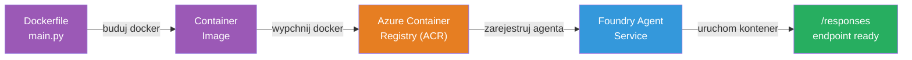
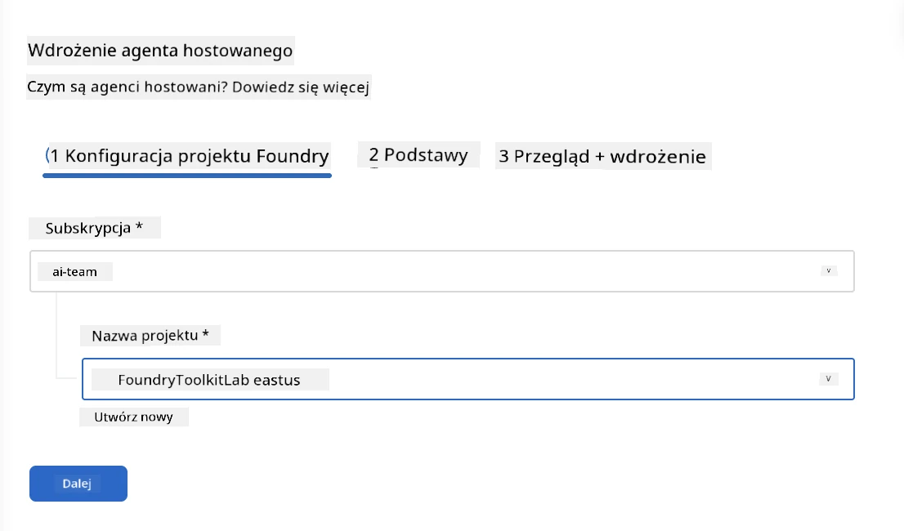
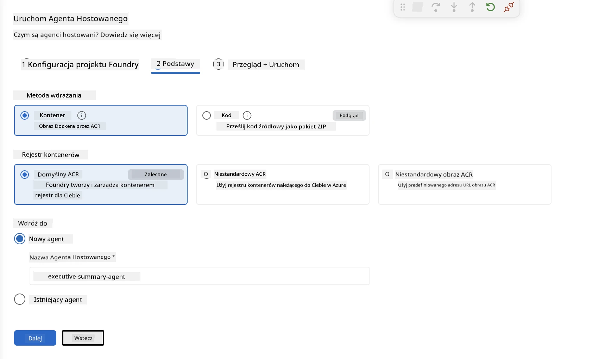
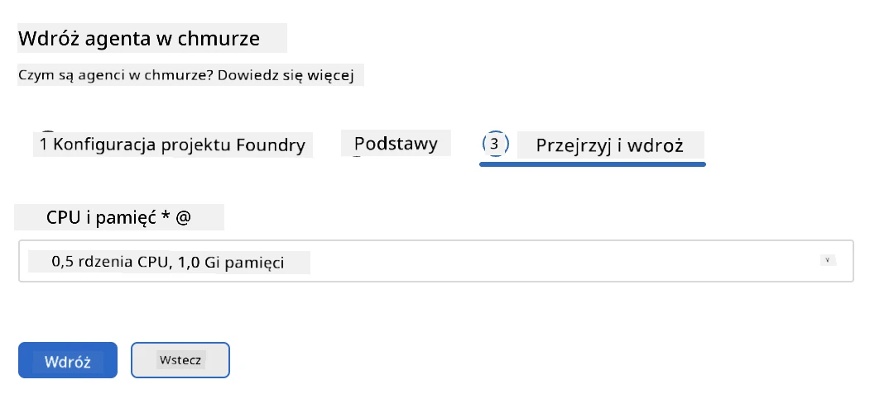
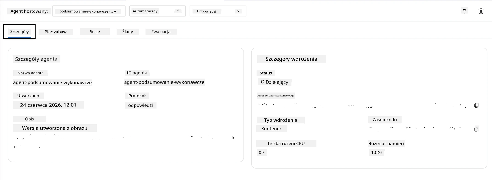

# Moduł 5 - Wdróż do usługi Foundry Agent

⏱️ ~10 min

> ⚠️ **Użytkownicy ścieżki B:** Ten moduł wymaga subskrypcji Foundry. Jeśli korzystasz z Foundry Local, przejdź do [Moduł 07 - Podsumowanie](07-summary.md). Pomyślnie ukończyłeś lokalny proces tworzenia!

W tym module wdrożysz lokalnie przetestowanego agenta do Microsoft Foundry jako **Hosted Agent**. Wdrożenie tworzy obraz kontenera, przesyła go do Azure Container Registry i uruchamia agenta w zarządzanej infrastrukturze Foundry.

### Pipeline wdrożeniowy

---

## Sprawdzenie wymagań wstępnych

Przed wdrożeniem zweryfikuj:

- [ ] Agent przeszedł wszystkie 3 lokalne scenariusze z [Moduł 04](04-test-locally.md)
- [ ] Masz rolę **Azure AI User** na poziomie projektu ([Moduł 01, Przypisywanie RBAC](01-setup.md#deploy-a-model--assign-rbac))
- [ ] Jesteś zalogowany do Azure w VS Code (ikona konta pokazuje twoje imię)

---

## Krok 1: Rozpocznij wdrożenie

### Opcja A: Wdróż z Agent Inspector (zalecane)

Jeśli Agent Inspector jest otwarty (po testowaniu):
1. Kliknij przycisk **Deploy** w prawym górnym rogu (ikona chmury ↑).

### Opcja B: Wdróż z Command Palette

1. Naciśnij `Ctrl+Shift+P` → **Foundry Toolkit: Deploy Hosted Agent**.

---

## Krok 2: Skonfiguruj wdrożenie

Kreator zapyta Cię o:

| Pytanie | Wybór |
|--------|--------|
| **Subskrypcja** | Twoja subskrypcja Azure |
| **Celowy projekt** | Twój projekt Foundry (np. `workshop-agents`) |

Kliknij **next**, aby skonfigurować swojego agenta.

| Pytanie | Wybór |
|--------|--------|
| **Metoda wdrożenia** | Kontener |
| **Rejestr kontenerów** | **Domyślny ACR** (Microsoft Foundry tworzy i zarządza jednym dla Ciebie) |
| **Wdróż do** | Nowy Agent (nazwa, `executive-summary-agent`) |

Kliknij **next**, aby przejrzeć i wdrożyć swojego agenta.

| Pytanie | Wybór |
|--------|--------|
| **CPU i pamięć** | **0.25 rdzeni CPU, 0.5 Gi pamięci** (wystarczające na warsztat) |

---

## Krok 3: Wdróż i monitoruj

1. Kliknij **Deploy**.
2. Obserwuj panel **Output** (wybierz **Microsoft Foundry** z rozwijanego menu).
3. Wdrożenie przechodzi przez następujące etapy:
   - **Budowa Dockera** - tworzy kontener na podstawie twojego Dockerfile
   - **Wypchnięcie Dockera** - przesyła obraz do ACR (1–3 min przy pierwszym wdrożeniu)
   - **Rejestracja agenta** - tworzy hosted agenta w Foundry
   - **Uruchomienie kontenera** - startuje z zarządzaną tożsamością systemową

4. Po zakończeniu pojawi się powiadomienie:
   > **my-agent został pomyślnie wdrożony.** `View logs` `Run agent`

5. Kliknij **Run agent**, aby otworzyć Agent Playground.

### Wartości statusu wdrożenia

| Status | Znaczenie |
|--------|----------|
| **Running** | Kontener gotowy, agent odpowiada |
| **Pending** | Kontener się uruchamia - poczekaj 30–60 sekund |
| **Failed** | Sprawdź logi (patrz rozwiązywanie problemów poniżej) |

---

## Częste błędy przy wdrażaniu

| Błąd | Przyczyna | Naprawa |
|-------|---------|--------|
| Odmowa uprawnień `agents/write` | Brak roli **Azure AI User** na poziomie projektu | [Moduł 01, Przypisywanie RBAC](01-setup.md#deploy-a-model--assign-rbac) |
| Docker nie działa | Docker Desktop nie uruchomiony | Uruchom Docker Desktop → sprawdź `docker info` |
| Autoryzacja ACR | Tożsamość zarządzana nie może pobrać obrazu | Zobacz [Moduł 08 - Rozwiązywanie problemów](08-troubleshooting.md) |

---

### ✅ Punkt kontrolny

- [ ] Wdrożenie zakończone bez błędów
- [ ] Agent widoczny pod **Hosted Agents (Preview)** w pasku bocznym Foundry
- [ ] Status kontenera pokazuje **Running**
- [ ] Otwarta karta Agent Playground pokazująca szczegóły agenta i URL końcowego punktu

---

**Poprzedni:** [04 - Testuj lokalnie](04-test-locally.md) · **Następny:** [06 - Weryfikuj w Playground →](06-verify-in-playground.md)

---

<!-- CO-OP TRANSLATOR DISCLAIMER START -->
**Zastrzeżenie**:
Niniejszy dokument został przetłumaczony za pomocą usługi tłumaczenia AI [Co-op Translator](https://github.com/Azure/co-op-translator). Choć dążymy do dokładności, prosimy pamiętać, że automatyczne tłumaczenia mogą zawierać błędy lub niedokładności. Oryginalny dokument w jego języku źródłowym należy uznawać za autorytatywne źródło. W przypadku informacji krytycznych zalecane jest skorzystanie z profesjonalnego tłumaczenia wykonanego przez człowieka. Nie ponosimy odpowiedzialności za jakiekolwiek nieporozumienia lub błędne interpretacje wynikające z użycia tego tłumaczenia.
<!-- CO-OP TRANSLATOR DISCLAIMER END -->