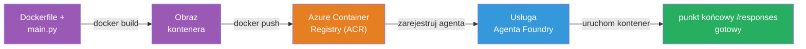
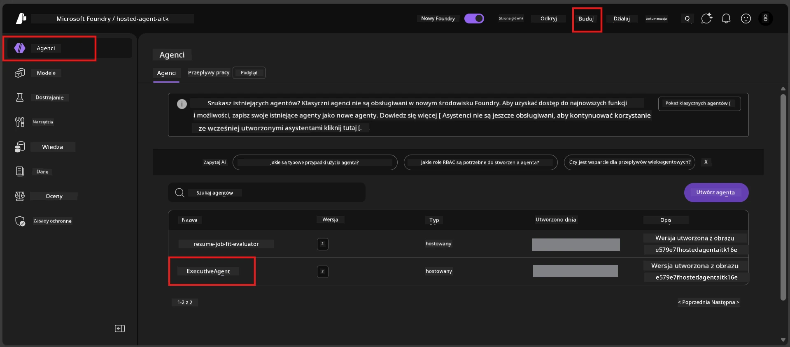

# Moduł 6 - Wdrażanie do Foundry Agent Service

W tym module wdrożysz lokalnie przetestowanego agenta do Microsoft Foundry jako [**Hosted Agent**](https://learn.microsoft.com/azure/foundry/agents/concepts/hosted-agents). Proces wdrażania buduje obraz kontenera Docker z Twojego projektu, wysyła go do [Azure Container Registry (ACR)](https://learn.microsoft.com/azure/container-registry/container-registry-intro) i tworzy wersję hostowanego agenta w [Foundry Agent Service](https://learn.microsoft.com/azure/foundry/agents/overview).

### Pipeline wdrażania


---

## Sprawdzenie wymagań wstępnych

Przed wdrożeniem zweryfikuj każdy z poniższych punktów. Pominięcie ich jest najczęstszą przyczyną niepowodzeń wdrożenia.

1. **Agent przeszedł lokalne testy wstępne:**
   - Ukończyłeś wszystkie 4 testy w [Moduł 5](05-test-locally.md) i agent poprawnie odpowiedział.

2. **Posiadasz rolę [Azure AI User](https://learn.microsoft.com/azure/foundry/concepts/rbac-foundry#built-in-roles):**
   - Rola ta została przypisana w [Moduł 2, krok 3](02-create-foundry-project.md). Jeśli nie jesteś pewien, sprawdź teraz:
   - Portal Azure → Twój zasób **projektu** Foundry → **Kontrola dostępu (IAM)** → zakładka **Przypisania ról** → wyszukaj swoje nazwisko → potwierdź, że jest wymieniona rola **Azure AI User**.

3. **Jesteś zalogowany do Azure w VS Code:**
   - Sprawdź ikonę Konta w lewym dolnym rogu VS Code. Nazwa Twojego konta powinna być widoczna.

4. **(Opcjonalnie) Docker Desktop jest uruchomiony:**
   - Docker jest potrzebny tylko wtedy, gdy rozszerzenie Foundry poprosi Cię o lokalne zbudowanie. W większości przypadków rozszerzenie automatycznie zajmuje się budowaniem kontenerów podczas wdrażania.
   - Jeśli masz zainstalowany Docker, sprawdź, czy działa: `docker info`

---

## Krok 1: Rozpocznij wdrożenie

Masz dwie możliwości wdrożenia - obie prowadzą do tego samego rezultatu.

### Opcja A: Wdrażanie z Agent Inspector (zalecane)

Jeśli uruchamiasz agenta w trybie debugowania (F5) i Agent Inspector jest otwarty:

1. Spójrz w **prawy górny róg** panelu Agent Inspector.
2. Kliknij przycisk **Deploy** (ikona chmury ze strzałką w górę ↑).
3. Otworzy się kreator wdrożenia.

### Opcja B: Wdrażanie z palety poleceń

1. Naciśnij `Ctrl+Shift+P`, aby otworzyć **Paletę poleceń**.
2. Wpisz: **Microsoft Foundry: Deploy Hosted Agent** i wybierz tę opcję.
3. Otworzy się kreator wdrożenia.

---

## Krok 2: Skonfiguruj wdrożenie

Kreator wdrożenia poprowadzi Cię przez konfigurację. Wypełnij każde polecenie:

### 2.1 Wybierz docelowy projekt

1. Rozwinie się lista rozwijana z Twoimi projektami Foundry.
2. Wybierz projekt utworzony w Moduł 2 (np. `workshop-agents`).

### 2.2 Wybierz plik agenta kontenera

1. Zostaniesz poproszony o wybranie punktu wejścia agenta.
2. Wybierz **`main.py`** (Python) - to plik, który kreator wykorzysta do identyfikacji Twojego projektu agenta.

### 2.3 Skonfiguruj zasoby

| Ustawienie | Zalecana wartość | Uwagi |
|------------|------------------|-------|
| **CPU** | `0.25` | Domyślne, wystarczające na warsztaty. Zwiększ dla obciążeń produkcyjnych |
| **Pamięć** | `0.5Gi` | Domyślne, wystarczające na warsztaty |

Wartości te odpowiadają ustawieniom w `agent.yaml`. Możesz zaakceptować domyślne.

---

## Krok 3: Potwierdź i wdroż

1. Kreator wyświetli podsumowanie wdrożenia z:
   - Nazwą docelowego projektu
   - Nazwą agenta (z `agent.yaml`)
   - Plikiem kontenera i zasobami
2. Przejrzyj podsumowanie i kliknij **Potwierdź i wdroż** (lub **Deploy**).
3. Obserwuj postęp w VS Code.

### Co się dzieje podczas wdrożenia (krok po kroku)

Wdrożenie to wieloetapowy proces. Obserwuj panel **Output** w VS Code (wybierz "Microsoft Foundry" z listy), aby śledzić postęp:

1. **Budowanie kontenera Docker** - VS Code buduje obraz kontenera Docker z Twojego `Dockerfile`. Zobaczysz komunikaty dotyczące warstw Dockera:
   ```
   Step 1/6 : FROM python:<version>-slim
   Step 2/6 : WORKDIR /app
   ...
   Successfully built abc123def456
   ```

2. **Wysłanie obrazu Docker** - Obraz jest wysyłany do **Azure Container Registry (ACR)** powiązanego z Twoim projektem Foundry. Może to potrwać 1-3 minuty przy pierwszym wdrożeniu (bazowy obraz ma ponad 100MB).

3. **Rejestracja agenta** - Foundry Agent Service tworzy nowego hostowanego agenta (lub nową wersję, jeśli agent już istnieje). Wykorzystywane są metadane z `agent.yaml`.

4. **Uruchomienie kontenera** - Kontener uruchamia się w zarządzanej infrastrukturze Foundry. Platforma przypisuje [systemowo zarządzaną tożsamość](https://learn.microsoft.com/azure/foundry/agents/concepts/agent-identity) oraz udostępnia punkt końcowy `/responses`.

> **Pierwsze wdrożenie trwa dłużej** (Docker musi wysłać wszystkie warstwy). Kolejne wdrożenia są szybsze dzięki cache'owaniu niezmienionych warstw przez Dockera.

---

## Krok 4: Zweryfikuj status wdrożenia

Po zakończeniu polecenia wdrożenia:

1. Otwórz **Microsoft Foundry** w pasku bocznym klikając ikonę Foundry w pasku aktywności.
2. Rozwiń sekcję **Hosted Agents (Preview)** pod swoim projektem.
3. Powinieneś zobaczyć nazwę swojego agenta (np. `ExecutiveAgent` lub nazwę z `agent.yaml`).
4. **Kliknij na nazwę agenta**, aby ją rozwinąć.
5. Zobaczysz jedną lub więcej **wersji** (np. `v1`).
6. Kliknij wybraną wersję, aby zobaczyć **Szczegóły Kontenera**.
7. Sprawdź pole **Status**:

   | Status | Znaczenie |
   |--------|-----------|
   | **Started** lub **Running** | Kontener działa, a agent jest gotowy |
   | **Pending** | Kontener uruchamia się (poczekaj 30-60 sekund) |
   | **Failed** | Kontener nie uruchomił się poprawnie (sprawdź logi - patrz rozwiązywanie problemów poniżej) |



> **Jeśli status "Pending" trwa dłużej niż 2 minuty:** Kontener może pobierać obraz bazowy. Poczekaj trochę dłużej. Jeśli nadal jest w stanie oczekiwania, sprawdź logi kontenera.

---

## Typowe błędy wdrożenia i ich rozwiązania

### Błąd 1: Odmowa dostępu - `agents/write`

```
Error: lacks the required data action 
Microsoft.CognitiveServices/accounts/AIServices/agents/write 
to perform POST /api/projects/{projectName}/assistants operation.
```

**Przyczyna:** Nie masz przypisanej roli `Azure AI User` na poziomie **projektu**.

**Jak naprawić krok po kroku:**

1. Otwórz [https://portal.azure.com](https://portal.azure.com).
2. W pasku wyszukiwania wpisz nazwę swojego projektu Foundry i kliknij go.
   - **Krytyczne:** Upewnij się, że otwierasz zasób **projektu** (typ: "Microsoft Foundry project"), NIE nadrzędny zasób konta/huba.
3. W lewym menu kliknij **Kontrola dostępu (IAM)**.
4. Kliknij **+ Dodaj** → **Dodaj przypisanie roli**.
5. W zakładce **Rola** wyszukaj [**Azure AI User**](https://learn.microsoft.com/azure/foundry/concepts/rbac-foundry#built-in-roles) i wybierz ją. Kliknij **Dalej**.
6. W zakładce **Członkowie** wybierz **Użytkownik, grupa lub tożsamość usługi**.
7. Kliknij **+ Wybierz członków**, wyszukaj swoje nazwisko/email, wybierz siebie, kliknij **Wybierz**.
8. Kliknij **Przejrzyj + przypisz** → ponownie **Przejrzyj + przypisz**.
9. Poczekaj 1-2 minuty na propagację przypisania ról.
10. **Spróbuj ponownie wdrożyć** z Kroku 1.

> Rola musi być przypisana na **poziomie projektu**, nie tylko na poziomie konta. To najczęstsza przyczyna niepowodzeń wdrożenia.

### Błąd 2: Docker nie działa

```
Error: Docker build failed / Cannot connect to Docker daemon
```

**Naprawa:**
1. Uruchom Docker Desktop (znajdziesz go w menu Start lub na pasku systemowym).
2. Poczekaj na komunikat "Docker Desktop is running" (30-60 sekund).
3. Zweryfikuj poleceniem: `docker info` w terminalu.
4. **Specjalnie dla Windows:** Upewnij się, że w ustawieniach Docker Desktop jest włączony backend WSL 2 → **Ogólne** → **Use the WSL 2 based engine**.
5. Spróbuj ponownie wdrożyć.

### Błąd 3: Autoryzacja w ACR - `AcrPullUnauthorized`

```
Error: AcrPullUnauthorized
```

**Przyczyna:** Zarządzana tożsamość projektu Foundry nie ma dostępu typu pull do rejestru kontenerów.

**Naprawa:**
1. W Azure Portal przejdź do swojego **[Container Registry](https://learn.microsoft.com/azure/container-registry/container-registry-intro)** (znajduje się w tym samym zasobniku co projekt Foundry).
2. Przejdź do **Kontrola dostępu (IAM)** → **Dodaj** → **Dodaj przypisanie roli**.
3. Wybierz rolę **[AcrPull](https://learn.microsoft.com/azure/container-registry/container-registry-roles)**.
4. W sekcji Członkowie wybierz **Tożsamość zarządzaną** → znajdź tożsamość zarządzaną projektu Foundry.
5. **Przejrzyj + przypisz**.

> Zazwyczaj jest to konfigurowane automatycznie przez rozszerzenie Foundry. Jeśli pojawił się ten błąd, może to oznaczać, że automatyczna konfiguracja się nie powiodła.

### Błąd 4: Niezgodność platformy kontenera (Apple Silicon)

Jeśli wdrażasz z Maca z procesorem Apple Silicon (M1/M2/M3), kontener musi być zbudowany dla `linux/amd64`:

```bash
docker build --platform linux/amd64 -t myagent:v1 .
```

> Rozszerzenie Foundry automatycznie obsługuje to dla większości użytkowników.

---

### Punkt kontrolny

- [ ] Komenda wdrożenia zakończyła się bez błędów w VS Code
- [ ] Agent pojawił się w **Hosted Agents (Preview)** w pasku bocznym Foundry
- [ ] Kliknąłeś na agenta → wybrałeś wersję → zobaczyłeś **Szczegóły Kontenera**
- [ ] Status kontenera pokazuje **Started** lub **Running**
- [ ] (Jeśli wystąpiły błędy) Zidentyfikowałeś błąd, zastosowałeś poprawkę i pomyślnie wdrożyłeś ponownie

---

**Poprzedni:** [05 - Testowanie lokalne](05-test-locally.md) · **Następny:** [07 - Weryfikacja na Playground →](07-verify-in-playground.md)

---

<!-- CO-OP TRANSLATOR DISCLAIMER START -->
**Zastrzeżenie**:  
Ten dokument został przetłumaczony za pomocą usługi tłumaczeń AI [Co-op Translator](https://github.com/Azure/co-op-translator). Mimo że dążymy do dokładności, prosimy mieć na uwadze, że automatyczne tłumaczenia mogą zawierać błędy lub niedokładności. Oryginalny dokument w języku źródłowym należy uznać za źródło nadrzędne. W przypadku informacji o znaczeniu krytycznym zaleca się skorzystanie z profesjonalnego tłumaczenia wykonanego przez człowieka. Nie ponosimy odpowiedzialności za jakiekolwiek nieporozumienia lub błędne interpretacje wynikające z korzystania z tego tłumaczenia.
<!-- CO-OP TRANSLATOR DISCLAIMER END -->