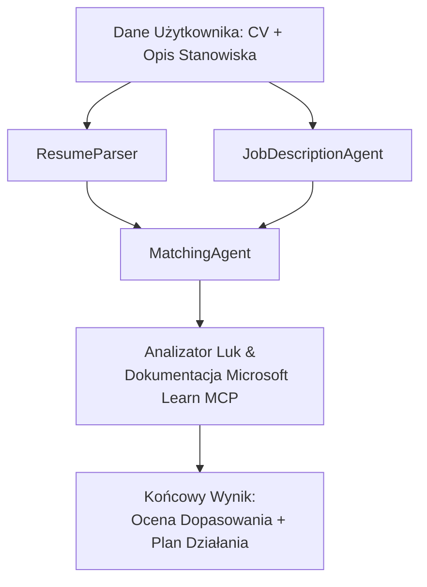

# PersonalCareerCopilot - Resume → Oceniacz Dopasowania do Oferty Pracy

Wieloagentowy workflow, który ocenia, jak dobrze CV pasuje do opisu stanowiska, a następnie generuje spersonalizowaną ścieżkę nauki, aby zamknąć luki.

---

## Agenci

| Agent | Rola | Narzędzia |
|-------|------|-----------|
| **ResumeParser** | Wyodrębnia ustrukturyzowane umiejętności, doświadczenie, certyfikaty z tekstu CV | - |
| **JobDescriptionAgent** | Wyodrębnia wymagane/preferowane umiejętności, doświadczenie, certyfikaty z opisu stanowiska | - |
| **MatchingAgent** | Porównuje profil z wymaganiami → wynik dopasowania (0-100) + dopasowane/brakujące umiejętności | - |
| **GapAnalyzer** | Buduje spersonalizowaną ścieżkę nauki z zasobów Microsoft Learn | `search_microsoft_learn_for_plan` (MCP) |

## Workflow


---

## Szybki start

### 1. Konfiguracja środowiska

```powershell
cd workshop\lab02-multi-agent\PersonalCareerCopilot
python -m venv .venv
.\.venv\Scripts\Activate.ps1          # Windows PowerShell
# source .venv/bin/activate            # macOS / Linux
pip install -r requirements.txt
```

### 2. Konfiguracja poświadczeń

Skopiuj przykład pliku env i wypełnij dane projektu Foundry:

```powershell
cp .env.example .env
```

Edytuj `.env`:

```env
PROJECT_ENDPOINT=https://<your-account>.services.ai.azure.com/api/projects/<your-project>
MODEL_DEPLOYMENT_NAME=gpt-4.1-mini
```

| Wartość | Gdzie ją znaleźć |
|---------|-----------------|
| `PROJECT_ENDPOINT` | Pasek boczny Microsoft Foundry w VS Code → kliknij prawym przyciskiem swojego projektu → **Kopiuj punkt końcowy projektu** |
| `MODEL_DEPLOYMENT_NAME` | Pasek boczny Foundry → rozwiń projekt → **Modele + punkty końcowe** → nazwa deploymentu |

### 3. Uruchom lokalnie

```powershell
python -m debugpy --listen 127.0.0.1:5679 -m agentdev run main.py --verbose --port 8088
```

Lub użyj zadania VS Code: `Ctrl+Shift+P` → **Tasks: Run Task** → **Run Lab02 HTTP Server**.

### 4. Test z Agent Inspector

Otwórz Agent Inspector: `Ctrl+Shift+P` → **Foundry Toolkit: Open Agent Inspector**.

Wklej ten testowy prompt:

```
Resume:
Jane Doe
Senior Software Engineer with 5 years of experience in Python, Django, and AWS.
Built microservices handling 10K+ requests/second. Led a team of 4 developers.
Certifications: AWS Solutions Architect Associate.
Education: B.S. Computer Science, State University.

Job Description:
Senior Cloud Engineer at Contoso Ltd.
Required: Python, Azure, Kubernetes, Terraform, CI/CD pipelines.
Preferred: Go, monitoring (Prometheus/Grafana), cost optimization.
Experience: 5+ years in cloud infrastructure.
Certifications: Azure Solutions Architect Expert preferred.
```

**Oczekiwane:** Wynik dopasowania (0-100), dopasowane/brakujące umiejętności oraz spersonalizowana ścieżka nauki z linkami Microsoft Learn.

### 5. Wdróż do Foundry

`Ctrl+Shift+P` → **Microsoft Foundry: Deploy Hosted Agent** → wybierz swój projekt → potwierdź.

---

## Struktura projektu

```
PersonalCareerCopilot/
├── .env.example        ← Template for environment variables
├── .env                ← Your credentials (git-ignored)
├── agent.yaml          ← Hosted agent definition (name, resources, env vars)
├── Dockerfile          ← Container image for Foundry deployment
├── main.py             ← 4-agent workflow (instructions, MCP tool, WorkflowBuilder)
└── requirements.txt    ← Python dependencies
```

## Kluczowe pliki

### `agent.yaml`

Definiuje hostowanego agenta dla Foundry Agent Service:
- `kind: hosted` - działa jako zarządzany kontener
- `protocols: [responses v1]` - udostępnia endpoint HTTP `/responses`
- `environment_variables` - `PROJECT_ENDPOINT` i `MODEL_DEPLOYMENT_NAME` są wstrzykiwane podczas wdrażania

### `main.py`

Zawiera:
- **Instrukcje agenta** - cztery stałe `*_INSTRUCTIONS`, po jednej na agenta
- **Narzędzie MCP** - `search_microsoft_learn_for_plan()` wywołuje `https://learn.microsoft.com/api/mcp` przez Streamable HTTP
- **Tworzenie agenta** - menadżer kontekstu `create_agents()` korzystający z `AzureAIAgentClient.as_agent()`
- **Graf workflow** - `create_workflow()` wykorzystuje `WorkflowBuilder` do połączenia agentów wzorcem fan-out/fan-in/sekwencyjnym
- **Uruchomienie serwera** - `from_agent_framework(agent).run_async()` na porcie 8088

### `requirements.txt`

| Pakiet | Wersja | Cel |
|---------|--------|-----|
| `agent-framework-azure-ai` | `1.0.0rc3` | Integracja Azure AI dla Microsoft Agent Framework |
| `agent-framework-core` | `1.0.0rc3` | Podstawowe środowisko uruchomieniowe (zawiera WorkflowBuilder) |
| `azure-ai-agentserver-agentframework` | `1.0.0b16` | Środowisko uruchomieniowe hostowanego serwera agentów |
| `azure-ai-agentserver-core` | `1.0.0b16` | Podstawowe abstrakcje serwera agentów |
| `debugpy` | najnowsza | Debugowanie Pythona (F5 w VS Code) |
| `agent-dev-cli` | `--pre` | Lokalne CLI dev + backend Agent Inspector |

---

## Rozwiązywanie problemów

| Problem | Rozwiązanie |
|---------|-------------|
| `RuntimeError: Missing required environment variable(s)` | Utwórz `.env` z `PROJECT_ENDPOINT` i `MODEL_DEPLOYMENT_NAME` |
| `ModuleNotFoundError: No module named 'agent_framework'` | Aktywuj venv i uruchom `pip install -r requirements.txt` |
| Brak linków Microsoft Learn w wyniku | Sprawdź połączenie internetowe pod `https://learn.microsoft.com/api/mcp` |
| Tylko 1 karta luki (przycięta) | Zweryfikuj, czy `GAP_ANALYZER_INSTRUCTIONS` zawiera blok `CRITICAL:` |
| Port 8088 zajęty | Zatrzymaj inne serwery: `netstat -ano \| findstr :8088` |

Szczegółowe informacje o rozwiązywaniu problemów znajdziesz w [Moduł 8 - Rozwiązywanie problemów](../docs/08-troubleshooting.md).

---

**Pełny przewodnik:** [Lab 02 Docs](../docs/README.md) · **Powrót do:** [Lab 02 README](../README.md) · [Strona warsztatów](../../../README.md)

---

<!-- CO-OP TRANSLATOR DISCLAIMER START -->
**Zastrzeżenie**:  
Dokument ten został przetłumaczony przy użyciu usługi tłumaczenia AI [Co-op Translator](https://github.com/Azure/co-op-translator). Chociaż dążymy do dokładności, prosimy pamiętać, że tłumaczenia automatyczne mogą zawierać błędy lub niedokładności. Za źródło autorytatywne należy uznać oryginalny dokument w jego języku źródłowym. W przypadku informacji krytycznych zalecane jest skorzystanie z profesjonalnego tłumaczenia wykonanego przez człowieka. Nie ponosimy odpowiedzialności za jakiekolwiek nieporozumienia lub błędne interpretacje wynikające z korzystania z tego tłumaczenia.
<!-- CO-OP TRANSLATOR DISCLAIMER END -->