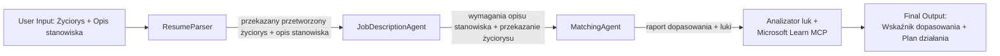

# PersonalCareerCopilot - Oceniacz dopasowania CV do oferty pracy

Aplikacja wieloagentowa z orientacją na przepływ pracy, która ocenia, jak dobrze CV odpowiada opisowi stanowiska, a następnie generuje spersonalizowaną mapę nauki do uzupełnienia luk.

---

## Agenci

| Agent | Rola | Narzędzia |
|-------|------|-------|
| **ResumeParser** | Wydobywa ustrukturyzowane umiejętności, doświadczenie, certyfikaty z tekstu CV | - |
| **JobDescriptionAgent** | Wydobywa wymagane/preferowane umiejętności, doświadczenie, certyfikaty z opisu stanowiska | - |
| **MatchingAgent** | Porównuje profil z wymaganiami → wynik dopasowania (0-100) + dopasowane/brakujące umiejętności | - |
| **GapAnalyzer** | Buduje spersonalizowaną mapę nauki z zasobami Microsoft Learn | `search_microsoft_learn_for_plan` (MCP) |

## Przepływ pracy


```mermaid
flowchart LR
    UserInput["User Input: Życiorys + Opis stanowiska"] --> ResumeParser
    ResumeParser -- "przekazany przetworzony życiorys + opis stanowiska" --> JobDescriptionAgent
    JobDescriptionAgent -- "wymagania opisu stanowiska + przekazanie życiorysu" --> MatchingAgent
    MatchingAgent -- "raport dopasowania + luki" --> GapAnalyzerMCP["Analizator luk +\nMicrosoft Learn MCP"]
    GapAnalyzerMCP --> FinalOutput["Final Output:\nWskaźnik dopasowania + Plan działania"]
```

---

## Szybki start

### 1. Skonfiguruj środowisko

Ten folder jest przykładową implementacją do Lab 02 opartego na przepływie pracy. `main.py` wykorzystuje istniejące bloki promptów oraz `WorkflowBuilder` do połączenia czterech agentów.

```powershell
cd workshop\lab02-multi-agent\PersonalCareerCopilot
python -m venv .venv
.\.venv\Scripts\Activate.ps1          # Windows PowerShell
# source .venv/bin/activate            # macOS / Linux
pip install -r requirements.txt
```

### 2. Skonfiguruj poświadczenia

Utwórz plik `.env` w tym folderze:

```powershell
copy .env .env.bak 2>$null; echo $null > .env
```

Edytuj `.env`:

```env
FOUNDRY_PROJECT_ENDPOINT=https://<your-account>.services.ai.azure.com/api/projects/<your-project>
AZURE_AI_MODEL_DEPLOYMENT_NAME=gpt-4.1-mini
```

| Wartość | Gdzie ją znaleźć |
|-------|------------------|
| `FOUNDRY_PROJECT_ENDPOINT` | Pasek boczny Foundry Toolkit → kliknij prawym na projekt → **Kopiuj endpoint projektu** |
| `AZURE_AI_MODEL_DEPLOYMENT_NAME` | Pasek boczny Foundry → rozwiń projekt → **Modele + endpointy** → nazwa wdrożenia |

### 3. Uruchom lokalnie

```powershell
python -m debugpy --listen 127.0.0.1:5679 main.py --port 8088
```

Lub użyj zadania VS Code: `Ctrl+Shift+P` → **Zadania: Uruchom zadanie** → **Uruchom serwer HTTP agenta**.

Aby debugować za pomocą F5, użyj **Debuguj lokalny serwer HTTP agenta**.

### 4. Testuj za pomocą Agent Inspector

Otwórz Agent Inspector: `Ctrl+Shift+P` → **Foundry Toolkit: Otwórz Agent Inspector**.

Wklej ten testowy prompt:

```
Resume:
Jane Doe
Senior Software Engineer with 5 years of experience in Python, Django, and AWS.
Built microservices handling 10K+ requests/second. Led a team of 4 developers.
Certifications: AWS Solutions Architect Associate.
Education: B.S. Computer Science, State University.

Job Description:
Senior Cloud Engineer at Contoso Ltd.
Required: Python, Azure, Kubernetes, Terraform, CI/CD pipelines.
Preferred: Go, monitoring (Prometheus/Grafana), cost optimization.
Experience: 5+ years in cloud infrastructure.
Certifications: Azure Solutions Architect Expert preferred.
```

**Oczekiwane:** Wynik dopasowania (0-100), dopasowane/brakujące umiejętności oraz spersonalizowana mapa nauki z adresami URL Microsoft Learn.

### 5. Wdróż do Foundry

`Ctrl+Shift+P` → **Foundry Toolkit: Wdróż hostowanego agenta** → wybierz projekt → potwierdź.

---

## Struktura projektu

```
PersonalCareerCopilot/
├── .env                ← Your credentials (git-ignored)
├── agent.yaml          ← Hosted agent definition (name, resources, env vars)
├── Dockerfile          ← Container image for Foundry deployment
├── main.py             ← 4-agent workflow (instructions, MCP tool, WorkflowBuilder)
└── requirements.txt    ← Python dependencies
```

## Kluczowe pliki

### `agent.yaml`

Definiuje hostowanego agenta dla Foundry Agent Service:
- `kind: hosted` - działa jako zarządzany kontener
- `protocols` - protokół `responses` w wersji `1.0.0`, udostępniający endpoint HTTP `/responses`
- `environment_variables` - `AZURE_AI_MODEL_DEPLOYMENT_NAME` jest tutaj deklarowany, `FOUNDRY_PROJECT_ENDPOINT` jest automatycznie wstrzykiwany podczas wdrożenia

### `main.py`

Zawiera:
- **Instrukcje agenta** - cztery stałe `*_INSTRUCTIONS`, po jednej na agenta
- **Narzędzie MCP** - `search_microsoft_learn_for_plan()` wywołuje `https://learn.microsoft.com/api/mcp` przez Streamable HTTP
- **Tworzenie agentów** - cztery instancje `Agent()` + `AgentExecutor()` współdzielące jeden `FoundryChatClient`
- **Graf przepływu pracy** - `WorkflowBuilder` łączy agentów w sekwencyjną pipeline: ResumeParser → JD Agent → MatchingAgent → GapAnalyzer
- **Uruchomienie serwera** - `ResponsesHostServer` działa na porcie 8088

### `requirements.txt`

| Pakiet | Przeznaczenie |
|---------|----------|
| `agent-framework-foundry` | Podstawowe środowisko wykonawcze: `Agent`, `AgentExecutor`, `WorkflowBuilder`, `@tool`, `FoundryChatClient` |
| `agent-framework-foundry-hosting` | `ResponsesHostServer` + integracja z hostingiem Foundry |
| `mcp<2,>=1.24.0` | Klient MCP dla GapAnalyzer (`streamable_http_client`) |
| `debugpy` | Debugowanie Pythona (F5 w VS Code) |

---

## Rozwiązywanie problemów

| Problem | Rozwiązanie |
|-------|-----|
| `KeyError: 'FOUNDRY_PROJECT_ENDPOINT'` lub `KeyError: 'AZURE_AI_MODEL_DEPLOYMENT_NAME'` | Utwórz `.env` z ustawionymi `FOUNDRY_PROJECT_ENDPOINT` i `AZURE_AI_MODEL_DEPLOYMENT_NAME` |
| `ModuleNotFoundError: No module named 'agent_framework'` | Aktywuj virtualenv i uruchom `pip install -r requirements.txt` |
| Brak URL-ów Microsoft Learn w wyniku | Sprawdź połączenie internetowe do `https://learn.microsoft.com/api/mcp` |
| Tylko jedna karta luk (przycinana) | Sprawdź, czy `GAP_ANALYZER_INSTRUCTIONS` zawiera blok `CRITICAL:` |
| Port 8088 jest zajęty | Zatrzymaj inne serwery: `netstat -ano \| findstr :8088` |

Szczegółowe rozwiązywanie problemów w [Moduł 8 - Rozwiązywanie problemów](../docs/08-troubleshooting.md).

---

**Pełny przewodnik:** [Dokumentacja Lab 02](../docs/README.md) · **Wróć do:** [README Lab 02](../README.md) · [Strona warsztatów](../../../README.md)

---

<!-- CO-OP TRANSLATOR DISCLAIMER START -->
**Zastrzeżenie**:
Niniejszy dokument został przetłumaczony za pomocą usługi tłumaczenia AI [Co-op Translator](https://github.com/Azure/co-op-translator). Choć dążymy do dokładności, prosimy pamiętać, że automatyczne tłumaczenia mogą zawierać błędy lub niedokładności. Oryginalny dokument w jego języku źródłowym należy uznawać za autorytatywne źródło. W przypadku informacji krytycznych zalecane jest skorzystanie z profesjonalnego tłumaczenia wykonanego przez człowieka. Nie ponosimy odpowiedzialności za jakiekolwiek nieporozumienia lub błędne interpretacje wynikające z użycia tego tłumaczenia.
<!-- CO-OP TRANSLATOR DISCLAIMER END -->