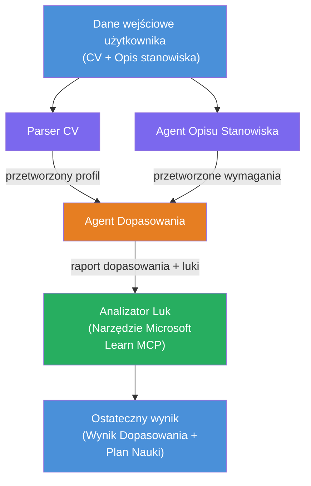

# Lab 02 - Workflow Wieloagentowy: Oceniacz Dopasowania CV do Oferty Pracy

---

## Co zbudujesz

**Oceniacz Dopasowania CV do Oferty Pracy** - workflow wieloagentowy, w którym cztery wyspecjalizowane agenty współpracują, aby ocenić, jak dobrze CV kandydata pasuje do opisu stanowiska, a następnie wygenerować spersonalizowaną ścieżkę nauki pozwalającą zlikwidować braki.

### Agenty

| Agent | Rola |
|-------|------|
| **Resume Parser** | Wydobywa ustrukturyzowane umiejętności, doświadczenie, certyfikaty z tekstu CV |
| **Job Description Agent** | Wydobywa wymagane/preferowane umiejętności, doświadczenie, certyfikaty z opisu stanowiska |
| **Matching Agent** | Porównuje profil z wymaganiami → wynik dopasowania (0-100) + dopasowane/brakujące umiejętności |
| **Gap Analyzer** | Tworzy spersonalizowaną ścieżkę nauki z zasobami, harmonogramem i szybkimi projektami |

### Przebieg demo

Prześlij **CV + opis stanowiska** → otrzymaj **wynik dopasowania + brakujące umiejętności** → otrzymaj **spersonalizowaną ścieżkę nauki**.

### Architektura workflow

> Fioletowy = agenty działające równolegle | Pomarańczowy = punkt agregacji | Zielony = agent końcowy z narzędziami. Zobacz [Moduł 1 - Zrozumienie architektury](docs/01-understand-multi-agent.md) oraz [Moduł 4 - Wzorce orkiestracji](docs/04-orchestration-patterns.md) dla szczegółowych diagramów i przepływu danych.

### Omówione tematy

- Tworzenie workflow wieloagentowego przy użyciu **WorkflowBuilder**
- Definiowanie ról agentów i przepływu orkiestracji (równoległy + sekwencyjny)
- Wzorce komunikacji między agentami
- Lokalny test z Agent Inspector
- Wdrażanie workflow wieloagentowego do Foundry Agent Service

---

## Wymagania wstępne

Najpierw ukończ Lab 01:

- [Lab 01 - Pojedynczy Agent](../lab01-single-agent/README.md)

---

## Zacznij

Pełne instrukcje konfiguracji, przegląd kodu i polecenia testowe znajdziesz w:

- [Lab 2 Docs - Wymagania wstępne](docs/00-prerequisites.md)
- [Lab 2 Docs - Pełna ścieżka nauki](docs/README.md)
- [Przewodnik uruchomienia PersonalCareerCopilot](PersonalCareerCopilot/README.md)

## Wzorce orkiestracji (alternatywy agentowe)

Lab 2 zawiera domyślny przepływ **równoległy → agregator → planista**, a dokumentacja opisuje także alternatywne wzorce demonstrujące silniejsze zachowania agentowe:

- **Fan-out/Fan-in z ważonym konsensusem**
- **Przejście recenzenta/krytyka przed ostateczną ścieżką**
- **Warunkowy router** (wybór ścieżki na podstawie wyniku dopasowania i brakujących umiejętności)

Zobacz [docs/04-orchestration-patterns.md](docs/04-orchestration-patterns.md).

---

**Poprzedni:** [Lab 01 - Pojedynczy Agent](../lab01-single-agent/README.md) · **Powrót do:** [Strona warsztatów](../../README.md)

---

<!-- CO-OP TRANSLATOR DISCLAIMER START -->
**Zastrzeżenie**:  
Niniejszy dokument został przetłumaczony za pomocą automatycznej usługi tłumaczeniowej AI [Co-op Translator](https://github.com/Azure/co-op-translator). Mimo że dążymy do jak największej dokładności, prosimy mieć na uwadze, że tłumaczenia automatyczne mogą zawierać błędy lub nieścisłości. Oryginalny dokument w języku źródłowym powinien być uznawany za autorytatywne źródło. W przypadku informacji o kluczowym znaczeniu zaleca się skorzystanie z profesjonalnego, ludzkiego tłumaczenia. Nie ponosimy odpowiedzialności za jakiekolwiek nieporozumienia lub błędne interpretacje wynikające z korzystania z tego tłumaczenia.
<!-- CO-OP TRANSLATOR DISCLAIMER END -->