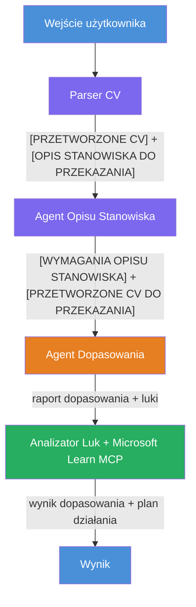

# Laboratorium 02 - Workflow Wieloagentowy: Oceniacz Dopasowania CV do Oferty Pracy

## Przegląd

W tym praktycznym laboratorium zbudujesz **aplikację wieloagentową zorientowaną na workflow** przy użyciu Foundry Toolkit w VS Code i wdrożysz ją w Microsoft Foundry Agent Service.

**Co zbudujesz:** Oceniacz Dopasowania CV do Oferty, który analizuje CV i opis stanowiska, ocenia dopasowanie oraz tworzy spersonalizowaną ścieżkę nauki korzystając z zasobów Microsoft Learn.

---

## Architektura

```mermaid
flowchart TD
    A["Wejście użytkownika"] --> B["Parser CV"]
    B -->|"[PRZETWORZONE CV] + [OPIS STANOWISKA DO PRZEKAZANIA]"| C["Agent Opisu Stanowiska"]
    C -->|"[WYMAGANIA OPISU STANOWISKA] + [PRZETWORZONE CV DO PRZEKAZANIA]"| D["Agent Dopasowania"]
    D -->|raport dopasowania + luki| E["Analizator Luk + Microsoft Learn MCP"]
    E -->|wynik dopasowania + plan działania| F["Wynik"]

    style A fill:#4A90D9,color:#fff
    style B fill:#7B68EE,color:#fff
    style C fill:#7B68EE,color:#fff
    style D fill:#E67E22,color:#fff
    style E fill:#27AE60,color:#fff
    style F fill:#4A90D9,color:#fff
```

**Jak to działa:**
1. Użytkownik wkleja CV oraz opis stanowiska.
2. **ResumeParser** analizuje CV i kopiuje opis stanowiska dokładnie do sekcji `[JOB DESCRIPTION PASS-THROUGH]`.
3. **JD Agent** wyciąga ustrukturyzowane wymagania z przekazu, a następnie przekazuje dalej `[PARSED RESUME]` jako `[PARSED RESUME PASS-THROUGH]`.
4. **MatchingAgent** porównuje `[PARSED RESUME PASS-THROUGH]` z `[JD REQUIREMENTS]` i generuje wynik dopasowania.
5. **GapAnalyzer** przekształca braki w praktyczną ścieżkę nauki i pobiera prawdziwe linki Microsoft Learn za pomocą MCP.

---

## Wymagania wstępne

Najpierw ukończ Laboratorium 01:

- [Laboratorium 01 - Pojedynczy Agent](../lab01-single-agent/README.md)

---

## Część 1: Przeczytaj moduły w kolejności

Pełna ścieżka nauki znajduje się w:

- [Dokumentacja Laboratorium 2 - Wymagania wstępne](docs/00-prerequisites.md)
- [Dokumentacja Laboratorium 2 - Pełna ścieżka nauki](docs/README.md)
- [Przewodnik uruchomienia PersonalCareerCopilot](PersonalCareerCopilot/README.md)

---

## Część 2: Zbuduj i przetestuj workflow

1. Użyj kreatora Foundry Toolkit, aby zainicjować projekt oparty na workflow.
2. Skopiuj bloki promptów i diagram workflow z `PersonalCareerCopilot/main.py` do swojego workspace.
3. Uruchom lokalnie z Agent Inspector i zweryfikuj czterech agentów oraz narzędzie MCP.
4. Wdróż hostowanego agenta w Foundry po pomyślnym teście lokalnym.

---

## Wzorce orkiestracji

Laboratorium 02 obejmuje domyślny przepływ **fan-out → fan-in → sekwencyjny**, a dokumentacja opisuje także alternatywne wzorce orkiestracji do eksperymentów.

- **Fan-out/Fan-in z ważonym konsensusem**
- **Przejście recenzenta/krytyka przed finalną ścieżką nauki**
- **Router warunkowy** oparty na wyniku dopasowania i brakujących umiejętnościach

Zobacz [docs/04-orchestration-patterns.md](docs/04-orchestration-patterns.md).

---

**Poprzednie:** [Laboratorium 01 - Pojedynczy Agent](../lab01-single-agent/README.md) · **Powrót do:** [Strony Głównej Warsztatu](../../README.md)

---

<!-- CO-OP TRANSLATOR DISCLAIMER START -->
**Zastrzeżenie**:
Niniejszy dokument został przetłumaczony za pomocą usługi tłumaczenia AI [Co-op Translator](https://github.com/Azure/co-op-translator). Choć dążymy do dokładności, prosimy pamiętać, że automatyczne tłumaczenia mogą zawierać błędy lub niedokładności. Oryginalny dokument w jego języku źródłowym należy uznawać za autorytatywne źródło. W przypadku informacji krytycznych zalecane jest skorzystanie z profesjonalnego tłumaczenia wykonanego przez człowieka. Nie ponosimy odpowiedzialności za jakiekolwiek nieporozumienia lub błędne interpretacje wynikające z użycia tego tłumaczenia.
<!-- CO-OP TRANSLATOR DISCLAIMER END -->