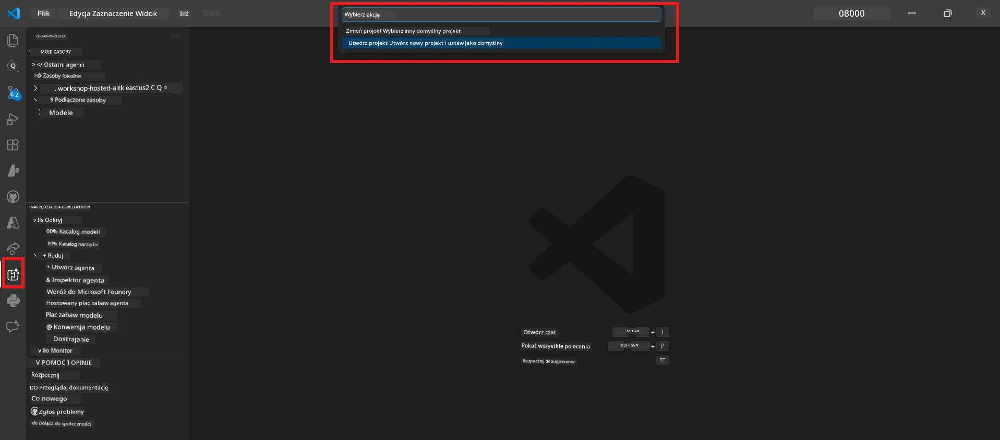

# Module 0 - Wymagania wstępne

Przed rozpoczęciem Laboratorium 02 upewnij się, że masz wykonane następujące kroki. To laboratorium bazuje bezpośrednio na Laboratorium 01 – nie pomijaj go.

---

## 1. Ukończ Laboratorium 01

Laboratorium 02 zakłada, że już:

- [x] Ukończyłeś wszystkie 8 modułów z [Laboratorium 01 - Pojedynczy Agent](../../lab01-single-agent/README.md)
- [x] Pomyślnie wdrożyłeś pojedynczego agenta w Foundry Agent Service
- [x] Zweryfikowałeś działanie agenta zarówno w lokalnym Agent Inspector, jak i w Foundry Playground

Jeśli nie ukończyłeś Laboratorium 01, wróć i dokończ je teraz: [Dokumentacja Laboratorium 01](../../lab01-single-agent/docs/00-prerequisites.md)

---

## 2. Zweryfikuj istniejące środowisko

Wszystkie narzędzia z Laboratorium 01 powinny być nadal zainstalowane i działać. Przeprowadź szybkie testy:

### 2.1 Azure CLI

```powershell
az account show --query "{name:name, id:id}" --output table
```

Oczekiwane: Pokaże nazwę i ID twojej subskrypcji. Jeśli to nie działa, uruchom [`az login`](https://learn.microsoft.com/cli/azure/authenticate-azure-cli-interactively).

### 2.2 Rozszerzenia VS Code

1. Naciśnij `Ctrl+Shift+P` → wpisz **"Microsoft Foundry"** → potwierdź, że widzisz polecenia (np. `Microsoft Foundry: Create a New Hosted Agent`).
2. Naciśnij `Ctrl+Shift+P` → wpisz **"Foundry Toolkit"** → potwierdź, że widzisz polecenia (np. `Foundry Toolkit: Open Agent Inspector`).

### 2.3 Projekt i model Foundry

1. Kliknij ikonę **Microsoft Foundry** na pasku aktywności VS Code.
2. Potwierdź, że twój projekt jest na liście (np. `workshop-agents`).
3. Rozwiń projekt → zweryfikuj, czy istnieje wdrożony model (np. `gpt-4.1-mini`) ze statusem **Succeeded**.

> **Jeśli wdrożenie twojego modelu wygasło:** Niektóre wdrożenia w darmowym planie wygasają automatycznie. Wdroż ponownie z [Model Catalog](https://learn.microsoft.com/azure/foundry/foundry-models/concepts/models-sold-directly-by-azure) (`Ctrl+Shift+P` → **Microsoft Foundry: Open Model Catalog**).



### 2.4 Role RBAC

Zweryfikuj, że masz rolę **Azure AI User** w swoim projekcie Foundry:

1. [Azure Portal](https://portal.azure.com) → zasób twojego projektu Foundry → **Kontrola dostępu (IAM)** → zakładka **[Przypisania ról](https://learn.microsoft.com/azure/foundry/concepts/rbac-foundry)**.
2. Wyszukaj swoje imię → potwierdź, że widnieje **[Azure AI User](https://aka.ms/foundry-ext-project-role)**.

---

## 3. Zrozum koncepcje wieloagentowe (nowość w Laboratorium 02)

Laboratorium 02 wprowadza koncepcje, które nie były omawiane w Laboratorium 01. Przeczytaj je przed kontynuacją:

### 3.1 Czym jest przepływ pracy wieloagentowy?

Zamiast jeden agent obsługujący wszystko, **przepływ pracy wieloagentowy** dzieli zadania pomiędzy wielu wyspecjalizowanych agentów. Każdy agent ma:

- Własne **instrukcje** (prompt systemowy)
- Własną **rolę** (za co jest odpowiedzialny)
- Opcjonalne **narzędzia** (funkcje, które może wywołać)

Agenci komunikują się poprzez **graf orkiestracji**, który definiuje przepływ danych między nimi.

### 3.2 WorkflowBuilder

Klasa [`WorkflowBuilder`](https://learn.microsoft.com/agent-framework/workflows/agents-in-workflows) z `agent_framework` to komponent SDK, który łączy agentów:

```python
from agent_framework import WorkflowBuilder

workflow = (
    WorkflowBuilder(
        name="MyWorkflow",
        start_executor=agent_a,
        output_executors=[agent_d],
    )
    .add_edge(agent_a, agent_b)
    .add_edge(agent_a, agent_c)
    .add_edge(agent_b, agent_d)
    .add_edge(agent_c, agent_d)
    .build()
)
```

- **`start_executor`** - Pierwszy agent, który otrzymuje dane wejściowe od użytkownika
- **`output_executors`** - Agent(y), którego wyjście staje się ostateczną odpowiedzią
- **`add_edge(source, target)`** - Definiuje, że `target` otrzymuje wyjście z `source`

### 3.3 Narzędzia MCP (Model Context Protocol)

Laboratorium 02 używa **narzędzia MCP**, które wywołuje API Microsoft Learn, aby pobrać zasoby edukacyjne. [MCP (Model Context Protocol)](https://modelcontextprotocol.io/introduction) to ustandaryzowany protokół łączący modele AI z zewnętrznymi źródłami danych i narzędziami.

| Termin | Definicja |
|------|-----------|
| **MCP server** | Usługa udostępniająca narzędzia/zasoby za pomocą protokołu [MCP](https://learn.microsoft.com/azure/foundry/agents/how-to/tools/model-context-protocol) |
| **MCP client** | Twój kod agenta łączący się z serwerem MCP i wywołujący jego narzędzia |
| **[Streamable HTTP](https://learn.microsoft.com/agent-framework/agents/tools/hosted-mcp-tools)** | Metoda transportu służąca do komunikacji z serwerem MCP |

### 3.4 Czym Laboratorium 02 różni się od Laboratorium 01

| Aspekt | Laboratorium 01 (Pojedynczy agent) | Laboratorium 02 (Wieloagentowy) |
|--------|----------------------|---------------------|
| Agenci | 1 | 4 (wyspecjalizowane role) |
| Orkiestracja | Brak | WorkflowBuilder (równoległa + sekwencyjna) |
| Narzędzia | Opcjonalna funkcja `@tool` | Narzędzie MCP (wywołanie zewnętrznego API) |
| Złożoność | Prosty prompt → odpowiedź | CV + opis stanowiska → ocena dopasowania → plan działania |
| Przepływ kontekstu | Bezpośredni | Przekazywanie między agentami |

---

## 4. Struktura repozytorium warsztatowego dla Laboratorium 02

Upewnij się, gdzie znajdują się pliki Laboratorium 02:

```
workshop/
└── lab02-multi-agent/
    ├── README.md                       ← Lab overview
    ├── docs/                           ← You are here
    │   ├── README.md                   ← Learning path index
    │   ├── 00-prerequisites.md         ← This file
    │   ├── 01-understand-multi-agent.md
    │   ├── ...
    │   └── 08-troubleshooting.md
    └── PersonalCareerCopilot/          ← The agent project
        ├── agent.yaml                  ← Agent definition
        ├── main.py                     ← 4-agent workflow code
        ├── Dockerfile                  ← Container configuration
        └── requirements.txt            ← Python dependencies
```

---

### Punkt kontrolny

- [ ] Laboratorium 01 jest całkowicie ukończone (wszystkie 8 modułów, agent wdrożony i zweryfikowany)
- [ ] `az account show` zwraca twoją subskrypcję
- [ ] Rozszerzenia Microsoft Foundry i Foundry Toolkit są zainstalowane i działają
- [ ] Projekt Foundry ma wdrożony model (np. `gpt-4.1-mini`)
- [ ] Masz rolę **Azure AI User** w projekcie
- [ ] Przeczytałeś sekcję o koncepcjach wieloagentowych powyżej i rozumiesz WorkflowBuilder, MCP oraz orkiestrację agentów

---

**Następny krok:** [01 - Zrozumienie architektury wieloagentowej →](01-understand-multi-agent.md)

---

<!-- CO-OP TRANSLATOR DISCLAIMER START -->
**Zastrzeżenie**:
Niniejszy dokument został przetłumaczony za pomocą usługi tłumaczenia AI [Co-op Translator](https://github.com/Azure/co-op-translator). Chociaż staramy się o dokładność, prosimy pamiętać, że tłumaczenia automatyczne mogą zawierać błędy lub niedokładności. Oryginalny dokument w języku źródłowym powinien być uważany za autorytatywne źródło. W przypadku informacji krytycznych zaleca się profesjonalne tłumaczenie wykonane przez człowieka. Nie ponosimy odpowiedzialności za wszelkie nieporozumienia lub błędne interpretacje wynikające z korzystania z tego tłumaczenia.
<!-- CO-OP TRANSLATOR DISCLAIMER END -->