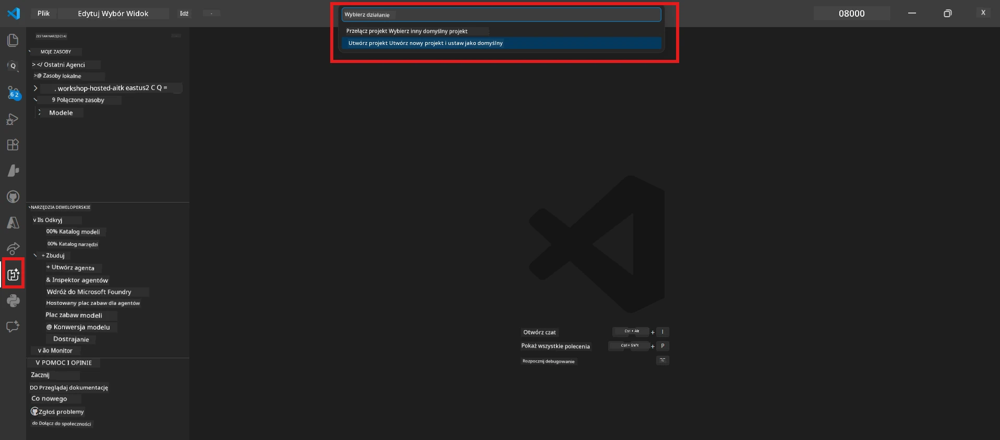

# Moduł 0 - Wprowadzenie

⏱️ ~10 min

> [!WARNING]
> **Podgląd i ograniczenia:** [Hostowani agenci](https://learn.microsoft.com/azure/foundry/agents/concepts/hosted-agents) są obecnie w **publicznym podglądzie** - niezalecane do obciążenia produkcyjnego. Niektóre funkcje pokazane w tym warsztacie mogą się zmienić w miarę dojrzewania usługi do wersji GA.

## Co zbudujesz

W tym laboratorium rozszerzasz umiejętności pojedynczego agenta z Laboratorium 01, aby zbudować **wielu agentów przepływ pracy** - Oceniacz dopasowania CV do oferty pracy.

Wklejasz **CV** i **opis stanowiska**. Czterech wyspecjalizowanych agentów przetwarza dane kolejno, a następnie zwraca:
- Wynik dopasowania (0–100 wraz z rozpiską punktacji)
- Listę braków w umiejętnościach i certyfikatach
- Spersonalizowaną mapę nauki z rzeczywistymi linkami Microsoft Learn dla każdego braku

**Przepływ pracy używa:**
- **Microsoft Agent Framework** - `WorkflowBuilder` do sekwencyjnej orkiestracji potoku
- **Foundry Toolkit dla VS Code** - stworzenie szkieletu, lokalne testy, wdrożenie
- **Modelu AI** (np. `gpt-4.1-mini`) - używany przez wszystkich czterech agentów
- **Microsoft Learn MCP server** - dostarcza prawdziwe linki do zasobów edukacyjnych dla każdego braku umiejętności

---

## Wybierz swoją ścieżkę

> ⚠️ **Kontynuuj tą samą ścieżką, którą używałeś w Laboratorium 01.**

<details open>
<summary><strong>🅰️ Ścieżka A - chmura Azure (wymaga subskrypcji Azure)</strong></summary>

| | Szczegóły |
|---|---|
| **Dla kogo?** | Ukończyłeś Laboratorium 01 używając subskrypcji Azure |
| **Model** | Azure OpenAI przez Foundry (np. `gpt-4.1-mini`) |
| **Objęte moduły** | Wszystkie moduły (00–09) |
| **Wdrożenie do chmury?** | ✅ Tak - pełne wdrożenie end-to-end |

</details>

<details open>
<summary><strong>🅱️ Ścieżka B - Foundry Local (nie wymaga subskrypcji Azure)</strong></summary>

| | Szczegóły |
|---|---|
| **Dla kogo?** | Ukończyłeś Laboratorium 01 używając Foundry Local |
| **Model** | Foundry Local (darmowy, działa na twoim komputerze) |
| **Objęte moduły** | Moduły 00–05 (pomija 06–07 - wdrożenie i weryfikacja w chmurze) |
| **Wdrożenie do chmury?** | ❌ Nie - tylko testowanie lokalne przez Agent Inspector |

</details>

---

## Sprawdzenie Laboratorium 01

Laboratorium 02 buduje się bezpośrednio na Laboratorium 01. Najpierw ukończ Laboratorium 01 przed rozpoczęciem tego.

Jeszcze nie zrobiłeś Laboratorium 01? Zacznij tutaj: [Laboratorium 01 - Wprowadzenie](../../lab01-single-agent/docs/00-prerequisites.md)

<details open>
<summary><strong>🅰️ Ścieżka A - chmura Azure</strong></summary>

```powershell
az account show --query "{name:name, id:id}" --output table
```

Jeśli to się nie uda, uruchom `az login`. Następnie sprawdź w VS Code:

1. `Ctrl+Shift+P` → wpisz **Foundry Toolkit** → potwierdź, że pojawiają się polecenia.
2. Kliknij ikonę **Foundry Toolkit** → twój projekt i wdrożony model pokazują **Powodzenie**.



> **RBAC:** Przypisałeś rolę **Użytkownik Foundry** w Laboratorium 01. Jeśli trzeba ją przypisać ponownie, zobacz [Laboratorium 01, Moduł 1](../../lab01-single-agent/docs/01-setup.md#deploy-a-model--assign-rbac). Rola wcześniej nazywała się **Użytkownik Azure AI** - te same uprawnienia.

</details>

<details open>
<summary><strong>🅱️ Ścieżka B - Foundry Local</strong></summary>

```powershell
Invoke-WebRequest -Uri "http://localhost:5273/v1/health" -UseBasicParsing | Select-Object StatusCode
```

Oczekiwany wynik: `StatusCode: 200`. Jeśli nie, zrestartuj Foundry Local z paska bocznego Foundry Toolkit.

> Całe wnioskowanie odbywa się na twoim komputerze. Jedyny outbound to narzędzie MCP do `https://learn.microsoft.com/api/mcp`.

</details>

---

## Co nowego w Laboratorium 02

| | Laboratorium 01 | Laboratorium 02 |
|--|--------|--------|
| Agenci | 1 | 4 (połączonych z WorkflowBuilder) |
| Szablon szkieletu | Podstawowy - Agent Framework | Przepływy pracy - Agent Framework |
| Nowy pakiet | - | `mcp` |
| Orkiestracja | Pojedynczy agent konwersacyjny | Sekwencyjny potok (WorkflowBuilder) |
| Nowe narzędzie | - | `search_microsoft_learn_for_plan` (MCP) |

---

**Dalej:** [01 - Zrozum architekturę →](01-understand-multi-agent.md)

---

<!-- CO-OP TRANSLATOR DISCLAIMER START -->
**Zastrzeżenie**:
Niniejszy dokument został przetłumaczony za pomocą usługi tłumaczenia AI [Co-op Translator](https://github.com/Azure/co-op-translator). Choć dążymy do dokładności, prosimy pamiętać, że automatyczne tłumaczenia mogą zawierać błędy lub niedokładności. Oryginalny dokument w jego języku źródłowym należy uznawać za autorytatywne źródło. W przypadku informacji krytycznych zalecane jest skorzystanie z profesjonalnego tłumaczenia wykonanego przez człowieka. Nie ponosimy odpowiedzialności za jakiekolwiek nieporozumienia lub błędne interpretacje wynikające z użycia tego tłumaczenia.
<!-- CO-OP TRANSLATOR DISCLAIMER END -->