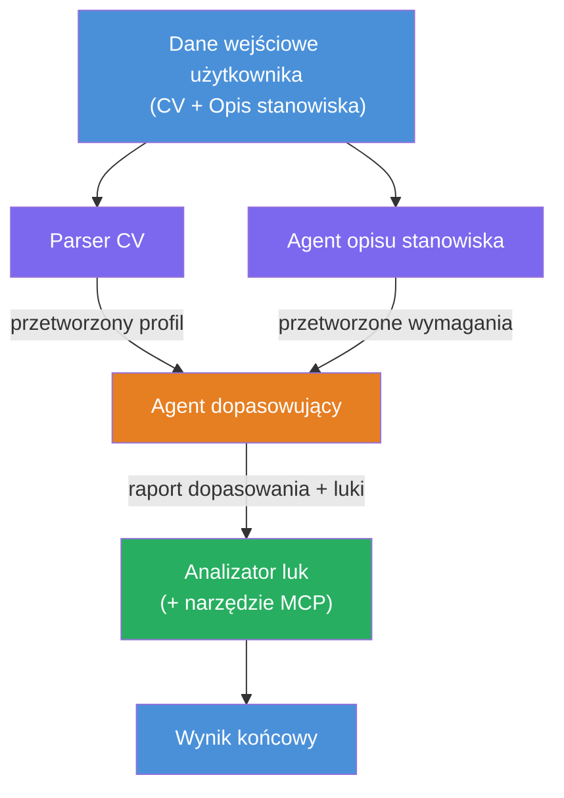
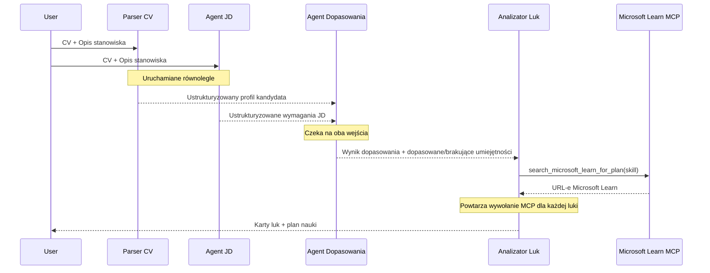
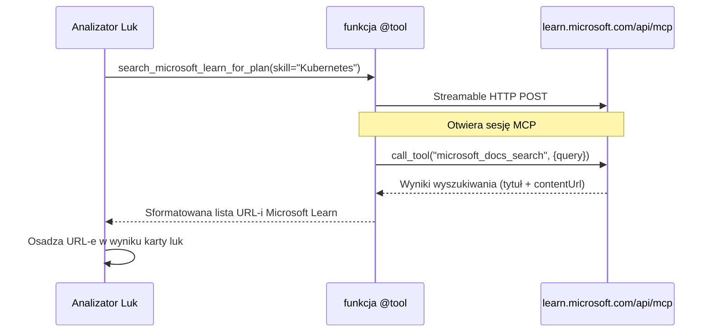

# Moduł 1 - Zrozumienie architektury wieloagentowej

W tym module poznasz architekturę Resume → Job Fit Evaluator zanim napiszesz jakikolwiek kod. Zrozumienie grafu orkiestracji, ról agentów oraz przepływu danych jest kluczowe dla debugowania i rozbudowy [procesów wieloagentowych](https://learn.microsoft.com/azure/architecture/ai-ml/idea/multiple-agent-workflow-automation).

---

## Problem, który to rozwiązuje

Dopasowanie CV do opisu stanowiska obejmuje wiele odrębnych umiejętności:

1. **Analiza składniowa** - wydobycie danych strukturalnych z niestrukturalnego tekstu (CV)
2. **Analiza** - wydobycie wymagań z opisu stanowiska
3. **Porównanie** - ocena zgodności między dwoma dokumentami
4. **Planowanie** - stworzenie planu nauki, aby zamknąć luki

Pojedynczy agent wykonujący wszystkie cztery zadania w jednym wywołaniu często produkuje:
- Niekompletne wydobycie (pędzi przez analizę, aby szybko uzyskać wynik)
- Płytką ocenę (brak rozbicia opartego na dowodach)
- Ogólne plany nauki (nie dostosowane do konkretnych braków)

Podział na **cztery wyspecjalizowane agenty** pozwala każdemu skupić się na swoim zadaniu z dedykowanymi instrukcjami, co skutkuje wyższą jakością na każdym etapie.

---

## Czterej agenci

Każdy agent to pełnoprawny [agent Microsoft Foundry](https://learn.microsoft.com/azure/foundry/agents/concepts/hosted-agents) utworzony przez `AzureAIAgentClient.as_agent()`. Dzielą tę samą implementację modelu, ale mają różne instrukcje i (opcjonalnie) różne narzędzia.

| # | Nazwa agenta | Rola | Wejście | Wyjście |
|---|--------------|------|---------|---------|
| 1 | **ResumeParser** | Wydobywa strukturalny profil z tekstu CV | Surowy tekst CV (od użytkownika) | Profil kandydata, umiejętności techniczne, umiejętności miękkie, certyfikaty, doświadczenie dziedzinowe, osiągnięcia |
| 2 | **JobDescriptionAgent** | Wydobywa strukturalne wymagania z opisu stanowiska | Surowy tekst opisu stanowiska (od użytkownika, przekazany przez ResumeParser) | Przegląd roli, wymagane umiejętności, preferowane umiejętności, doświadczenie, certyfikaty, wykształcenie, obowiązki |
| 3 | **MatchingAgent** | Oblicza wynik dopasowania oparty na dowodach | Wyniki z ResumeParser + JobDescriptionAgent | Wynik dopasowania (0-100 z rozbiciem), dopasowane umiejętności, brakujące umiejętności, luki |
| 4 | **GapAnalyzer** | Tworzy spersonalizowany plan nauki | Wynik z MatchingAgent | Karty luk (dla każdej umiejętności), kolejność nauki, harmonogram, zasoby z Microsoft Learn |

---

## Graf orkiestracji

Proces wykorzystuje **równoległe rozgałęzienie** (fan-out) po którym następuje **sekwencyjna agregacja**:


> **Legenda:** Fioletowy = agenci równolegli, Pomarańczowy = punkt agregacji, Zielony = końcowy agent z narzędziami

### Jak płynie przepływ danych


1. **Użytkownik wysyła** wiadomość zawierającą CV i opis stanowiska.
2. **ResumeParser** otrzymuje pełne dane i wydobywa strukturalny profil kandydata.
3. **JobDescriptionAgent** równolegle otrzymuje dane użytkownika i wydobywa strukturalne wymagania.
4. **MatchingAgent** otrzymuje wyjścia z **ResumeParser oraz JobDescriptionAgent** (framework czeka na ukończenie obu, zanim uruchomi MatchingAgent).
5. **GapAnalyzer** otrzymuje wyniki MatchingAgent i wywołuje **Microsoft Learn MCP tool** aby pobrać rzeczywiste zasoby nauki dla każdej luki.
6. **Końcowym wynikiem** jest odpowiedź GapAnalyzer, która zawiera wynik dopasowania, karty luk oraz kompletny plan nauki.

### Dlaczego równoległe rozgałęzienie ma znaczenie

ResumeParser i JobDescriptionAgent działają **równolegle**, ponieważ żaden z nich nie zależy od drugiego. To:
- Skraca całkowite opóźnienie (obie działają jednocześnie, zamiast po kolei)
- To naturalny podział (parsowanie CV vs parsowanie JD to niezależne zadania)
- Pokazuje popularny wzorzec wieloagentowy: **fan-out → agreguj → działaj**

---

## WorkflowBuilder w kodzie

Poniżej jak powyższy graf mapuje się na wywołania API [`WorkflowBuilder`](https://learn.microsoft.com/agent-framework/workflows/agents-in-workflows) w `main.py`:

```python
from agent_framework import WorkflowBuilder

workflow = (
    WorkflowBuilder(
        name="ResumeJobFitEvaluator",
        start_executor=resume_parser,       # Pierwszy agent otrzymujący dane wejściowe od użytkownika
        output_executors=[gap_analyzer],     # Ostateczny agent, którego wynik jest zwracany
    )
    .add_edge(resume_parser, jd_agent)      # ResumeParser → JobDescriptionAgent
    .add_edge(resume_parser, matching_agent) # ResumeParser → MatchingAgent
    .add_edge(jd_agent, matching_agent)      # JobDescriptionAgent → MatchingAgent
    .add_edge(matching_agent, gap_analyzer)  # MatchingAgent → GapAnalyzer
    .build()
)
```

**Zrozumienie krawędzi:**

| Krawędź | Co oznacza |
|---------|------------|
| `resume_parser → jd_agent` | Agent JD otrzymuje wyjście ResumeParser |
| `resume_parser → matching_agent` | MatchingAgent otrzymuje wyjście ResumeParser |
| `jd_agent → matching_agent` | MatchingAgent otrzymuje także wyjście Agenta JD (czeka na oba) |
| `matching_agent → gap_analyzer` | GapAnalyzer otrzymuje wyjście MatchingAgent |

Ponieważ `matching_agent` ma **dwie krawędzie przychodzące** (`resume_parser` i `jd_agent`), framework automatycznie czeka na ukończenie obu, zanim uruchomi Matching Agent.

---

## Narzędzie MCP

Agent GapAnalyzer posiada jedno narzędzie: `search_microsoft_learn_for_plan`. Jest to **[narzędzie MCP](https://learn.microsoft.com/agent-framework/agents/tools/hosted-mcp-tools)**, które wywołuje API Microsoft Learn, aby pobierać wyselekcjonowane zasoby edukacyjne.

### Jak to działa

```python
@tool
async def search_microsoft_learn_for_plan(
    skill: str, role: str = "", max_results: int = 5
) -> str:
    """Search Microsoft Learn MCP and return curated official links."""
    # Łączy się z https://learn.microsoft.com/api/mcp za pomocą strumieniowego HTTP
    # Wywołuje narzędzie 'microsoft_docs_search' na serwerze MCP
    # Zwraca sformatowaną listę adresów URL Microsoft Learn
```

### Przebieg wywołania MCP


1. GapAnalyzer decyduje, że potrzebuje zasobów nauki dla umiejętności (np. "Kubernetes")
2. Framework wywołuje `search_microsoft_learn_for_plan(skill="Kubernetes")`
3. Funkcja otwiera [Streamable HTTP](https://learn.microsoft.com/agent-framework/agents/tools/hosted-mcp-tools) połączenie z `https://learn.microsoft.com/api/mcp`
4. Wywołuje narzędzie `microsoft_docs_search` na [serwerze MCP](https://learn.microsoft.com/azure/foundry/agents/how-to/tools/model-context-protocol)
5. Serwer MCP zwraca wyniki wyszukiwania (tytuł + URL)
6. Funkcja formatuje wyniki i zwraca je jako tekst
7. GapAnalyzer używa zwróconych URLi w wyjściu kart luk

### Oczekiwane logi MCP

Gdy narzędzie działa, zobaczysz wpisy logów takie jak:

```
GET https://learn.microsoft.com/api/mcp → 405 (Method Not Allowed)
POST https://learn.microsoft.com/api/mcp → 200
DELETE https://learn.microsoft.com/api/mcp → 405 (Method Not Allowed)
```

**To jest normalne.** Klient MCP wykonuje zapytania GET i DELETE podczas inicjalizacji – zwracanie 405 jest zachowaniem oczekiwanym. Rzeczywiste wywołanie narzędzia używa POST i zwraca 200. Należy się martwić tylko, jeśli wywołania POST się nie powiodą.

---

## Wzorzec tworzenia agenta

Każdy agent jest tworzony z użyciem **asynchronicznego menedżera kontekstu [`AzureAIAgentClient.as_agent()`](https://learn.microsoft.com/python/api/overview/azure/ai-agents-readme)**. To wzorzec Foundry SDK do tworzenia agentów, którzy są automatycznie sprzątani:

```python
async with (
    get_credential() as credential,
    AzureAIAgentClient(
        project_endpoint=PROJECT_ENDPOINT,
        model_deployment_name=MODEL_DEPLOYMENT_NAME,
        credential=credential,
    ).as_agent(
        name="ResumeParser",
        instructions=RESUME_PARSER_INSTRUCTIONS,
    ) as resume_parser,
    # ... powtórz dla każdego agenta ...
):
    # Tutaj istnieją wszyscy 4 agenci
    workflow = create_workflow(resume_parser, jd_agent, matching_agent, gap_analyzer)
```

**Kluczowe punkty:**
- Każdy agent posiada własną instancję `AzureAIAgentClient` (SDK wymaga nazwy agenta zapakowanej w klienta)
- Wszyscy agenci dzielą te same `credential`, `PROJECT_ENDPOINT` i `MODEL_DEPLOYMENT_NAME`
- Blok `async with` zapewnia, że agenci są sprzątani podczas zamykania serwera
- GapAnalyzer dodatkowo otrzymuje `tools=[search_microsoft_learn_for_plan]`

---

## Uruchomienie serwera

Po utworzeniu agentów i zbudowaniu workflow serwer się uruchamia:

```python
from azure.ai.agentserver.agentframework import from_agent_framework

agent = create_workflow(resume_parser, jd_agent, matching_agent, gap_analyzer)
await from_agent_framework(agent).run_async()
```

`from_agent_framework()` opakowuje workflow jako serwer HTTP udostępniający endpoint `/responses` na porcie 8088. To ten sam wzorzec co w Laboratorium 01, ale „agentem” jest teraz cały [graf workflow](https://learn.microsoft.com/agent-framework/workflows/as-agents).

---

### Kontrola postępów

- [ ] Rozumiesz architekturę 4 agentów i rolę każdego z nich
- [ ] Potrafisz śledzić przepływ danych: Użytkownik → ResumeParser → (równolegle) Agent JD + MatchingAgent → GapAnalyzer → Wynik
- [ ] Rozumiesz, dlaczego MatchingAgent czeka na oba wyjścia od ResumeParser i Agenta JD (dwie krawędzie przychodzące)
- [ ] Rozumiesz narzędzie MCP: co robi, jak je wywołać, oraz że logi GET 405 są normalne
- [ ] Rozumiesz wzorzec `AzureAIAgentClient.as_agent()` i dlaczego każdy agent ma własną instancję klienta
- [ ] Potrafisz czytać kod `WorkflowBuilder` i mapować go na wizualny graf

---

**Poprzedni:** [00 - Wymagania wstępne](00-prerequisites.md) · **Następny:** [02 - Szkielet projektu wieloagentowego →](02-scaffold-multi-agent.md)

---

<!-- CO-OP TRANSLATOR DISCLAIMER START -->
**Zastrzeżenie**:
Ten dokument został przetłumaczony za pomocą usługi tłumaczenia AI [Co-op Translator](https://github.com/Azure/co-op-translator). Chociaż dążymy do dokładności, prosimy pamiętać, że automatyczne tłumaczenia mogą zawierać błędy lub nieścisłości. Oryginalny dokument w języku źródłowym powinien być uważany za wiarygodne źródło. W przypadku informacji krytycznych zalecane jest skorzystanie z profesjonalnego tłumaczenia wykonanego przez człowieka. Nie ponosimy odpowiedzialności za wszelkie nieporozumienia lub błędne interpretacje wynikające z korzystania z tego tłumaczenia.
<!-- CO-OP TRANSLATOR DISCLAIMER END -->