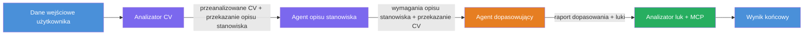

# Moduł 1 - Zrozumienie architektury

⏱️ ~5 minut

Zanim napiszesz jakikolwiek kod, oto szybki przegląd tego, co tworzysz i jak to działa.

---

## Co tworzysz

Wklejasz **CV** i **opis stanowiska**. Proces zwraca:

- Wskaźnik dopasowania (0–100 z rozbiciem)
- Listę braków w umiejętnościach i certyfikatach
- Spersonalizowaną ścieżkę nauki z linkami do Microsoft Learn dla każdego braku

---

## Cztery agenty

Pojedynczy agent próbujący analizować, oceniać i planować jednocześnie zwykle działa pośpiesznie i generuje powierzchowne wyniki. Podzielenie pracy na cztery wyspecjalizowane agentów daje lepsze rezultaty:

| Agent | Co robi |
|-------|---------|
| **ResumeParser** | Analizuje CV; kopiuje opis stanowiska dokładnie do `[JOB DESCRIPTION PASS-THROUGH]` dla kolejnych agentów |
| **JobDescriptionAgent** | Wyodrębnia wymagania opisu stanowiska z przekazanych danych; przekazuje dalej `[PARSED RESUME]` jako `[PARSED RESUME PASS-THROUGH]` |
| **MatchingAgent** | Porównuje obie oznaczone sekcje; generuje wskaźnik dopasowania 0–100 oraz listę braków |
| **GapAnalyzer** | Tworzy ścieżkę nauki; wyszukuje w Microsoft Learn dla każdego braku |

---

## Graf orkiestracji

Proces to **sekwencyjna linia przetwarzania** - każdy agent przekazuje swoje wyjście do następnego:


```mermaid
flowchart LR
    A["Dane wejściowe użytkownika"] --> B["Analizator CV"]
    B -- "przeanalizowane CV + przekazanie opisu stanowiska" --> C["Agent opisu stanowiska"]
    C -- "wymagania opisu stanowiska + przekazanie CV" --> D["Agent dopasowujący"]
    D -- "raport dopasowania + luki" --> E["Analizator luk + MCP"]
    E --> F["Wynik końcowy"]

    style A fill:#4A90D9,color:#fff
    style B fill:#7B68EE,color:#fff
    style C fill:#7B68EE,color:#fff
    style D fill:#E67E22,color:#fff
    style E fill:#27AE60,color:#fff
    style F fill:#4A90D9,color:#fff
```

1. **ResumeParser** odbiera dane wejściowe od użytkownika, analizuje CV i kopiuje opis stanowiska do `[JOB DESCRIPTION PASS-THROUGH]`.
2. **Agent JD** wyodrębnia strukturalne wymagania i przekazuje dalej `[PARSED RESUME PASS-THROUGH]`.
3. **MatchingAgent** porównuje obie sekcje i generuje wskaźnik dopasowania oraz listę braków.
4. **GapAnalyzer** tworzy ścieżkę nauki i wywołuje narzędzie Microsoft Learn MCP dla każdego braku.

---

## Jak to odzwierciedla się w kodzie

W `main.py` opisujesz ten graf za pomocą `WorkflowBuilder`:

```python
workflow_agent = (
    WorkflowBuilder(
        start_executor=resume_executor,       # pierwszy agent otrzymujący dane od użytkownika
        output_executors=[gap_executor],      # ostatni agent - jego wyjście jest odpowiedzią
    )
    .add_edge(resume_executor, jd_executor)       # ResumeParser → Agent JD
    .add_edge(jd_executor, matching_executor)     # Agent JD → MatchingAgent
    .add_edge(matching_executor, gap_executor)    # MatchingAgent → GapAnalyzer
    .build()
    .as_agent()
)
```

Każdy `Agent` jest opakowany w `AgentExecutor`. Wywołania `add_edge()` definiują ściśle sekwencyjną linię przetwarzania - każdy agent otrzymuje wyjście tylko od bezpośredniego poprzednika.

> `context_mode="last_agent"` oznacza, że każdy executor widzi tylko wyjście bezpośredniego poprzednika. ResumeParser i Agent JD przekazują dane dalej w oznaczonych sekcjach, dzięki czemu każdy kolejny agent ma dokładnie to, czego potrzebuje.

---

## Narzędzie MCP

GapAnalyzer ma jedno narzędzie: `search_microsoft_learn_for_plan`. Łączy się z `https://learn.microsoft.com/api/mcp` i zwraca faktyczne linki Microsoft Learn dla każdego braku umiejętności.

Podczas działania narzędzia zobaczysz te logi — wszystkie oczekiwane:

```
GET  https://learn.microsoft.com/api/mcp → 405   ← connection probe, normal
POST https://learn.microsoft.com/api/mcp → 200   ← actual tool call
DELETE https://learn.microsoft.com/api/mcp → 405 ← cleanup probe, normal
```

Zwróć uwagę tylko, jeśli `POST` zwraca błąd.

---

**Poprzedni:** [00 - Wymagania wstępne](00-prerequisites.md) · **Następny:** [02 - Szablon projektu →](02-scaffold-multi-agent.md)

---

<!-- CO-OP TRANSLATOR DISCLAIMER START -->
**Zastrzeżenie**:
Niniejszy dokument został przetłumaczony za pomocą usługi tłumaczenia AI [Co-op Translator](https://github.com/Azure/co-op-translator). Choć dążymy do dokładności, prosimy pamiętać, że automatyczne tłumaczenia mogą zawierać błędy lub niedokładności. Oryginalny dokument w jego języku źródłowym należy uznawać za autorytatywne źródło. W przypadku informacji krytycznych zalecane jest skorzystanie z profesjonalnego tłumaczenia wykonanego przez człowieka. Nie ponosimy odpowiedzialności za jakiekolwiek nieporozumienia lub błędne interpretacje wynikające z użycia tego tłumaczenia.
<!-- CO-OP TRANSLATOR DISCLAIMER END -->