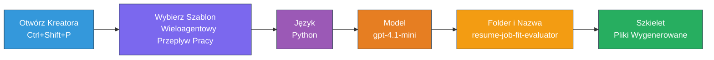
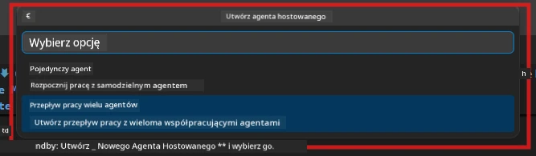

# Module 2 - Utwórz strukturę projektu wieloagentowego

W tym module użyjesz [rozszerzenia Microsoft Foundry](https://marketplace.visualstudio.com/items?itemName=TeamsDevApp.vscode-ai-foundry), aby **utworzyć strukturę projektu wieloagentowego workflow**. Rozszerzenie generuje całą strukturę projektu - `agent.yaml`, `main.py`, `Dockerfile`, `requirements.txt`, `.env` oraz konfigurację debugowania. Następnie dostosujesz te pliki w Modułach 3 i 4.

> **Uwaga:** Folder `PersonalCareerCopilot/` w tym laboratorium jest kompletnym, działającym przykładem dostosowanego projektu wieloagentowego. Możesz albo utworzyć nowy projekt od podstaw (zalecane do nauki), albo bezpośrednio przeanalizować istniejący kod.

---

## Krok 1: Otwórz kreatora tworzenia Hosted Agent


1. Naciśnij `Ctrl+Shift+P`, aby otworzyć **Paletę poleceń**.
2. Wpisz: **Microsoft Foundry: Create a New Hosted Agent** i wybierz tę opcję.
3. Otworzy się kreator tworzenia hosted agenta.

> **Alternatywa:** Kliknij ikonę **Microsoft Foundry** na pasku aktywności → kliknij ikonę **+** obok **Agents** → **Create New Hosted Agent**.

---

## Krok 2: Wybierz szablon Multi-Agent Workflow

Kreator poprosi o wybór szablonu:

| Szablon | Opis | Kiedy używać |
|----------|-------------|-------------|
| Single Agent | Jeden agent z instrukcjami oraz opcjonalnymi narzędziami | Lab 01 |
| **Multi-Agent Workflow** | Wielu agentów współpracujących za pomocą WorkflowBuilder | **To laboratorium (Lab 02)** |

1. Wybierz **Multi-Agent Workflow**.
2. Kliknij **Next**.



---

## Krok 3: Wybierz język programowania

1. Wybierz **Python**.
2. Kliknij **Next**.

---

## Krok 4: Wybierz model

1. Kreator pokazuje modele wdrożone w twoim projekcie Foundry.
2. Wybierz ten sam model, którego używałeś w Lab 01 (np. **gpt-4.1-mini**).
3. Kliknij **Next**.

> **Wskazówka:** [`gpt-4.1-mini`](https://learn.microsoft.com/azure/foundry/foundry-models/concepts/models-sold-directly-by-azure#gpt-41-series) jest polecany do developmentu - jest szybki, tani i dobrze obsługuje workflow wieloagentowe. Na finalne wdrożenie produkcyjne przełącz się na `gpt-4.1`, jeśli chcesz uzyskać wyższą jakość wyników.

---

## Krok 5: Wybierz lokalizację folderu i nazwę agenta

1. Otworzy się okno wyboru pliku. Wybierz docelowy folder:
   - Jeśli korzystasz z repozytorium warsztatowego: przejdź do `workshop/lab02-multi-agent/` i utwórz nowy podfolder
   - Jeśli zaczynasz od nowa: wybierz dowolny folder
2. Wprowadź **nazwę** hostowanego agenta (np. `resume-job-fit-evaluator`).
3. Kliknij **Create**.

---

## Krok 6: Poczekaj na zakończenie tworzenia struktury

1. VS Code otworzy nowe okno (lub zaktualizuje bieżące) z utworzonym projektem.
2. Powinieneś zobaczyć tę strukturę plików:

```
resume-job-fit-evaluator/
├── .env                ← Environment variables (placeholders)
├── .vscode/
│   └── launch.json     ← Debug configuration
├── agent.yaml          ← Agent definition (kind: hosted)
├── Dockerfile          ← Container configuration
├── main.py             ← Multi-agent workflow code (scaffold)
└── requirements.txt    ← Python dependencies
```

> **Notatka warsztatowa:** W repozytorium warsztatowym folder `.vscode/` znajduje się w **głównym katalogu roboczym** z wspólnymi plikami `launch.json` i `tasks.json`. Konfiguracje debugowania dla Lab 01 i Lab 02 są obie dostępne. Po naciśnięciu F5 wybierz **"Lab02 - Multi-Agent"** z listy.

---

## Krok 7: Zrozum pliki wygenerowane przez scaffold (szczegóły wieloagentowe)

Struktura wieloagentowa różni się od pojedynczego agenta w kilku kluczowych aspektach:

### 7.1 `agent.yaml` - Definicja agenta

```yaml
kind: hosted
name: resume-job-fit-evaluator
description: >
  A multi-agent workflow that evaluates resume-to-job fit.
metadata:
  authors:
    - Microsoft
  tags:
    - Multi-Agent Workflow
    - Resume Evaluator
protocols:
  - protocol: responses
    version: v1
environment_variables:
  - name: PROJECT_ENDPOINT
    value: ${PROJECT_ENDPOINT}
  - name: MODEL_DEPLOYMENT_NAME
    value: ${MODEL_DEPLOYMENT_NAME}
```

**Kluczowa różnica w stosunku do Lab 01:** Sekcja `environment_variables` może zawierać dodatkowe zmienne dla punktów końcowych MCP lub innych konfiguracji narzędzi. `name` i `description` odzwierciedlają zastosowanie wieloagentowe.

### 7.2 `main.py` - Kod workflow wieloagentowego

Struktura zawiera:
- **Wiele łańcuchów znaków instrukcji agenta** (po jednej stałej na agenta)
- **Wiele menedżerów kontekstu [`AzureAIAgentClient.as_agent()`](https://learn.microsoft.com/python/api/overview/azure/ai-agents-readme)** (po jednym na agenta)
- **[`WorkflowBuilder`](https://learn.microsoft.com/agent-framework/workflows/agents-in-workflows)**, który łączy agentów
- **`from_agent_framework()`** do udostępnienia workflow jako punktu końcowego HTTP

```python
from agent_framework import WorkflowBuilder, tool
from agent_framework.azure import AzureAIAgentClient
from azure.ai.agentserver.agentframework import from_agent_framework
```

Dodatkowy import [`WorkflowBuilder`](https://learn.microsoft.com/agent-framework/workflows/agents-in-workflows) jest nowością w porównaniu do Lab 01.

### 7.3 `requirements.txt` - Dodatkowe zależności

Projekt wieloagentowy używa tych samych podstawowych pakietów co Lab 01 oraz dodatkowych pakietów związanych z MCP:

```
agent-framework-azure-ai==1.0.0rc3
agent-framework-core==1.0.0rc3
azure-ai-agentserver-agentframework==1.0.0b16
azure-ai-agentserver-core==1.0.0b16
debugpy
agent-dev-cli --pre
```

> **Ważna uwaga dotycząca wersji:** Pakiet `agent-dev-cli` wymaga flagi `--pre` w `requirements.txt`, aby zainstalować najnowszą wersję podglądu. Jest to wymagane dla zgodności Agent Inspector z `agent-framework-core==1.0.0rc3`. Szczegóły wersji znajdziesz w [Module 8 - Troubleshooting](08-troubleshooting.md).

| Pakiet | Wersja | Cel |
|---------|---------|---------|
| [`agent-framework-azure-ai`](https://learn.microsoft.com/agent-framework/overview/) | `1.0.0rc3` | Integracja Azure AI dla [Microsoft Agent Framework](https://github.com/microsoft/agent-framework) |
| [`agent-framework-core`](https://learn.microsoft.com/agent-framework/overview/) | `1.0.0rc3` | Podstawowe środowisko uruchomieniowe (zawiera WorkflowBuilder) |
| `azure-ai-agentserver-agentframework` | `1.0.0b16` | Środowisko serwera hostowanego agenta |
| `azure-ai-agentserver-core` | `1.0.0b16` | Podstawowe abstrakcje serwera agenta |
| `debugpy` | najnowsza | Debugowanie Pythona (F5 w VS Code) |
| `agent-dev-cli` | `--pre` | Lokalny CLI deweloperski + backend Agent Inspector |

### 7.4 `Dockerfile` - Tak samo jak w Lab 01

Dockerfile jest identyczny jak w Lab 01 - kopiuje pliki, instaluje zależności z `requirements.txt`, udostępnia port 8088 i uruchamia `python main.py`.

```dockerfile
FROM python:3.14-slim
WORKDIR /app
COPY ./ .
RUN pip install --upgrade pip && \
    if [ -f requirements.txt ]; then \
        pip install -r requirements.txt; \
    else \
      echo "No requirements.txt found" >&2; exit 1; \
    fi
EXPOSE 8088
CMD ["python", "main.py"]
```

---

### Punkt kontrolny

- [ ] Kreator scaffold zakończony → widoczna nowa struktura projektu
- [ ] Widać wszystkie pliki: `agent.yaml`, `main.py`, `Dockerfile`, `requirements.txt`, `.env`
- [ ] `main.py` zawiera import `WorkflowBuilder` (potwierdza wybór szablonu wieloagentowego)
- [ ] `requirements.txt` zawiera `agent-framework-core` oraz `agent-framework-azure-ai`
- [ ] Rozumiesz, czym struktura wieloagentowa różni się od pojedynczego agenta (wielu agentów, WorkflowBuilder, narzędzia MCP)

---

**Poprzedni:** [01 - Zrozum architekturę Multi-Agent](01-understand-multi-agent.md) · **Następny:** [03 - Konfiguracja Agentów i Środowiska →](03-configure-agents.md)

---

<!-- CO-OP TRANSLATOR DISCLAIMER START -->
**Zastrzeżenie**:
Niniejszy dokument został przetłumaczony za pomocą usługi tłumaczeń AI [Co-op Translator](https://github.com/Azure/co-op-translator). Chociaż dążymy do dokładności, prosimy mieć na uwadze, że tłumaczenia automatyczne mogą zawierać błędy lub nieścisłości. Oryginalny dokument w języku źródłowym powinien być traktowany jako źródło autorytatywne. W przypadku krytycznych informacji zalecane jest skorzystanie z profesjonalnego tłumaczenia wykonanego przez człowieka. Nie ponosimy odpowiedzialności za jakiekolwiek nieporozumienia lub błędne interpretacje wynikające z korzystania z tego tłumaczenia.
<!-- CO-OP TRANSLATOR DISCLAIMER END -->