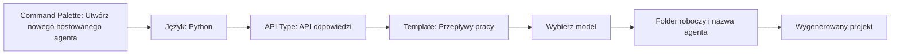
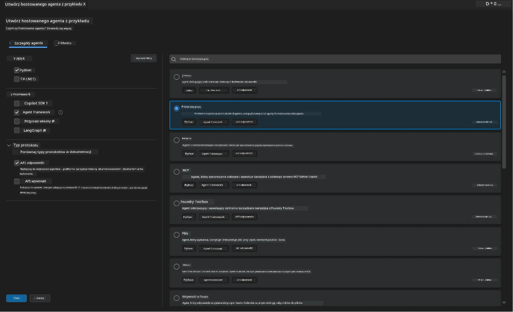
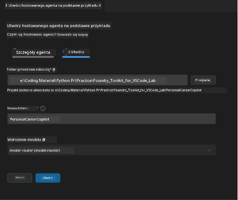

# Moduł 2 - Szkielet projektu Multi-Agent

⏱️ ~5 min

W tym module korzystasz z [Foundry Toolkit for VS Code](https://aka.ms/foundrytk), aby **utworzyć szkielet projektu multi-agenta**. Kreator generuje `agent.yaml`, `main.py`, `Dockerfile`, `requirements.txt`, `.env` oraz konfigurację debugowania VS Code - dzięki czemu możesz skupić się na łączeniu przepływu pracy 4 agentów w Module 3.

> **Kluczowa koncepcja:** Szkielet to działający szkic z jednym agentem. W Module 3 zastępujesz logikę zastępczą grafem `WorkflowBuilder`. Nie piszesz boilerplate od zera.

> **Implementacja referencyjna:** [`PersonalCareerCopilot/`](../../../../../workshop/lab02-multi-agent/PersonalCareerCopilot) to pełny działający przykład. Używaj go do porównywania swojej pracy po drodze.

### Przebieg kreatora szkieletu


```mermaid
flowchart LR
    A[Command Palette: Utwórz nowego hostowanego agenta] --> B[Język: Python]
    B --> C[API Type: API odpowiedzi]
    C --> D[Template: Przepływy pracy]
    D --> E[Wybierz model]
    E --> F[Folder roboczy i nazwa agenta]
    F --> G[Wygenerowany projekt]
```

---

## Krok 1: Otwórz kreatora Create Hosted Agent

1. Naciśnij `Ctrl+Shift+P`, aby otworzyć **Command Palette**.
2. Wpisz: **Foundry Toolkit: Create a New Hosted Agent** i wybierz tę opcję.
3. Kreator otworzy się na zakładce **Agent Details**.

> **Alternatywa:** Kliknij ikonę **Foundry Toolkit** w Activity Bar → kliknij ikonę **+** obok **Hosted Agents** → **Create New Hosted Agent**.

---

## Krok 2: Wybierz ustawienia



1. W lewej nawigacji/opcjach wybierz następujące:

| Menu | Wybór | Uwagi |
|--------|-----------|-------|
| **Language** | Python | Wspierany jest też C# (.NET) |
| **Framework** | Agent Framework | Udostępnia `Agent`, `AgentExecutor`, `WorkflowBuilder` |
| **API type** | Response API | `POST /responses` - historia zarządzana przez platformę, wsparcie strumieniowania |
| **Template** | **Workflows** | Przetwarza żądania sekwencyjnie przez wielu agentów |

2. Po wybraniu kliknij **Next**



3. W kolejnym oknie wybierz następujące:

| Menu | Wybór | Uwagi |
|--------|-----------|-------|
| **Workspace folder** | Wskaż docelowy folder | np. `workshop/lab02-multi-agent/` w tym repo |
| **Agent name** | `PersonalCareerCopilot` | To stanie się nazwą katalogu projektu |
| **Model Deployment** | Wybierz swój wdrożony model | np. `gpt-4.1-mini` z Laboratorium 01 |

4. Kliknij **Create**, aby stworzyć szkic projektu. VS Code wygeneruje pliki i otworzy folder.

> **Wskazówka:** [`gpt-4.1-mini`](https://learn.microsoft.com/azure/foundry/foundry-models/concepts/models-sold-directly-by-azure#gpt-41-series) dobrze równoważy szybkość i jakość dla rozwoju multi-agentów.

---

## Krok 3: Sprawdź wygenerowany projekt

Po zakończeniu tworzenia szkieletu sprawdź, czy w Eksploratorze (`Ctrl+Shift+E`) widzisz te pliki:

```
📂 <your-agent-name>/
├── .azdignore          ← Files excluded from Azure Developer CLI deployments
├── .dockerignore       ← Files excluded from Docker builds
├── .env                ← Environment variables (placeholders - fill in Module 3)
├── .vscode/
│   ├── launch.json     ← Debug config (F5 → run + Agent Inspector)
│   └── tasks.json      ← VS Code task definitions
├── agent.yaml          ← Agent definition (kind: hosted, protocol: responses)
├── Dockerfile          ← Container config for deployment
├── main.py             ← Stub agent entry point (replace with WorkflowBuilder in Module 3)
└── requirements.txt    ← Python dependencies
```

> **Ważne:** Otwórz ten szkicowany folder bezpośrednio w VS Code, aby `.vscode/launch.json` i `tasks.json` działały poprawnie podczas debugowania (F5).

### Kluczowe pliki i ich znaczenie

| Plik | Znaczenie |
|------|---------|
| `agent.yaml` | Deklaruje `kind: hosted`, mapuje zmienne środowiskowe, definiuje protokół `/responses` |
| `main.py` | Szkielet: jeden `FoundryChatClient` → `Agent` → `ResponsesHostServer`. W Module 3 zastąpisz to 4 agentami + `WorkflowBuilder` |
| `Dockerfile` | `python:3.12-slim`, instaluje `requirements.txt`, odsłania port 8088, uruchamia `python main.py` |
| `requirements.txt` | `agent-framework-foundry`, `agent-framework-foundry-hosting`, `mcp<2,>=1.24.0`, `debugpy` |

> **Referencja:** Zobacz [`PersonalCareerCopilot/agent.yaml`](../../../../../workshop/lab02-multi-agent/PersonalCareerCopilot/agent.yaml) oraz [`PersonalCareerCopilot/requirements.txt`](../../../../../workshop/lab02-multi-agent/PersonalCareerCopilot/requirements.txt) dla kompletnej wygenerowanej zawartości.

---

### ✅ Punkt kontrolny

- [ ] Kreator szkieletu ukończony - nowy folder projektu jest widoczny w Eksploratorze
- [ ] Wszystkie oczekiwane pliki obecne: `agent.yaml`, `main.py`, `Dockerfile`, `requirements.txt`, `.env`
- [ ] `agent.yaml` wskazuje `kind: hosted` oraz `protocol: responses`
- [ ] `main.py` importuje `Agent`, `FoundryChatClient`, `ResponsesHostServer`
- [ ] Otwarty folder szkieletu jako root workspace VS Code
- [ ] Rozumiesz, że `main.py` to szkic - `WorkflowBuilder` dodasz w Module 3

---

**Poprzedni:** [01 - Zrozum architekturę Multi-Agent](01-understand-multi-agent.md) · **Następny:** [03 - Konfiguracja agentów i środowiska →](03-configure-agents.md)

---

<!-- CO-OP TRANSLATOR DISCLAIMER START -->
**Zastrzeżenie**:
Niniejszy dokument został przetłumaczony za pomocą usługi tłumaczenia AI [Co-op Translator](https://github.com/Azure/co-op-translator). Choć dążymy do dokładności, prosimy pamiętać, że automatyczne tłumaczenia mogą zawierać błędy lub niedokładności. Oryginalny dokument w jego języku źródłowym należy uznawać za autorytatywne źródło. W przypadku informacji krytycznych zalecane jest skorzystanie z profesjonalnego tłumaczenia wykonanego przez człowieka. Nie ponosimy odpowiedzialności za jakiekolwiek nieporozumienia lub błędne interpretacje wynikające z użycia tego tłumaczenia.
<!-- CO-OP TRANSLATOR DISCLAIMER END -->