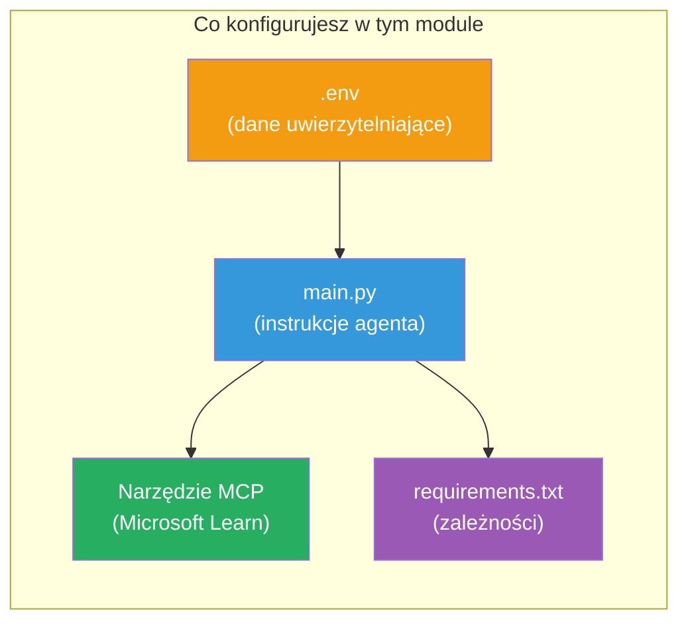

# Module 3 - Konfiguracja agentów, narzędzia MCP i środowiska

W tym module dostosujesz szablon wieloagentowego projektu. Napiszesz instrukcje dla wszystkich czterech agentów, skonfigurujesz narzędzie MCP dla Microsoft Learn, ustawisz zmienne środowiskowe i zainstalujesz zależności.


> **Referencja:** Kompletny działający kod znajduje się w [`PersonalCareerCopilot/main.py`](../../../../../workshop/lab02-multi-agent/PersonalCareerCopilot/main.py). Używaj go jako odniesienia podczas tworzenia własnego.

---

## Krok 1: Konfiguracja zmiennych środowiskowych

1. Otwórz plik **`.env`** w katalogu głównym projektu.
2. Wypełnij dane projektu Foundry:

   ```env
   PROJECT_ENDPOINT=https://<your-account>.services.ai.azure.com/api/projects/<your-project>
   MODEL_DEPLOYMENT_NAME=gpt-4.1-mini
   ```

3. Zapisz plik.

### Gdzie znaleźć te wartości

| Wartość | Jak to znaleźć |
|---------|----------------|
| **Project endpoint** | Pasek boczny Microsoft Foundry → kliknij swój projekt → adres URL endpointu w widoku szczegółów |
| **Model deployment name** | Pasek boczny Foundry → rozwiń projekt → **Models + endpoints** → nazwa obok wdrożonego modelu |

> **Bezpieczeństwo:** Nigdy nie zatwierdzaj pliku `.env` do kontroli wersji. Dodaj go do `.gitignore`, jeśli jeszcze tam nie jest.

### Mapowanie zmiennych środowiskowych

Plik `main.py` wieloagentowego projektu odczytuje zarówno standardowe, jak i specyficzne dla warsztatu nazwy zmiennych środowiskowych:

```python
PROJECT_ENDPOINT = os.getenv("AZURE_AI_PROJECT_ENDPOINT") or os.getenv("PROJECT_ENDPOINT")
MODEL_DEPLOYMENT_NAME = os.getenv(
    "AZURE_AI_MODEL_DEPLOYMENT_NAME",
    os.getenv("MODEL_DEPLOYMENT_NAME", "gpt-4.1-mini"),
)
MICROSOFT_LEARN_MCP_ENDPOINT = os.getenv(
    "MICROSOFT_LEARN_MCP_ENDPOINT", "https://learn.microsoft.com/api/mcp"
)
```

Endpoint MCP ma rozsądną wartość domyślną – nie musisz go ustawiać w `.env`, chyba że chcesz go nadpisać.

---

## Krok 2: Napisz instrukcje dla agentów

To najważniejszy krok. Każdy agent potrzebuje starannie opracowanych instrukcji definiujących jego rolę, format wyjścia i zasady. Otwórz `main.py` i utwórz (lub zmodyfikuj) stałe instrukcji.

### 2.1 Agent analizujący CV

```python
RESUME_PARSER_INSTRUCTIONS = """\
You are the Resume Parser.
Extract resume text into a compact, structured profile for downstream matching.

Output exactly these sections:
1) Candidate Profile
2) Technical Skills (grouped categories)
3) Soft Skills
4) Certifications & Awards
5) Domain Experience
6) Notable Achievements

Rules:
- Use only explicit or strongly implied evidence.
- Do not invent skills, titles, or experience.
- Keep concise bullets; no long paragraphs.
- If input is not a resume, return a short warning and request resume text.
"""
```

**Dlaczego te sekcje?** Agent MatchingAgent potrzebuje danych strukturalnych do oceniania. Spójne sekcje zapewniają niezawodne przekazywanie informacji między agentami.

### 2.2 Agent analizujący opis stanowiska

```python
JOB_DESCRIPTION_INSTRUCTIONS = """\
You are the Job Description Analyst.
Extract a structured requirement profile from a JD.

Output exactly these sections:
1) Role Overview
2) Required Skills
3) Preferred Skills
4) Experience Required
5) Certifications Required
6) Education
7) Domain / Industry
8) Key Responsibilities

Rules:
- Keep required vs preferred clearly separated.
- Only use what the JD states; do not invent hidden requirements.
- Flag vague requirements briefly.
- If input is not a JD, return a short warning and request JD text.
"""
```

**Dlaczego osobno wymagane i preferowane?** MatchingAgent stosuje różne wagi dla każdej kategorii (Wymagane umiejętności = 40 punktów, Preferowane umiejętności = 10 punktów).

### 2.3 Agent dopasowujący

```python
MATCHING_AGENT_INSTRUCTIONS = """\
You are the Matching Agent.
Compare parsed resume output vs JD output and produce an evidence-based fit report.

Scoring (100 total):
- Required Skills 40
- Experience 25
- Certifications 15
- Preferred Skills 10
- Domain Alignment 10

Output exactly these sections:
1) Fit Score (with breakdown math)
2) Matched Skills
3) Missing Skills
4) Partially Matched
5) Experience Alignment
6) Certification Gaps
7) Overall Assessment

Rules:
- Be objective and evidence-only.
- Keep partial vs missing separate.
- Keep Missing Skills precise; it feeds roadmap planning.
"""
```

**Dlaczego jawne punktowanie?** Powtarzalne ocenianie umożliwia porównywanie wyników i debugowanie. Skala 100 punktów jest łatwa do interpretacji dla użytkowników.

### 2.4 Agent analizujący luki

```python
GAP_ANALYZER_INSTRUCTIONS = """\
You are the Gap Analyzer and Roadmap Planner.
Create a practical upskilling plan from the matching report.

Microsoft Learn MCP usage (required):
- For EVERY High and Medium priority gap, call tool `search_microsoft_learn_for_plan`.
- Use returned Learn links in Suggested Resources.
- Prefer Microsoft Learn for free resources.

CRITICAL: You MUST produce a SEPARATE detailed gap card for EVERY skill listed in
the Missing Skills and Certification Gaps sections of the matching report. Do NOT
skip or combine gaps. Do NOT summarize multiple gaps into one card.

Output format:
1) Personalized Learning Roadmap for [Role Title]
2) One DETAILED card per gap (produce ALL cards, not just the first):
   - Skill
   - Priority (High/Medium/Low)
   - Current Level
   - Target Level
   - Suggested Resources (include Learn URL from tool results)
   - Estimated Time
   - Quick Win Project
3) Recommended Learning Order (numbered list)
4) Timeline Summary (week-by-week)
5) Motivational Note

Rules:
- Produce every gap card before writing the summary sections.
- Keep it specific, realistic, and actionable.
- Tailor to candidate's existing stack.
- If fit >= 80, focus on polish/interview readiness.
- If fit < 40, be honest and provide a staged path.
"""
```

**Dlaczego nacisk na "CRITICAL"?** Bez jednoznacznej instrukcji do wygenerowania WSZYSTKICH kart luk, model zwykle tworzy tylko 1-2 karty i streszcza resztę. Blok "CRITICAL" zapobiega temu ograniczeniu.

---

## Krok 3: Definiowanie narzędzia MCP

GapAnalyzer używa narzędzia, które wywołuje serwer [Microsoft Learn MCP](https://learn.microsoft.com/azure/foundry/agents/how-to/tools/model-context-protocol). Dodaj to do `main.py`:

```python
import json
from agent_framework import tool
from mcp.client.session import ClientSession
from mcp.client.streamable_http import streamable_http_client

@tool
async def search_microsoft_learn_for_plan(
    skill: str, role: str = "", max_results: int = 5
) -> str:
    """Search Microsoft Learn MCP and return curated official links for roadmap planning."""
    query = " ".join(part for part in [skill, role, "learning path module"] if part).strip()
    query = query or "job skills learning path"

    try:
        async with streamable_http_client(MICROSOFT_LEARN_MCP_ENDPOINT) as (
            read_stream, write_stream, _,
        ):
            async with ClientSession(read_stream, write_stream) as session:
                await session.initialize()
                result = await session.call_tool(
                    "microsoft_docs_search", {"query": query}
                )

        if not result.content:
            return (
                "No results returned from Microsoft Learn MCP. "
                "Fallback: https://learn.microsoft.com/training/support/catalog-api"
            )

        payload_text = getattr(result.content[0], "text", "")
        data = json.loads(payload_text) if payload_text else {}
        items = data.get("results", [])[:max(1, min(max_results, 10))]

        if not items:
            return f"No direct Microsoft Learn results found for '{skill}'."

        lines = [f"Microsoft Learn resources for '{skill}':"]
        for i, item in enumerate(items, start=1):
            title = item.get("title") or item.get("url") or "Microsoft Learn Resource"
            url = item.get("url") or item.get("link") or ""
            lines.append(f"{i}. {title} - {url}".rstrip(" -"))
        return "\n".join(lines)
    except Exception as ex:
        return (
            f"Microsoft Learn MCP lookup unavailable. Reason: {ex}. "
            "Fallbacks: https://learn.microsoft.com/api/mcp"
        )
```

### Jak działa narzędzie

| Krok | Co się dzieje |
|------|--------------|
| 1 | GapAnalyzer decyduje, że potrzebuje zasobów dla umiejętności (np. "Kubernetes") |
| 2 | Framework wywołuje `search_microsoft_learn_for_plan(skill="Kubernetes")` |
| 3 | Funkcja otwiera połączenie [Streamable HTTP](https://learn.microsoft.com/agent-framework/agents/tools/hosted-mcp-tools) do `https://learn.microsoft.com/api/mcp` |
| 4 | Wywołuje `microsoft_docs_search` na [serwerze MCP](https://learn.microsoft.com/azure/foundry/agents/how-to/tools/model-context-protocol) |
| 5 | Serwer MCP zwraca wyniki wyszukiwania (tytuł + URL) |
| 6 | Funkcja formatuje wyniki jako listę numerowaną |
| 7 | GapAnalyzer włącza URL-e do karty luk |

### Zależności MCP

Biblioteki klienta MCP są dołączane pośrednio przez [`agent-framework-core`](https://learn.microsoft.com/agent-framework/overview/). Nie musisz dodawać ich osobno do `requirements.txt`. Jeśli pojawią się błędy importu, sprawdź:

```powershell
pip list | Select-String "mcp"
```

Oczekiwane: pakiet `mcp` jest zainstalowany (wersja 1.x lub nowsza).

---

## Krok 4: Podłącz agentów i przepływ pracy

### 4.1 Tworzenie agentów z menedżerami kontekstu

```python
from contextlib import asynccontextmanager

@asynccontextmanager
async def create_agents():
    async with (
        get_credential() as credential,
        AzureAIAgentClient(
            project_endpoint=PROJECT_ENDPOINT,
            model_deployment_name=MODEL_DEPLOYMENT_NAME,
            credential=credential,
        ).as_agent(
            name="ResumeParser",
            instructions=RESUME_PARSER_INSTRUCTIONS,
        ) as resume_parser,
        AzureAIAgentClient(
            project_endpoint=PROJECT_ENDPOINT,
            model_deployment_name=MODEL_DEPLOYMENT_NAME,
            credential=credential,
        ).as_agent(
            name="JobDescriptionAgent",
            instructions=JOB_DESCRIPTION_INSTRUCTIONS,
        ) as jd_agent,
        AzureAIAgentClient(
            project_endpoint=PROJECT_ENDPOINT,
            model_deployment_name=MODEL_DEPLOYMENT_NAME,
            credential=credential,
        ).as_agent(
            name="MatchingAgent",
            instructions=MATCHING_AGENT_INSTRUCTIONS,
        ) as matching_agent,
        AzureAIAgentClient(
            project_endpoint=PROJECT_ENDPOINT,
            model_deployment_name=MODEL_DEPLOYMENT_NAME,
            credential=credential,
        ).as_agent(
            name="GapAnalyzer",
            instructions=GAP_ANALYZER_INSTRUCTIONS,
            tools=[search_microsoft_learn_for_plan],
        ) as gap_analyzer,
    ):
        yield resume_parser, jd_agent, matching_agent, gap_analyzer
```

**Kluczowe punkty:**
- Każdy agent ma własną instancję `AzureAIAgentClient`
- Tylko GapAnalyzer otrzymuje `tools=[search_microsoft_learn_for_plan]`
- `get_credential()` zwraca [`ManagedIdentityCredential`](https://learn.microsoft.com/python/api/overview/azure/identity-readme#managed-identity-support) w Azure, [`DefaultAzureCredential`](https://learn.microsoft.com/azure/developer/python/sdk/authentication/credential-chains#defaultazurecredential-overview) lokalnie

### 4.2 Budowa grafu przepływu pracy

```python
def create_workflow(resume_parser, jd_agent, matching_agent, gap_analyzer):
    workflow = (
        WorkflowBuilder(
            name="ResumeJobFitEvaluator",
            start_executor=resume_parser,
            output_executors=[gap_analyzer],
        )
        .add_edge(resume_parser, jd_agent)
        .add_edge(resume_parser, matching_agent)
        .add_edge(jd_agent, matching_agent)
        .add_edge(matching_agent, gap_analyzer)
        .build()
    )
    return workflow.as_agent()
```

> Zobacz [Przepływy pracy jako agenci](https://learn.microsoft.com/agent-framework/workflows/as-agents), aby zrozumieć wzorzec `.as_agent()`.

### 4.3 Uruchomienie serwera

```python
async def main() -> None:
    validate_configuration()
    async with create_agents() as (resume_parser, jd_agent, matching_agent, gap_analyzer):
        agent = create_workflow(resume_parser, jd_agent, matching_agent, gap_analyzer)
        from azure.ai.agentserver.agentframework import from_agent_framework
        await from_agent_framework(agent).run_async()

if __name__ == "__main__":
    asyncio.run(main())
```

---

## Krok 5: Utwórz i aktywuj środowisko wirtualne

### 5.1 Utwórz środowisko

```powershell
cd workshop\lab02-multi-agent\PersonalCareerCopilot
python -m venv .venv
```

### 5.2 Aktywuj je

**PowerShell (Windows):**
```powershell
.\.venv\Scripts\Activate.ps1
```

**macOS/Linux:**
```bash
source .venv/bin/activate
```

### 5.3 Zainstaluj zależności

```powershell
pip install -r requirements.txt
```

> **Uwaga:** Linia `agent-dev-cli --pre` w `requirements.txt` zapewnia instalację najnowszej wersji poglądowej. Jest to wymagane do kompatybilności z `agent-framework-core==1.0.0rc3`.

### 5.4 Sprawdź instalację

```powershell
pip list | Select-String "agent-framework|agentserver|agent-dev"
```

Oczekiwany wynik:
```
agent-dev-cli                  0.0.1b260316
agent-framework-azure-ai       1.0.0rc3
agent-framework-core            1.0.0rc3
azure-ai-agentserver-agentframework 1.0.0b16
azure-ai-agentserver-core      1.0.0b16
```

> **Jeśli `agent-dev-cli` pokazuje starszą wersję** (np. `0.0.1b260119`), Agent Inspector nie zadziała, wyświetlając błędy 403/404. Aktualizacja: `pip install agent-dev-cli --pre --upgrade`

---

## Krok 6: Sprawdź uwierzytelnianie

Uruchom tę samą weryfikację uwierzytelnienia z Lab 01:

```powershell
az account show --query "{name:name, id:id}" --output table
```

Jeśli to się nie powiedzie, uruchom [`az login`](https://learn.microsoft.com/cli/azure/authenticate-azure-cli-interactively).

W przepływach wieloagentowych wszyscy czterej agenci korzystają z tego samego poświadczenia. Jeśli uwierzytelnienie działa dla jednego, działa dla wszystkich.

---

### Punkt kontrolny

- [ ] `.env` zawiera poprawne wartości `PROJECT_ENDPOINT` i `MODEL_DEPLOYMENT_NAME`
- [ ] Wszystkie 4 stałe instrukcji agentów są zdefiniowane w `main.py` (ResumeParser, JD Agent, MatchingAgent, GapAnalyzer)
- [ ] Narzędzie MCP `search_microsoft_learn_for_plan` jest zdefiniowane i zarejestrowane w GapAnalyzer
- [ ] `create_agents()` tworzy wszystkich 4 agentów z indywidualnymi instancjami `AzureAIAgentClient`
- [ ] `create_workflow()` buduje poprawny graf z użyciem `WorkflowBuilder`
- [ ] Środowisko wirtualne jest utworzone i aktywowane (`(.venv)` widoczne)
- [ ] `pip install -r requirements.txt` kończy się bez błędów
- [ ] `pip list` pokazuje wszystkie oczekiwane pakiety we właściwych wersjach (rc3 / b16)
- [ ] `az account show` zwraca Twoją subskrypcję

---

**Poprzedni:** [02 - Scaffold Multi-Agent Project](02-scaffold-multi-agent.md) · **Następny:** [04 - Orchestration Patterns →](04-orchestration-patterns.md)

---

<!-- CO-OP TRANSLATOR DISCLAIMER START -->
**Zastrzeżenie**:
Dokument ten został przetłumaczony za pomocą usługi tłumaczenia AI [Co-op Translator](https://github.com/Azure/co-op-translator). Chociaż dążymy do dokładności, prosimy mieć na uwadze, że automatyczne tłumaczenia mogą zawierać błędy lub niedokładności. Oryginalny dokument w języku źródłowym należy traktować jako wiarygodne źródło. W przypadku informacji krytycznych zalecane jest skorzystanie z profesjonalnego tłumaczenia wykonanego przez człowieka. Nie ponosimy odpowiedzialności za jakiekolwiek nieporozumienia lub błędne interpretacje wynikające z korzystania z tego tłumaczenia.
<!-- CO-OP TRANSLATOR DISCLAIMER END -->