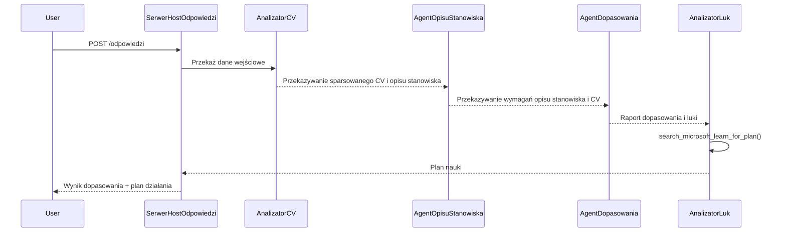

# Moduł 3 - Konfiguracja instrukcji, środowiska i instalacja zależności

⏱️ ~15 min

W tym module przekształcisz szkieletowy szablon w **własny** wieloagentowy przepływ pracy - ustawiając zmienne środowiskowe, pisząc instrukcje dla agentów, dodając narzędzie MCP, łącząc graf przepływu pracy oraz instalując zależności.

> **Odniesienie:** Kompletny działający kod znajduje się w [`PersonalCareerCopilot/main.py`](../../../../../workshop/lab02-multi-agent/PersonalCareerCopilot/main.py). Używaj go jako odniesienia podczas tworzenia własnego grafu przepływu pracy i bloków promptów.

---

## Jak współdziałają czterej agenci


```mermaid
sequenceDiagram
    participant User
    participant Server as SerwerHostOdpowiedzi
    participant RP as AnalizatorCV
    participant JD as AgentOpisuStanowiska
    participant MA as AgentDopasowania
    participant GA as AnalizatorLuk

    User->>Server: POST /odpowiedzi
    Server->>RP: Przekaż dane wejściowe
    RP-->>JD: Przekazywanie sparsowanego CV i opisu stanowiska
    JD-->>MA: Przekazywanie wymagań opisu stanowiska i CV
    MA-->>GA: Raport dopasowania i luki
    GA->>GA: search_microsoft_learn_for_plan()
    GA-->>Server: Plan nauki
    Server-->>User: Wynik dopasowania + plan działania
```

---

## Krok 1: Konfiguracja zmiennych środowiskowych

1. Otwórz plik **`.env`** w katalogu głównym projektu (utworzony przez kreatora szkieletowego).
2. Zamień symbole zastępcze na rzeczywiste wartości z Laboratorium 01.

<details open>
<summary><strong>🅰️ Ścieżka A - subskrypcja Foundry</strong></summary>

```env
FOUNDRY_PROJECT_ENDPOINT=https://<your-account>.services.ai.azure.com/api/projects/<your-project>
AZURE_AI_MODEL_DEPLOYMENT_NAME=gpt-4.1-mini
```

> **Gdzie znaleźć wartości:** Zobacz [Laboratorium 01, Moduł 1](../../lab01-single-agent/docs/01-setup.md#deploy-a-model--assign-rbac).

</details>

<details open>
<summary><strong>🅱️ Ścieżka B - Foundry Lokalny</strong></summary>

```env
FOUNDRY_PROJECT_ENDPOINT=http://localhost:5273/v1
AZURE_AI_MODEL_DEPLOYMENT_NAME=phi-4-mini
```

> Wszystkie wnioskowania odbywają się na twoim urządzeniu - żadne dane nie opuszczają twojego sprzętu. Uruchom `foundry model list`, aby potwierdzić dokładną nazwę modelu. Jedyny zewnętrzny żądanie to wywołanie narzędzia MCP do `https://learn.microsoft.com/api/mcp`.

> **Gdzie znaleźć wartości:** Zobacz [Laboratorium 01, Moduł 1 - ścieżka lokalna](../../lab01-single-agent/docs/01-setup.md#step-2-set-up-based-on-your-access).

</details>

> **Bezpieczeństwo:** Nigdy nie wprowadzaj `.env` do systemu kontroli wersji. Powinien on już być uwzględniony w `.gitignore`.

---

## Krok 2: Napisz instrukcje dla agentów

Instrukcje definiują rolę każdego agenta, format wyjścia oraz zasady. Otwórz `main.py` i określ (lub zamień) cztery stałe instrukcje - kompletne ciągi znajdują się w [`PersonalCareerCopilot/main.py`](../../../../../workshop/lab02-multi-agent/PersonalCareerCopilot/main.py).

### 2.1 `RESUME_PARSER_INSTRUCTIONS`
Parsuje życiorys na ustrukturyzowany profil kandydata **i** kopiuje opis stanowiska dosłownie do `[JOB DESCRIPTION PASS-THROUGH]`. Obie oznaczone sekcje muszą pojawić się w wyjściu.

> **Dlaczego przekazywanie dalej?** Przy `context_mode="last_agent"` ResumeParser jest **jedynym** agentem, który widzi oryginalną wiadomość użytkownika. Jeśli nie przekaże dalej JD, kolejni agenci nigdy go nie zobaczą.

### 2.2 `JOB_DESCRIPTION_INSTRUCTIONS`
Odczytuje `[PARSED RESUME]` i `[JOB DESCRIPTION PASS-THROUGH]` z wyjścia ResumeParsera. Generuje `[JD REQUIREMENTS]` (ustrukturyzowane wymagania) i `[PARSED RESUME PASS-THROUGH]` (kopię życiorysu dla MatchingAgent).

### 2.3 `MATCHING_AGENT_INSTRUCTIONS`
Odczytuje `[JD REQUIREMENTS]` oraz `[PARSED RESUME PASS-THROUGH]`. Tworzy ocenę dopasowania (0–100) z analizą matematyczną, dopasowanymi umiejętnościami, brakującymi umiejętnościami i zgodnością doświadczenia.

### 2.4 `GAP_ANALYZER_INSTRUCTIONS`
Odczytuje raport dopasowania. Dla **każdej** brakującej umiejętności wywołuje `search_microsoft_learn_for_plan`, aby pobrać zasoby Microsoft Learn. Tworzy jedną szczegółową kartę luki na umiejętność oraz tygodniowy plan nauki.

---

## Krok 3: Dodaj narzędzie MCP

GapAnalyzer wywołuje [Microsoft Learn MCP server](https://learn.microsoft.com/azure/foundry/agents/how-to/tools/model-context-protocol), aby pobrać rzeczywiste zasoby edukacyjne dla każdej luki w umiejętnościach. Pełna funkcja `search_microsoft_learn_for_plan` znajduje się w [`PersonalCareerCopilot/main.py`](../../../../../workshop/lab02-multi-agent/PersonalCareerCopilot/main.py).

Zarejestruj narzędzie na GapAnalyzer przy tworzeniu agenta:

```python
gap_analyzer = Agent(
    client=client,
    instructions=GAP_ANALYZER_INSTRUCTIONS,
    name="GapAnalyzer",
    tools=[search_microsoft_learn_for_plan],
)
```

> Zobacz [`PersonalCareerCopilot/main.py`](../../../../../workshop/lab02-multi-agent/PersonalCareerCopilot/main.py) dla pełnego grafu `WorkflowBuilder` z `FoundryChatClient`, `AgentExecutor` i wszystkimi wywołaniami `add_edge()`.

---

## Krok 4: Utwórz środowisko wirtualne i zainstaluj zależności

> ⚠️ **Nie pomijaj tego kroku.** Bez zainstalowanych zależności debugowanie za pomocą F5 nie zadziała.

### 4.1 Utwórz środowisko wirtualne

```powershell
python -m venv .venv
```

### 4.2 Aktywuj je

| System operacyjny | Polecenie |
|----|---------|
| **Windows (PowerShell)** | `.\.venv\Scripts\Activate.ps1` |
| **Windows (CMD)** | `.venv\Scripts\activate.bat` |
| **macOS / Linux** | `source .venv/bin/activate` |

Powinieneś zobaczyć `(.venv)` na swoim terminalu.

### 4.3 Zainstaluj zależności

```powershell
pip install -r requirements.txt
```

### 4.4 Zweryfikuj

```powershell
pip list | Select-String "agent-framework|mcp|debugpy"
```

Oczekiwane: `agent-framework-foundry`, `agent-framework-foundry-hosting`, `mcp` i `debugpy` są wymienione.

---

## Krok 5: Zweryfikuj uwierzytelnianie

<details open>
<summary><strong>🅰️ Ścieżka A - poświadczenia Azure</strong></summary>

```powershell
az account show --query "{name:name, id:id}" --output table
```

Jeśli to się nie powiedzie, uruchom [`az login`](https://learn.microsoft.com/cli/azure/authenticate-azure-cli-interactively).

Wszyscy czterej agenci korzystają z jednego `FoundryChatClient` i jednej `DefaultAzureCredential`. Jeśli uwierzytelnianie działa dla jednego, działa dla wszystkich.

</details>

<details open>
<summary><strong>🅱️ Ścieżka B - Foundry Lokalny</strong></summary>

Do testów lokalnych nie jest wymagane uwierzytelnianie.

</details>

---

### ✅ Punkt kontrolny

> Nie przechodź do Modułu 04, dopóki: **(1)** `(.venv)` nie będzie widoczne w twoim prompt ORAZ **(2)** `pip install -r requirements.txt` nie zakończy się powodzeniem.

- [ ] `.env` zawiera prawidłowy endpoint i nazwę wdrożenia modelu (nie symbole zastępcze)
- [ ] Wszystkie 4 stałe instrukcji agentów zdefiniowane w `main.py` (ResumeParser, JD Agent, MatchingAgent, GapAnalyzer)
- [ ] `search_microsoft_learn_for_plan` jako narzędzie MCP zdefiniowane i zarejestrowane na GapAnalyzer
- [ ] Obiekty `FoundryChatClient` + 4 `Agent` + 4 `AgentExecutor` utworzone w `main()`
- [ ] `WorkflowBuilder` buduje poprawny sekwencyjny graf z wszystkimi 3 wywołaniami `add_edge()`
- [ ] Środowisko wirtualne utworzone i aktywowane (`(.venv)` widoczne w prompt)
- [ ] `pip install -r requirements.txt` zakończone bez błędów
- [ ] **Ścieżka A:** `az account show` działa LUB ikona Konta VS Code pokazuje zalogowane konto

---

**Poprzedni:** [02 - Tworzenie wieloagentowego projektu](02-scaffold-multi-agent.md) · **Następny:** [04 - Wzorce orkiestracji →](04-orchestration-patterns.md)

---

<!-- CO-OP TRANSLATOR DISCLAIMER START -->
**Zastrzeżenie**:
Niniejszy dokument został przetłumaczony za pomocą usługi tłumaczenia AI [Co-op Translator](https://github.com/Azure/co-op-translator). Choć dążymy do dokładności, prosimy pamiętać, że automatyczne tłumaczenia mogą zawierać błędy lub niedokładności. Oryginalny dokument w jego języku źródłowym należy uznawać za autorytatywne źródło. W przypadku informacji krytycznych zalecane jest skorzystanie z profesjonalnego tłumaczenia wykonanego przez człowieka. Nie ponosimy odpowiedzialności za jakiekolwiek nieporozumienia lub błędne interpretacje wynikające z użycia tego tłumaczenia.
<!-- CO-OP TRANSLATOR DISCLAIMER END -->