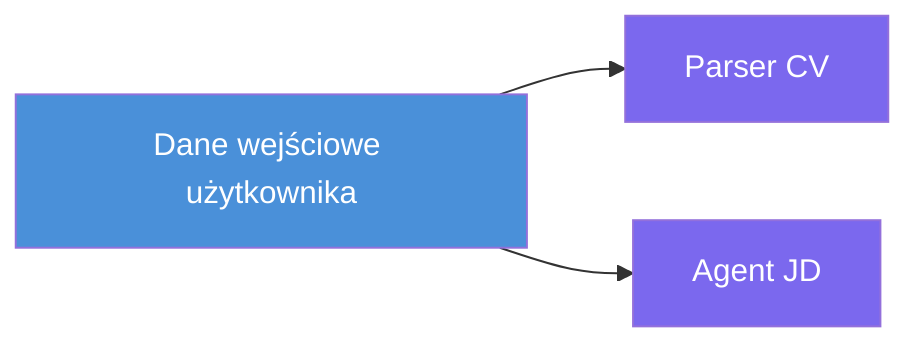
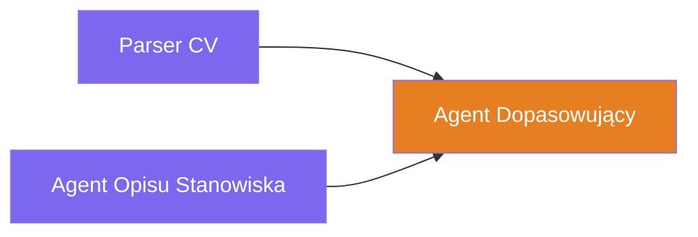
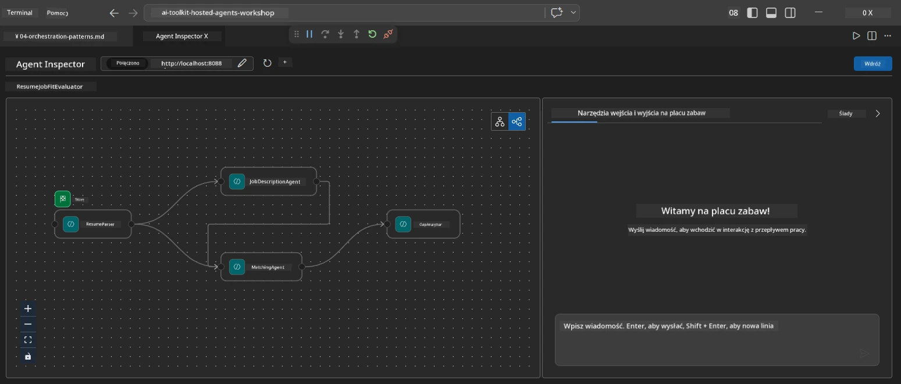
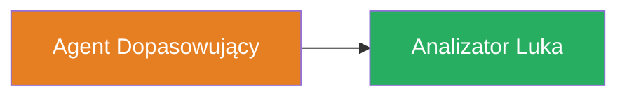
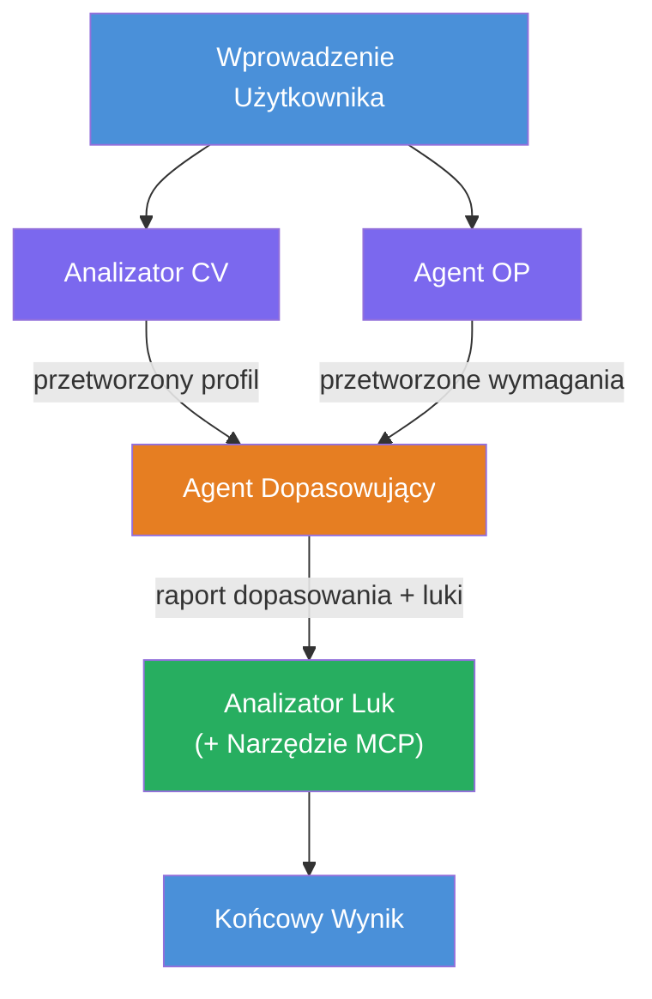
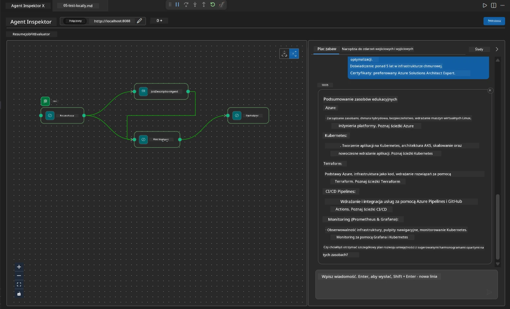

# Moduł 4 - Wzorce orkiestracji

W tym module poznasz wzorce orkiestracji użyte w Resume Job Fit Evaluator oraz nauczysz się, jak czytać, modyfikować i rozszerzać wykres przepływu pracy. Zrozumienie tych wzorców jest niezbędne do debugowania problemów z przepływem danych i tworzenia własnych [wielagentowych przepływów pracy](https://learn.microsoft.com/agent-framework/workflows/).

---

## Wzorzec 1: Rozchodzenie (równoległy podział)

Pierwszym wzorcem w przepływie pracy jest **rozchodzenie** - pojedyncze wejście jest wysyłane jednocześnie do wielu agentów.


W kodzie dzieje się tak, ponieważ `resume_parser` jest `start_executor` - otrzymuje pierwszą wiadomość od użytkownika. Następnie, ponieważ zarówno `jd_agent`, jak i `matching_agent` mają krawędzie od `resume_parser`, framework przesyła wyjście z `resume_parser` do obu agentów:

```python
.add_edge(resume_parser, jd_agent)         # Wynik ResumeParser → Agent JD
.add_edge(resume_parser, matching_agent)   # Wynik ResumeParser → MatchingAgent
```

**Dlaczego to działa:** ResumeParser i JD Agent przetwarzają różne aspekty tego samego wejścia. Uruchamianie ich równolegle skraca całkowite opóźnienie w porównaniu do ich wykonywania sekwencyjnego.

### Kiedy używać rozchodzenia

| Przypadek użycia | Przykład |
|------------------|----------|
| Niezależne podzadania | Parsowanie CV vs. parsowanie opisu stanowiska |
| Nadmiarowość / głosowanie | Dwóch agentów analizuje te same dane, trzeci wybiera najlepszą odpowiedź |
| Wieloformatowe wyjście | Jeden agent generuje tekst, inny generuje ustrukturyzowany JSON |

---

## Wzorzec 2: Zbieganie (agregacja)

Drugim wzorcem jest **zbieganie** - wiele wyjść agentów jest zbieranych i wysyłanych do pojedynczego agenta w dół strumienia.


W kodzie:

```python
.add_edge(resume_parser, matching_agent)   # Wynik ResumeParser → MatchingAgent
.add_edge(jd_agent, matching_agent)        # Wynik agenta JD → MatchingAgent
```

**Kluczowe zachowanie:** Gdy agent ma **dwa lub więcej krawędzi wejściowych**, framework automatycznie czeka, aż **wszyscy** agenci źródłowi zakończą działanie, zanim uruchomi agenta docelowego. MatchingAgent nie startuje, dopóki nie zakończą pracy zarówno ResumeParser, jak i JD Agent.

### Co otrzymuje MatchingAgent

Framework łączy wyjścia ze wszystkich agentów źródłowych. Dane wejściowe MatchingAgent wyglądają tak:

```
[ResumeParser output]
---
Candidate Profile:
  Name: Jane Doe
  Technical Skills: Python, Azure, Kubernetes, ...
  ...

[JobDescriptionAgent output]
---
Role Overview: Senior Cloud Engineer
Required Skills: Python, Azure, Terraform, ...
...
```

> **Uwaga:** Dokładny format łączenia zależy od wersji frameworka. Instrukcje dla agenta powinny być napisane tak, aby obsługiwały zarówno ustrukturyzowane, jak i nieustrukturyzowane wyjście z górnego źródła.



---

## Wzorzec 3: Łańcuch sekwencyjny

Trzecim wzorcem jest **łańcuch sekwencyjny** - wyjście jednego agenta trafia bezpośrednio do następnego.


W kodzie:

```python
.add_edge(matching_agent, gap_analyzer)    # Wyjście MatchingAgent → GapAnalyzer
```

To najprostszy wzorzec. GapAnalyzer otrzymuje ocenę dopasowania od MatchingAgent, dopasowane / brakujące umiejętności oraz luki. Następnie wywołuje [narzędzie MCP](https://learn.microsoft.com/azure/foundry/agents/how-to/tools/model-context-protocol) dla każdej luki, aby pobrać zasoby Microsoft Learn.

---

## Pełny wykres

Połączenie wszystkich trzech wzorców daje pełny przepływ pracy:


### Oś czasu wykonania

```mermaid
gantt
    title Oś czasu wykonania agenta
    dateFormat X
    axisFormat %s

    section Równoległy
    Resume Parser       :rp, 0, 3
    JD Agent            :jd, 0, 2

    section Sekwencyjny
    Matching Agent      :ma, 3, 5
    Gap Analyzer        :ga, 5, 9
```


> Całkowity czas zegara ściennego to około `max(ResumeParser, JD Agent) + MatchingAgent + GapAnalyzer`. GapAnalyzer jest zwykle najszybszy, ponieważ wykonuje wiele wywołań narzędzia MCP (po jednym na każdą lukę).

---

## Czytanie kodu WorkflowBuilder

Oto pełna funkcja `create_workflow()` z `main.py`, z adnotacjami:

```python
def create_workflow(resume_parser, jd_agent, matching_agent, gap_analyzer):
    workflow = (
        WorkflowBuilder(
            name="ResumeJobFitEvaluator",

            # Pierwszy agent otrzymujący dane wejściowe od użytkownika
            start_executor=resume_parser,

            # Agent(i), którego wyjście staje się ostateczną odpowiedzią
            output_executors=[gap_analyzer],
        )
        # Rozgałęzienie: wyjście ResumeParser trafia zarówno do JD Agent, jak i MatchingAgent
        .add_edge(resume_parser, jd_agent)
        .add_edge(resume_parser, matching_agent)

        # Scalanie: MatchingAgent czeka na ResumeParser i JD Agent
        .add_edge(jd_agent, matching_agent)

        # Sekwencyjnie: wyjście MatchingAgent zasila GapAnalyzer
        .add_edge(matching_agent, gap_analyzer)

        .build()
    )
    return workflow.as_agent()
```

### Tabela podsumowująca krawędzie

| # | Krawędź | Wzorzec | Efekt |
|---|---------|---------|-------|
| 1 | `resume_parser → jd_agent` | Rozchodzenie | JD Agent otrzymuje wyjście z ResumeParser (plus oryginalne wejście użytkownika) |
| 2 | `resume_parser → matching_agent` | Rozchodzenie | MatchingAgent otrzymuje wyjście z ResumeParser |
| 3 | `jd_agent → matching_agent` | Zbieganie | MatchingAgent otrzymuje też wyjście z JD Agent (czeka na oba) |
| 4 | `matching_agent → gap_analyzer` | Sekwencyjne | GapAnalyzer otrzymuje raport dopasowania + listę luk |

---

## Modyfikowanie wykresu

### Dodawanie nowego agenta

Aby dodać piątego agenta (np. **InterviewPrepAgent**, który generuje pytania na podstawie analizy luk):

```python
# 1. Zdefiniuj instrukcje
INTERVIEW_PREP_INSTRUCTIONS = """\
You are the Interview Prep Agent.
Given a gap analysis and fit report, generate 10 targeted interview questions
the candidate should prepare for.
"""

# 2. Utwórz agenta (wewnątrz bloku async with)
AzureAIAgentClient(
    project_endpoint=PROJECT_ENDPOINT,
    model_deployment_name=MODEL_DEPLOYMENT_NAME,
    credential=credential,
).as_agent(
    name="InterviewPrepAgent",
    instructions=INTERVIEW_PREP_INSTRUCTIONS,
) as interview_prep,

# 3. Dodaj krawędzie w create_workflow()
.add_edge(matching_agent, interview_prep)   # odbiera raport dopasowania
.add_edge(gap_analyzer, interview_prep)     # odbiera również karty luki

# 4. Aktualizuj output_executors
output_executors=[interview_prep],  # teraz ostateczny agent
```

### Zmiana kolejności wykonania

Aby uruchomić JD Agent **po** ResumeParser (sekwencyjnie zamiast równolegle):

```python
# Usuń: .add_edge(resume_parser, jd_agent)  ← już istnieje, zachowaj to
# Usuń ukrytą równoległość poprzez NIE pozwalanie jd_agent na bezpośrednie odbieranie danych od użytkownika
# start_executor najpierw wysyła do resume_parser, a jd_agent otrzymuje
# wyjście resume_parser poprzez krawędź. To sprawia, że są sekwencyjne.
```

> **Ważne:** `start_executor` jest jedynym agentem otrzymującym surowe wejście użytkownika. Wszystkie pozostałe agenty otrzymują wyjścia ze swoich krawędzi wejściowych. Jeśli chcesz, aby agent również otrzymywał surowe wejście użytkownika, musi mieć krawędź od `start_executor`.

---

## Typowe błędy w wykresie

| Błąd | Objaw | Naprawa |
|------|-------|---------|
| Brak krawędzi do `output_executors` | Agent działa, ale wyjście jest puste | Upewnij się, że istnieje ścieżka z `start_executor` do każdego agenta w `output_executors` |
| Zależność cykliczna | Nieskończona pętla lub timeout | Sprawdź, czy żaden agent nie odsyła danych do agenta wyżej w hierarchii |
| Agent w `output_executors` bez krawędzi wejściowej | Puste wyjście | Dodaj przynajmniej jedną krawędź `add_edge(source, that_agent)` |
| Wiele `output_executors` bez zbiegania | Wyjście zawiera odpowiedź tylko jednego agenta | Użyj pojedynczego agenta wyjściowego agregującego, lub zaakceptuj wiele wyjść |
| Brak `start_executor` | Błąd `ValueError` podczas budowania | Zawsze określ `start_executor` w `WorkflowBuilder()` |

---

## Debugowanie wykresu

### Korzystanie z Agent Inspector

1. Uruchom agenta lokalnie (F5 lub terminal - zobacz [Moduł 5](05-test-locally.md)).
2. Otwórz Agent Inspector (`Ctrl+Shift+P` → **Foundry Toolkit: Open Agent Inspector**).
3. Wyślij testową wiadomość.
4. W panelu odpowiedzi Inspector zobaczysz **strumieniowe wyjście** - pokazuje wkład każdego agenta w kolejności.



### Korzystanie z logowania

Dodaj logowanie do `main.py`, aby śledzić przepływ danych:

```python
import logging
logger = logging.getLogger("resume-job-fit")

# W create_workflow(), po zbudowaniu:
logger.info("Workflow graph built with edges: RP→JD, RP→MA, JD→MA, MA→GA")
```

Logi serwera pokazują kolejność wykonania agentów i wywołania narzędzia MCP:

```
INFO:resume-job-fit:Starting Resume -> Job Fit Evaluator HTTP server...
INFO:resume-job-fit:Server running on http://localhost:8088
INFO:agent_framework:Executing agent: ResumeParser
INFO:agent_framework:Executing agent: JobDescriptionAgent
INFO:agent_framework:Waiting for upstream agents: ResumeParser, JobDescriptionAgent
INFO:agent_framework:Executing agent: MatchingAgent
INFO:agent_framework:Executing agent: GapAnalyzer
INFO:agent_framework:Tool call: search_microsoft_learn_for_plan(skill="Kubernetes")
POST https://learn.microsoft.com/api/mcp → 200
INFO:agent_framework:Tool call: search_microsoft_learn_for_plan(skill="Terraform")
POST https://learn.microsoft.com/api/mcp → 200
```

---

### Checkpoint

- [ ] Potrafisz zidentyfikować trzy wzorce orkiestracji w przepływie pracy: rozchodzenie, zbieganie oraz łańcuch sekwencyjny
- [ ] Rozumiesz, że agenci z wieloma krawędziami wejściowymi czekają, aż wszyscy agenci źródłowi zakończą działanie
- [ ] Potrafisz czytać kod `WorkflowBuilder` i dopasować każde wywołanie `add_edge()` do wizualnego wykresu
- [ ] Rozumiesz oś czasu wykonania: najpierw równoległe agenty, potem agregacja, na końcu sekwencja
- [ ] Wiesz, jak dodać nowego agenta do wykresu (zdefiniować instrukcje, stworzyć agenta, dodać krawędzie, zaktualizować wyjście)
- [ ] Potrafisz zidentyfikować typowe błędy w wykresie i ich objawy

---

**Poprzedni:** [03 - Konfiguracja agentów i środowiska](03-configure-agents.md) · **Następny:** [05 - Test lokalny →](05-test-locally.md)

---

<!-- CO-OP TRANSLATOR DISCLAIMER START -->
**Zastrzeżenie**:
Dokument ten został przetłumaczony za pomocą usługi tłumaczenia AI [Co-op Translator](https://github.com/Azure/co-op-translator). Chociaż dążymy do dokładności, prosimy mieć na uwadze, że automatyczne tłumaczenia mogą zawierać błędy lub nieścisłości. Oryginalny dokument w jego języku źródłowym powinien być uważany za źródło autorytatywne. W przypadku informacji krytycznych zaleca się skorzystanie z profesjonalnego tłumaczenia wykonanego przez człowieka. Nie ponosimy odpowiedzialności za jakiekolwiek nieporozumienia lub błędne interpretacje wynikające z korzystania z tego tłumaczenia.
<!-- CO-OP TRANSLATOR DISCLAIMER END -->