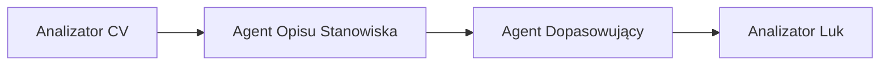
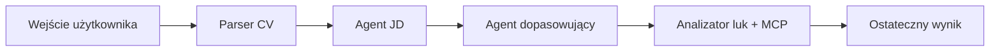

# Moduł 4 - Wzorce orkiestracji

⏱️ ~10 min

W tym module poznajesz wzorce orkiestracji stosowane w Resume Job Fit Evaluator oraz uczysz się, jak czytać, modyfikować i rozszerzać grafik przepływu pracy. Zrozumienie tych wzorców jest niezbędne do debugowania problemów z przepływem danych oraz tworzenia własnych [wieloekagentowych przepływów pracy](https://learn.microsoft.com/agent-framework/workflows/).

---

## Wzorzec 1: Łańcuch sekwencyjny

Podstawowym wzorcem w przepływie pracy jest **łańcuch sekwencyjny** - wyjście każdego agenta jest bezpośrednio przekazywane do kolejnego.


```mermaid
flowchart LR
    RP[Analizator CV] --> JD[Agent Opisu Stanowiska]
    JD --> MA[Agent Dopasowujący]
    MA --> GA[Analizator Luk]
```

W kodzie każde wywołanie `add_edge()` tworzy jeden krok w łańcuchu:

```python
.add_edge(resume_executor, jd_executor)       # Wynik ResumeParser → JD Agent
.add_edge(jd_executor, matching_executor)     # Wynik JD Agent → MatchingAgent
.add_edge(matching_executor, gap_executor)    # Wynik MatchingAgent → GapAnalyzer
```

> **Dlaczego sekwencyjny, a nie rozgałęzienie/złączenie?** `WorkflowBuilder` używa **semantyki LUB (OR)** dla krawędzi przychodzących: executor na dole uruchamia się, gdy **jakikolwiek** poprzednik zakończy pracę. Gdyby `matching_executor` miał dwie krawędzie przychodzące (z `resume_executor` i `jd_executor`), uruchamiałby się dwukrotnie - raz po zakończeniu ResumeParser i ponownie po zakończeniu JD Agent - powodując, że GapAnalyzer również uruchomi się dwa razy, a wynik pojawi się dwukrotnie. Sekwencyjna linia produkcyjna całkowicie unika tego problemu.

## Wzorzec 2: Przekazywanie zawartości

Ponieważ `context_mode="last_agent"` oznacza, że każdy executor widzi tylko wyjście swojego **bezpośredniego poprzednika**, agenci w łańcuchu sekwencyjnym muszą explicite przekazywać naprzód dane, które potrzebują agenci położeni niżej w łańcuchu.

W tym przepływie pracy:
- **ResumeParser** kopiuje opis pracy [JOB DESCRIPTION] dosłownie do `[JOB DESCRIPTION PASS-THROUGH]` (aby JD Agent mógł go znaleźć).
- **JD Agent** kopiuje `[PARSED RESUME]` dosłownie do `[PARSED RESUME PASS-THROUGH]` (aby MatchingAgent mógł porównać oba profile).

```
ResumeParser output
└─ [PARSED RESUME]               ← extracted by JD Agent
└─ [JOB DESCRIPTION PASS-THROUGH] ← extracted by JD Agent

JD Agent output
└─ [JD REQUIREMENTS]             ← extracted by MatchingAgent
└─ [PARSED RESUME PASS-THROUGH]  ← extracted by MatchingAgent
```

Każda sekcja przekazywania musi być kopiowana **dosłownie** - streszczanie lub parafrazowanie łamie działanie agenta zależnego.

---

## Pełny grafik

Połączenie wzorców łańcucha sekwencyjnego i przekazywania zawartości tworzy pełny przepływ pracy:


```mermaid
flowchart LR
    U[Wejście użytkownika] --> RP[Parser CV]
    RP --> JD[Agent JD]
    JD --> MA[Agent dopasowujący]
    MA --> GA[Analizator luk + MCP]
    GA --> O[Ostateczny wynik]
```

Agent Inspector pokazuje tę samą strukturę grafu podczas działania agenta lokalnie. Odwiedź [Moduł 5 - Test lokalny](05-test-locally.md) po zrzuty ekranu.

---

## Czytanie kodu WorkflowBuilder

Pełna funkcja `create_workflow()` znajduje się w [`PersonalCareerCopilot/main.py`](../../../../../workshop/lab02-multi-agent/PersonalCareerCopilot/main.py). Trzy wywołania `add_edge()` budują linię sekwencyjną:

| # | Krawędź | Efekt |
|---|---------|-------|
| 1 | `resume_executor → jd_executor` | JD Agent otrzymuje `[PARSED RESUME]` + `[JOB DESCRIPTION PASS-THROUGH]` |
| 2 | `jd_executor → matching_executor` | MatchingAgent otrzymuje `[JD REQUIREMENTS]` + `[PARSED RESUME PASS-THROUGH]` |
| 3 | `matching_executor → gap_executor` | GapAnalyzer otrzymuje raport dopasowania + listę luk |

---

## Modyfikacja grafu

### Dodanie nowego agenta

Aby dodać piątego agenta (np. **InterviewPrepAgent** po GapAnalyzer):

1. Zdefiniuj stałą `INTERVIEW_PREP_INSTRUCTIONS`.
2. Stwórz obiekty `Agent` + `AgentExecutor` (ten sam wzorzec co istniejące cztery).
3. Dodaj `.add_edge(gap_executor, interview_exec)` w `WorkflowBuilder`.
4. Zaktualizuj `output_executors=[interview_exec]`.

> **Ważne:** `start_executor` to jedyny agent otrzymujący surowe dane wejściowe od użytkownika. Wszyscy inni agenci otrzymują wyjście z ich krawędzi upstream.

---

## Typowe błędy w grafie

| Błąd | Objaw | Naprawa |
|-------|-------|---------|
| Brak krawędzi do `output_executors` | Agent działa, ale wyjście jest puste | Upewnij się, że istnieje ścieżka z `start_executor` do każdego agenta w `output_executors` |
| Cykl zależności | Nieskończona pętla lub timeout | Sprawdź, czy żaden agent nie przekazuje danych z powrotem do agenta upstream |
| Agent w `output_executors` bez krawędzi przychodzącej | Puste wyjście | Dodaj przynajmniej jedną krawędź `add_edge(source, that_agent)` |
| Wiele `output_executors` bez fan-in | Wyjście zawiera odpowiedź tylko jednego agenta | Użyj jednego agenta wyjściowego agregującego lub zaakceptuj wiele wyjść |
| Brak `start_executor` | `ValueError` podczas budowania | Zawsze określaj `start_executor` w `WorkflowBuilder()` |

---

## Debugowanie grafu

### Korzystanie z Agent Inspector

1. Uruchom agenta lokalnie za pomocą F5.
2. Otwórz Agent Inspector (`Ctrl+Shift+P` → **Foundry Toolkit: Open Agent Inspector**).
3. Wyślij wiadomość testową.
4. W panelu odpowiedzi Inspectora szukaj **streamingu wyjścia** - pokazuje wkład każdego agenta w kolejności.


### Korzystanie z logowania

Dodaj logowanie do `main.py` aby śledzić przepływ danych:

```python
import logging
logger = logging.getLogger("resume-job-fit")

# W funkcji main(), po zbudowaniu workflow:
logger.info("Workflow graph built with edges: RP→JD, JD→MA, MA→GA")
```

Logi serwera pokazują kolejność wykonania agentów oraz wywołania narzędzi MCP:

```
INFO:agent_framework:Executing agent: ResumeParser
INFO:agent_framework:Executing agent: JobDescriptionAgent
INFO:agent_framework:Executing agent: MatchingAgent
INFO:agent_framework:Executing agent: GapAnalyzer
INFO:agent_framework:Tool call: search_microsoft_learn_for_plan(skill="Kubernetes")
POST https://learn.microsoft.com/api/mcp → 200
INFO:agent_framework:Tool call: search_microsoft_learn_for_plan(skill="Terraform")
POST https://learn.microsoft.com/api/mcp → 200
```

---

### Checkpoint

- [ ] Potrafisz zidentyfikować dwa wzorce orkiestracji w przepływie pracy: łańcuch sekwencyjny i przekazywanie zawartości
- [ ] Rozumiesz, dlaczego `context_mode="last_agent"` wymaga explicite przekazywania danych pomiędzy agentami
- [ ] Potrafisz czytać kod `WorkflowBuilder` i odmapować każde wywołanie `add_edge()` na wizualny graf
- [ ] Wiesz, jak dodać nowego agenta na koniec linii produkcyjnej
- [ ] Potrafisz zidentyfikować typowe błędy w grafie oraz ich objawy

---

**Poprzedni:** [03 - Konfiguracja agentów i środowiska](03-configure-agents.md) · **Następny:** [05 - Test lokalny →](05-test-locally.md)

---

<!-- CO-OP TRANSLATOR DISCLAIMER START -->
**Zastrzeżenie**:
Niniejszy dokument został przetłumaczony za pomocą usługi tłumaczenia AI [Co-op Translator](https://github.com/Azure/co-op-translator). Choć dążymy do dokładności, prosimy pamiętać, że automatyczne tłumaczenia mogą zawierać błędy lub niedokładności. Oryginalny dokument w jego języku źródłowym należy uznawać za autorytatywne źródło. W przypadku informacji krytycznych zalecane jest skorzystanie z profesjonalnego tłumaczenia wykonanego przez człowieka. Nie ponosimy odpowiedzialności za jakiekolwiek nieporozumienia lub błędne interpretacje wynikające z użycia tego tłumaczenia.
<!-- CO-OP TRANSLATOR DISCLAIMER END -->