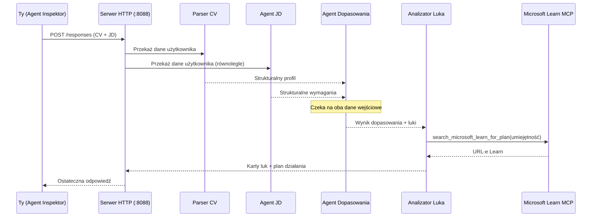
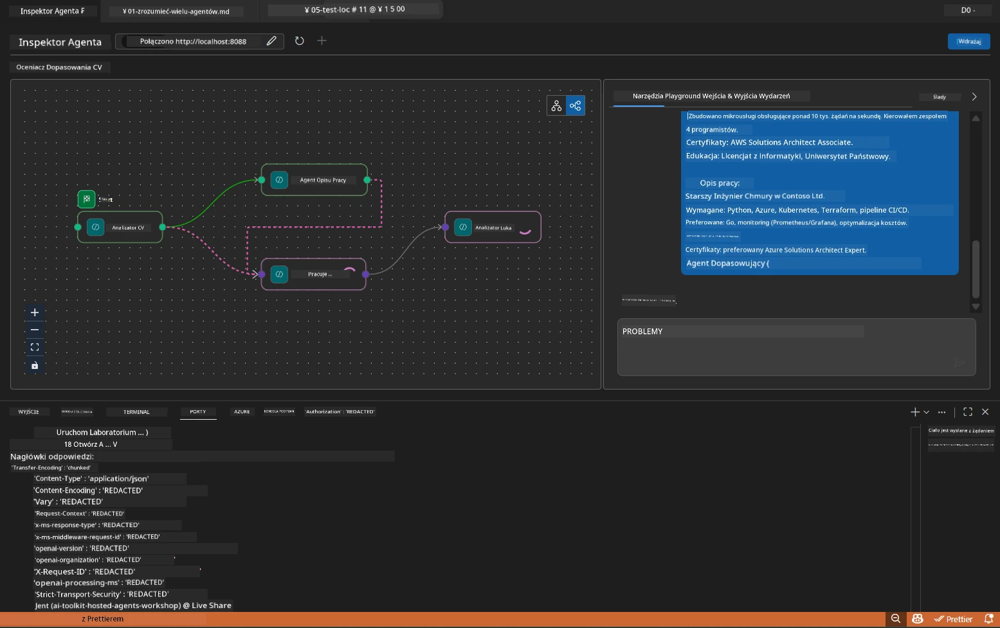

# Moduł 5 - Test lokalny (wieloagentowy)

W tym module uruchomisz lokalnie przepływ pracy wieloagentowej, przetestujesz go za pomocą Agent Inspector oraz zweryfikujesz, czy wszystkie cztery agenty i narzędzie MCP działają poprawnie przed wdrożeniem do Foundry.

### Co się dzieje podczas lokalnego testu


---

## Krok 1: Uruchom serwer agenta

### Opcja A: Używanie zadania w VS Code (zalecane)

1. Naciśnij `Ctrl+Shift+P` → wpisz **Tasks: Run Task** → wybierz **Run Lab02 HTTP Server**.
2. Zadanie uruchamia serwer z debugpy podłączonym do portu `5679` oraz agenta na porcie `8088`.
3. Poczekaj, aż wyświetli się:

```
INFO:resume-job-fit:Starting Resume -> Job Fit Evaluator HTTP server...
INFO:resume-job-fit:Server running on http://localhost:8088
```

### Opcja B: Ręczne użycie terminala

```powershell
cd workshop\lab02-multi-agent\PersonalCareerCopilot
```

Aktywuj środowisko wirtualne:

**PowerShell (Windows):**
```powershell
.\.venv\Scripts\Activate.ps1
```

**macOS/Linux:**
```bash
source .venv/bin/activate
```

Uruchom serwer:

```powershell
python -m debugpy --listen 127.0.0.1:5679 -m agentdev run main.py --verbose --port 8088
```

### Opcja C: Użycie F5 (tryb debugowania)

1. Naciśnij `F5` lub przejdź do **Run and Debug** (`Ctrl+Shift+D`).
2. Wybierz konfigurację uruchomienia **Lab02 - Multi-Agent** z listy rozwijanej.
3. Serwer uruchomi się z pełnym wsparciem punktów przerwania.

> **Wskazówka:** Tryb debugowania pozwala ustawiać punkty przerwania w `search_microsoft_learn_for_plan()`, aby sprawdzić odpowiedzi MCP, lub w ciągach instrukcji agentów, aby zobaczyć, co otrzymuje każdy agent.

---

## Krok 2: Otwórz Agent Inspector

1. Naciśnij `Ctrl+Shift+P` → wpisz **Foundry Toolkit: Open Agent Inspector**.
2. Agent Inspector otworzy się w karcie przeglądarki pod adresem `http://localhost:5679`.
3. Powinieneś zobaczyć interfejs agenta gotowy do przyjmowania wiadomości.

> **Jeśli Agent Inspector się nie otwiera:** Upewnij się, że serwer jest w pełni uruchomiony (widzisz wpis "Server running"). Jeśli port 5679 jest zajęty, zobacz [Moduł 8 - Rozwiązywanie problemów](08-troubleshooting.md).

---

## Krok 3: Uruchom testy wstępne

Uruchom te trzy testy po kolei. Każdy test sprawdza coraz większą część przepływu pracy.

### Test 1: Podstawowe CV + opis stanowiska

Wklej poniższe do Agent Inspector:

```
Resume:
Jane Doe
Senior Software Engineer with 5 years of experience in Python, Django, and AWS.
Built microservices handling 10K+ requests/second. Led a team of 4 developers.
Certifications: AWS Solutions Architect Associate.
Education: B.S. Computer Science, State University.

Job Description:
Senior Cloud Engineer at Contoso Ltd.
Required: Python, Azure, Kubernetes, Terraform, CI/CD pipelines.
Preferred: Go, monitoring (Prometheus/Grafana), cost optimization.
Experience: 5+ years in cloud infrastructure.
Certifications: Azure Solutions Architect Expert preferred.
```

**Oczekiwana struktura odpowiedzi:**

Odpowiedź powinna zawierać wyjście od wszystkich czterech agentów we właściwej kolejności:

1. **Wyjście Resume Parser** - Ustrukturyzowany profil kandydata z umiejętnościami pogrupowanymi według kategorii
2. **Wyjście JD Agent** - Ustrukturyzowane wymagania z rozdzieleniem umiejętności wymaganych i preferowanych
3. **Wyjście Matching Agent** - Wynik dopasowania (0-100) z rozbiciem, dopasowane umiejętności, brakujące umiejętności, luki
4. **Wyjście Gap Analyzer** - Indywidualne karty luk dla każdej brakującej umiejętności, każda z linkami do Microsoft Learn



### Co zweryfikować w Teście 1

| Sprawdzenie | Oczekiwane | Zdane? |
|-------------|------------|--------|
| Odpowiedź zawiera wynik dopasowania | Liczba od 0 do 100 z rozbiciem | |
| Wymienione umiejętności dopasowane | Python, CI/CD (częściowo), itp. | |
| Wymienione umiejętności brakujące | Azure, Kubernetes, Terraform, itp. | |
| Istnieją karty luk dla każdej brakującej umiejętności | Jedna karta na umiejętność | |
| Obecne linki Microsoft Learn | Prawdziwe linki `learn.microsoft.com` | |
| Brak komunikatów o błędach w odpowiedzi | Czysta, ustrukturyzowana odpowiedź | |

### Test 2: Weryfikacja działania narzędzia MCP

Podczas uruchamiania Testu 1 sprawdź **terminal serwera** pod kątem wpisów dziennika MCP:

```
GET https://learn.microsoft.com/api/mcp → 405 (Method Not Allowed)
POST https://learn.microsoft.com/api/mcp → 200
DELETE https://learn.microsoft.com/api/mcp → 405 (Method Not Allowed)
```

| Wpis w dzienniku | Znaczenie | Oczekiwane? |
|------------------|-----------|-------------|
| `GET ... → 405` | Klient MCP sprawdza GET podczas inicjalizacji | Tak - normalne |
| `POST ... → 200` | Rzeczywiste wywołanie narzędzia do serwera Microsoft Learn MCP | Tak - to jest właściwe wywołanie |
| `DELETE ... → 405` | Klient MCP sprawdza DELETE podczas czyszczenia | Tak - normalne |
| `POST ... → 4xx/5xx` | Wywołanie narzędzia nie powiodło się | Nie - zobacz [Rozwiązywanie problemów](08-troubleshooting.md) |

> **Kluczowa uwaga:** Linie `GET 405` i `DELETE 405` to **oczekiwane zachowanie**. Nie martw się, chyba że wywołania `POST` zwracają inne niż 200 kody statusu.

### Test 3: Przypadek graniczny - kandydat o wysokim dopasowaniu

Wklej CV, które bardzo dobrze odpowiada opisowi stanowiska, aby zweryfikować, jak GapAnalyzer radzi sobie z takimi scenariuszami:

```
Resume:
Alex Chen
Senior Cloud Engineer with 7 years of experience.
Skills: Python, Azure (AKS, Functions, DevOps), Kubernetes, Terraform, CI/CD (GitHub Actions, Azure Pipelines), Go, Prometheus, Grafana, cost optimization.
Certifications: Azure Solutions Architect Expert, Azure DevOps Engineer Expert.
Led infrastructure migration to Azure for 3 enterprise clients.
Education: M.S. Computer Science, Tech University.

Job Description:
Senior Cloud Engineer at Contoso Ltd.
Required: Python, Azure, Kubernetes, Terraform, CI/CD pipelines.
Preferred: Go, monitoring (Prometheus/Grafana), cost optimization.
Experience: 5+ years in cloud infrastructure.
Certifications: Azure Solutions Architect Expert preferred.
```

**Oczekiwane zachowanie:**
- Wynik dopasowania powinien wynosić **80+** (większość umiejętności się zgadza)
- Karty luk powinny skupiać się na dopracowaniu/przygotowaniu do rozmowy, a nie na podstawowej nauce
- Instrukcje GapAnalyzer mówią: „Jeśli dopasowanie >= 80, skup się na dopracowaniu/przygotowaniu do rozmowy”

---

## Krok 4: Weryfikacja kompletności wyników

Po uruchomieniu testów sprawdź, czy wyjście spełnia poniższe kryteria:

### Lista kontrolna struktury wyjścia

| Sekcja | Agent | Obecna? |
|--------|-------|---------|
| Profil kandydata | Resume Parser | |
| Umiejętności techniczne (pogrupowane) | Resume Parser | |
| Przegląd roli | JD Agent | |
| Umiejętności wymagane vs. preferowane | JD Agent | |
| Wynik dopasowania z rozbiciem | Matching Agent | |
| Umiejętności dopasowane / brakujące / częściowe | Matching Agent | |
| Karta luki na każdą brakującą umiejętność | Gap Analyzer | |
| Linki Microsoft Learn w kartach luk | Gap Analyzer (MCP) | |
| Kolejność nauki (numerowana) | Gap Analyzer | |
| Podsumowanie osi czasu | Gap Analyzer | |

### Typowe problemy na tym etapie

| Problem | Przyczyna | Naprawa |
|---------|-----------|---------|
| Tylko 1 karta luki (reszta obcięta) | W instrukcjach GapAnalyzer brakuje akapitu CRITICAL | Dodaj akapit `CRITICAL:` do `GAP_ANALYZER_INSTRUCTIONS` - zobacz [Moduł 3](03-configure-agents.md) |
| Brak linków Microsoft Learn | Punkt końcowy MCP niedostępny | Sprawdź połączenie internetowe. Zweryfikuj `MICROSOFT_LEARN_MCP_ENDPOINT` w `.env` — powinno być `https://learn.microsoft.com/api/mcp` |
| Pusty wynik | Nie ustawiono `PROJECT_ENDPOINT` lub `MODEL_DEPLOYMENT_NAME` | Sprawdź wartości w pliku `.env`. Uruchom `echo $env:PROJECT_ENDPOINT` w terminalu |
| Wynik dopasowania to 0 lub brak | MatchingAgent nie otrzymał danych z wyżej połączonych agentów | Sprawdź, czy istnieją `add_edge(resume_parser, matching_agent)` i `add_edge(jd_agent, matching_agent)` w `create_workflow()` |
| Agent się uruchamia, ale natychmiast zamyka | Błąd importu lub brakująca zależność | Uruchom ponownie `pip install -r requirements.txt`. Sprawdź terminal pod kątem błędów |
| Błąd `validate_configuration` | Brakujące zmienne środowiskowe | Utwórz `.env` z `PROJECT_ENDPOINT=<twoj-endpoint>` i `MODEL_DEPLOYMENT_NAME=<twoj-model>` |

---

## Krok 5: Testuj na własnych danych (opcjonalnie)

Spróbuj wkleić swoje własne CV i rzeczywisty opis stanowiska. To pomoże zweryfikować:

- Czy agenty obsługują różne formaty CV (chronologiczne, funkcjonalne, hybrydowe)
- Czy JD Agent radzi sobie z różnymi stylami opisów (wypunktowanie, akapity, ustrukturyzowane)
- Czy narzędzie MCP zwraca odpowiednie zasoby dla rzeczywistych umiejętności
- Czy karty luk są spersonalizowane do Twojego konkretnego doświadczenia

> **Uwaga o prywatności:** Podczas testów lokalnych Twoje dane pozostają na Twoim komputerze i są wysyłane tylko do Twojego wdrożenia Azure OpenAI. Nie są logowane ani przechowywane przez infrastrukturę warsztatu. Jeśli wolisz, używaj nazw zastępczych (np. „Jan Kowalski” zamiast prawdziwego imienia).

---

### Punkt kontrolny

- [ ] Serwer uruchomił się pomyślnie na porcie `8088` (w logu widoczny wpis "Server running")
- [ ] Agent Inspector otworzył się i połączył z agentem
- [ ] Test 1: Pełna odpowiedź z wynikiem dopasowania, dopasowanymi/brakującymi umiejętnościami, kartami luk i linkami Microsoft Learn
- [ ] Test 2: Logi MCP pokazują `POST ... → 200` (wywołania narzędzia zakończone powodzeniem)
- [ ] Test 3: Kandydat o wysokim dopasowaniu otrzymuje wynik 80+ z rekomendacjami skupionymi na dopracowaniu
- [ ] Wszystkie karty luk są obecne (po jednej na brakującą umiejętność, brak obcięcia)
- [ ] Brak błędów lub śladów stosu w terminalu serwera

---

**Poprzedni:** [04 - Wzorce orkiestracji](04-orchestration-patterns.md) · **Następny:** [06 - Wdrożenie do Foundry →](06-deploy-to-foundry.md)

---

<!-- CO-OP TRANSLATOR DISCLAIMER START -->
**Zastrzeżenie**:  
Niniejszy dokument został przetłumaczony za pomocą usługi tłumaczenia AI [Co-op Translator](https://github.com/Azure/co-op-translator). Mimo że staramy się zapewnić dokładność, prosimy pamiętać, że tłumaczenia automatyczne mogą zawierać błędy lub nieścisłości. Oryginalny dokument w języku źródłowym powinien być uważany za źródło wiarygodne. W przypadku informacji krytycznych zalecane jest skorzystanie z tłumaczenia wykonanego przez profesjonalnego tłumacza. Nie ponosimy odpowiedzialności za jakiekolwiek nieporozumienia lub błędne interpretacje wynikające z korzystania z tego tłumaczenia.
<!-- CO-OP TRANSLATOR DISCLAIMER END -->