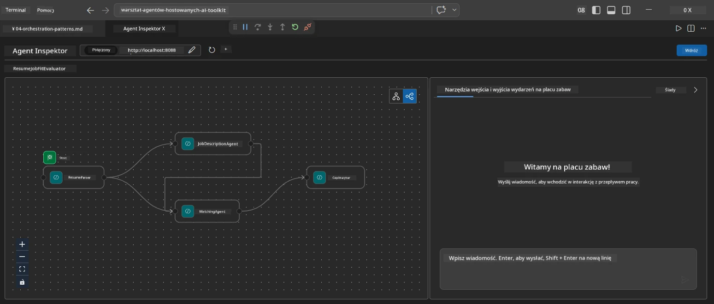
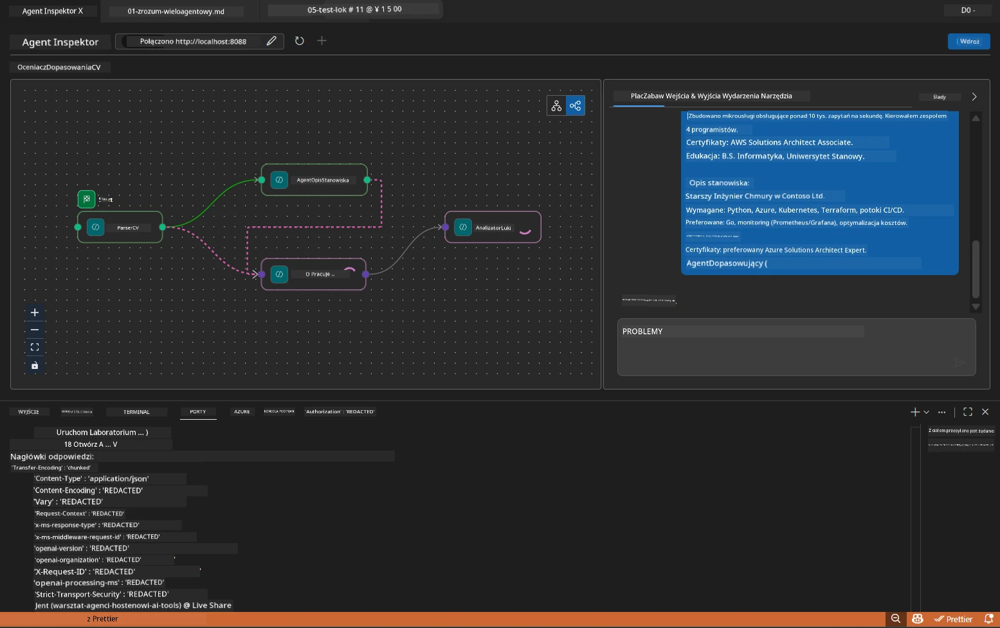
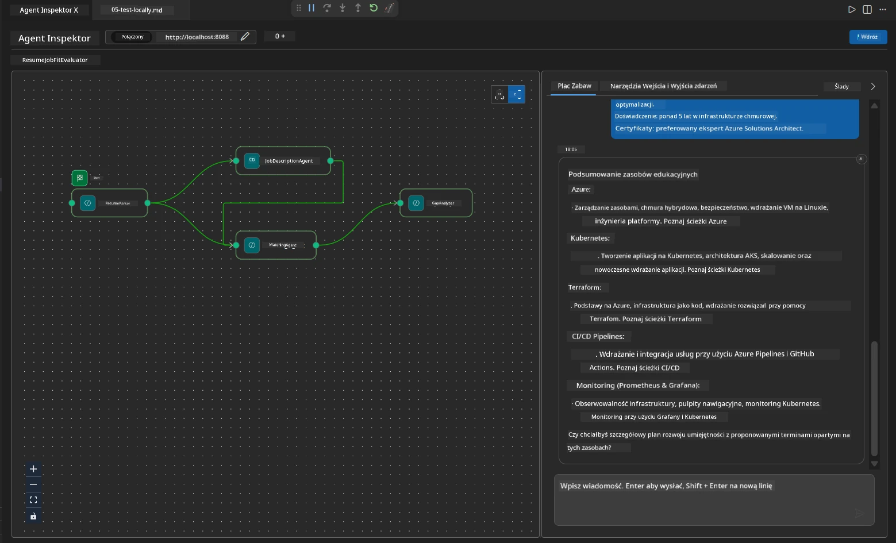

# Moduł 5 - Testowanie lokalne

⏱️ ~15 min

W tym module uruchomisz wielo-agentowy przepływ pracy lokalnie, przetestujesz go za pomocą Agent Inspector i zweryfikujesz, czy wszyscy czterej agenci oraz narzędzie MCP działają poprawnie przed wdrożeniem.

---

## Krok 1: Uruchom serwer agenta

### Opcja A: Użycie zadania VS Code (zalecane)

1. Otwórz `workshop/lab02-multi-agent/PersonalCareerCopilot/` jako folder w VS Code.
2. Naciśnij `Ctrl+Shift+P` → wpisz **Tasks: Run Task** → wybierz **Run Agent HTTP Server**.
3. Zadanie uruchomi serwer z dołączonym debugpy na porcie `5679` oraz agenta na porcie `8088`.
4. Poczekaj, aż w wyjściu pojawi się:

```
INFO:resume-job-fit:Starting Resume -> Job Fit Evaluator HTTP server...
INFO:resume-job-fit:Server running on http://localhost:8088
```

### Opcja B: Użycie F5 (tryb debugowania)

1. Naciśnij `F5` → wybierz **Debug Local Agent HTTP Server**.
2. Serwer uruchomi się z pełnym wsparciem punktów przerwań – przydatne do inspekcji odpowiedzi MCP lub wyjść agenta.

---

## Krok 2: Otwórz Agent Inspector

1. Naciśnij `Ctrl+Shift+P` → wpisz **Foundry Toolkit: Open Agent Inspector**.
2. Agent Inspector otworzy się jako panel VS Code połączony z `http://localhost:8088`.
3. Powinieneś zobaczyć interfejs agenta gotowy do odbioru wiadomości.



> **Jeśli Agent Inspector się nie otwiera:** Upewnij się, że serwer jest w pełni uruchomiony (widzisz w logu „Server running”). Jeśli port 5679 jest zajęty, zobacz [Moduł 8 - Rozwiązywanie problemów](08-troubleshooting.md).

---

## Krok 2b: (Opcjonalnie) Otwórz Visualizer przepływu pracy

Foundry Toolkit zawiera działający w czasie rzeczywistym **Workflow Visualizer**, który pokazuje, jak agenci współdziałają w trakcie wykonania grafu. Jest to szczególnie przydatne do debugowania wielo-agentowego.

1. Naciśnij `Ctrl+Shift+P` → wpisz **Foundry Toolkit: Open Visualizer for Hosted Agents**.
2. Otworzy się nowa karta VS Code z na żywo aktualizowanym grafem wykonania.
3. W miarę wysyłania wiadomości w Agent Inspector, visualizer aktualizuje się automatycznie – zielone węzły oznaczają zakończonych agentów, a animowane krawędzie pokazują przepływ danych między nimi.

> **Konflikt portu:** Jeśli port visualizera jest już używany, zmień go w Ustawieniach VS Code → **Extensions** → **Microsoft Foundry Configuration** → **Hosted Agents: Visualizer Port**.

---

## Krok 3: Uruchom testy podstawowe

Uruchom te trzy testy kolejno. Każdy z nich sprawdza kolejne części przepływu pracy.

### Test 1: Podstawowe CV + opis stanowiska

Wklej następujący tekst do Agent Inspector:

```
Resume:
Jane Doe
Senior Software Engineer with 5 years of experience in Python, Django, and AWS.
Built microservices handling 10K+ requests/second. Led a team of 4 developers.
Certifications: AWS Solutions Architect Associate.
Education: B.S. Computer Science, State University.

Job Description:
Senior Cloud Engineer at Contoso Ltd.
Required: Python, Azure, Kubernetes, Terraform, CI/CD pipelines.
Preferred: Go, monitoring (Prometheus/Grafana), cost optimization.
Experience: 5+ years in cloud infrastructure.
Certifications: Azure Solutions Architect Expert preferred.
```

**Oczekiwana struktura odpowiedzi:**

Odpowiedź powinna zawierać wynik wszystkich czterech agentów w kolejności:

1. **Wyjście Resume Parser** – Dwa oznaczone sekcje: `[PARSED RESUME]` (profil kandydata z pogrupowanymi umiejętnościami) oraz `[JOB DESCRIPTION PASS-THROUGH]` (dosłowny tekst opisu pracy, który trafia do JD Agent)
2. **Wyjście JD Agent** – Strukturalne wymagania z oddzieleniem umiejętności wymaganych i preferowanych
3. **Wyjście Matching Agent** – Wynik dopasowania (0-100) z podziałem, dopasowane umiejętności, brakujące umiejętności, luki
4. **Wyjście Gap Analyzer** – Indywidualne karty luk dla każdej brakującej umiejętności, każda z adresami URL do Microsoft Learn





### Co zweryfikować w Teście 1

| Sprawdź | Oczekiwane | Pasuje? |
|-------|------------|----------|
| Odpowiedź zawiera wynik dopasowania | Liczba między 0 a 100 z podziałem | |
| Wymienione są dopasowane umiejętności | Python, CI/CD (częściowo), itp. | |
| Wymienione są brakujące umiejętności | Azure, Kubernetes, Terraform, itp. | |
| Karty luk istnieją dla każdej brakującej umiejętności | Jedna karta na umiejętność | |
| Obecne są adresy URL Microsoft Learn | Prawdziwe linki `learn.microsoft.com` | |
| Brak komunikatów o błędach w odpowiedzi | Czyste, strukturalne wyjście | |

### Test 2: Przypadek graniczny – kandydat o wysokim dopasowaniu

Wklej CV bardzo dobrze pasujące do opisu stanowiska, aby zweryfikować, jak GapAnalyzer radzi sobie z przypadkami wysokiego dopasowania:

```
Resume:
Alex Chen
Senior Cloud Engineer with 7 years of experience.
Skills: Python, Azure (AKS, Functions, DevOps), Kubernetes, Terraform, CI/CD (GitHub Actions, Azure Pipelines), Go, Prometheus, Grafana, cost optimization.
Certifications: Azure Solutions Architect Expert, Azure DevOps Engineer Expert.
Led infrastructure migration to Azure for 3 enterprise clients.
Education: M.S. Computer Science, Tech University.

Job Description:
Senior Cloud Engineer at Contoso Ltd.
Required: Python, Azure, Kubernetes, Terraform, CI/CD pipelines.
Preferred: Go, monitoring (Prometheus/Grafana), cost optimization.
Experience: 5+ years in cloud infrastructure.
Certifications: Azure Solutions Architect Expert preferred.
```

**Oczekiwane zachowanie:**
- Wynik dopasowania powinien wynosić **80+** (większość umiejętności się zgadza)
- Karty luk powinny skupiać się na doszlifowaniu/przygotowaniu do rozmowy zamiast na podstawowej nauce
- Instrukcje GapAnalyzer mówią: „If fit >= 80, focus on polish/interview readiness”

---

## Krok 4: Test z własnymi danymi (opcjonalnie)

Spróbuj wkleić własne CV oraz rzeczywisty opis stanowiska. To pozwoli zweryfikować:

- Agenci obsługują różne formaty CV (chronologiczny, funkcjonalny, hybrydowy)
- JD Agent radzi sobie z różnymi stylami opisu stanowiska (punktory, paragrafy, struktura)
- Narzędzie MCP zwraca odpowiednie zasoby dla rzeczywistych umiejętności
- Karty luk są spersonalizowane względem twojego konkretnego doświadczenia

> **Prywatność - Ścieżka A (chmura Foundry):** Tekst CV i opisu stanowiska jest wysyłany do twojego wdrożenia Azure OpenAI w celu inferencji. Nie jest logowany ani przechowywany przez infrastrukturę warsztatu. Używaj nazw zastępczych (np. „Jan Kowalski”), jeśli wolisz.
>
> **Prywatność - Ścieżka B (Foundry Lokalnie):** Wszystkie cztery inferences agentów uruchamiane są całkowicie na twoim urządzeniu. Tekst twojego CV i opisu stanowiska **nigdy nie opuszcza twojej maszyny**. Jedynym zewnętrznym wywołaniem jest pobieranie zasobów przez narzędzie MCP z `https://learn.microsoft.com/api/mcp`; zapytanie zawiera tylko nazwę umiejętności, nie twoje dane osobowe.

---

### Checkpoint

- [ ] Serwer uruchomił się pomyślnie na porcie `8088` (w logu pojawia się "Server running")
- [ ] Agent Inspector otwarty i połączony z agentem
- [ ] Test 1: Pełna odpowiedź z wynikiem dopasowania, umiejętnościami dopasowanymi/brakującymi, kartami luk i adresami URL Microsoft Learn
- [ ] Test 2: Kandydat o wysokim dopasowaniu uzyskuje wynik 80+ z zaleceniami skupionymi na doszlifowaniu
- [ ] Wszystkie karty luk obecne (jedna na każdą brakującą umiejętność, bez obcięć)
- [ ] Brak błędów i śladów stosu w terminalu serwera

---

**Poprzedni:** [04 - Wzorce orkiestracji](04-orchestration-patterns.md) · **Następny:** [06 - Wdrożenie na Foundry →](06-deploy-to-foundry.md)

---

<!-- CO-OP TRANSLATOR DISCLAIMER START -->
**Zastrzeżenie**:
Niniejszy dokument został przetłumaczony za pomocą usługi tłumaczenia AI [Co-op Translator](https://github.com/Azure/co-op-translator). Choć dążymy do dokładności, prosimy pamiętać, że automatyczne tłumaczenia mogą zawierać błędy lub niedokładności. Oryginalny dokument w jego języku źródłowym należy uznawać za autorytatywne źródło. W przypadku informacji krytycznych zalecane jest skorzystanie z profesjonalnego tłumaczenia wykonanego przez człowieka. Nie ponosimy odpowiedzialności za jakiekolwiek nieporozumienia lub błędne interpretacje wynikające z użycia tego tłumaczenia.
<!-- CO-OP TRANSLATOR DISCLAIMER END -->