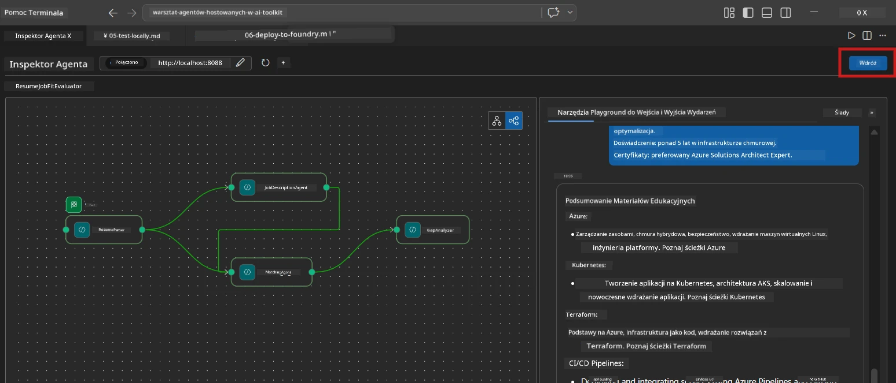
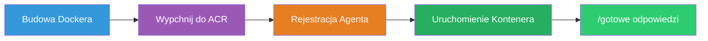
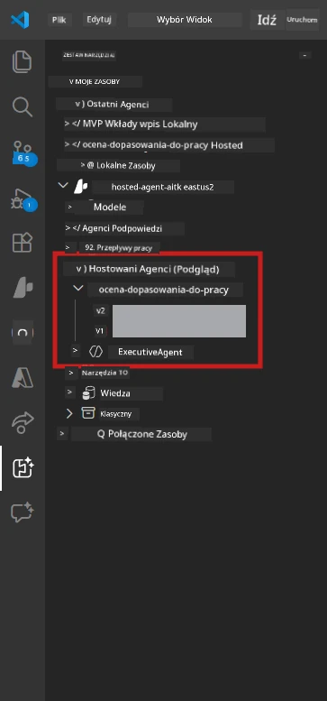

# Moduł 6 - Wdrożenie do usługi Foundry Agent

W tym module wdrażasz lokalnie przetestowany wieloagentowy przepływ pracy do [Microsoft Foundry](https://learn.microsoft.com/azure/foundry/agents/concepts/hosted-agents) jako **Hostowany Agent**. Proces wdrożenia tworzy obraz kontenera Docker, wysyła go do [Azure Container Registry (ACR)](https://learn.microsoft.com/azure/container-registry/container-registry-intro) oraz tworzy wersję hostowanego agenta w [Foundry Agent Service](https://learn.microsoft.com/azure/foundry/agents/how-to/publish-agent).

> **Kluczowa różnica od Laboratorium 01:** Proces wdrożenia jest identyczny. Foundry traktuje twój wieloagentowy przepływ pracy jako pojedynczego hostowanego agenta – złożoność jest w środku kontenera, ale powierzchnia wdrożenia to ten sam punkt końcowy `/responses`.

---

## Sprawdzenie wymagań wstępnych

Przed wdrożeniem zweryfikuj każdy z poniższych punktów:

1. **Agent przeszedł lokalne testy wstępne:**
   - Ukończyłeś wszystkie 3 testy w [Moduł 5](05-test-locally.md), a przepływ pracy wygenerował pełny output z kartami przerw i adresami URL Microsoft Learn.

2. **Posiadasz rolę [Azure AI User](https://learn.microsoft.com/azure/foundry/concepts/rbac-foundry):**
   - Przypisana w [Laboratorium 01, Moduł 2](../../lab01-single-agent/docs/02-create-foundry-project.md). Sprawdź:
   - [Azure Portal](https://portal.azure.com) → zasób twojego projektu Foundry → **Access control (IAM)** → **Role assignments** → potwierdź, że **[Azure AI User](https://aka.ms/foundry-ext-project-role)** jest przypisany do twojego konta.

3. **Jesteś zalogowany do Azure w VS Code:**
   - Sprawdź ikonę Konta w lewym dolnym rogu VS Code. Powinno być widoczne twoje konto.

4. **`agent.yaml` ma poprawne wartości:**
   - Otwórz `PersonalCareerCopilot/agent.yaml` i zweryfikuj:
     ```yaml
     environment_variables:
       - name: PROJECT_ENDPOINT
         value: ${PROJECT_ENDPOINT}
       - name: MODEL_DEPLOYMENT_NAME
         value: ${MODEL_DEPLOYMENT_NAME}
     ```
   - Muszą one odpowiadać zmiennym środowiskowym odczytywanym przez `main.py`.

5. **`requirements.txt` ma poprawne wersje:**
   ```
   agent-framework-azure-ai==1.0.0rc3
   agent-framework-core==1.0.0rc3
   azure-ai-agentserver-agentframework==1.0.0b16
   azure-ai-agentserver-core==1.0.0b16
   debugpy
   agent-dev-cli --pre
   ```

---

## Krok 1: Rozpocznij wdrożenie

### Opcja A: Wdrożenie z Agent Inspector (zalecane)

Jeśli agent działa przez F5 z otwartym Agent Inspector:

1. Spójrz w **prawy górny róg** panelu Agent Inspector.
2. Kliknij przycisk **Deploy** (ikona chmury ze strzałką w górę ↑).
3. Otworzy się kreator wdrożenia.



### Opcja B: Wdrożenie z Command Palette

1. Naciśnij `Ctrl+Shift+P`, aby otworzyć **Command Palette**.
2. Wpisz: **Microsoft Foundry: Deploy Hosted Agent** i wybierz tę opcję.
3. Otworzy się kreator wdrożenia.

---

## Krok 2: Skonfiguruj wdrożenie

### 2.1 Wybierz projekt docelowy

1. Pojawi się lista rozwijana z twoimi projektami Foundry.
2. Wybierz projekt używany podczas całych warsztatów (np. `workshop-agents`).

### 2.2 Wybierz plik agenta kontenera

1. Zostaniesz poproszony o wskazanie punktu wejścia agenta.
2. Przejdź do `workshop/lab02-multi-agent/PersonalCareerCopilot/` i wybierz **`main.py`**.

### 2.3 Skonfiguruj zasoby

| Ustawienie | Zalecana wartość | Uwagi |
|------------|------------------|-------|
| **CPU** | `0.25` | Domyślnie. Przepływy pracy wieloagentowe nie potrzebują więcej CPU, ponieważ wywołania modeli są zależne od I/O |
| **Pamięć** | `0.5Gi` | Domyślnie. Zwiększ do `1Gi`, jeśli dodasz duże narzędzia do przetwarzania danych |

---

## Krok 3: Potwierdź i wdroż

1. Kreator pokazuje podsumowanie wdrożenia.
2. Przejrzyj je i kliknij **Confirm and Deploy**.
3. Obserwuj postęp w VS Code.

### Co dzieje się podczas wdrożenia

Obserwuj panel **Output** w VS Code (wybierz listę rozwijaną „Microsoft Foundry”):


1. **Docker build** – Buduje obraz kontenera z twojego `Dockerfile`:
   ```
   Step 1/6 : FROM python:3.14-slim
   Step 2/6 : WORKDIR /app
   ...
   Successfully built abc123def456
   ```

2. **Docker push** – Wysyła obraz do ACR (1-3 minuty przy pierwszym wdrożeniu).

3. **Rejestracja agenta** – Foundry tworzy hostowanego agenta korzystając z metadanych `agent.yaml`. Nazwa agenta to `resume-job-fit-evaluator`.

4. **Uruchomienie kontenera** – Kontener startuje w zarządzanej infrastrukturze Foundry z tożsamością zarządzaną przez system.

> **Pierwsze wdrożenie trwa dłużej** (Docker przesyła wszystkie warstwy). Kolejne wdrożenia wykorzystują warstwy z pamięci podręcznej i są szybsze.

### Specyficzne uwagi do wieloagenta

- **Wszystkie cztery agenty są w jednym kontenerze.** Foundry widzi pojedynczego hostowanego agenta. Graf WorkflowBuilder działa wewnętrznie.
- **Wywołania MCP są wychodzące.** Kontener musi mieć dostęp do internetu, aby osiągnąć `https://learn.microsoft.com/api/mcp`. Zarządzana infrastruktura Foundry zapewnia to domyślnie.
- **[Managed Identity](https://learn.microsoft.com/python/api/overview/azure/identity-readme#managed-identity-support).** W środowisku hostowanym `get_credential()` w `main.py` zwraca `ManagedIdentityCredential()` (bo zmienna `MSI_ENDPOINT` jest ustawiona). Działa to automatycznie.

---

## Krok 4: Zweryfikuj status wdrożenia

1. Otwórz pasek boczny **Microsoft Foundry** (kliknij ikonę Foundry na pasku aktywności).
2. Rozwiń **Hosted Agents (Preview)** pod swoim projektem.
3. Znajdź **resume-job-fit-evaluator** (lub nazwę twojego agenta).
4. Kliknij nazwę agenta → rozwiń wersje (np. `v1`).
5. Kliknij wersję → sprawdź **Container Details** → **Status**:



| Status | Znaczenie |
|--------|-----------|
| **Started** / **Running** | Kontener działa, agent jest gotowy |
| **Pending** | Kontener się uruchamia (poczekaj 30-60 sekund) |
| **Failed** | Kontener nie uruchomił się (sprawdź logi – patrz dalej) |

> **Uruchomienie wieloagenta trwa dłużej** niż pojedynczego agenta, ponieważ kontener tworzy 4 instancje agenta na starcie. "Pending" do 2 minut jest normalne.

---

## Typowe błędy wdrożenia i ich naprawa

### Błąd 1: Permission denied – `agents/write`

```
Error: lacks the required data action 
Microsoft.CognitiveServices/accounts/AIServices/agents/write
```

**Naprawa:** Przypisz rolę **[Azure AI User](https://learn.microsoft.com/azure/foundry/concepts/rbac-foundry)** na poziomie **projektu**. Zobacz [Moduł 8 - Rozwiązywanie problemów](08-troubleshooting.md) z instrukcjami krok po kroku.

### Błąd 2: Docker nie działa

```
Error: Docker build failed / Cannot connect to Docker daemon
```

**Naprawa:**
1. Uruchom Docker Desktop.
2. Poczekaj, aż pojawi się komunikat „Docker Desktop is running”.
3. Zweryfikuj: `docker info`
4. **Windows:** Upewnij się, że backend WSL 2 jest włączony w ustawieniach Docker Desktop.
5. Spróbuj ponownie.

### Błąd 3: pip install nie udaje się podczas budowy Dockera

```
Error: Could not find a version that satisfies the requirement agent-dev-cli
```

**Naprawa:** Flaga `--pre` w `requirements.txt` jest obsługiwana inaczej pod Dockerem. Upewnij się, że twój `requirements.txt` zawiera:
```
agent-dev-cli --pre
```

Jeśli Docker ciągle nie działa, stwórz `pip.conf` lub przekaż `--pre` przez argument budowy. Zobacz [Moduł 8](08-troubleshooting.md).

### Błąd 4: Narzędzie MCP nie działa w hostowanym agencie

Jeśli Gap Analyzer przestaje generować adresy URL Microsoft Learn po wdrożeniu:

**Przyczyna:** Polityka sieciowa może blokować wychodzące połączenia HTTPS z kontenera.

**Naprawa:**
1. Zwykle nie jest to problem z domyślną konfiguracją Foundry.
2. Jeśli występuje, sprawdź, czy wirtualna sieć projektu Foundry ma NSG blokujące wychodzące HTTPS.
3. Narzędzie MCP ma wbudowane awaryjne adresy URL, więc agent nadal wygeneruje output (ale bez aktywnych adresów URL).

---

### Punkt kontrolny

- [ ] Polecenie wdrożenia zakończyło się w VS Code bez błędów
- [ ] Agent pojawił się pod **Hosted Agents (Preview)** w pasku bocznym Foundry
- [ ] Nazwa agenta to `resume-job-fit-evaluator` (lub twoja wybrana nazwa)
- [ ] Status kontenera to **Started** lub **Running**
- [ ] (Jeśli wystąpiły błędy) Zidentyfikowano błąd, zastosowano poprawkę i wdrożono ponownie z powodzeniem

---

**Poprzedni:** [05 - Test Locally](05-test-locally.md) · **Następny:** [07 - Verify in Playground →](07-verify-in-playground.md)

---

<!-- CO-OP TRANSLATOR DISCLAIMER START -->
**Zastrzeżenie**:  
Dokument ten został przetłumaczony przy użyciu usługi tłumaczenia AI [Co-op Translator](https://github.com/Azure/co-op-translator). Chociaż dokładamy starań, aby tłumaczenie było precyzyjne, prosimy mieć na uwadze, że automatyczne tłumaczenia mogą zawierać błędy lub nieścisłości. Oryginalny dokument w języku źródłowym powinien być uznawany za autorytatywne źródło. W przypadku informacji krytycznych zalecane jest skorzystanie z profesjonalnego tłumaczenia ludzkiego. Nie ponosimy odpowiedzialności za jakiekolwiek nieporozumienia lub błędne interpretacje wynikające z korzystania z tego tłumaczenia.
<!-- CO-OP TRANSLATOR DISCLAIMER END -->