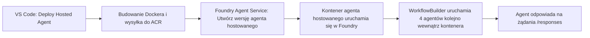
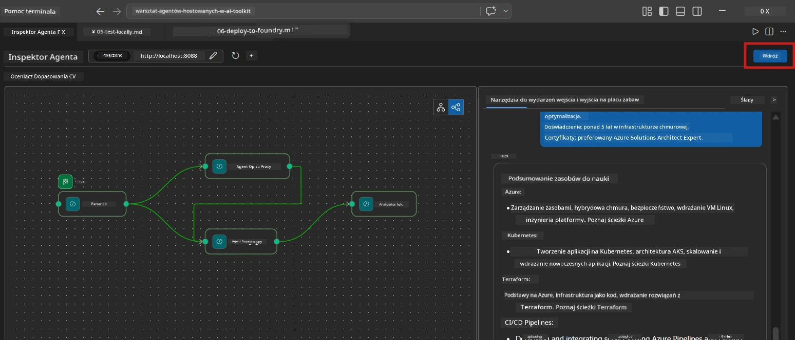
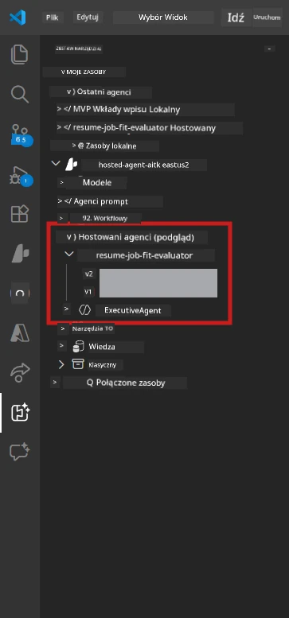

# Moduł 6 - Wdrożenie do Foundry Agent Service

⏱️ ~10 min

W tym module wdrożysz lokalnie przetestowany wieloagentowy przepływ pracy do [Microsoft Foundry](https://learn.microsoft.com/azure/foundry/agents/concepts/hosted-agents) jako **Hostowany Agent**. Proces wdrożenia buduje obraz kontenera Docker, przesyła go do [Azure Container Registry (ACR)](https://learn.microsoft.com/azure/container-registry/container-registry-intro) i tworzy wersję hostowanego agenta w [Foundry Agent Service](https://learn.microsoft.com/azure/foundry/agents/how-to/publish-agent).

> **Kluczowa różnica względem Laboratorium 01:** Proces wdrożenia jest identyczny. Foundry traktuje twój wieloagentowy przepływ pracy jako pojedynczego hostowanego agenta - złożoność jest wewnątrz kontenera, ale powierzchnia wdrożenia to ten sam punkt końcowy `/responses`.

### Pipeline wdrożeniowy


```mermaid
flowchart LR
    A[VS Code: Deploy Hosted Agent] --> B[Budowanie Dockera i wysyłka do ACR]
    B --> C[Foundry Agent Service: Utwórz wersję agenta hostowanego]
    C --> D[Kontener agenta hostowanego uruchamia się w Foundry]
    D --> E[WorkflowBuilder uruchamia 4 agentów kolejno wewnątrz kontenera]
    E --> F[Agent odpowiada na żądania /responses]
```

---

## Sprawdzenie wymagań wstępnych

Przed wdrożeniem zweryfikuj poniższe elementy:

1. **Agent przeszedł lokalne testy wstępne:**
   - Ukończyłeś wszystkie 3 testy w [Moduł 5](05-test-locally.md) i przepływ pracy wygenerował kompletne wyjście z kartami luk i adresami URL Microsoft Learn.

2. **Masz rolę [Foundry User](https://learn.microsoft.com/azure/foundry/concepts/rbac-foundry)** (do wdrożenia potrzebujesz co najmniej **Foundry Project Manager** na poziomie projektu):

   > **Uwaga:** Role RBAC Foundry zostały niedawno przemianowane - **Foundry User**, **Foundry Owner** i **Foundry Project Manager** wcześniej nazywały się odpowiednio Azure AI User, Azure AI Owner i Azure AI Project Manager. Identyfikatory ról i uprawnienia pozostają bez zmian.

   - Zweryfikuj w [Azure Portal](https://portal.azure.com) → zasób twojego projektu Foundry → **Kontrola dostępu (IAM)** → **Przydziały ról** → potwierdź, że **Foundry User** (lub wyższa) jest przypisana do twojego konta.

3. **Jesteś zalogowany do Azure w VS Code:**
   - Sprawdź ikonę Konta w lewym dolnym rogu VS Code. Powinno być widoczne twoje konto.

4. **`agent.yaml` ma prawidłowe wartości:**
   - Otwórz `PersonalCareerCopilot/agent.yaml` i zweryfikuj:
     ```yaml
     environment_variables:
       - name: AZURE_AI_MODEL_DEPLOYMENT_NAME
         value: ${AZURE_AI_MODEL_DEPLOYMENT_NAME}
     ```
   - `FOUNDRY_PROJECT_ENDPOINT` **nie jest** tutaj wpisany - Foundry wstrzykuje go podczas uruchomienia. Wystarczy zadeklarować `AZURE_AI_MODEL_DEPLOYMENT_NAME`.

5. **`requirements.txt` zawiera prawidłowe wersje:**
   ```
   agent-framework-foundry
   agent-framework-foundry-hosting
   mcp<2,>=1.24.0
   debugpy
   ```

---

## Krok 1: Rozpocznij wdrożenie

### Opcja A: Wdrożenie z Inspektora Agenta (zalecane)

Jeśli agent działa w trybie F5 z otwartym Inspektorem Agenta:

1. Spójrz w **prawy górny róg** panelu Inspektora Agenta.
2. Kliknij przycisk **Deploy** (ikona chmury z strzałką w górę ↑).
3. Otworzy się kreator wdrożenia.



### Opcja B: Wdrożenie z Palety Poleceń

1. Naciśnij `Ctrl+Shift+P`, aby otworzyć **Paletę Poleceń**.
2. Wpisz: **Foundry Toolkit: Deploy Hosted Agent** i wybierz tę opcję.
3. Otworzy się kreator wdrożenia.

---

## Krok 2: Skonfiguruj wdrożenie

### 2.1 Wybierz docelowy projekt

1. Pojawi się lista rozwijana z twoimi projektami Foundry.
2. Wybierz projekt, którego używałeś podczas warsztatów (np. `workshop-agents`).

### 2.2 Wybierz plik agenta kontenera

1. Zostaniesz poproszony o wybranie punktu wejścia agenta.
2. Przejdź do `workshop/lab02-multi-agent/PersonalCareerCopilot/` i wybierz **`main.py`**.

### 2.3 Skonfiguruj zasoby

| Ustawienie | Zalecana wartość | Uwagi |
|---------|------------------|-------|
| **Metoda wdrożenia** | **Container** (zalecane) lub **Code** | Container buduje obraz Dockera; Code przesyła źródło jako ZIP (preview) |
| **Rejestr kontenerów** | **Domyślny ACR** | Foundry tworzy i zarządza nim za ciebie |
| **CPU** | `0.25` | Domyślnie. Wieloagentowe przepływy nie potrzebują więcej CPU, ponieważ wywołania modelu są zależne od I/O |
| **Pamięć** | `0.5Gi` | Domyślnie. Zwiększ do `1Gi`, jeśli dodasz duże narzędzia przetwarzające dane |

---

## Krok 3: Potwierdź i wdroż

1. Kreator pokazuje podsumowanie wdrożenia.
2. Przejrzyj i kliknij **Potwierdź i wdroż**.
3. Obserwuj postęp w VS Code.

### Co się dzieje podczas wdrożenia

Obserwuj panel **Output** w VS Code (wybierz rozwijane menu "Microsoft Foundry"):

1. **Budowa Dockera** - Buduje kontener z twojego `Dockerfile`
   ```
   Step 1/6 : FROM python:3.12-slim
   Step 2/6 : WORKDIR /app
   ...
   Successfully built abc123def456
   ```

2. **Push Dockera** - Przesyła obraz do ACR (1-3 minuty podczas pierwszego wdrożenia).

3. **Rejestracja agenta** - Foundry tworzy hostowanego agenta używając metadanych z `agent.yaml`. Nazwa agenta to `resume-job-fit-evaluator`.

4. **Start kontenera** - Kontener uruchamia się w zarządzanej infrastrukturze Foundry z tożsamością zarządzaną przez system.

> **Pierwsze wdrożenie jest wolniejsze** (Docker przesyła wszystkie warstwy). Kolejne wdrożenia wykorzystują warstwy z pamięci podręcznej i są szybsze.

### Specjalne uwagi dla wieloagentów

- **Wszystkie cztery agenty są w jednym kontenerze.** Foundry widzi pojedynczego hostowanego agenta. Graf WorkflowBuilder działa wewnętrznie.
- **Wywołania MCP są wychodzące.** Kontener potrzebuje dostępu do Internetu, aby sięgnąć do `https://learn.microsoft.com/api/mcp`. Zarządzana infrastruktura Foundry zapewnia to domyślnie.
- **[Tożsamość zarządzana](https://learn.microsoft.com/azure/foundry/agents/concepts/agent-identity).** Foundry automatycznie tworzy **dedykowaną tożsamość Entra na agenta** dla każdego Hostowanego agenta podczas wdrożenia. W środowisku hostowanym `DefaultAzureCredential` automatycznie rozwiązuje tę tożsamość agenta - konfiguracja tożsamości zarządzanej ręcznie nie jest potrzebna.

---

## Krok 4: Zweryfikuj status wdrożenia

1. Otwórz pasek boczny **Microsoft Foundry** (kliknij ikonę Foundry w pasku aktywności).
2. Rozwiń **Hosted Agents (Preview)** w swoim projekcie.
3. Znajdź **resume-job-fit-evaluator** (lub nazwę twojego agenta).
4. Kliknij nazwę agenta → rozwiń wersje (np. `v1`).
5. Kliknij wersję → sprawdź **Szczegóły kontenera** → **Status**:



| Status | Znaczenie |
|--------|---------|
| **active** | Agent działa i jest gotowy do obsługi żądań |
| **creating** | Kontener się uruchamia (poczekaj 30–60 sekund) |
| **failed** | Kontener nie uruchomił się poprawnie (sprawdź logi - patrz poniżej) |

> **Uwaga:** Pasek boczny VS Code może wyświetlać etykiety takie jak "Running" lub "Started", podczas gdy status API to `active`/`creating`. Oba oznaczają ten sam stan.

> **Uruchomienie wieloagentowe trwa dłużej** niż jednoagentowe, ponieważ kontener tworzy 4 instancje agenta przy starcie. `creating` przez nawet 2 minuty to norma.

---

## Typowe błędy wdrożeniowe i rozwiązania

### Błąd 1: Odmowa uprawnień - `agents/write`

```
Error: lacks the required data action 
Microsoft.CognitiveServices/accounts/AIServices/agents/write
```

**Rozwiązanie:** Przypisz rolę **[Foundry User](https://learn.microsoft.com/azure/foundry/concepts/rbac-foundry)** (dawniej **Azure AI User**) na poziomie **projektu**. Zobacz [Moduł 8 - Rozwiązywanie problemów](08-troubleshooting.md) z instrukcjami krok po kroku.

### Błąd 2: Docker nie działa

```
Error: Docker build failed / Cannot connect to Docker daemon
```

**Rozwiązanie:**
1. Uruchom Docker Desktop.
2. Poczekaj na komunikat "Docker Desktop is running".
3. Sprawdź: `docker info`
4. **Windows:** Upewnij się, że backend WSL 2 jest włączony w ustawieniach Docker Desktop.
5. Spróbuj ponownie.

### Błąd 3: `pip install` nie powiodło się podczas budowy Dockera

```
Error: Could not find a version that satisfies the requirement agent-framework-foundry
```

**Rozwiązanie:** Zweryfikuj, czy `requirements.txt` jest taki sam jak:
```
agent-framework-foundry
agent-framework-foundry-hosting
mcp<2,>=1.24.0
debugpy
```

Jeśli budowanie nadal się nie udaje, twoja sieć Docker może blokować PyPI. Sprawdź ustawienia proxy w `docker info`.

### Błąd 4: Narzędzie MCP nie działa w hostowanym agencie

Jeśli Gap Analyzer przestaje generować adresy Microsoft Learn po wdrożeniu:

**Przyczyna:** Polityka sieciowa może blokować wychodzący ruch HTTPS z kontenera.

**Rozwiązanie:**
1. Zazwyczaj nie jest to problem przy domyślnej konfiguracji Foundry.
2. Jeśli się pojawi, sprawdź, czy wirtualna sieć projektu Foundry nie ma NSG blokującego wychodzące HTTPS.
3. Narzędzie MCP ma wbudowane zapasowe adresy URL, więc agent nadal będzie generował wynik (bez aktywnych linków).

---

### Punkt kontrolny

- [ ] Komenda wdrożenia zakończona bez błędów w VS Code
- [ ] Agent pojawia się pod **Hosted Agents (Preview)** w pasku bocznym Foundry
- [ ] Nazwa agenta to `resume-job-fit-evaluator` (lub wybrana przez ciebie)
- [ ] Status kontenera pokazuje **Started** lub **Running**
- [ ] (Jeśli błędy) Zidentyfikowałeś błąd, zastosowałeś poprawkę i pomyślnie wdrożyłeś ponownie

---

**Poprzedni:** [05 - Test lokalny](05-test-locally.md) · **Następny:** [07 - Weryfikacja w Playground →](07-verify-in-playground.md)

---

<!-- CO-OP TRANSLATOR DISCLAIMER START -->
**Zastrzeżenie**:
Niniejszy dokument został przetłumaczony za pomocą usługi tłumaczenia AI [Co-op Translator](https://github.com/Azure/co-op-translator). Choć dążymy do dokładności, prosimy pamiętać, że automatyczne tłumaczenia mogą zawierać błędy lub niedokładności. Oryginalny dokument w jego języku źródłowym należy uznawać za autorytatywne źródło. W przypadku informacji krytycznych zalecane jest skorzystanie z profesjonalnego tłumaczenia wykonanego przez człowieka. Nie ponosimy odpowiedzialności za jakiekolwiek nieporozumienia lub błędne interpretacje wynikające z użycia tego tłumaczenia.
<!-- CO-OP TRANSLATOR DISCLAIMER END -->