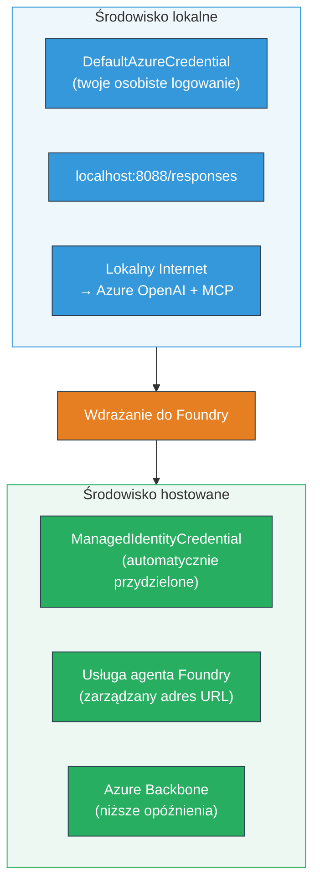

# Moduł 7 - Weryfikacja w Playground

W tym module testujesz wdrożony wieloagentowy przepływ pracy zarówno w **VS Code**, jak i w **[Foundry Portal](https://ai.azure.com)**, potwierdzając, że agent zachowuje się identycznie jak podczas testów lokalnych.

---

## Dlaczego weryfikować po wdrożeniu?

Twój wieloagentowy przepływ pracy działał doskonale lokalnie, więc dlaczego testować ponownie? Środowisko hostowane różni się pod wieloma względami:


| Różnica | Lokalnie | Hostowane |
|-----------|-------|--------|
| **Tożsamość** | [`DefaultAzureCredential`](https://learn.microsoft.com/azure/developer/python/sdk/authentication/credential-chains#defaultazurecredential-overview) (twoje osobiste logowanie) | [`ManagedIdentityCredential`](https://learn.microsoft.com/python/api/overview/azure/identity-readme#managed-identity-support) (automatycznie przydzielone) |
| **Punkt końcowy** | `http://localhost:8088/responses` | punkt końcowy [Foundry Agent Service](https://learn.microsoft.com/azure/foundry/agents/concepts/hosted-agents) (zarządzany URL) |
| **Sieć** | Lokalna maszyna → Azure OpenAI + MCP outbound | Szkielet Azure (niższa latencja między usługami) |
| **Łączność MCP** | Lokalne łącze internetowe → `learn.microsoft.com/api/mcp` | Kontener wychodzący → `learn.microsoft.com/api/mcp` |

Jeśli jakakolwiek zmienna środowiskowa jest źle skonfigurowana, RBAC jest inny lub MCP outbound jest zablokowany, wykryjesz to tutaj.

---

## Opcja A: Testuj na Playground w VS Code (zalecane najpierw)

[Foundry extension](https://marketplace.visualstudio.com/items?itemName=TeamsDevApp.vscode-ai-foundry) zawiera zintegrowane Playground, które pozwala rozmawiać z wdrożonym agentem bez wychodzenia z VS Code.

### Krok 1: Przejdź do swojego hostowanego agenta

1. Kliknij ikonę **Microsoft Foundry** w **Activity Bar** VS Code (lewy pasek boczny), aby otworzyć panel Foundry.
2. Rozwiń podłączony projekt (np. `workshop-agents`).
3. Rozwiń **Hosted Agents (Preview)**.
4. Powinieneś zobaczyć nazwę swojego agenta (np. `resume-job-fit-evaluator`).

### Krok 2: Wybierz wersję

1. Kliknij nazwę agenta, aby zobaczyć jego wersje.
2. Kliknij wersję, którą wdrożyłeś (np. `v1`).
3. Otworzy się **panel szczegółów** z danymi kontenera.
4. Sprawdź, czy status to **Started** lub **Running**.

### Krok 3: Otwórz Playground

1. W panelu szczegółów kliknij przycisk **Playground** (lub kliknij prawym przyciskiem wersję → **Open in Playground**).
2. Otworzy się interfejs czatu w karcie VS Code.

### Krok 4: Przeprowadź testy dymne

Użyj tych samych 3 testów z [Modułu 5](05-test-locally.md). Wpisz każdą wiadomość w polu input Playground i naciśnij **Send** (lub **Enter**).

#### Test 1 - Pełe CV + opis stanowiska (standardowy przebieg)

Wklej pełny prompt z CV + JD z Modułu 5, Test 1 (Jane Doe + Senior Cloud Engineer w Contoso Ltd).

**Oczekiwane:**
- Wynik dopasowania z rozbiciem matematycznym (skala 100-punktowa)
- Sekcja dopasowanych umiejętności
- Sekcja brakujących umiejętności
- **Jedna karta luki na każdą brakującą umiejętność** z linkami Microsoft Learn
- Ścieżka nauki z harmonogramem

#### Test 2 - Szybki test skrócony (minimalny input)

```
RESUME: 3 years Python developer, knows Django and PostgreSQL, no cloud experience.

JOB: Cloud DevOps Engineer requiring AWS, Kubernetes, Terraform, CI/CD. 5 years needed.
```

**Oczekiwane:**
- Niższy wynik dopasowania (< 40)
- Szczere oszacowanie z etapową ścieżką nauki
- Wiele kart luki (AWS, Kubernetes, Terraform, CI/CD, luka doświadczenia)

#### Test 3 - Kandydat o wysokim dopasowaniu

```
RESUME:
10 years Azure Cloud Architect. AZ-305 certified. Expert in AKS, Terraform, Azure DevOps, 
Azure Functions, Helm, Prometheus, Grafana, Python, Go. Led platform team of 8.

JOB:
Senior Cloud Engineer. Required: AKS, Terraform, Azure DevOps, Python. Preferred: Helm, Go.
5+ years experience. AZ-305 preferred.
```

**Oczekiwane:**
- Wysoki wynik dopasowania (≥ 80)
- Skupienie na gotowości do rozmowy i szlifowaniu umiejętności
- Kilka lub brak kart luki
- Krótki harmonogram skoncentrowany na przygotowaniu

### Krok 5: Porównaj z lokalnymi wynikami

Otwórz swoje notatki lub kartę przeglądarki z Modułu 5, gdzie zapisałeś lokalne odpowiedzi. Dla każdego testu:

- Czy odpowiedź ma **taką samą strukturę** (wynik dopasowania, karty luki, ścieżka)?
- Czy stosuje się **takie same zasady punktacji** (rozkład 100-punktowy)?
- Czy **linki Microsoft Learn** są nadal obecne w kartach luki?
- Czy jest **jedna karta luki na każdą brakującą umiejętność** (nie ucięta)?

> **Niewielkie różnice w sformułowaniach są normalne** - model jest niedeterministyczny. Skup się na strukturze, spójności punktacji i użyciu narzędzi MCP.

---

## Opcja B: Testuj w Foundry Portal

[Foundry Portal](https://ai.azure.com) to webowe playground przydatne do współdzielenia z zespołem lub interesariuszami.

### Krok 1: Otwórz Foundry Portal

1. Otwórz przeglądarkę i przejdź do [https://ai.azure.com](https://ai.azure.com).
2. Zaloguj się tym samym kontem Azure, którego używałeś podczas warsztatu.

### Krok 2: Przejdź do swojego projektu

1. Na stronie głównej poszukaj **Recent projects** w lewym pasku bocznym.
2. Kliknij nazwę swojego projektu (np. `workshop-agents`).
3. Jeśli nie widzisz go, kliknij **All projects** i wyszukaj.

### Krok 3: Znajdź swojego wdrożonego agenta

1. W lewej nawigacji projektu kliknij **Build** → **Agents** (lub poszukaj sekcji **Agents**).
2. Powinieneś zobaczyć listę agentów. Znajdź swojego wdrożonego agenta (np. `resume-job-fit-evaluator`).
3. Kliknij nazwę agenta, aby otworzyć stronę szczegółów.

### Krok 4: Otwórz Playground

1. Na stronie szczegółów agenta spójrz na górny pasek narzędzi.
2. Kliknij **Open in playground** (lub **Try in playground**).
3. Otworzy się interfejs czatu.

### Krok 5: Przeprowadź te same testy dymne

Powtórz wszystkie 3 testy z sekcji Playground VS Code powyżej. Porównaj każdą odpowiedź zarówno z lokalnymi wynikami (Moduł 5), jak i wynikami z Playground VS Code (Opcja A powyżej).

---

## Specyficzna weryfikacja wieloagentowa

Poza podstawową poprawnością, zweryfikuj następujące zachowania specyficzne dla wieloagentowości:

### Wykonanie narzędzia MCP

| Sprawdzenie | Jak zweryfikować | Warunek zaliczenia |
|-------------|------------------|--------------------|
| Wywołania MCP powiodły się | Karty luki zawierają URL-e `learn.microsoft.com` | Prawdziwe URL-e, nie komunikaty zastępcze |
| Wiele wywołań MCP | Każda luka o wysokim/średnim priorytecie ma zasoby | Nie tylko pierwsza karta luki |
| Fallback MCP działa | Jeśli URL ze znika, sprawdź tekst fallback | Agent nadal generuje karty luki (z lub bez URLi) |

### Koordynacja agentów

| Sprawdzenie | Jak zweryfikować | Warunek zaliczenia |
|-------------|------------------|--------------------|
| Wykonano 4 agentów | Wyjście zawiera wynik dopasowania ORAZ karty luki | Wynik od MatchingAgent, karty od GapAnalyzer |
| Równoległy rozgłos | Czas odpowiedzi jest rozsądny (< 2 min) | Jeśli > 3 min, równoległa egzekucja może nie działać |
| Integralność przepływu danych | Karty luki odnoszą się do umiejętności z raportu dopasowania | Brak zmyślonych umiejętności nieobecnych w JD |

---

## Rubryka walidacyjna

Użyj tej rubryki, aby ocenić zachowanie wdrożonego wieloagentowego przepływu pracy:

| # | Kryterium | Warunek zaliczenia | Zaliczone? |
|---|-----------|--------------------|------------|
| 1 | **Poprawność funkcjonalna** | Agent odpowiada na CV + JD wynikiem dopasowania i analizą luk | |
| 2 | **Spójność punktacji** | Wynik dopasowania używa 100-punktowej skali z wyliczeniem | |
| 3 | **Kompletność kart luki** | Jedna karta na każdą brakującą umiejętność (nie ucięta ani łączona) | |
| 4 | **Integracja narzędzia MCP** | Karty luki zawierają prawdziwe linki Microsoft Learn | |
| 5 | **Spójność strukturalna** | Struktura wyników zgadza się między uruchomieniami lokalnymi i hostowanymi | |
| 6 | **Czas odpowiedzi** | Agent hostowany odpowiada w ciągu 2 minut dla pełnej oceny | |
| 7 | **Brak błędów** | Brak błędów HTTP 500, przekroczeń czasu ani pustych odpowiedzi | |

> "Zaliczenie" oznacza, że wszystkie 7 kryteriów zostało spełnionych dla wszystkich 3 testów dymnych w co najmniej jednym playgroundzie (VS Code lub Portal).

---

## Rozwiązywanie problemów z playgroundem

| Objaw | Prawdopodobna przyczyna | Naprawa |
|---------|-------------------------|---------|
| Playground się nie ładuje | Status kontenera nie "Started" | Wróć do [Modułu 6](06-deploy-to-foundry.md), sprawdź status wdrożenia. Poczekaj jeśli "Pending" |
| Agent zwraca pustą odpowiedź | Nazwa wdrożenia modelu niepasująca | Sprawdź `agent.yaml` → `environment_variables` → `MODEL_DEPLOYMENT_NAME`, czy pasuje do wdrożonego modelu |
| Agent zwraca komunikat o błędzie | Brak uprawnień [RBAC](https://learn.microsoft.com/azure/foundry/concepts/rbac-foundry) | Przypisz rolę **[Azure AI User](https://aka.ms/foundry-ext-project-role)** na poziomie projektu |
| Brak linków Microsoft Learn w kartach luki | MCP outbound zablokowany lub serwer MCP niedostępny | Sprawdź, czy kontener może nawiązać połączenie z `learn.microsoft.com`. Zobacz [Moduł 8](08-troubleshooting.md) |
| Tylko 1 karta luki (ucięta) | Instrukcje GapAnalyzer brakują bloku "CRITICAL" | Sprawdź [Moduł 3, Krok 2.4](03-configure-agents.md) |
| Wynik dopasowania bardzo różny od lokalnego | Inny model lub inne instrukcje | Porównaj zmienne środowiskowe `agent.yaml` z lokalnym `.env`. W razie potrzeby wdroż ponownie |
| "Agent not found" w Portalu | Wdrożenie nadal jest propagowane lub nieudane | Poczekaj 2 minuty, odśwież. Jeśli brak nadal, ponownie wdroż z [Modułu 6](06-deploy-to-foundry.md) |

---

### Checkpoint

- [ ] Przetestowano agenta w Playground VS Code - wszystkie 3 testy dymne zaliczone
- [ ] Przetestowano agenta w Playground [Foundry Portal](https://ai.azure.com) - wszystkie 3 testy dymne zaliczone
- [ ] Odpowiedzi są strukturalnie spójne z testami lokalnymi (wynik dopasowania, karty luki, ścieżka)
- [ ] Linki Microsoft Learn są obecne w kartach luki (narzędzie MCP działa w środowisku hostowanym)
- [ ] Jedna karta luki na każdą brakującą umiejętność (brak ucinania)
- [ ] Brak błędów lub timeoutów podczas testów
- [ ] Uzupełniona rubryka walidacyjna (wszystkie 7 kryteriów zaliczone)

---

**Poprzedni:** [06 - Deploy to Foundry](06-deploy-to-foundry.md) · **Następny:** [08 - Troubleshooting →](08-troubleshooting.md)

---

<!-- CO-OP TRANSLATOR DISCLAIMER START -->
**Zastrzeżenie**:  
Dokument ten został przetłumaczony przy użyciu usługi tłumaczeń AI [Co-op Translator](https://github.com/Azure/co-op-translator). Chociaż dążymy do dokładności, prosimy pamiętać, że automatyczne tłumaczenia mogą zawierać błędy lub nieścisłości. Oryginalny dokument w języku źródłowym należy traktować jako wiarygodne źródło. W przypadku informacji krytycznych zaleca się skorzystanie z profesjonalnego tłumaczenia ludzkiego. Nie ponosimy odpowiedzialności za jakiekolwiek nieporozumienia lub błędne interpretacje wynikające z użycia tego tłumaczenia.
<!-- CO-OP TRANSLATOR DISCLAIMER END -->