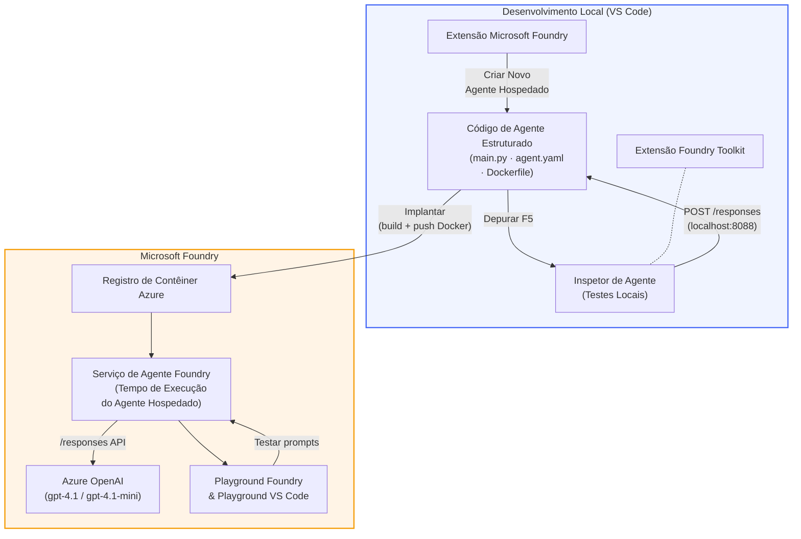

# Foundry Toolkit + Workshop de Agentes Hospedados Foundry

[](https://www.python.org/)
[](https://github.com/microsoft/agents)
[](https://learn.microsoft.com/azure/ai-foundry/agents/concepts/hosted-agents/)
[](https://ai.azure.com/)
[](https://learn.microsoft.com/azure/ai-services/openai/)
[](https://learn.microsoft.com/cli/azure/install-azure-cli)
[](https://learn.microsoft.com/azure/developer/azure-developer-cli/install-azd)
[](https://www.docker.com/)
[](https://marketplace.visualstudio.com/items?itemName=ms-windows-ai-studio.windows-ai-studio)
[](LICENSE)

Construa, teste e implante agentes de IA no **Microsoft Foundry Agent Service** como **Agentes Hospedados** - tudo a partir do VS Code usando a **extensão Microsoft Foundry** e o **Foundry Toolkit**.

> **Agentes Hospedados estão atualmente em prévia.** Regiões suportadas são limitadas - veja [disponibilidade por região](https://learn.microsoft.com/azure/foundry/agents/concepts/hosted-agents#region-availability).

> A pasta `agent/` dentro de cada laboratório é **criada automaticamente** pela extensão Foundry - você depois personaliza o código, testa localmente e implanta.

### 🌐 Suporte Multilíngue

#### Suportado via GitHub Action (Automatizado & Sempre Atualizado)

<!-- CO-OP TRANSLATOR LANGUAGES TABLE START -->
[Árabe](../ar/README.md) | [Bengali](../bn/README.md) | [Búlgaro](../bg/README.md) | [Birmanês (Myanmar)](../my/README.md) | [Chinês (Simplificado)](../zh-CN/README.md) | [Chinês (Tradicional, Hong Kong)](../zh-HK/README.md) | [Chinês (Tradicional, Macau)](../zh-MO/README.md) | [Chinês (Tradicional, Taiwan)](../zh-TW/README.md) | [Croata](../hr/README.md) | [Tcheco](../cs/README.md) | [Dinamarquês](../da/README.md) | [Holandês](../nl/README.md) | [Estoniano](../et/README.md) | [Finlandês](../fi/README.md) | [Francês](../fr/README.md) | [Alemão](../de/README.md) | [Grego](../el/README.md) | [Hebraico](../he/README.md) | [Hindi](../hi/README.md) | [Húngaro](../hu/README.md) | [Indonésio](../id/README.md) | [Italiano](../it/README.md) | [Japonês](../ja/README.md) | [Kannada](../kn/README.md) | [Khmer](../km/README.md) | [Coreano](../ko/README.md) | [Lituano](../lt/README.md) | [Malaio](../ms/README.md) | [Malayalam](../ml/README.md) | [Marathi](../mr/README.md) | [Nepali](../ne/README.md) | [Pidgin Nigeriano](../pcm/README.md) | [Norueguês](../no/README.md) | [Persa (Farsi)](../fa/README.md) | [Polonês](../pl/README.md) | [Português (Brasil)](./README.md) | [Português (Portugal)](../pt-PT/README.md) | [Punjabi (Gurmukhi)](../pa/README.md) | [Romeno](../ro/README.md) | [Russo](../ru/README.md) | [Sérvio (Cirílico)](../sr/README.md) | [Eslovaco](../sk/README.md) | [Esloveno](../sl/README.md) | [Espanhol](../es/README.md) | [Suaíli](../sw/README.md) | [Sueco](../sv/README.md) | [Tagalog (Filipino)](../tl/README.md) | [Tâmil](../ta/README.md) | [Telugu](../te/README.md) | [Tailandês](../th/README.md) | [Turco](../tr/README.md) | [Ucraniano](../uk/README.md) | [Urdu](../ur/README.md) | [Vietnamita](../vi/README.md)

> **Prefere Clonar Localmente?**
>
> Este repositório inclui mais de 50 traduções de idiomas, o que aumenta significativamente o tamanho do download. Para clonar sem traduções, use sparse checkout:
>
> **Bash / macOS / Linux:**
> ```bash
> git clone --filter=blob:none --sparse https://github.com/microsoft-foundry/Foundry_Toolkit_for_VSCode_Lab.git
> cd Foundry_Toolkit_for_VSCode_Lab
> git sparse-checkout set --no-cone '/*' '!translations' '!translated_images'
> ```
>
> **CMD (Windows):**
> ```cmd
> git clone --filter=blob:none --sparse https://github.com/microsoft-foundry/Foundry_Toolkit_for_VSCode_Lab.git
> cd Foundry_Toolkit_for_VSCode_Lab
> git sparse-checkout set --no-cone "/*" "!translations" "!translated_images"
> ```
>
> Isso fornece tudo o que você precisa para completar o curso com um download muito mais rápido.
<!-- CO-OP TRANSLATOR LANGUAGES TABLE END -->

---

## Arquitetura


**Fluxo:** A extensão Foundry cria a estrutura do agente → você personaliza o código e as instruções → testa localmente com o Agent Inspector → implanta no Foundry (imagem Docker enviada ao ACR) → verifica no Playground.

---

## O que você vai construir

| Laboratório | Descrição | Status |
|-------------|-----------|--------|
| **Lab 01 - Agente Único** | Construa o **Agente "Explique Como se Eu Fosse um Executivo"**, teste localmente e implante no Foundry | ✅ Disponível |
| **Lab 02 - Fluxo Multi-Agente** | Construa o **"Avaliador de Compatibilidade Currículo → Vaga"** - 4 agentes colaboram para pontuar a adequação do currículo e gerar um roadmap de aprendizado | ✅ Disponível |

---

## Conheça o Agente Executivo

Neste workshop você vai construir o **Agente "Explique Como se Eu Fosse um Executivo"** - um agente de IA que pega jargão técnico complicado e traduz em resumos calmos, prontos para a sala de diretoria. Porque sejamos honestos, ninguém na alta liderança quer ouvir sobre "exaustão do pool de threads causada por chamadas síncronas introduzidas na v3.2."

Criei este agente após incidentes em que meu post-mortem perfeitamente elaborado recebia a resposta: *"Então... o site está fora do ar ou não?"*

### Como funciona

Você fornece uma atualização técnica. Ele devolve um resumo executivo - três pontos em destaque, sem jargões, sem rastreamentos de pilha, sem pânico existencial. Apenas **o que aconteceu**, **impacto no negócio** e **próximo passo**.

### Veja em ação

**Você diz:**
> "A latência da API aumentou devido à exaustão do pool de threads causada por chamadas síncronas introduzidas na v3.2."

**O agente responde:**

> **Resumo Executivo:**
> - **O que aconteceu:** Após a última versão, o sistema ficou mais lento.
> - **Impacto no negócio:** Alguns usuários sofreram atrasos ao usar o serviço.
> - **Próximo passo:** A mudança foi revertida e uma correção está sendo preparada antes da reimplantação.

### Por que este agente?

É um agente simples, com um único propósito - perfeito para aprender o fluxo de trabalho do agente hospedado de ponta a ponta sem se perder em cadeias complexas de ferramentas. E, sinceramente? Toda equipe de engenharia poderia usar um desses.

---

## Estrutura do workshop

```
📂 Foundry_Toolkit_for_VSCode_Lab/
├── 📄 README.md                      ← You are here
├── 📂 ExecutiveAgent/                ← Standalone hosted agent project
│   ├── agent.yaml
│   ├── Dockerfile
│   ├── main.py
│   └── requirements.txt
└── 📂 workshop/
    ├── 📂 lab01-single-agent/        ← Full lab: docs + agent code
    │   ├── README.md                 ← Hands-on lab instructions
    │   ├── 📂 docs/                  ← Step-by-step tutorial modules
    │   │   ├── 00-prerequisites.md
    │   │   ├── 01-install-foundry-toolkit.md
    │   │   ├── 02-create-foundry-project.md
    │   │   ├── 03-create-hosted-agent.md
    │   │   ├── 04-configure-and-code.md
    │   │   ├── 05-test-locally.md
    │   │   ├── 06-deploy-to-foundry.md
    │   │   ├── 07-verify-in-playground.md
    │   │   └── 08-troubleshooting.md
    │   └── 📂 agent/                 ← Reference solution (auto-scaffolded by Foundry extension)
    │       ├── agent.yaml
    │       ├── Dockerfile
    │       ├── main.py
    │       └── requirements.txt
    └── 📂 lab02-multi-agent/         ← Resume → Job Fit Evaluator
        ├── README.md                 ← Hands-on lab instructions (end-to-end)
        ├── 📂 docs/                  ← Step-by-step tutorial modules
        │   ├── 00-prerequisites.md
        │   ├── 01-understand-multi-agent.md
        │   ├── 02-scaffold-multi-agent.md
        │   ├── 03-configure-agents.md
        │   ├── 04-orchestration-patterns.md
        │   ├── 05-test-locally.md
        │   ├── 06-deploy-to-foundry.md
        │   ├── 07-verify-in-playground.md
        │   └── 08-troubleshooting.md
        └── 📂 PersonalCareerCopilot/ ← Reference solution (multi-agent workflow)
            ├── agent.yaml
            ├── Dockerfile
            ├── main.py
            └── requirements.txt
```

> **Nota:** A pasta `agent/` dentro de cada laboratório é o que a **extensão Microsoft Foundry** gera quando você executa `Microsoft Foundry: Create a New Hosted Agent` pelo Command Palette. Os arquivos são então personalizados com as instruções, ferramentas e configurações do seu agente. O Lab 01 guia você por todo esse processo do zero.

---

## Começando

### 1. Clone o repositório

```bash
git clone https://github.com/microsoft-foundry/Foundry_Toolkit_for_VSCode_Lab.git
cd Foundry_Toolkit_for_VSCode_Lab
```

### 2. Configure um ambiente virtual Python

```bash
python -m venv venv
```

Ative-o:

- **Windows (PowerShell):**
  ```powershell
  .\venv\Scripts\Activate.ps1
  ```

- **macOS / Linux:**
  ```bash
  source venv/bin/activate
  ```

### 3. Instale as dependências

```bash
pip install -r workshop/lab01-single-agent/agent/requirements.txt
```

### 4. Configure as variáveis de ambiente

Copie o arquivo exemplo `.env` dentro da pasta do agente e preencha seus valores:

```bash
cp workshop/lab01-single-agent/agent/.env.example workshop/lab01-single-agent/agent/.env
```

Edite `workshop/lab01-single-agent/agent/.env`:

```env
AZURE_AI_PROJECT_ENDPOINT=https://<your-account>.services.ai.azure.com/api/projects/<your-project>
MODEL_DEPLOYMENT_NAME=<your-model-deployment-name>
```

### 5. Siga os laboratórios do workshop

Cada laboratório é auto-contido com seus próprios módulos. Comece pelo **Lab 01** para aprender os fundamentos, depois avance para o **Lab 02** para fluxos multi-agente.

#### Lab 01 - Agente Único ([instruções completas](workshop/lab01-single-agent/README.md))

| # | Módulo | Link |
|---|--------|------|
| 1 | Leia os pré-requisitos | [00-prerequisites.md](workshop/lab01-single-agent/docs/00-prerequisites.md) |
| 2 | Instale Foundry Toolkit & extensão Foundry | [01-install-foundry-toolkit.md](workshop/lab01-single-agent/docs/01-install-foundry-toolkit.md) |
| 3 | Crie um projeto Foundry | [02-create-foundry-project.md](workshop/lab01-single-agent/docs/02-create-foundry-project.md) |
| 4 | Crie um agente hospedado | [03-create-hosted-agent.md](workshop/lab01-single-agent/docs/03-create-hosted-agent.md) |
| 5 | Configure instruções & ambiente | [04-configure-and-code.md](workshop/lab01-single-agent/docs/04-configure-and-code.md) |
| 6 | Teste localmente | [05-test-locally.md](workshop/lab01-single-agent/docs/05-test-locally.md) |
| 7 | Implemente no Foundry | [06-deploy-to-foundry.md](workshop/lab01-single-agent/docs/06-deploy-to-foundry.md) |
| 8 | Verifique no playground | [07-verify-in-playground.md](workshop/lab01-single-agent/docs/07-verify-in-playground.md) |
| 9 | Solução de problemas | [08-troubleshooting.md](workshop/lab01-single-agent/docs/08-troubleshooting.md) |

#### Lab 02 - Fluxo Multi-Agente ([instruções completas](workshop/lab02-multi-agent/README.md))

| # | Módulo | Link |
|---|--------|------|
| 1 | Pré-requisitos (Lab 02) | [00-prerequisites.md](workshop/lab02-multi-agent/docs/00-prerequisites.md) |
| 2 | Entenda a arquitetura multi-agente | [01-understand-multi-agent.md](workshop/lab02-multi-agent/docs/01-understand-multi-agent.md) |
| 3 | Crie a estrutura do projeto multi-agente | [02-scaffold-multi-agent.md](workshop/lab02-multi-agent/docs/02-scaffold-multi-agent.md) |
| 4 | Configure agentes & ambiente | [03-configure-agents.md](workshop/lab02-multi-agent/docs/03-configure-agents.md) |
| 5 | Padrões de orquestração | [04-orchestration-patterns.md](workshop/lab02-multi-agent/docs/04-orchestration-patterns.md) |
| 6 | Teste localmente (multi-agente) | [05-test-locally.md](workshop/lab02-multi-agent/docs/05-test-locally.md) |
| 7 | Implantar no Foundry | [06-deploy-to-foundry.md](workshop/lab02-multi-agent/docs/06-deploy-to-foundry.md) |
| 8 | Verificar no playground | [07-verify-in-playground.md](workshop/lab02-multi-agent/docs/07-verify-in-playground.md) |
| 9 | Solução de problemas (multi-agente) | [08-troubleshooting.md](workshop/lab02-multi-agent/docs/08-troubleshooting.md) |

---

## Mantenedor

<table>
<tr>
    <td align="center"><a href="https://github.com/ShivamGoyal03">
        <br />
        <sub><b>Shivam Goyal</b></sub>
    </a><br />
    </td>
</tr>
</table>

---

## Permissões necessárias (referência rápida)

| Cenário | Funções necessárias |
|----------|---------------|
| Criar novo projeto Foundry | **Azure AI Owner** no recurso Foundry |
| Implantar em projeto existente (novos recursos) | **Azure AI Owner** + **Contributor** na assinatura |
| Implantar em projeto totalmente configurado | **Reader** na conta + **Azure AI User** no projeto |

> **Importante:** Os papéis `Owner` e `Contributor` do Azure incluem apenas permissões de *gerenciamento*, não permissões de *desenvolvimento* (ação de dados). Você precisa de **Azure AI User** ou **Azure AI Owner** para criar e implantar agentes.

---

## Referências

- [Início rápido: Implemente seu primeiro agente hospedado (VS Code)](https://learn.microsoft.com/azure/foundry/agents/quickstarts/quickstart-hosted-agent)
- [O que são agentes hospedados?](https://learn.microsoft.com/azure/foundry/agents/concepts/hosted-agents)
- [Criar fluxos de trabalho de agente hospedado no VS Code](https://learn.microsoft.com/azure/foundry/agents/how-to/vs-code-agents-workflow-pro-code)
- [Implantar um agente hospedado](https://learn.microsoft.com/azure/foundry/agents/how-to/deploy-hosted-agent)
- [RBAC para Microsoft Foundry](https://learn.microsoft.com/azure/foundry/concepts/rbac-foundry)
- [Exemplo de agente de Revisão de Arquitetura](https://github.com/Azure-Samples/agent-architecture-review-sample) - Agente hospedado do mundo real com ferramentas MCP, diagramas Excalidraw e implantação dupla

---


## Licença

[MIT](../../LICENSE)

---

<!-- CO-OP TRANSLATOR DISCLAIMER START -->
**Aviso**:  
Este documento foi traduzido usando o serviço de tradução por IA [Co-op Translator](https://github.com/Azure/co-op-translator). Embora nos esforcemos para garantir a precisão, esteja ciente de que traduções automáticas podem conter erros ou imprecisões. O documento original em seu idioma nativo deve ser considerado a fonte autoritativa. Para informações críticas, recomenda-se tradução profissional humana. Não nos responsabilizamos por quaisquer mal-entendidos ou interpretações incorretas decorrentes do uso desta tradução.
<!-- CO-OP TRANSLATOR DISCLAIMER END -->