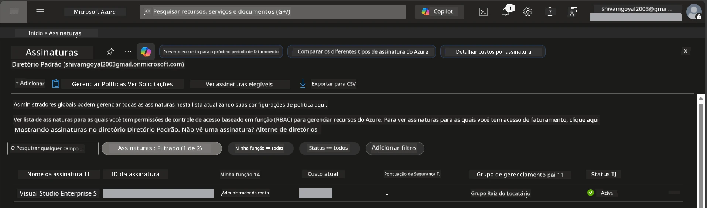

# Module 0 - Pré-requisitos

Antes de iniciar o workshop, confirme se você tem as seguintes ferramentas, acessos e ambiente prontos. Siga cada passo abaixo - não pule etapas.

---

## 1. Conta e assinatura Azure

### 1.1 Crie ou verifique sua assinatura Azure

1. Abra um navegador e acesse [https://azure.microsoft.com/free/](https://azure.microsoft.com/free/).
2. Se você não tem uma conta Azure, clique em **Comece grátis** e siga o fluxo de cadastro. Você precisará de uma conta Microsoft (ou criar uma) e de um cartão de crédito para verificação de identidade.
3. Se você já tem uma conta, faça login em [https://portal.azure.com](https://portal.azure.com).
4. No Portal, clique na lâmina **Assinaturas** na navegação à esquerda (ou pesquise "Assinaturas" na barra de pesquisa superior).
5. Verifique se você vê pelo menos uma assinatura **Ativa**. Anote o **ID da assinatura** - você precisará dele mais tarde.



### 1.2 Entenda as funções RBAC necessárias

A implantação do [Hosted Agent](https://learn.microsoft.com/azure/foundry/agents/concepts/hosted-agents) requer permissões de **ação de dados** que os papéis padrão `Owner` e `Contributor` do Azure **não** incluem. Você precisará de uma destas [combinações de papéis](https://learn.microsoft.com/azure/foundry/concepts/rbac-foundry#built-in-roles):

| Cenário | Papéis necessários | Onde atribuí-los |
|----------|--------------------|------------------|
| Criar novo projeto Foundry | **Proprietário AI Azure** no recurso Foundry | Recurso Foundry no Portal Azure |
| Implantar em projeto existente (recursos novos) | **Proprietário AI Azure** + **Colaborador** na assinatura | Assinatura + recurso Foundry |
| Implantar em projeto totalmente configurado | **Leitor** na conta + **Usuário AI Azure** no projeto | Conta + Projeto no Portal Azure |

> **Ponto-chave:** Os papéis do Azure `Owner` e `Contributor` cobrem apenas permissões de *gerenciamento* (operações ARM). Você precisa do [**Usuário AI Azure**](https://learn.microsoft.com/azure/foundry/concepts/rbac-foundry#built-in-roles) (ou superior) para *ações de dados* como `agents/write`, que é requerido para criar e implantar agentes. Você atribuirá esses papéis no [Módulo 2](02-create-foundry-project.md).

---

## 2. Instale as ferramentas locais

Instale cada ferramenta abaixo. Após instalar, verifique se funciona executando o comando de checagem.

### 2.1 Visual Studio Code

1. Vá para [https://code.visualstudio.com/](https://code.visualstudio.com/).
2. Baixe o instalador para seu SO (Windows/macOS/Linux).
3. Execute o instalador com as configurações padrão.
4. Abra o VS Code para confirmar que ele inicia.

### 2.2 Python 3.10+

1. Vá para [https://www.python.org/downloads/](https://www.python.org/downloads/).
2. Baixe o Python 3.10 ou superior (3.12+ recomendado).
3. **Windows:** Durante a instalação, marque **"Add Python to PATH"** na primeira tela.
4. Abra um terminal e verifique:

   ```powershell
   python --version
   ```
  
   Saída esperada: `Python 3.10.x` ou superior.

### 2.3 Azure CLI

1. Vá para [https://learn.microsoft.com/cli/azure/install-azure-cli](https://learn.microsoft.com/cli/azure/install-azure-cli).
2. Siga as instruções de instalação para seu SO.
3. Verifique:

   ```powershell
   az --version
   ```
  
   Esperado: `azure-cli 2.80.0` ou superior.

4. Faça login:

   ```powershell
   az login
   ```
  
### 2.4 Azure Developer CLI (azd)

1. Vá para [https://learn.microsoft.com/azure/developer/azure-developer-cli/install-azd](https://learn.microsoft.com/azure/developer/azure-developer-cli/install-azd).
2. Siga as instruções para instalação no seu SO. No Windows:

   ```powershell
   winget install microsoft.azd
   ```
  
3. Verifique:

   ```powershell
   azd version
   ```
  
   Esperado: `azd version 1.x.x` ou superior.

4. Faça login:

   ```powershell
   azd auth login
   ```
  
### 2.5 Docker Desktop (opcional)

O Docker é necessário apenas se você quiser construir e testar a imagem do contêiner localmente antes da implantação. A extensão Foundry gerencia construções de contêiner automaticamente durante a implantação.

1. Vá para [https://docs.docker.com/get-docker/](https://docs.docker.com/get-docker/).
2. Baixe e instale o Docker Desktop para seu SO.
3. **Windows:** Certifique-se de que o backend WSL 2 está selecionado durante a instalação.
4. Inicie o Docker Desktop e aguarde o ícone na bandeja do sistema mostrar **"Docker Desktop is running"**.
5. Abra um terminal e verifique:

   ```powershell
   docker info
   ```
  
   Isso deve imprimir informações do sistema Docker sem erros. Se você vir `Cannot connect to the Docker daemon`, aguarde mais alguns segundos para o Docker iniciar completamente.

---

## 3. Instale extensões no VS Code

Você precisa de três extensões. Instale-as **antes** do workshop começar.

### 3.1 Microsoft Foundry para VS Code

1. Abra o VS Code.
2. Pressione `Ctrl+Shift+X` para abrir o painel de Extensões.
3. No campo de busca, digite **"Microsoft Foundry"**.
4. Encontre **Microsoft Foundry for Visual Studio Code** (publicador: Microsoft, ID: `TeamsDevApp.vscode-ai-foundry`).
5. Clique em **Instalar**.
6. Após a instalação, você deve ver o ícone **Microsoft Foundry** aparecer na Barra de Atividades (barra lateral esquerda).

### 3.2 Foundry Toolkit

1. No painel de Extensões (`Ctrl+Shift+X`), pesquise por **"Foundry Toolkit"**.
2. Encontre **Foundry Toolkit** (publicador: Microsoft, ID: `ms-windows-ai-studio.windows-ai-studio`).
3. Clique em **Instalar**.
4. O ícone **Foundry Toolkit** deve aparecer na Barra de Atividades.

### 3.3 Python

1. No painel de Extensões, pesquise por **"Python"**.
2. Encontre **Python** (publicador: Microsoft, ID: `ms-python.python`).
3. Clique em **Instalar**.

---

## 4. Faça login no Azure pelo VS Code

O [Microsoft Agent Framework](https://learn.microsoft.com/agent-framework/overview/) usa [`DefaultAzureCredential`](https://learn.microsoft.com/azure/developer/python/sdk/authentication/credential-chains#defaultazurecredential-overview) para autenticação. Você precisa estar logado no Azure no VS Code.

### 4.1 Login pelo VS Code

1. Olhe no canto inferior esquerdo do VS Code e clique no ícone **Contas** (silhueta de pessoa).
2. Clique em **Entrar para usar Microsoft Foundry** (ou **Entrar com Azure**).
3. Uma janela do navegador abrirá - faça login com a conta Azure que tem acesso à sua assinatura.
4. Retorne ao VS Code. Você deve ver seu nome de conta no canto inferior esquerdo.

### 4.2 (Opcional) Login via Azure CLI

Se você instalou a Azure CLI e prefere autenticação via CLI:

```powershell
az login
```
  
Isto abrirá um navegador para o login. Após o login, defina a assinatura correta:

```powershell
az account set --subscription "<your-subscription-id>"
```
  
Verifique:

```powershell
az account show --query "{name:name, id:id, state:state}" --output table
```
  
Você deve ver o nome da sua assinatura, ID e estado = `Enabled`.

### 4.3 (Alternativa) Autenticação com principal de serviço

Para CI/CD ou ambientes compartilhados, defina estas variáveis de ambiente em vez disso:

```powershell
$env:AZURE_TENANT_ID = "<your-tenant-id>"
$env:AZURE_CLIENT_ID = "<your-client-id>"
$env:AZURE_CLIENT_SECRET = "<your-client-secret>"
```
  
---

## 5. Limitações da prévia

Antes de continuar, esteja ciente das limitações atuais:

- [**Hosted Agents**](https://learn.microsoft.com/azure/foundry/agents/concepts/hosted-agents) estão atualmente em **prévia pública** - não recomendado para cargas de trabalho em produção.
- **Regiões suportadas são limitadas** - verifique a [disponibilidade regional](https://learn.microsoft.com/azure/foundry/agents/concepts/hosted-agents#region-availability) antes de criar recursos. Se você escolher uma região não suportada, a implantação falhará.
- O pacote `azure-ai-agentserver-agentframework` está em pré-lançamento (`1.0.0b16`) - APIs podem mudar.
- Limites de escala: agentes hospedados suportam 0-5 réplicas (incluindo scale-to-zero).

---

## 6. Lista de verificação pré-voo

Revise cada item abaixo. Se algum passo falhar, volte e corrija antes de continuar.

- [ ] VS Code abre sem erros
- [ ] Python 3.10+ está no seu PATH (`python --version` mostra `3.10.x` ou superior)
- [ ] Azure CLI está instalado (`az --version` mostra `2.80.0` ou superior)
- [ ] Azure Developer CLI está instalado (`azd version` mostra a versão)
- [ ] Extensão Microsoft Foundry está instalada (ícone visível na Barra de Atividades)
- [ ] Extensão Foundry Toolkit está instalada (ícone visível na Barra de Atividades)
- [ ] Extensão Python está instalada
- [ ] Você está logado no Azure no VS Code (verifique o ícone Contas, canto inferior esquerdo)
- [ ] `az account show` mostra sua assinatura
- [ ] (Opcional) Docker Desktop está rodando (`docker info` mostra informações do sistema sem erros)

### Ponto de verificação

Abra a Barra de Atividades do VS Code e confirme que você vê as vistas laterais **Foundry Toolkit** e **Microsoft Foundry**. Clique em cada uma para verificar se carregam sem erros.

---

**Próximo:** [01 - Instalar Foundry Toolkit & extensão Foundry →](01-install-foundry-toolkit.md)

---

<!-- CO-OP TRANSLATOR DISCLAIMER START -->
**Aviso Legal**:  
Este documento foi traduzido utilizando o serviço de tradução por IA [Co-op Translator](https://github.com/Azure/co-op-translator). Embora nos esforcemos pela precisão, esteja ciente de que traduções automáticas podem conter erros ou imprecisões. O documento original em seu idioma nativo deve ser considerado a fonte autorizada. Para informações críticas, recomenda-se tradução profissional feita por humanos. Não nos responsabilizamos por quaisquer mal-entendidos ou interpretações equivocadas decorrentes do uso desta tradução.
<!-- CO-OP TRANSLATOR DISCLAIMER END -->