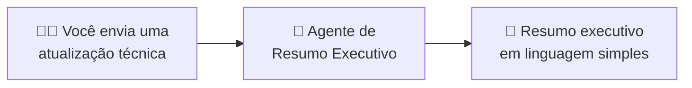

# Módulo 0 - Introdução

⏱️ ~10 min

> [!WARNING]
> **Visualização & Limitações:** [Agentes hospedados](https://learn.microsoft.com/azure/foundry/agents/concepts/hosted-agents) estão atualmente em **pré-visualização pública** - não recomendado para cargas de trabalho em produção. Esteja ciente do seguinte:
> - **Regiões suportadas são limitadas** - verifique a [disponibilidade da região](https://learn.microsoft.com/azure/foundry/agents/concepts/hosted-agents#region-availability) antes de criar recursos. Se você escolher uma região não suportada, a implantação falhará.
> - O pacote `azure-ai-agentserver-agentframework` é pré-lançamento - as APIs podem mudar entre versões.
> - Limites de escala: agentes hospedados suportam de 0 a 5 réplicas (incluindo escala para zero).
> - Algumas funcionalidades mostradas neste workshop podem mudar conforme o serviço avança para GA.

## O que você vai construir

Neste workshop, você construirá um agente **"Explique Como se Eu Fosse um Executivo"** - um agente de IA hospedado que transforma atualizações técnicas complexas em resumos executivos em linguagem simples.

```mermaid
flowchart LR
    A["🧑‍💻 Você envia uma\natualização técnica"] --> B["🤖 Agente de\nResumo Executivo"]
    B --> C["📝 Resumo executivo\nem linguagem simples"]
```

**O agente usa:**
- **Microsoft Agent Framework** - para a lógica e estrutura do agente
- **Foundry Toolkit para VS Code** - para gerar estrutura, testar localmente e implantar
- **Um modelo de IA** (ex.: `gpt-4.1-mini/gpt-5-mini`) - para gerar os resumos

Ao final deste laboratório, você terá um agente funcional que poderá testar localmente via Agent Inspector e, opcionalmente, implantar na nuvem.

---

## O que são agentes hospedados?

Um **agente hospedado** é um agente de IA que roda como um serviço gerenciado no Microsoft Foundry. Em vez de gerenciar sua própria infraestrutura, você empacota o código do agente em um contêiner e o Foundry cuida da escalabilidade, hospedagem e exposição via endpoint HTTP padrão.

| Conceito | O que significa |
|---------|---------------|
| **Agente** | Seu código Python que recebe uma mensagem do usuário, chama um modelo de IA e retorna uma resposta estruturada |
| **Hospedado** | Foundry executa seu contêiner para você - sem VMs, sem Kubernetes, sem infraestrutura para gerenciar |
| **Protocolo de respostas** | Uma API HTTP padrão (`POST /responses`) que qualquer cliente pode usar para interagir com seu agente |
| **Agent Inspector** | Uma interface local de teste (integrada ao Foundry Toolkit) que permite conversar com seu agente antes de implantar |

Neste workshop, você irá do zero até um agente completamente hospedado - ou pode parar no teste local se preferir.

---

## Escolha seu caminho

> ⚠️ **Escolha um caminho antes de continuar.** Sua escolha determina quais ferramentas instalar e quais módulos seguir. Você pode mudar do Caminho B → Caminho A depois caso obtenha uma assinatura.

<strong>🅰️ Caminho A - Nuvem Azure (requer assinatura Azure)</strong>

| | Detalhes |
|---|---------|
| **Para quem é?** | Você tem uma assinatura ativa do Azure e pode criar recursos no Foundry |
| **Modelo** | Azure OpenAI via Foundry (ex.: `gpt-4.1-mini/gpt-5-mini`) |
| **Módulos cobertos** | Todos os módulos (00–07) |
| **Implantar na nuvem?** | ✅ Sim - implantação completa de ponta a ponta |

<strong>🅱️ Caminho B - Local / nível gratuito (não precisa assinatura Azure)</strong>

| | Detalhes |
|---|---------|
| **Para quem é?** | MVPs, estudantes ou qualquer pessoa sem acesso ao Azure |
| **Modelo** | **Foundry Local** (gratuito, roda na sua máquina) |
| **Módulos cobertos** | Módulos 00–04 (pula implantação e verificação na nuvem) |
| **Implantar na nuvem?** | ❌ Não - apenas testes locais via Agent Inspector |

---

## Todos os caminhos: Ferramentas obrigatórias

Instale cada ferramenta abaixo. Depois de instalar, verifique se está funcionando executando o comando de verificação.

| # | Ferramenta | Versão | Instalar | Verificar (Saída Esperada) |
|---|-----------|---------|----------|---------------------------|
| 1 | **Visual Studio Code** | Última | [code.visualstudio.com](https://code.visualstudio.com/) | Abre sem erros |
| 2 | **Python** | 3.12 ou superior | [python.org/downloads](https://www.python.org/downloads/) | `python --version` $\rightarrow$ `Python 3.12.x` |
| 3 | **Foundry Toolkit para VS Code** | Última | ID da extensão: `ms-windows-ai-studio.windows-ai-studio` | Ícone do Foundry na Barra de Atividades |
| 4 | **Extensão Python para VS Code** | Última | ID da extensão: `ms-python.python` | Instalado no painel de Extensões |

> [!TIP]
> **Dicas para instalação:**
> - **PATH do Python (Windows):** Sempre marque **"Add Python to PATH"** na primeira tela do instalador do Python. Sem isso, `python` não será reconhecido no terminal.
> - **Múltiplas versões de Python:** Se você tem Python 3.10 e 3.12 instalados, use `python3.12 -m venv .venv` para garantir que a versão correta seja usada no ambiente virtual.
> - **Docker WSL 2 (Windows):** Durante a instalação do Docker Desktop, certifique-se de que o **backend WSL 2** está selecionado. Docker com Hyper-V é mais lento e pode causar problemas com builds de contêiner do Foundry.
> - **Docker não inicia?** Espere 30–60 segundos após abrir o Docker Desktop. Execute `docker info` - se mostrar "Cannot connect to the Docker daemon", o Docker ainda está inicializando.
> - **Extensões do VS Code não carregam?** Após instalar extensões, recarregue a janela: `Ctrl+Shift+P` → `Developer: Reload Window`.

> **Usuários Windows:** Marque **"Add Python to PATH"** durante a instalação do Python.

**Próximo:** [01 - Configuração →](01-setup.md)

---

<!-- CO-OP TRANSLATOR DISCLAIMER START -->
**Aviso Legal**:
Este documento foi traduzido usando o serviço de tradução por IA [Co-op Translator](https://github.com/Azure/co-op-translator). Embora nos esforcemos pela precisão, por favor, esteja ciente de que traduções automatizadas podem conter erros ou imprecisões. O documento original em seu idioma nativo deve ser considerado a fonte autorizada. Para informações críticas, recomenda-se tradução profissional humana. Não nos responsabilizamos por quaisquer mal-entendidos ou interpretações incorretas decorrentes do uso desta tradução.
<!-- CO-OP TRANSLATOR DISCLAIMER END -->