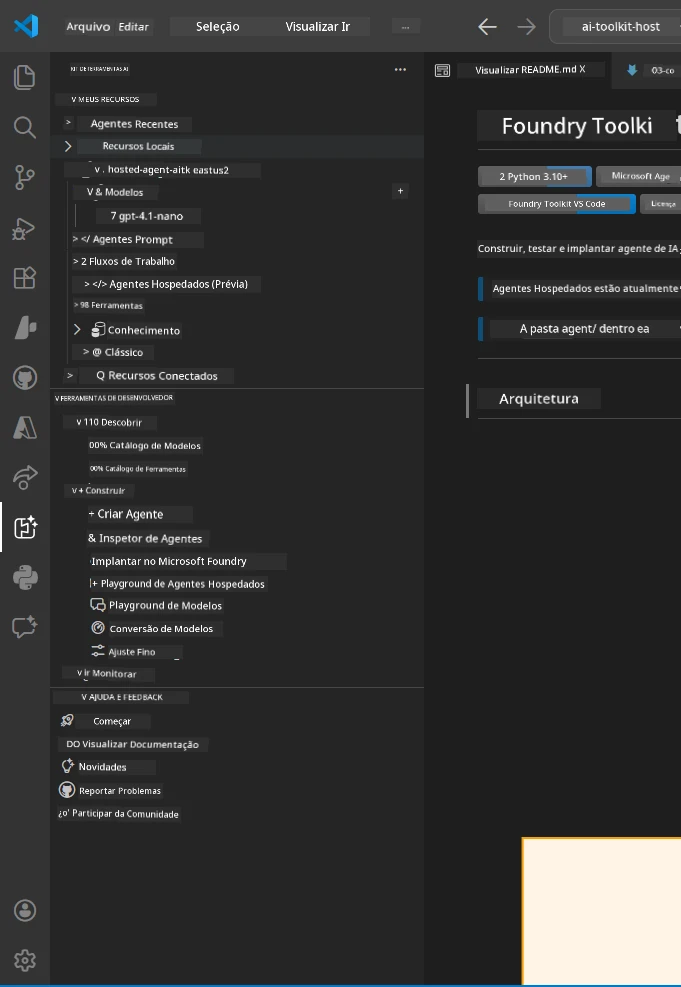
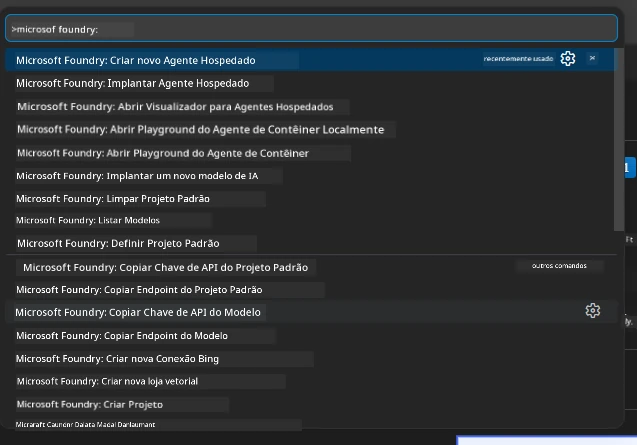

# Módulo 1 - Instalar Foundry Toolkit & Extensão Foundry

Este módulo orienta você na instalação e verificação das duas principais extensões do VS Code para este workshop. Se você já as instalou durante o [Módulo 0](00-prerequisites.md), use este módulo para verificar se estão funcionando corretamente.

---

## Passo 1: Instalar a Extensão Microsoft Foundry

A extensão **Microsoft Foundry for VS Code** é sua ferramenta principal para criar projetos Foundry, implantar modelos, estruturar agentes hospedados e implantar diretamente do VS Code.

1. Abra o VS Code.
2. Pressione `Ctrl+Shift+X` para abrir o painel de **Extensões**.
3. Na caixa de busca no topo, digite: **Microsoft Foundry**
4. Procure pelo resultado intitulado **Microsoft Foundry for Visual Studio Code**.
   - Publicador: **Microsoft**
   - ID da Extensão: `TeamsDevApp.vscode-ai-foundry`
5. Clique no botão **Instalar**.
6. Aguarde a conclusão da instalação (você verá um pequeno indicador de progresso).
7. Após a instalação, observe a **Barra de Atividades** (a barra vertical de ícones no lado esquerdo do VS Code). Você deve ver um novo ícone **Microsoft Foundry** (parece um diamante/ícone de IA).
8. Clique no ícone **Microsoft Foundry** para abrir a visualização da barra lateral. Você deve ver seções para:
   - **Recursos** (ou Projetos)
   - **Agentes**
   - **Modelos**

> **Se o ícone não aparecer:** Tente recarregar o VS Code (`Ctrl+Shift+P` → `Developer: Reload Window`).

---

## Passo 2: Instalar a Extensão Foundry Toolkit

A extensão **Foundry Toolkit** oferece o [**Agent Inspector**](https://learn.microsoft.com/azure/foundry/agents/how-to/vs-code-agents-workflow-pro-code) — uma interface visual para testar e depurar agentes localmente — além de playground, gerenciamento de modelos e ferramentas de avaliação.

1. No painel de Extensões (`Ctrl+Shift+X`), limpe a caixa de busca e digite: **Foundry Toolkit**
2. Encontre **Foundry Toolkit** nos resultados.
   - Publicador: **Microsoft**
   - ID da Extensão: `ms-windows-ai-studio.windows-ai-studio`
3. Clique em **Instalar**.
4. Após a instalação, o ícone **Foundry Toolkit** aparece na Barra de Atividades (parece um robô/ícone de brilho).
5. Clique no ícone **Foundry Toolkit** para abrir a visualização da barra lateral. Você deve ver a tela de boas-vindas do Foundry Toolkit com opções para:
   - **Modelos**
   - **Playground**
   - **Agentes**

---

## Passo 3: Verificar se ambas as extensões estão funcionando

### 3.1 Verificar Extensão Microsoft Foundry

1. Clique no ícone **Microsoft Foundry** na Barra de Atividades.
2. Se você estiver conectado ao Azure (do Módulo 0), deverá ver seus projetos listados em **Recursos**.
3. Se for solicitado a entrar, clique em **Entrar** e siga o fluxo de autenticação.
4. Confirme que você consegue ver a barra lateral sem erros.

### 3.2 Verificar Extensão Foundry Toolkit

1. Clique no ícone **Foundry Toolkit** na Barra de Atividades.
2. Confirme que a visualização de boas-vindas ou o painel principal carregam sem erros.
3. Você ainda não precisa configurar nada — usaremos o Agent Inspector no [Módulo 5](05-test-locally.md).

### 3.3 Verificar via Command Palette

1. Pressione `Ctrl+Shift+P` para abrir a Command Palette.
2. Digite **"Microsoft Foundry"** — você verá comandos como:
   - `Microsoft Foundry: Create a New Hosted Agent`
   - `Microsoft Foundry: Deploy Hosted Agent`
   - `Microsoft Foundry: Open Model Catalog`
3. Pressione `Escape` para fechar a Command Palette.
4. Abra a Command Palette novamente e digite **"Foundry Toolkit"** — você verá comandos como:
   - `Foundry Toolkit: Open Agent Inspector`

> Se você não vir esses comandos, pode ser que as extensões não estejam instaladas corretamente. Tente desinstalá-las e instalá-las novamente.

---

## O que essas extensões fazem neste workshop

| Extensão | O que faz | Quando você vai usar |
|-----------|-------------|-------------------|
| **Microsoft Foundry for VS Code** | Criar projetos Foundry, implantar modelos, **estruturar [agentes hospedados](https://learn.microsoft.com/azure/foundry/agents/concepts/hosted-agents)** (gera automaticamente `agent.yaml`, `main.py`, `Dockerfile`, `requirements.txt`), implantar no [Foundry Agent Service](https://learn.microsoft.com/azure/foundry/agents/overview) | Módulos 2, 3, 6, 7 |
| **Foundry Toolkit** | Agent Inspector para teste/depuração local, interface playground, gerenciamento de modelos | Módulos 5, 7 |

> **A extensão Foundry é a ferramenta mais crítica neste workshop.** Ela gerencia o ciclo completo: estruturar → configurar → implantar → verificar. O Foundry Toolkit complementa oferecendo o Agent Inspector visual para testes locais.

---

### Ponto de Verificação

- [ ] Ícone Microsoft Foundry visível na Barra de Atividades
- [ ] Clicar nele abre a barra lateral sem erros
- [ ] Ícone Foundry Toolkit visível na Barra de Atividades
- [ ] Clicar nele abre a barra lateral sem erros
- [ ] `Ctrl+Shift+P` → digitar "Microsoft Foundry" mostra comandos disponíveis
- [ ] `Ctrl+Shift+P` → digitar "Foundry Toolkit" mostra comandos disponíveis

---

**Anterior:** [00 - Requisitos Prévio](00-prerequisites.md) · **Próximo:** [02 - Criar Projeto Foundry →](02-create-foundry-project.md)

---

<!-- CO-OP TRANSLATOR DISCLAIMER START -->
**Aviso Legal**:  
Este documento foi traduzido usando o serviço de tradução por IA [Co-op Translator](https://github.com/Azure/co-op-translator). Embora nos esforcemos pela precisão, esteja ciente de que traduções automatizadas podem conter erros ou imprecisões. O documento original em seu idioma nativo deve ser considerado a fonte autorizada. Para informações críticas, recomenda-se tradução profissional feita por humanos. Não nos responsabilizamos por quaisquer mal-entendidos ou interpretações incorretas decorrentes do uso desta tradução.
<!-- CO-OP TRANSLATOR DISCLAIMER END -->